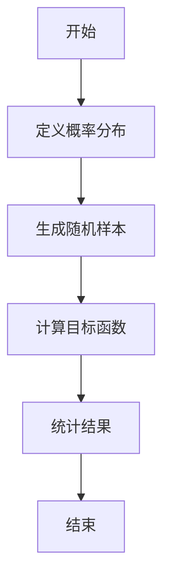
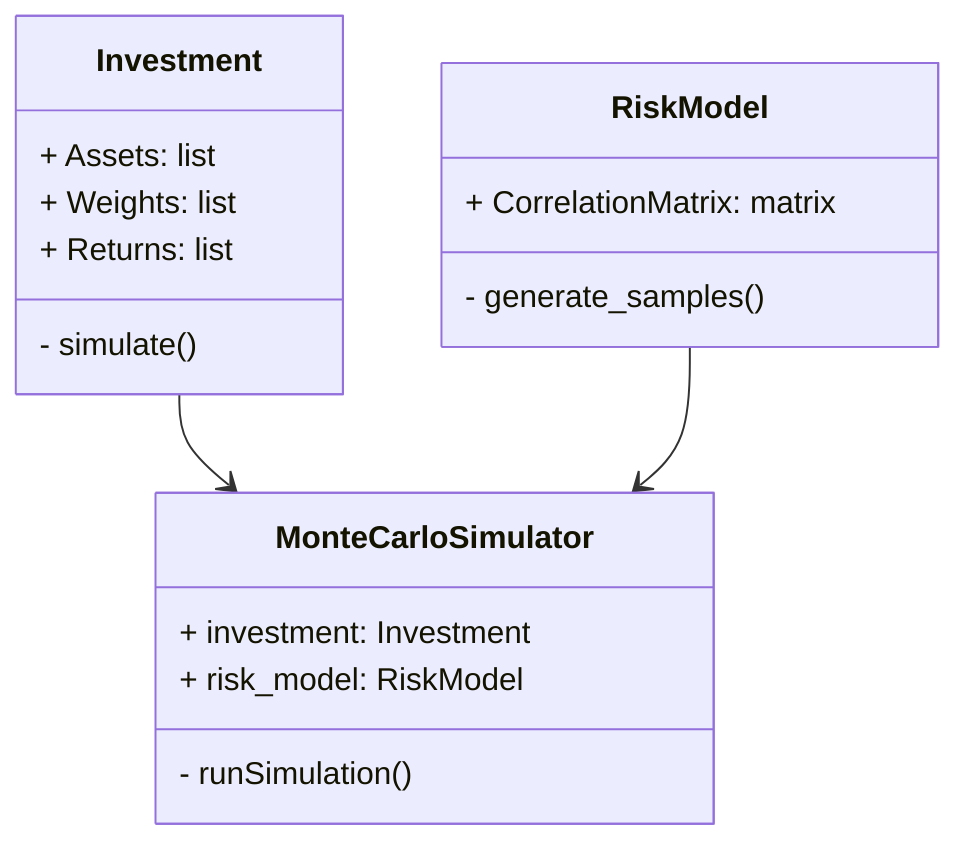

                 


# Monte Carlo模拟：投资结果的概率分布分析

## 关键词：Monte Carlo模拟，概率分布，投资分析，随机变量，风险评估

## 摘要

Monte Carlo模拟是一种强大的工具，用于分析投资结果的概率分布。通过生成大量随机样本，该方法能够模拟不同市场条件下投资组合的可能表现，帮助投资者更好地理解风险和回报的分布情况。本文详细探讨了Monte Carlo模拟的基本原理、数学模型、算法实现及其在投资分析中的应用，并通过实际案例展示其在风险管理中的价值。

---

## 第1章 引言

### 1.1 Monte Carlo模拟的定义与背景

Monte Carlo模拟是一种基于随机采样的计算方法，广泛应用于物理、工程、金融等领域。在投资分析中，它通过模拟市场波动、经济指标和其他不确定性因素，帮助评估投资组合的风险和回报。

### 1.2 投资结果分析的重要性

投资者需要了解不同市场条件下投资组合的可能表现，以做出明智的决策。Monte Carlo模拟通过概率分布分析，提供了对投资结果的全面评估。

### 1.3 本文的结构安排

本文将从概率分布的基本概念开始，逐步深入探讨Monte Carlo模拟的数学模型、算法实现，以及在投资分析中的应用。

---

## 第2章 概率分布与随机变量

### 2.1 概率分布的基本概念

概率分布描述了随机变量取值的概率。常见的分布包括正态分布、均匀分布和泊松分布。

#### 2.1.1 正态分布

正态分布在金融中广泛用于描述资产回报。其概率密度函数为：

$$f(x) = \frac{1}{\sigma \sqrt{2\pi}} e^{-\frac{(x-\mu)^2}{2\sigma^2}}$$

其中，$\mu$ 是均值，$\sigma$ 是标准差。

### 2.2 随机变量的生成

随机变量生成是Monte Carlo模拟的关键步骤。常用方法包括Box-Muller算法生成正态分布随机数。

#### 2.2.1 Box-Muller算法

Box-Muller算法通过生成均匀分布随机数，转换为标准正态分布随机数。Python实现如下：

```python
import random

def box_muller():
    u1 = random.uniform(0, 1)
    u2 = random.uniform(0, 1)
    z1 = (1 - u1**2)**0.5 * math.cos(2 * math.pi * u2)
    z2 = (1 - u1**2)**0.5 * math.sin(2 * math.pi * u2)
    return z1, z2
```

---

## 第3章 Monte Carlo模拟的数学模型

### 3.1 模拟的基本原理

Monte Carlo模拟通过生成大量随机样本，估计系统行为。其核心步骤包括：

1. 定义概率分布。
2. 生成随机样本。
3. 计算目标函数。
4. 统计结果。

#### 3.1.1 模拟流程图



### 3.2 算法实现

Monte Carlo模拟的实现需要随机数生成和目标函数计算。伪代码如下：

```python
def monte_carlo_simulation(n, target_function):
    results = []
    for _ in range(n):
        sample = generate_random_sample()
        result = target_function(sample)
        results.append(result)
    return results
```

---

## 第4章 投资组合分析中的系统架构

### 4.1 领域模型

领域模型描述了投资组合分析的主要组件及其关系。

#### 4.1.1 领域模型类图



### 4.2 系统架构

系统架构分为数据输入、模拟引擎和结果展示层。

#### 4.2.1 系统架构图


---

## 第5章 项目实战：投资回报模拟

### 5.1 环境安装

需要安装Python和相关库（如NumPy和Matplotlib）。

### 5.2 核心实现

实现一个简单的蒙特卡洛模拟，计算资产回报的概率分布。

#### 5.2.1 Python代码实现

```python
import numpy as np
import matplotlib.pyplot as plt

def main():
    np.random.seed(42)
    n_samples = 10000
    mu = 0.07
    sigma = 0.15

    returns = np.random.normal(mu, sigma, n_samples)
    
    plt.hist(returns, bins=50, alpha=0.7)
    plt.xlabel('Return')
    plt.ylabel('Frequency')
    plt.title('投资回报概率分布')
    plt.show()

if __name__ == '__main__':
    main()
```

### 5.3 实际案例分析

模拟10,000次资产回报，绘制概率分布直方图。结果表明回报主要集中在均值附近，尾部区域风险较高。

---

## 第6章 最佳实践与注意事项

### 6.1 最佳实践

1. **选择合适的风险模型**：确保概率分布与实际数据匹配。
2. **验证模拟结果**：通过统计测试确认结果的可靠性。
3. **处理大数据问题**：优化算法以提高效率。

### 6.2 小结

Monte Carlo模拟在投资分析中提供了概率分布的视角，帮助投资者更好地理解风险和回报。

---

## 第7章 结论

### 7.1 总结

Monte Carlo模拟通过概率分布分析，为投资结果的风险评估提供了有力工具。本文详细探讨了其数学模型、算法实现和实际应用。

### 7.2 未来展望

未来，Monte Carlo模拟将结合机器学习和大数据技术，进一步提升投资分析的精准度和效率。

---

通过本文的详细讲解，读者可以掌握Monte Carlo模拟在投资分析中的应用，并将其应用于实际风险管理中。

