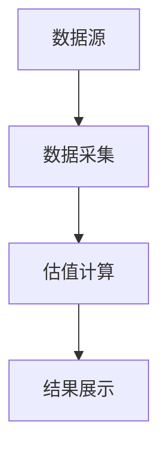

                 


# PEG比率：结合增长预期的动态估值方法

> 关键词：PEG比率，动态估值，股票分析，增长预期，投资策略

> 摘要：本文深入探讨了PEG比率这一结合增长预期的动态估值方法，分析其理论基础、计算公式、实际应用以及系统架构设计。通过案例分析和项目实战，展示了如何利用PEG比率进行股票筛选和投资决策，并提供了最佳实践和小结。

---

## 第1章: PEG比率的定义与背景

### 1.1 什么是PEG比率

PEG（Price/Earnings to Growth）比率是一种结合市盈率（P/E）和盈利增长率（EGR）的动态估值指标。它弥补了传统市盈率仅考虑当前利润的不足，引入了未来增长的预期。

#### 1.1.1 估值的基本概念

- 市盈率（P/E）：市价与每股收益的比率，衡量股票价格是否合理。
- 增长率（EGR）：预测未来三年的年均盈利增长率，是PEG的核心要素。

#### 1.1.2 PEG比率的提出与发展

- 背景：史蒂芬·佩罗于1991年提出PEG，旨在动态评估成长型股票的价值。
- 发展：广泛应用于股票分析，特别是在科技和消费等行业。

#### 1.1.3 PEG比率的核心公式

$$ PEG = \frac{P/E}{EGR} $$

其中，EGR通常取未来三年的预测增长率。

---

### 1.2 PEG比率的理论基础

#### 1.2.1 市盈率与增长率的结合

- 市盈率反映当前盈利能力，增长率预测未来潜力。
- PEG将两者结合，平衡短期表现与长期增长。

#### 1.2.2 PEG比率的数学模型

$$ PEG = \frac{(P/S) \times E}{EGR} $$

其中，P/S为股价与销售额比率，E为每股收益。

#### 1.2.3 PEG比率的优缺点

- 优点：动态评估，适合成长型企业。
- 缺点：依赖未来预测，存在主观性。

---

## 第2章: PEG比率的计算与应用

### 2.1 PEG比率的计算步骤

#### 2.1.1 收益率的计算

- 每股收益（EPS）：净利润除以总股本。
- 市盈率（P/E）= 股价 / EPS。

#### 2.1.2 增长率的预测

- 使用分析师预测或历史增长率调整未来预期。

#### 2.1.3 PEG比率计算

$$ PEG = \frac{P/E}{EGR} $$

---

### 2.2 PEG比率的实际应用

#### 2.2.1 案例分析：科技公司PEG计算

假设某科技公司：
- 股价 = 50元
- EPS = 5元
- 预测EGR = 20%

$$ P/E = 50 / 5 = 10 $$
$$ PEG = 10 / 0.2 = 50 $$

---

## 第3章: 系统分析与架构设计

### 3.1 系统功能设计

#### 3.1.1 数据采集模块

- 获取股票数据：股价、EPS、EGR。

#### 3.1.2 估值计算模块

- 输入数据，计算PEG比率。

#### 3.1.3 结果展示模块

- 可视化展示PEG值，辅助投资决策。

### 3.2 系统架构设计



---

## 第4章: 项目实战

### 4.1 环境安装

- Python 3.x
- 数据获取库：pandas、requests
- 可视化库：matplotlib

### 4.2 核心代码实现

```python
import pandas as pd
import requests

def get_stock_data(symbol):
    # 获取股票数据
    url = f'https://api.example.com/stock/{symbol}'
    response = requests.get(url)
    data = response.json()
    return pd.DataFrame(data)

def calculate_pe(symbol):
    df = get_stock_data(symbol)
    pe = df['price'] / df['eps']
    return pe

def calculate_peg(symbol, growth_rate):
    pe = calculate_pe(symbol)
    peg = pe / growth_rate
    return peg

symbol = 'AAPL'
growth_rate = 0.2  # 假设EGR为20%
peg = calculate_peg(symbol, growth_rate)
print(f"{symbol}的PEG值为：{peg}")
```

---

## 第5章: 总结与展望

### 5.1 最佳实践

- 结合行业特点调整PEG阈值。
- 定期更新数据和预测模型。

### 5.2 小结

PEG比率通过引入增长率，提供了一个动态的估值视角，特别适合成长型企业。投资者需注意预测的准确性，并结合其他指标进行综合分析。

---

## 第6章: 扩展阅读

- 常见误区：忽视行业差异，机械应用PEG。
- 拓展指标：PEGY（市盈率相对增长比率）。

---

通过以上步骤，我们全面解析了PEG比率的理论基础、计算方法和实际应用，帮助投资者提升动态估值能力。希望本文能为您的投资决策提供有价值的参考。

