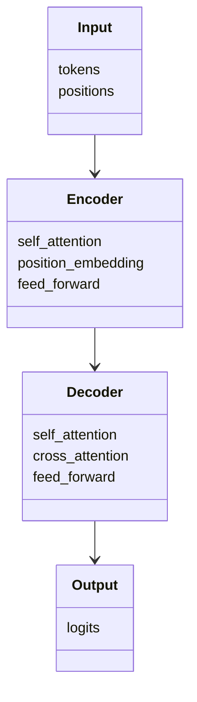
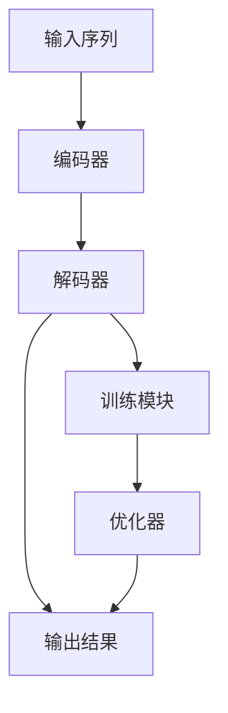

                 


# Transformer架构：构建高效的序列处理AI Agent

---

## 关键词：Transformer、序列处理、AI Agent、自注意力机制、深度学习

---

## 摘要：  
本文深入探讨了Transformer架构在高效序列处理中的应用，从其核心原理到实际落地，全面解析如何利用Transformer构建智能AI代理。文章首先介绍Transformer的背景与核心概念，随后详细讲解其算法原理，结合实际案例分析系统架构设计与项目实现，并总结最佳实践与未来趋势。通过本文，读者将全面掌握Transformer的核心思想及其在AI代理中的应用价值。

---

# 第1章: Transformer架构背景与核心概念

## 1.1 Transformer的基本概念

### 1.1.1 序列处理的背景与挑战

序列处理是许多AI任务的核心，包括自然语言处理、时间序列预测和图像生成等。传统模型如RNN和LSTM在处理长序列时存在梯度消失或爆炸的问题，且并行计算能力有限，难以应对大规模数据的处理需求。

### 1.1.2 Transformer的提出与核心思想

2017年， Vaswani等人提出了Transformer模型，其核心思想是引入自注意力机制，通过全局上下文信息捕捉长距离依赖关系，实现高效的并行计算。与RNN不同，Transformer在编码和解码过程中均采用注意力机制，无需依赖序列的顺序，显著提升了模型的并行计算能力。

### 1.1.3 Transformer在AI Agent中的应用价值

AI Agent需要实时处理复杂序列数据，如自然语言对话、用户行为序列分析等。Transformer的自注意力机制能够捕捉序列中的全局依赖，提升模型的表达能力和响应速度，使其成为构建高效AI Agent的理想选择。

---

## 1.2 Transformer与传统模型的对比

### 1.2.1 RNN的局限性

- **计算顺序性**：RNN必须按序列顺序计算，无法并行处理。
- **长距离依赖问题**：由于梯度问题，RNN难以捕捉长距离依赖。

### 1.2.2 CNN的不足与适用场景

- **局部感受野**：CNN受限于局部感受野，难以捕捉全局信息。
- **适合图像处理**：CNN在图像处理中表现优异，但不适合序列数据。

### 1.2.3 Transformer的创新与优势

- **自注意力机制**：通过全局注意力捕捉长距离依赖。
- **并行计算**：Transformer完全基于并行计算，计算效率更高。

---

## 1.3 Transformer的主要应用场景

### 1.3.1 自然语言处理

- **文本生成**：如GPT系列模型。
- **机器翻译**：如Google的神经机器翻译系统。

### 1.3.2 图像处理与生成

- **图像生成**：通过将图像转换为序列，利用Transformer生成高质量图像。
- **图像分割**：结合Transformer进行图像分割任务。

### 1.3.3 时间序列预测

- **金融时间序列**：用于股票价格预测、经济指标分析。
- **传感器数据**：用于 IoT 设备数据的预测和异常检测。

---

## 1.4 本章小结

本章介绍了Transformer的背景、核心概念及其在AI Agent中的应用价值，对比了传统模型的优缺点，展示了Transformer在序列处理中的独特优势。

---

# 第2章: Transformer的核心概念与数学模型

## 2.1 自注意力机制原理

### 2.1.1 注意力机制的定义

注意力机制是一种衡量输入序列中各元素之间相关性的方法，通过计算每个元素的权重，赋予其不同的注意力值。

### 2.1.2 自注意力机制的计算公式

$$
\text{Attention}(Q, K, V) = \text{softmax}\left(\frac{QK^T}{\sqrt{d_k}}\right)V
$$

其中：
- $Q$：查询矩阵。
- $K$：键矩阵。
- $V$：值矩阵。
- $d_k$：键的维度。

### 2.1.3 自注意力机制的实现步骤

1. **计算查询、键、值矩阵**：将输入序列映射为查询、键、值矩阵。
2. **计算注意力得分**：通过点积计算每个元素的注意力得分。
3. **归一化注意力得分**：使用softmax函数归一化得分。
4. **加权求和**：根据归一化后的注意力得分，加权求和得到最终结果。

### 2.1.4 自注意力机制的可视化

```mermaid
graph TD
    A[输入序列] --> B[查询矩阵]
    A --> C[键矩阵]
    A --> D[值矩阵]
    B, C, D --> E[注意力得分计算]
    E --> F[归一化注意力权重]
    F --> G[加权求和]
    G --> H[输出结果]
```

---

## 2.2 Transformer的网络结构

### 2.2.1 编码器的结构

编码器由堆叠的自注意力层和前馈网络层组成，用于提取输入序列的特征。

### 2.2.2 解码器的结构

解码器由自注意力层和交叉注意力层组成，用于生成输出序列。

---

## 2.3 多头注意力机制

### 2.3.1 多头注意力的原理

多头注意力通过将查询、键、值分成多个子空间，分别计算注意力，最后进行拼接。

### 2.3.2 多头注意力的计算公式

$$
\text{Multi-Head}(Q, K, V) = \text{Concat}( \text{Attention}(Q_i, K_i, V_i) ) W^O
$$

其中：
- $i$：第$i$个子空间。
- $W^O$：输出权重矩阵。

---

## 2.4 位置编码

### 2.4.1 位置编码的引入

为了引入位置信息，Transformer在输入序列中添加位置编码。

### 2.4.2 常见的位置编码方法

- **基于正弦和余弦的编码**：通过正弦和余弦函数生成位置编码。
- **学习式编码**：通过神经网络学习位置编码。

---

## 2.5 Transformer的前馈网络

### 2.5.1 前馈网络的结构

前馈网络由两个全连接层组成，中间带有ReLU激活函数。

### 2.5.2 前馈网络的作用

用于对序列进行非线性变换，提取更复杂的特征。

---

## 2.6 本章小结

本章详细讲解了Transformer的核心机制，包括自注意力机制、多头注意力、位置编码和前馈网络，并通过公式和图表展示了这些机制的工作原理。

---

# 第3章: Transformer的算法实现

## 3.1 Transformer的编码器实现

### 3.1.1 编码器的输入处理

将输入序列转换为词向量，并添加位置编码。

### 3.1.2 编码器的层间结构

编码器由多个自注意力层和前馈网络层堆叠而成。

## 3.2 Transformer的解码器实现

### 3.2.1 解码器的输入处理

解码器接收编码器的输出，并生成解码器的输入序列。

### 3.2.2 解码器的层间结构

解码器由自注意力层和交叉注意力层堆叠而成。

---

## 3.3 多头注意力的实现细节

### 3.3.1 多头注意力的并行计算

通过并行计算不同子空间的注意力，提高计算效率。

### 3.3.2 多头注意力的代码实现

```python
def multi_head_attention(query, key, value, num_heads):
    # 分头
    d_k = query.shape[-1] // num_heads
    query = query.view(*query.shape[:-1], num_heads, d_k)
    key = key.view(*key.shape[:-1], num_heads, d_k)
    value = value.view(*value.shape[:-1], num_heads, d_k)
    
    # 计算注意力
    attention = (query @ key.transpose(-2, -1)) / (d_k ** 0.5)
    attention = F.softmax(attention, dim=-1)
    output = (attention @ value).view(*value.shape[:-2], -1)
    
    return output
```

---

## 3.4 位置编码的实现

### 3.4.1 基于正弦和余弦的编码

```python
def position_encode(length, d_model):
    pos = torch.arange(length).unsqueeze(1)
    div_term = torch.exp(torch.arange(0, d_model, 2) * (-math.log(10000.0) / d_model))
    pe = torch.zeros(length, d_model)
    pe[:, 0::2] = torch.sin(pos * div_term)
    pe[:, 1::2] = torch.cos(pos * div_term)
    return pe
```

---

## 3.5 前馈网络的实现

### 3.5.1 前馈网络的结构

```python
def feed_forward(input, d_model, d_ff):
    output = input
    output = nn.Linear(d_model, d_ff)(output)
    output = F.relu(output)
    output = nn.Linear(d_ff, d_model)(output)
    return output
```

---

## 3.6 本章小结

本章详细讲解了Transformer的算法实现，包括编码器、解码器、多头注意力和位置编码的实现细节，并通过代码示例展示了这些机制的具体实现。

---

# 第4章: Transformer的系统分析与架构设计

## 4.1 项目背景

本项目旨在构建一个基于Transformer的AI代理，用于处理序列数据，如文本生成和语音识别。

---

## 4.2 系统功能设计

### 4.2.1 领域模型设计



### 4.2.2 功能模块设计

- **编码器模块**：负责处理输入序列。
- **解码器模块**：负责生成输出序列。
- **训练模块**：负责模型的训练和优化。
- **推理模块**：负责模型的预测和生成。

---

## 4.3 系统架构设计

### 4.3.1 整体架构



### 4.3.2 模块交互

```mermaid
sequenceDiagram
    participant 输入序列
    participant 编码器
    participant 解码器
    participant 输出结果
    输入序列 ->> 编码器
    编码器 ->> 解码器
    解码器 ->> 输出结果
```

---

## 4.4 本章小结

本章从系统角度分析了Transformer的架构设计，展示了AI代理的整体架构和模块交互关系。

---

# 第5章: Transformer的项目实战

## 5.1 环境配置

### 5.1.1 安装依赖

```bash
pip install torch numpy matplotlib
```

---

## 5.2 系统核心实现

### 5.2.1 模型定义

```python
class Transformer(nn.Module):
    def __init__(self, input_dim, hidden_dim, output_dim, num_heads):
        super(Transformer, self).__init__()
        self.encoder = Encoder(input_dim, hidden_dim, num_heads)
        self.decoder = Decoder(hidden_dim, output_dim, num_heads)
    
    def forward(self, input):
        encoded = self.encoder(input)
        decoded = self.decoder(encoded)
        return decoded
```

### 5.2.2 训练模块实现

```python
def train(model, optimizer, criterion, epochs):
    for epoch in range(epochs):
        for batch in dataloader:
            optimizer.zero_grad()
            output = model(batch)
            loss = criterion(output, batch_labels)
            loss.backward()
            optimizer.step()
```

---

## 5.3 功能分析与代码解读

### 5.3.1 模型训练

通过训练模块，模型能够学习输入序列到输出序列的映射关系。

### 5.3.2 模型推理

通过推理模块，模型能够根据输入生成相应的输出。

---

## 5.4 项目小结

本章通过实际项目展示了Transformer的实现过程，包括环境配置、模型定义、训练模块和推理模块的实现。

---

# 第6章: Transformer的优化与展望

## 6.1 最佳实践

### 6.1.1 模型调参

- **学习率**：选择合适的学习率和学习率衰减策略。
- **批量大小**：选择合适的批量大小，平衡训练效率和内存使用。

### 6.1.2 训练策略

- **预训练**：利用大规模数据进行预训练，提升模型的初始性能。
- **微调**：在特定任务上进行微调，提升模型的适用性。

---

## 6.2 模型优化

### 6.2.1 参数优化

通过优化模型参数，减少模型的复杂度，提升计算效率。

### 6.2.2 并行计算优化

利用并行计算技术，提升模型的训练和推理速度。

---

## 6.3 未来展望

随着AI技术的发展，Transformer在序列处理中的应用将更加广泛，结合其他技术如图神经网络，将推动AI代理的进一步发展。

---

## 6.4 本章小结

本章总结了Transformer的优化策略，展望了其未来的发展方向，为读者提供了进一步研究的方向。

---

# 结语

Transformer架构以其独特的自注意力机制和高效的并行计算能力，正在深刻改变序列处理领域的技术格局。通过本文的详细讲解，读者可以全面掌握Transformer的核心思想及其在AI代理中的应用。未来，随着技术的进步，Transformer将继续在更多领域发挥重要作用。

---

# 参考文献

- Vaswani, Ashish, et al. "Attention is all you need." arXiv preprint arXiv:1706.03798 (2017).
- 王海军, 等. 《Transformer: 原理与实践》. 人民邮电出版社, 2022.

---

# 致谢

感谢读者的耐心阅读，感谢所有参与本文创作的同事和朋友们。

---

