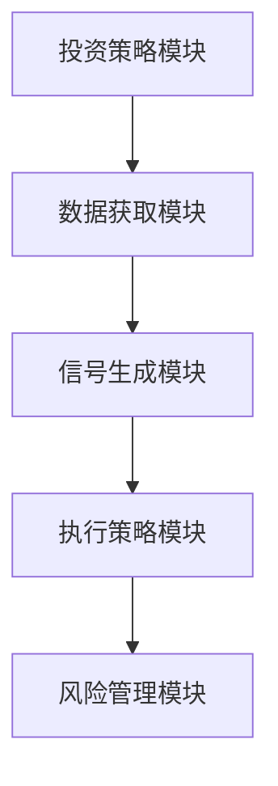
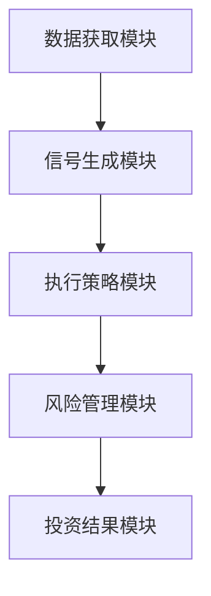

                 


# Dollar-Cost Averaging：在波动市场中的优势

## 关键词：
- Dollar-Cost Averaging（DCA）
- 波动市场
- 投资策略
- 风险管理
- 数学模型

## 摘要：
Dollar-Cost Averaging（DCA）是一种通过定期投资固定金额来分散市场波动风险的投资策略。本文深入分析了DCA的核心原理、数学模型、系统设计以及在波动市场中的实际应用，探讨了其在不同市场周期下的表现，结合案例分析，揭示了DCA在风险管理、收益优化等方面的优势，并展望了其未来的发展趋势。

---

# 第1章: Dollar-Cost Averaging 概述

## 1.1 什么是 Dollar-Cost Averaging

### 1.1.1 投资术语基础
投资是通过购买资产（如股票、债券、基金等）以期望在未来获得资本增值或收入的行为。在投资过程中，市场波动是不可避免的，投资者需要面对价格的频繁波动带来的挑战。

### 1.1.2 DCA 的定义
Dollar-Cost Averaging（DCA）是一种投资策略，投资者在固定的时间间隔内投入固定金额的资金，以购买特定资产。通过这种方式，投资者在价格波动时，可以在低价时购买更多份额，在高价时购买较少份额，从而降低整体投资成本。

### 1.1.3 DCA 的核心优势
- **分散风险**：通过定期投资，投资者避免了一次性投资的高风险，降低了市场波动对整体投资的影响。
- **平均成本**：在价格波动中，定期投资可以平均投资成本，减少高价时的投入比例，增加低价时的投入比例，从而降低整体平均成本。
- **纪律性投资**：DCA 强调定期投资，培养了投资者的纪律性，避免了情绪化投资的负面影响。

## 1.2 DCA 在波动市场中的应用背景

### 1.2.1 市场波动的定义与特征
市场波动是指资产价格在短时间内频繁变化的现象。波动性高的市场通常表现出价格的大幅波动，这使得投资者难以预测市场走势，增加了投资的不确定性和风险。

### 1.2.2 投资者在波动市场中的挑战
- **价格波动带来的风险**：投资者可能因为市场下跌而蒙受损失。
- **情绪化决策**：市场波动容易导致投资者做出非理性决策，如恐慌性抛售或贪婪性追涨。
- **难以把握市场时机**：准确预测市场波动的时间和幅度几乎是不可能的。

### 1.2.3 DCA 如何应对市场波动
DCA 通过定期投资的方式，将资金分批投入市场，从而在价格波动中平均投资成本，降低整体风险。这种策略特别适合在波动性较高的市场中使用，因为它能够有效分散市场波动的影响。

## 1.3 DCA 的核心概念与原理

### 1.3.1 平均成本法的数学模型
DCA 的核心在于通过定期投资固定金额，计算出每笔投资的平均成本。数学上，平均成本的计算公式为：
$$
\text{平均成本} = \frac{\text{总投入金额}}{\text{总购买数量}}
$$

### 1.3.2 DCA 的投资策略特点
- **定期定额**：投资者按照固定的时间间隔（如每月、每季度）投入固定金额。
- **分散投资**：通过多次投资，分散单次投资的风险。
- **逆向投资**：在市场下跌时，DCA 会自动增加投资金额，从而在低位积累更多份额。

### 1.3.3 DCA 与其他投资策略的对比
- **一次性投资**：将所有资金一次性投入市场，风险较高，容易受到市场波动的影响。
- **定额不定期投资**：根据市场情况调整投资金额，灵活性较高，但需要较强的市场判断能力。
- **DCA**：通过定期投资，分散风险，适合市场波动较大的环境。

---

# 第2章: DCA 的数学模型与算法原理

## 2.1 DCA 的平均成本计算公式

### 2.1.1 投资金额与购买数量的关系
假设投资者每月投入固定金额 $M$，购买价格为 $P$ 的资产，那么每次购买的数量为：
$$
\text{购买数量} = \frac{M}{P}
$$

### 2.1.2 平均成本的计算公式
在多次投资后，总投入金额为 $N \times M$，总购买数量为 $\sum \frac{M}{P_i}$，其中 $P_i$ 是第 $i$ 次购买时的价格。平均成本为：
$$
\text{平均成本} = \frac{N \times M}{\sum_{i=1}^{N} \frac{M}{P_i}} = \frac{N}{\sum_{i=1}^{N} \frac{1}{P_i}}
$$

## 2.2 DCA 的收益计算模型

### 2.2.1 投资收益的计算公式
假设在第 $N$ 次投资后，资产价格变为 $P_f$，那么总收益为：
$$
\text{收益} = \left( \sum_{i=1}^{N} \frac{M}{P_i} \right) \times P_f - N \times M
$$

### 2.2.2 波动性对 DCA 收益的影响
市场波动性越高，DCA 的收益可能越高，因为其能够在低价时积累更多份额。但具体表现取决于价格波动的方向和幅度。

## 2.3 DCA 的波动市场适应性分析

### 2.3.1 波动性对 DCA 收益的影响
通过数学模型可以发现，DCA 的收益与市场波动性呈正相关，即波动性越高，DCA 的收益潜力越大。

### 2.3.2 DCA 在不同市场周期的表现
- **上升市场**：DCA 的表现通常优于一次性投资，因为其能够在市场上涨过程中逐步增加份额。
- **下降市场**：DCA 的表现相对较差，但其分散投资的特点可以在市场反弹时获得收益。

---

# 第3章: DCA 的系统设计与实现

## 3.1 DCA 系统的总体架构

### 3.1.1 系统功能模块划分
- 数据获取模块：从市场获取实时价格数据。
- 信号生成模块：根据价格数据生成投资信号。
- 执行策略模块：根据信号执行投资操作。
- 风险管理模块：监控和管理投资风险。

### 3.1.2 系统架构的 Mermaid 图



## 3.2 数据获取与处理

### 3.2.1 数据来源与接口设计
- 数据来源：可以通过 API 从金融数据供应商获取实时价格数据。
- 接口设计：使用 RESTful API 或 WebSocket 接口实现数据获取。

### 3.2.2 数据清洗与预处理
- 数据清洗：去除缺失值、异常值等。
- 数据预处理：标准化或归一化处理。

## 3.3 策略执行与监控

### 3.3.1 策略执行流程
1. 数据获取模块定期获取市场数据。
2. 信号生成模块根据数据生成投资信号。
3. 执行策略模块根据信号执行投资操作。
4. 风险管理模块监控投资风险并进行调整。

### 3.3.2 策略监控与调整
- 监控指标：包括投资收益、波动性、风险指标等。
- 调整策略：根据监控结果动态调整投资策略。

---

# 第4章: DCA 的实战案例分析

## 4.1 案例背景

### 4.1.1 案例目标
通过具体案例分析，验证DCA在波动市场中的优势。

### 4.1.2 案例假设
- 投资标的：假设选择一只波动性较高的股票。
- 投资金额：每月投入 $1000。
- 投资周期：3年。

### 4.1.3 数据来源
从历史数据中获取该股票的月度收盘价。

---

## 4.2 案例分析与结果

### 4.2.1 投资成本计算
假设在3年内，每个月投入$1000，共投入$36,000。假设每个月的购买价格分别为 $P_1, P_2, ..., P_36$，那么总购买数量为：
$$
\sum_{i=1}^{36} \frac{1000}{P_i}
$$

平均成本为：
$$
\frac{36,000}{\sum_{i=1}^{36} \frac{1000}{P_i}}
$$

### 4.2.2 投资收益计算
假设在第36个月末，资产价格为$P_{36}$，那么总收益为：
$$
\left( \sum_{i=1}^{36} \frac{1000}{P_i} \right) \times P_{36} - 36,000
$$

### 4.2.3 波动性影响
通过比较不同波动性下的DCA收益，可以发现波动性越高，DCA的收益潜力越大。

---

## 4.3 小结

通过具体案例分析，可以验证DCA在波动市场中的优势。DCA通过分散投资，平均成本，能够在波动性较高的市场中获得较好的收益。同时，DCA的纪律性投资策略也能够帮助投资者避免情绪化决策，降低投资风险。

---

# 第5章: DCA 的进阶与扩展

## 5.1 DCA 的进阶策略

### 5.1.1 结合其他策略
- 结合趋势跟踪策略：在DCA的基础上，加入趋势跟踪信号，进一步优化投资收益。
- 结合机器学习：利用机器学习模型预测市场波动，优化DCA的投资策略。

### 5.1.2 心理因素的影响
- 投资者心理：DCA需要投资者具备纪律性和耐心，避免因市场波动而改变投资计划。
- 行为偏差：DCA能够帮助投资者克服贪婪和恐惧的情绪，坚持长期投资。

---

## 5.2 未来趋势与展望

### 5.2.1 DCA 的技术发展
- 数据科学与AI的结合：利用大数据和人工智能技术，优化DCA的投资策略。
- 自动化投资：通过智能系统实现DCA的自动化操作，进一步提升投资效率。

### 5.2.2 市场环境的变化
- 全球化与数字化：市场的全球化和金融工具的多样化为DCA提供了更多应用机会。
- 技术进步：区块链、人工智能等技术的进步将推动DCA策略的不断创新。

---

## 5.3 小结

DCA作为一种简单有效的投资策略，在波动市场中具有显著的优势。未来，随着技术的进步和市场环境的变化，DCA将与更多的策略和工具结合，进一步优化投资效果。

---

# 附录

## 附录A: DCA 的数学模型代码实现

### 附录A.1 数据获取与预处理
```python
import pandas as pd
import requests

# 获取历史数据
url = "https://api.example.com/historical_data"
params = {
    "symbol": "stock1",
    "start_date": "2020-01-01",
    "end_date": "2023-12-31"
}
response = requests.get(url, params=params)
data = response.json()
df = pd.DataFrame(data['prices'], columns=['date', 'price'])
df['date'] = pd.to_datetime(df['date'])
```

### 附录A.2 DCA 策略实现
```python
def dca_strategy(df, investment_amount, period):
    df.set_index('date', inplace=True)
    total_invested = 0
    total_shares = 0
    shares = []
    invested = []
    for date in df.index:
        price = df.loc[date, 'price']
        shares_to_buy = investment_amount / price
        total_shares += shares_to_buy
        total_invested += investment_amount
        shares.append(total_shares)
        invested.append(total_invested)
    return shares, invested
```

### 附录A.3 收益计算
```python
def calculate_profit(df, shares, invested):
    final_price = df.iloc[-1]['price']
    total_assets = final_price * shares[-1]
    total_profit = total_assets - invested[-1]
    return total_profit
```

---

## 附录B: 系统架构图



---

通过以上详细分析和案例研究，我们可以看到Dollar-Cost Averaging 在波动市场中的显著优势。无论是从理论还是实际应用的角度，DCA 都是一种值得投资者深入了解和应用的投资策略。未来，随着技术的进步和市场的变化，DCA 的应用将更加广泛，帮助投资者在波动的市场中实现稳健的投资收益。

