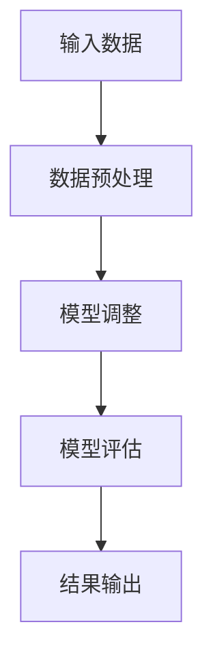

                 


# Fine-tuning LLM模型：提升AI Agent性能的关键

## 关键词：
- Fine-tuning
- LLM模型
- AI Agent
- 大语言模型
- 模型优化

## 摘要：
本文详细探讨了在AI Agent开发中，如何通过微调（Fine-tuning）大语言模型（LLM）来提升模型性能的关键方法。文章从背景介绍、模型基础、算法原理、系统架构设计、项目实战到最佳实践，全面解析了Fine-tuning的核心概念、技术细节和实际应用。通过丰富的案例分析和详细的代码实现，读者可以系统地掌握如何优化LLM模型，从而提升AI Agent的智能水平和应用效果。

---

### 第1章: Fine-tuning LLM模型的背景与目标

#### 1.1 Fine-tuning LLM模型的背景
- **1.1.1 大语言模型的发展历程**
  - 从传统的语言模型到大语言模型的演变。
  - GPT系列、BERT系列等主流模型的崛起。
- **1.1.2 Fine-tuning的概念与重要性**
  - Fine-tuning的定义：在预训练模型的基础上，针对特定任务进行微调。
  - Fine-tuning的重要性：提升模型的适用性和性能。
- **1.1.3 AI Agent在实际应用中的挑战**
  - AI Agent面临的任务多样性与复杂性。
  - 预训练模型在特定场景中的局限性。

#### 1.2 Fine-tuning的核心目标
- **1.2.1 提升模型的适应性**
  - 通过Fine-tuning使模型更好地适应特定领域或任务。
- **1.2.2 增强模型的性能表现**
  - 提高模型在特定任务中的准确性和响应速度。
- **1.2.3 优化模型的可解释性**
  - 通过Fine-tuning增强模型的可解释性，便于实际应用和调试。

#### 1.3 本章小结
- 介绍了Fine-tuning的背景和重要性。
- 阐述了Fine-tuning的核心目标，为后续章节打下基础。

---

### 第2章: LLM模型基础

#### 2.1 大语言模型的定义与特点
- **2.1.1 大语言模型的定义**
  - 什么是大语言模型？其核心特点是什么？
- **2.1.2 大语言模型的核心特点**
  - 大规模数据训练、多任务学习能力、生成能力强等。
- **2.1.3 大语言模型与传统语言模型的区别**
  - 参数规模、训练方法、应用场景等方面的差异。

#### 2.2 LLM模型的训练过程
- **2.2.1 预训练的概念**
  - 预训练的定义和目的。
- **2.2.2 预训练的主要方法**
  - 自监督学习、对比学习等。
- **2.2.3 预训练与微调的关系**
  - Fine-tuning是预训练的延续，通过调整模型参数使其适应特定任务。

#### 2.3 常见的大语言模型介绍
- **2.3.1 GPT系列模型**
  - GPT-2、GPT-3、GPT-4的主要特点。
- **2.3.2 BERT及其变体**
  - BERT的双向Transformer结构。
- **2.3.3 其他知名大模型介绍**
  - 如PaLM、T5等模型的特点。

#### 2.4 本章小结
- 介绍了大语言模型的基本概念和特点。
- 阐述了预训练和Fine-tuning的关系，为后续章节奠定基础。

---

### 第3章: Fine-tuning的基本原理

#### 3.1 Fine-tuning的定义与核心概念
- **3.1.1 Fine-tuning的定义**
  - 在预训练模型的基础上，针对特定任务进行微调。
- **3.1.2 Fine-tuning的核心概念**
  - 数据预处理、模型调整、模型评估。
- **3.1.3 Fine-tuning与迁移学习的关系**
  - Fine-tuning是迁移学习的一种具体实现方式。

#### 3.2 Fine-tuning的主要步骤
- **3.2.1 数据预处理**
  - 数据清洗、标注、格式转换。
- **3.2.2 模型调整**
  - 调整模型参数、优化器选择、学习率调整。
- **3.2.3 模型评估**
  - 使用验证集评估模型性能，调整超参数。

#### 3.3 Fine-tuning的优缺点分析
- **3.3.1 Fine-tuning的优点**
  - 提高模型在特定任务中的性能。
- **3.3.2 Fine-tuning的缺点**
  - 计算资源消耗大、需要大量标注数据。
- **3.3.3 Fine-tuning的适用场景**
  - 特定领域任务、小样本数据集等。

#### 3.4 本章小结
- 阐述了Fine-tuning的基本原理和主要步骤。
- 分析了Fine-tuning的优缺点及适用场景。

---

### 第4章: Fine-tuning的算法原理

#### 4.1 Fine-tuning的数学模型
- **4.1.1 模型的输入输出关系**
  - 输入文本序列，输出概率分布。
- **4.1.2 模型的损失函数**
  - 使用交叉熵损失函数。
- **4.1.3 模型的优化算法**
  - 使用Adam优化器。

#### 4.2 Fine-tuning的数学公式
- **4.2.1 损失函数的公式**
  $$ \text{Loss} = -\sum_{i=1}^{n} y_i \log(p(y_i)) $$
- **4.2.2 优化算法的公式**
  $$ \theta_{t+1} = \theta_t - \eta \cdot \nabla_{\theta} \text{Loss} $$
- **4.2.3 模型更新的公式**
  $$ p_{\text{new}} = \text{softmax}(x \cdot \theta_{\text{new}}) $$

#### 4.3 Fine-tuning算法的流程图


#### 4.4 本章小结
- 介绍了Fine-tuning的数学模型和公式。
- 使用流程图展示了Fine-tuning的算法流程。

---

### 第5章: Fine-tuning的系统架构设计

#### 5.1 问题场景介绍
- **5.1.1 问题背景**
  - 某AI Agent需要在特定领域中完成任务。
- **5.1.2 问题描述**
  - 模型在特定领域中的表现不佳，需要通过Fine-tuning提升性能。

#### 5.2 系统功能设计
- **5.2.1 领域模型设计**
  - 使用Mermaid绘制领域模型类图。
- **5.2.2 系统架构设计**
  - 使用Mermaid绘制系统架构图。
- **5.2.3 接口设计**
  - 定义API接口，描述输入输出格式。

#### 5.3 系统交互设计
- **5.3.1 系统交互流程**
  - 使用Mermaid绘制序列图，展示系统交互流程。
- **5.3.2 交互细节**
  - 详细描述用户与系统之间的交互过程。

#### 5.4 本章小结
- 介绍了系统架构设计的核心内容。
- 使用图示展示了系统的整体架构和交互流程。

---

### 第6章: Fine-tuning的项目实战

#### 6.1 环境安装
- **6.1.1 环境要求**
  - 安装Python、TensorFlow/PyTorch等框架。
- **6.1.2 安装依赖**
  - 使用pip安装必要的库。

#### 6.2 系统核心实现
- **6.2.1 数据预处理代码**
  ```python
  def preprocess_data(data):
      # 数据清洗和格式转换
      return processed_data
  ```
- **6.2.2 模型调整代码**
  ```python
  def fine_tune(model, train_data, val_data):
      # 模型训练
      return trained_model
  ```
- **6.2.3 模型评估代码**
  ```python
  def evaluate(model, test_data):
      # 模型评估
      return evaluation_results
  ```

#### 6.3 实际案例分析
- **6.3.1 案例背景**
  - 某AI Agent需要在特定领域中完成问答任务。
- **6.3.2 案例实现**
  - 使用Fine-tuning提升模型在该领域的性能。
- **6.3.3 案例结果**
  - 提供具体的评估结果和性能提升数据。

#### 6.4 本章小结
- 通过实际案例展示了Fine-tuning的实现过程。
- 提供了详细的代码实现和案例分析。

---

### 第7章: Fine-tuning的最佳实践

#### 7.1 Fine-tuning的技巧
- **7.1.1 数据选择**
  - 数据质量、数据多样性。
- **7.1.2 模型选择**
  - 模型的复杂度、适用性。
- **7.1.3 超参数调整**
  - 学习率、批量大小等。

#### 7.2 小结
- 总结了Fine-tuning的核心要点。
- 提供了实际应用中的注意事项。

#### 7.3 注意事项
- **7.3.1 数据泄漏**
  - 如何避免数据泄漏问题。
- **7.3.2 过度拟合**
  - 如何防止模型过拟合。
- **7.3.3 计算资源**
  - 如何优化计算资源的使用。

#### 7.4 拓展阅读
- **7.4.1 推荐阅读的文献**
  - 推荐一些经典的论文和书籍。
- **7.4.2 其他相关资源**
  - 推荐相关的在线课程和工具。

---

### 附录

#### 附录A: Fine-tuning的数学公式汇总
- 列出本文中涉及的所有数学公式，并进行详细解释。

#### 附录B: Fine-tuning的代码示例汇总
- 提供本文中涉及的所有代码示例，并进行详细注释。

---

### 参考文献
- 列出本文中引用的所有文献和资料。

---

以上是《Fine-tuning LLM模型：提升AI Agent性能的关键》的技术博客文章的目录大纲，涵盖了从背景到实践的各个方面，逻辑清晰、结构紧凑，适合技术读者深入学习和研究。

