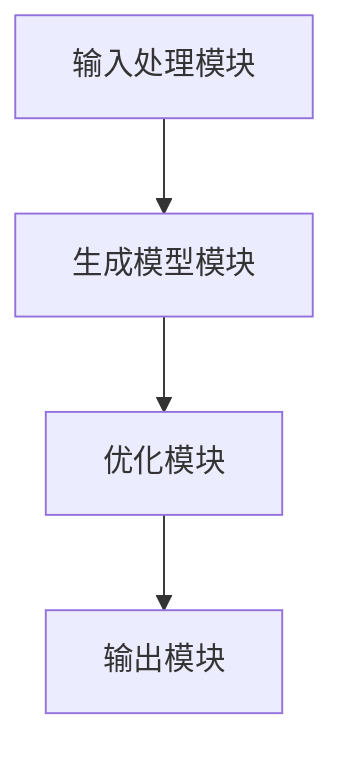

                 


# 第一部分: Prompt工程基础

## # 第1章: Prompt工程概述

### ## 1.1 Prompt工程的基本概念
#### ### 1.1.1 什么是Prompt工程
Prompt工程是一门专注于设计和优化提示（Prompt）的学科，旨在通过明确的需求和上下文信息，引导AI生成模型生成符合预期的输出。它结合了自然语言处理（NLP）、机器学习和认知科学等领域的知识，致力于提升AI Agent的输出质量。

#### ### 1.1.2 Prompt工程的重要性
随着AI技术的快速发展，AI Agent在各个领域的应用越来越广泛，从智能客服到内容生成，再到自动编程。然而，AI生成模型的输出质量往往依赖于输入的提示设计。一个 poorly crafted的Prompt可能导致生成内容偏离预期，甚至引发错误。因此，Prompt工程的重要性不言而喻，它是连接用户需求与AI生成模型的桥梁。

#### ### 1.1.3 Prompt工程的核心目标
Prompt工程的核心目标是通过科学的设计方法，最大化生成模型的输出质量，使其更符合用户意图。具体来说，Prompt工程的目标包括：
1. 提高生成内容的准确性和相关性。
2. 优化生成过程的效率和可解释性。
3. 实现跨领域、跨场景的通用提示设计。

### ## 1.2 AI Agent的基本原理
#### ### 1.2.1 AI Agent的定义与分类
AI Agent是一种能够感知环境、自主决策并执行任务的智能体。根据功能和应用场景的不同，AI Agent可以分为以下几类：
- **简单规则型AI Agent**：基于预设的规则进行决策和执行。
- **基于模型的AI Agent**：利用环境模型进行状态预测和决策。
- **强化学习型AI Agent**：通过与环境互动，学习最优策略。
- **生成模型型AI Agent**：基于生成模型生成多样化的输出。

#### ### 1.2.2 AI Agent的工作流程
AI Agent的工作流程一般包括以下步骤：
1. **感知环境**：通过传感器或API获取环境信息。
2. **目标设定**：根据任务需求设定目标。
3. **决策与规划**：基于当前状态和目标，制定行动方案。
4. **执行任务**：根据决策结果执行具体操作。
5. **反馈与学习**：根据执行结果调整策略，优化后续行为。

#### ### 1.2.3 Prompt在AI Agent中的作用
Prompt在AI Agent中起到了关键的桥梁作用。通过设计合理的Prompt，AI Agent可以更准确地理解用户需求，生成符合预期的输出。Prompt工程的核心在于如何将用户意图转化为生成模型能够理解的输入，从而优化生成结果的质量和相关性。

## # 第2章: Prompt的设计原则与策略

### ## 2.1 Prompt设计的基本原则
#### ### 2.1.1 明确性原则
Prompt设计的第一大原则是明确性。一个优秀的Prompt应该清晰明确，避免模糊不清的描述。例如，"生成一篇关于人工智能的科普文章"比"写一篇关于科技的文章"更为具体明确。

#### ### 2.1.2 简洁性原则
简洁性是Prompt设计的第二大原则。Prompt的长度和复杂度直接影响生成模型的效率和输出质量。过于复杂的Prompt可能导致生成模型难以理解和执行，因此，建议在保证明确性的前提下，尽量简化Prompt的描述。

#### ### 2.1.3 一致性原则
一致性原则要求Prompt的设计在不同场景和任务中保持一致性和可扩展性。例如，在设计对话系统的Prompt时，应该确保每个Prompt的结构和格式一致，以便生成模型能够快速适应不同的输入。

### ## 2.2 Prompt设计的策略
#### ### 2.2.1 目标导向的Prompt设计
目标导向的Prompt设计是一种以结果为导向的设计方法。在设计Prompt时，需要明确任务的目标、输入和输出。例如，设计一个对话系统的Prompt时，需要明确对话的主题、对话的轮数以及每轮对话的响应方式。

#### ### 2.2.2 任务拆解的Prompt设计
任务拆解是一种将复杂任务分解为多个子任务的方法。在设计Prompt时，可以通过任务拆解，将大任务分解为小任务，从而提高生成模型的效率和准确性。例如，在设计一个多轮对话的Prompt时，可以将对话过程分解为多个独立的Prompt。

#### ### 2.2.3 上下文关联的Prompt设计
上下文关联的Prompt设计是一种通过上下文信息优化生成模型输出的方法。通过引入上下文信息，生成模型能够更好地理解当前任务的需求和背景，从而生成更准确和相关的输出。例如，在设计一个新闻生成系统的Prompt时，可以引入新闻的主题、时间、地点等信息，从而提高生成内容的相关性和准确性。

## # 第3章: Prompt的数学模型与算法原理

### ## 3.1 生成模型的基本原理
#### ### 3.1.1 解码器的结构与功能
生成模型的核心是解码器，其结构通常包括编码器和解码器两部分。编码器负责将输入的Prompt转化为向量表示，解码器则基于这些向量生成输出文本。解码器的结构通常包括自注意力机制和前馈网络，用于捕捉输入中的长距离依赖关系。

#### ### 3.1.2 概率生成的数学模型
生成模型通常基于概率生成的数学模型。具体来说，生成模型的目标是最小化生成文本的概率与真实标签的交叉熵损失。公式表示为：
$$
\text{损失函数} = -\sum_{t=1}^{T} \log p(y_t | y_{<t})
$$
其中，$y_t$表示生成的第$t$个字符，$y_{<t}$表示之前的生成结果。

#### ### 3.1.3 解码器的训练过程
解码器的训练过程通常包括以下几个步骤：
1. **输入处理**：将输入的Prompt转换为向量表示。
2. **解码过程**：基于向量表示，生成输出文本。
3. **损失计算**：计算生成文本的概率与真实标签的交叉熵损失。
4. **反向传播**：通过反向传播算法优化模型参数。

### ## 3.2 Prompt优化的数学模型
#### ### 3.2.1 Prompt向量化表示
为了优化Prompt的设计，通常需要将Prompt转换为向量表示。常用的向量化方法包括词嵌入和句嵌入。词嵌入通过将每个词映射到低维空间，句嵌入则通过将整个句子映射到低维空间，以捕捉句子的语义信息。

#### ### 3.2.2 损失函数的优化
在优化Prompt的设计时，可以通过优化损失函数来提升生成模型的输出质量。常用的损失函数包括交叉熵损失和困惑度损失。交叉熵损失用于衡量生成概率与真实标签的差异，困惑度损失则用于衡量生成模型的预测准确度。

#### ### 3.2.3 贝叶斯推断的应用
贝叶斯推断是一种统计推断方法，可以用于优化Prompt的设计。通过贝叶斯推断，可以在生成模型中引入先验知识，从而提高生成结果的准确性和相关性。例如，在设计一个问答系统的Prompt时，可以通过贝叶斯推断，引入领域知识，从而提高生成结果的相关性。

### ## 3.3 算法实现与代码示例
#### ### 3.3.1 解码器的实现代码
以下是一个简单的解码器实现代码示例（基于PyTorch）：
```python
class Decoder(nn.Module):
    def __init__(self, vocab_size, embedding_dim, hidden_dim):
        super(Decoder, self).__init__()
        self.embedding = nn.Embedding(vocab_size, embedding_dim)
        self.lstm = nn.LSTM(embedding_dim, hidden_dim, batch_first=True)
        self.fc = nn.Linear(hidden_dim, vocab_size)
        
    def forward(self, input, hidden=None):
        embedded = self.embedding(input)
        output, hidden = self.lstm(embedded, hidden)
        output = self.fc(output[:, -1, :])
        return output, hidden
```

#### ### 3.3.2 损失函数的优化
在优化损失函数时，通常使用交叉熵损失。以下是一个交叉熵损失的实现代码示例：
```python
import torch.nn as nn

criterion = nn.CrossEntropyLoss()
```

#### ### 3.3.3 贝叶斯推断的代码实现
贝叶斯推断可以通过引入先验分布来优化生成模型。以下是一个简单的贝叶斯推断实现代码示例：
```python
import numpy as np

# 假设我们有一个分类任务
# 先验分布
prior = {'A': 0.5, 'B': 0.5}
# 似然函数
likelihood = {'A': [0.8, 0.2], 'B': [0.2, 0.8]}
# 后验分布
posterior = {}
for h in ['A', 'B']:
    posterior[h] = prior[h] * likelihood[h][test_data]
    posterior[h] /= sum(prior[h] * likelihood[h][test_data] for h in ['A', 'B'])
```

### ## 3.4 Prompt工程的数学模型与公式
在Prompt工程中，数学模型主要用于优化Prompt的设计和生成模型的训练。以下是一些常用的数学公式：
1. **交叉熵损失**：
$$
\text{损失函数} = -\sum_{t=1}^{T} \log p(y_t | y_{<t})
$$

2. **困惑度**：
$$
\text{困惑度} = \exp\left(-\frac{1}{N}\sum_{i=1}^{N}\log p(y_i)\right)
$$

3. **贝叶斯推断**：
$$
P(h|d) = \frac{P(d|h)P(h)}{P(d)}
$$

## # 第4章: Prompt工程的系统架构

### ## 4.1 系统架构与设计
#### ### 4.1.1 系统模块划分
一个典型的Prompt工程系统可以划分为以下几个模块：
- **输入处理模块**：负责接收和解析用户输入的Prompt。
- **生成模型模块**：负责根据Prompt生成输出文本。
- **优化模块**：负责优化生成模型的参数，提高生成质量。
- **输出模块**：负责将生成的文本输出给用户。

#### ### 4.1.2 系统架构设计
系统架构设计需要考虑模块之间的交互和数据流。以下是一个可能的系统架构图（使用Mermaid）：


#### ### 4.1.3 接口设计
接口设计需要确保模块之间的通信高效且稳定。常用的接口设计包括：
- **API接口**：通过RESTful API实现模块之间的通信。
- **消息队列**：通过消息队列实现模块之间的异步通信。

#### ### 4.1.4 测试与优化
在系统架构设计完成后，需要进行测试和优化。测试内容包括单元测试、集成测试和性能测试。优化内容包括模型参数调优和系统性能优化。

### ## 4.2 系统实现与代码示例
#### ### 4.2.1 系统核心实现
以下是一个简单的系统核心实现代码示例（基于Flask）：
```python
from flask import Flask, request, jsonify

app = Flask(__name__)

@app.route('/generate', methods=['POST'])
def generate():
    data = request.json
    prompt = data['prompt']
    # 生成文本
    output = generate_model.generate(prompt)
    return jsonify({'result': output})
```

#### ### 4.2.2 系统交互流程
系统交互流程可以通过以下步骤实现：
1. **用户输入**：用户通过API发送Prompt请求。
2. **输入处理**：输入处理模块解析Prompt并将其传递给生成模型模块。
3. **生成模型生成**：生成模型根据Prompt生成输出文本。
4. **优化与输出**：优化模块对生成结果进行优化，然后将优化后的结果输出给用户。

#### ### 4.2.3 系统测试与优化
系统测试与优化包括以下几个步骤：
1. **单元测试**：对各个模块进行单独测试，确保每个模块的功能正常。
2. **集成测试**：对整个系统进行集成测试，确保模块之间的交互正常。
3. **性能测试**：对系统进行压力测试，确保系统在高负载下的性能稳定。

### ## 4.3 系统优化与调优
#### ### 4.3.1 模型调优
模型调优是优化生成模型的关键步骤。常用的调优方法包括：
- **超参数调优**：通过调整学习率、批量大小等超参数，优化模型性能。
- **模型架构调优**：通过修改模型架构，优化生成效果。

#### ### 4.3.2 系统性能优化
系统性能优化可以通过以下方法实现：
- **缓存优化**：通过引入缓存机制，减少重复计算。
- **并行计算**：通过并行计算，提高系统处理速度。

## # 第5章: 项目实战与最佳实践

### ## 5.1 项目实战
#### ### 5.1.1 项目背景与需求分析
在本章中，我们将通过一个具体的项目实战，展示如何设计和优化Prompt。项目背景可以是一个智能客服系统，需求是通过设计合理的Prompt，提高客服对话的效率和准确性。

#### ### 5.1.2 系统实现
系统实现包括以下几个步骤：
1. **需求分析**：明确项目需求和目标。
2. **系统设计**：设计系统的模块划分和交互流程。
3. **系统实现**：根据设计，实现各个模块的功能。
4. **系统测试**：对系统进行测试和优化。

#### ### 5.1.3 代码实现与优化
代码实现与优化包括以下几个方面：
- **Prompt设计**：设计符合需求的Prompt。
- **生成模型训练**：训练生成模型，优化模型参数。
- **系统部署**：将系统部署到生产环境。

### ## 5.2 最佳实践与小结
#### ### 5.2.1 最佳实践
在设计和优化Prompt时，需要注意以下几点：
- **明确性原则**：Prompt的设计必须明确具体。
- **简洁性原则**：尽量简化Prompt的描述。
- **一致性原则**：保持Prompt设计的一致性和可扩展性。

#### ### 5.2.2 小结
通过本章的项目实战，我们展示了如何设计和优化Prompt，以提高AI Agent的输出质量。在实际应用中，还需要根据具体需求和场景，不断调整和优化Prompt设计，以实现最佳效果。

## # 第6章: 总结与展望

### ## 6.1 总结
在本章中，我们总结了Prompt工程的核心概念和设计原则，介绍了生成模型的数学模型和算法原理，探讨了系统架构与设计，展示了项目实战与最佳实践。通过这些内容，我们希望读者能够全面理解Prompt工程的理论和应用。

### ## 6.2 展望
随着AI技术的不断发展，Prompt工程将发挥越来越重要的作用。未来，我们需要进一步研究和探索Prompt工程的新方法和新技术，以应对更加复杂和多样化的应用场景。

