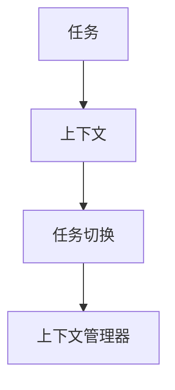
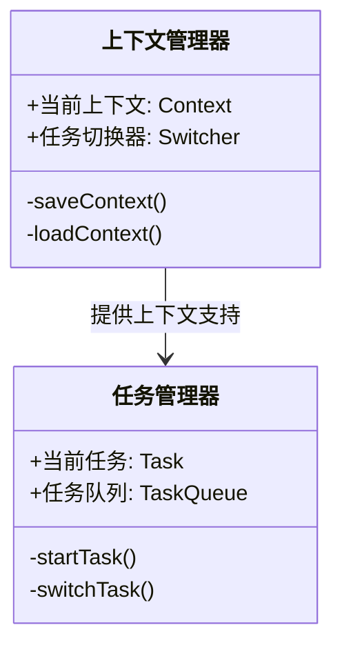
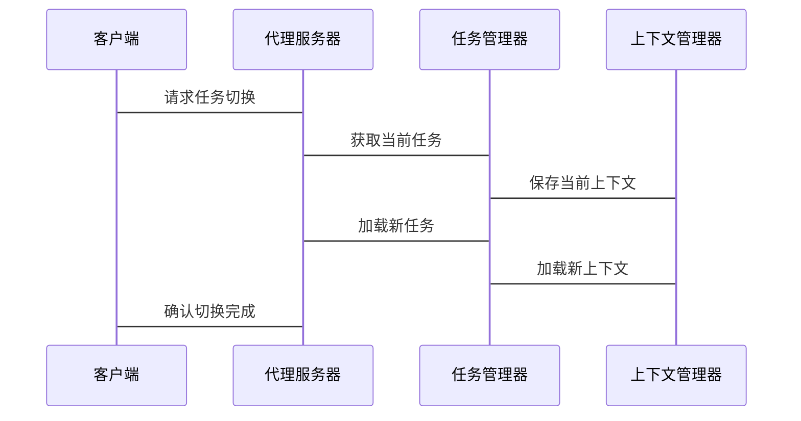

                 


```markdown
# 上下文切换：让AI Agent更灵活地处理复杂场景

## 关键词：
AI Agent, 上下文切换, 多任务处理, 任务切换, 上下文管理

## 摘要：
本文深入探讨了上下文切换在AI Agent中的重要性及其在复杂场景中的应用。通过分析多任务处理中的挑战，提出了有效的任务切换机制和上下文管理方法，结合实际案例和代码实现，为构建高效灵活的AI Agent提供指导。

## 目录

### 第一部分: 上下文切换的背景与重要性

#### 第1章: 上下文切换的背景与问题背景

##### 1.1 问题背景
###### 1.1.1 AI Agent的多任务处理挑战
在处理多个任务时，AI Agent需要在不同上下文间切换，保持高效和准确性。

###### 1.1.2 上下文切换的必要性
上下文切换是处理复杂场景的关键，确保任务间的平滑过渡。

###### 1.1.3 复杂场景下的任务切换需求
复杂场景中，任务切换的频率和复杂度更高，要求上下文管理更加精细。

##### 1.2 问题描述
###### 1.2.1 上下文切换的核心问题
如何在任务切换时保持信息完整性，避免数据丢失。

###### 1.2.2 任务切换中的信息丢失问题
分析任务切换过程中可能的信息丢失及其影响。

###### 1.2.3 多线程处理中的上下文管理
探讨多线程环境下上下文切换的实现方法。

##### 1.3 问题解决
###### 1.3.1 上下文切换的解决方案概述
介绍上下文切换的主要方法和工具。

###### 1.3.2 任务切换机制的设计思路
设计任务切换的触发条件和流程。

###### 1.3.3 上下文管理的实现方法
详细讲解上下文存储和恢复的具体步骤。

##### 1.4 边界与外延
###### 1.4.1 上下文切换的边界条件
定义上下文切换的适用范围和限制。

###### 1.4.2 相关概念的外延扩展
扩展讨论与上下文切换相关的其他概念。

###### 1.4.3 与其他技术的关联性
分析上下文切换与多线程、分布式系统等技术的关系。

##### 1.5 概念结构与核心要素
###### 1.5.1 上下文切换的核心要素
包括上下文存储、任务切换机制等关键组成部分。

###### 1.5.2 任务切换的流程模型
用流程图展示任务切换的详细步骤。

###### 1.5.3 上下文管理的系统架构
描述系统架构中各模块的职责和交互方式。

### 第二部分: 核心概念与联系

#### 第2章: 核心概念与联系

##### 2.1 上下文切换的机制原理
###### 2.1.1 上下文切换的基本原理
解释上下文切换的基本概念和工作原理。

###### 2.1.2 任务切换的触发条件
分析任务切换触发的具体条件和场景。

###### 2.1.3 上下文存储与恢复的实现
详细描述上下文存储和恢复的具体实现方法。

##### 2.2 核心概念属性对比
###### 2.2.1 上下文切换的关键属性
比较不同上下文切换方法的优缺点。

###### 2.2.2 任务切换的属性对比
用表格展示任务切换不同方法的对比。

###### 2.2.3 上下文管理的属性分析
分析上下文管理中的关键属性及其影响。

##### 2.3 实体关系图


### 第三部分: 算法原理讲解

#### 第3章: 算法原理

##### 3.1 任务切换算法

###### 3.1.1 任务切换的触发条件
分析任务切换的触发条件，如优先级、时间限制等。

###### 3.1.2 上下文存储机制
设计高效的上下文存储结构，确保快速恢复。

###### 3.1.3 任务切换流程
详细描述任务切换的流程，包括保存当前上下文、加载新任务等步骤。

##### 3.2 上下文记忆模型

###### 3.2.1 上下文记忆的结构设计
设计上下文记忆的数据结构，确保信息的完整性和可恢复性。

###### 3.2.2 上下文恢复算法
实现高效的上下文恢复算法，确保任务切换的平滑进行。

###### 3.2.3 任务切换的数学模型
建立数学模型，描述任务切换的逻辑关系。

### 第四部分: 系统分析与架构设计

#### 第4章: 系统分析与架构设计

##### 4.1 问题场景介绍
###### 4.1.1 复杂场景下的任务管理
分析复杂场景中任务管理的挑战和解决方案。

##### 4.2 项目介绍
###### 4.2.1 项目目标
明确项目的总体目标和关键里程碑。

##### 4.3 系统功能设计
###### 4.3.1 领域模型设计
用Mermaid类图展示系统的领域模型。



##### 4.4 系统架构设计
###### 4.4.1 系统架构图
用Mermaid架构图展示系统的整体架构。

```mermaid
archiitecture
    客户端 --> 代理服务器
    代理服务器 --> 任务管理器
    代理服务器 --> 上下文管理器
```

##### 4.5 系统接口设计
###### 4.5.1 接口描述
详细描述系统接口，如上下文保存、任务切换等。

##### 4.6 系统交互设计
###### 4.6.1 系统交互流程
用Mermaid序列图展示系统交互的流程。



### 第五部分: 项目实战

#### 第5章: 项目实战

##### 5.1 环境安装
###### 5.1.1 开发环境配置
安装必要的开发工具和库，如Python、Mermaid等。

##### 5.2 核心实现

###### 5.2.1 任务切换器实现
编写Python代码实现任务切换器，包括保存和加载上下文的功能。

```python
class ContextManager:
    def __init__(self):
        self.current_context = {}

    def save_context(self):
        # 保存当前上下文
        pass

    def load_context(self, context_id):
        # 加载指定上下文
        pass

class TaskSwitcher:
    def __init__(self):
        self.context_manager = ContextManager()

    def switch_task(self, new_task):
        self.context_manager.save_context()
        # 加载新任务的上下文
        self.context_manager.load_context(new_task.context_id)
```

###### 5.2.2 上下文存储实现
实现高效的上下文存储机制，确保任务切换的快速响应。

##### 5.3 案例分析
###### 5.3.1 实际案例
分析一个多轮对话任务切换的实际案例，展示上下文切换的效果。

##### 5.4 代码实现与分析
###### 5.4.1 代码实现
提供完整的代码实现，包括任务切换器和上下文管理器的实现。

###### 5.4.2 代码分析
分析代码的结构和实现细节，解释每个部分的功能。

### 第六部分: 最佳实践与小结

#### 第6章: 最佳实践

##### 6.1 最佳实践总结
###### 6.1.1 经验总结
总结上下文切换中的最佳实践，如选择合适的存储结构、优化任务切换流程等。

##### 6.1.2 注意事项
提醒在实际应用中需要注意的事项，避免常见错误。

##### 6.2 拓展阅读
###### 6.2.1 相关技术
推荐相关的书籍和资源，供读者深入学习。

### 参考文献
- AI Agent相关书籍
- 上下文切换的学术论文
- 相关技术文档

### 致谢
感谢读者的支持和关注，感谢在编写过程中提供帮助的同事和朋友。
```

这个目录大纲详细地覆盖了上下文切换在AI Agent中的各个方面，从背景介绍到算法实现，再到项目实战和最佳实践，确保读者能够全面理解并掌握相关知识。

