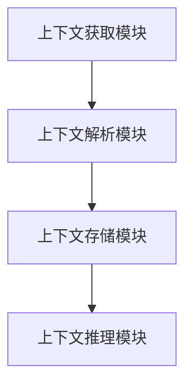
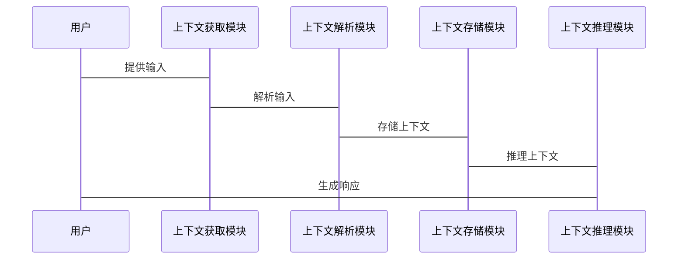

                 


# 上下文管理：增强AI Agent的对话连贯性

## 关键词：上下文管理，对话系统，AI Agent，自然语言处理，对话连贯性，机器学习

## 摘要：  
上下文管理是实现AI Agent与人类对话连贯性的重要技术。本文通过详细分析上下文管理的背景、核心概念、算法原理、系统架构设计以及实际项目案例，全面探讨如何通过上下文管理提升AI Agent的对话能力。文章从基础概念出发，结合数学模型和系统设计，为读者提供深入的技术解析，同时结合实际案例，展示上下文管理在AI对话系统中的具体应用。

---

# 第一部分: 上下文管理概述

## 第1章: 上下文管理的背景与概念

### 1.1 上下文管理的定义与背景  
上下文管理是指在对话过程中，系统对当前对话的背景、历史信息、用户意图等进行理解和管理的过程。它通过捕捉对话中的关键信息，帮助AI Agent更好地理解和生成连贯的对话内容。

#### 1.1.1 什么是上下文管理  
上下文管理是一种技术，用于跟踪和维护对话中的上下文信息，包括用户的历史输入、当前对话的状态以及可能的意图。它是实现对话系统连贯性的核心机制。

#### 1.1.2 上下文管理的重要性  
在AI Agent与用户的对话中，上下文管理能够确保对话的连贯性，避免重复提问或信息丢失。它通过分析对话历史，帮助系统更好地理解用户的需求，从而提供更精准的回复。

#### 1.1.3 上下文管理的应用场景  
上下文管理广泛应用于智能客服、智能助手、对话机器人等领域。例如，在智能客服系统中，上下文管理可以帮助系统理解用户的问题背景，从而提供更准确的解决方案。

### 1.2 AI Agent与对话连贯性的关系  
AI Agent是一种能够自主感知环境并执行任务的智能体。在对话系统中，AI Agent需要通过上下文管理来理解用户的需求，并生成连贯的对话内容。

#### 1.2.1 AI Agent的基本概念  
AI Agent是具有智能性的计算机程序，能够通过感知环境、理解用户输入并执行任务。在对话系统中，AI Agent需要具备上下文管理能力，以确保对话的连贯性。

#### 1.2.2 对话连贯性的挑战  
对话的连贯性是指对话内容在逻辑上和语义上保持一致。然而，由于用户的输入可能不完整或存在歧义，AI Agent需要通过上下文管理来理解和生成连贯的对话内容。

#### 1.2.3 上下文管理在AI Agent中的作用  
上下文管理是AI Agent实现对话连贯性的关键技术。它通过维护对话历史和用户意图，帮助AI Agent理解上下文信息，并生成符合逻辑的回复。

### 1.3 本章小结  
本章介绍了上下文管理的基本概念、重要性和应用场景，并重点阐述了上下文管理在AI Agent中的作用。通过本章的学习，读者可以理解上下文管理在对话系统中的重要性。

---

## 第2章: 上下文管理的核心概念

### 2.1 上下文管理的核心要素  
上下文管理的核心要素包括对话历史、用户意图、当前状态等。这些要素共同构成了对话的上下文信息。

#### 2.1.1 上下文的组成  
上下文由对话历史、用户意图和当前状态三部分组成。对话历史记录了用户之前的输入，用户意图反映了用户的需求，当前状态则描述了对话的当前情况。

#### 2.1.2 上下文的状态表示  
上下文的状态可以通过向量、图结构或概率分布等多种方式表示。其中，向量表示法是一种常见的方法，通过将上下文信息映射为向量，便于后续处理。

#### 2.1.3 上下文的更新机制  
上下文的更新机制是指在对话过程中，如何根据新的输入更新上下文信息。常见的更新机制包括基于规则的更新和基于模型的更新。

### 2.2 上下文与对话连贯性的关系  
上下文是对话连贯性的基础。通过管理上下文信息，AI Agent可以理解用户的意图，并生成连贯的对话内容。

#### 2.2.1 上下文在对话中的作用  
上下文在对话中的作用包括提供背景信息、帮助理解用户意图以及指导对话生成。通过上下文管理，AI Agent能够更好地理解用户的需求，并生成符合逻辑的回复。

#### 2.2.2 上下文对对话连贯性的影响  
上下文对对话连贯性的影响主要体现在帮助系统理解对话的背景和逻辑。通过上下文管理，AI Agent可以避免重复提问或信息丢失，从而提高对话的连贯性。

#### 2.2.3 上下文管理的目标  
上下文管理的目标是通过维护和更新上下文信息，帮助AI Agent理解用户的需求，并生成连贯的对话内容。

### 2.3 本章小结  
本章详细介绍了上下文管理的核心要素、状态表示和更新机制，并探讨了上下文在对话连贯性中的作用。通过本章的学习，读者可以理解上下文管理的基本原理。

---

## 第3章: 上下文管理的算法原理

### 3.1 上下文管理的基本原理  
上下文管理的算法原理包括信息提取、上下文建模和对话生成三个主要步骤。

#### 3.1.1 上下文的获取与解析  
上下文的获取与解析是指从用户输入中提取关键信息，并将其转化为系统能够理解的格式。这一步骤是上下文管理的基础。

#### 3.1.2 上下文的存储与更新  
上下文的存储与更新是指将提取的信息存储起来，并在对话过程中不断更新。常见的存储方式包括数据库和缓存。

#### 3.1.3 上下文的关联与推理  
上下文的关联与推理是指通过分析上下文信息，推理出用户的潜在需求。这一步骤需要结合自然语言处理技术和推理算法。

### 3.2 上下文管理的算法实现  
上下文管理的算法实现包括基于概率论的推理、基于图论的关联和基于深度学习的建模。

#### 3.2.1 基于概率论的上下文推理  
基于概率论的上下文推理是一种常用的推理方法。通过计算事件之间的概率关系，系统可以推断出用户的潜在需求。

#### 3.2.2 基于图论的上下文关联  
基于图论的上下文关联方法通过构建图结构，分析上下文信息之间的关联关系。这种方法在处理复杂对话场景时具有优势。

#### 3.2.3 基于深度学习的上下文建模  
基于深度学习的上下文建模方法通过神经网络模型，捕捉上下文信息的语义特征。这种方法在处理复杂对话场景时表现出色。

### 3.3 本章小结  
本章详细介绍了上下文管理的算法原理和实现方法，包括基于概率论、图论和深度学习的上下文推理方法。通过本章的学习，读者可以理解上下文管理的技术实现。

---

## 第4章: 上下文管理的系统架构与设计

### 4.1 上下文管理系统的架构设计  
上下文管理系统的架构设计包括功能设计、架构图和扩展性设计。

#### 4.1.1 系统功能设计  
上下文管理系统的功能设计包括上下文获取、解析、存储和推理四个模块。每个模块负责不同的功能，协同工作以实现上下文管理。

#### 4.1.2 系统架构图  
下图展示了上下文管理系统的架构设计。系统分为上下文获取、解析、存储和推理四个模块，每个模块之间通过接口进行交互。



#### 4.1.3 系统扩展性设计  
系统扩展性设计考虑了未来的扩展需求，例如增加新的上下文类型或优化推理算法。通过模块化设计，系统可以方便地进行扩展。

### 4.2 上下文管理系统的接口设计  
上下文管理系统的接口设计包括接口定义、实现细节和调用流程。

#### 4.2.1 系统接口定义  
系统接口定义包括上下文获取接口、解析接口和推理接口。每个接口负责不同的功能，通过标准化的接口定义，方便系统集成。

#### 4.2.2 接口实现细节  
接口实现细节包括参数定义、返回格式和调用流程。通过标准化的接口定义，系统可以方便地进行集成和扩展。

#### 4.2.3 接口调用流程  
接口调用流程包括用户输入处理、系统响应生成和上下文状态更新。通过接口调用流程的设计，系统可以实现高效的上下文管理。

### 4.3 上下文管理系统的交互设计  
上下文管理系统的交互设计包括交互流程、序列图和小结。

#### 4.3.1 交互流程设计  
交互流程设计包括用户输入处理、系统响应生成和上下文状态更新。通过交互流程的设计，系统可以实现高效的对话管理。

#### 4.3.2 交互序列图  
下图展示了上下文管理系统的交互序列图。用户输入首先被解析，然后上下文信息被存储，最后系统生成响应。



#### 4.3.3 本章小结  
本章详细介绍了上下文管理系统的架构设计、接口设计和交互设计。通过模块化设计和标准化接口，系统可以实现高效的上下文管理。

---

## 第5章: 上下文管理的项目实战

### 5.1 项目背景与目标  
项目背景包括对话系统的应用需求和上下文管理的重要性。目标是通过实现上下文管理，提升对话系统的连贯性。

#### 5.1.1 项目背景  
本项目旨在开发一个智能对话系统，通过上下文管理提升对话的连贯性。项目的核心需求包括上下文获取、解析、存储和推理。

#### 5.1.2 项目目标  
项目目标是实现一个高效的上下文管理系统，能够准确捕捉对话中的上下文信息，并生成连贯的对话内容。

### 5.2 项目实现细节  
项目实现细节包括环境安装、核心代码实现和案例分析。

#### 5.2.1 环境安装  
项目需要安装Python、相关库和框架。以下是安装命令：

```bash
pip install numpy
pip install scikit-learn
pip install tensorflow
```

#### 5.2.2 核心代码实现  
以下是上下文管理系统的核心代码实现：

```python
class ContextManager:
    def __init__(self):
        self.context = {}

    def update_context(self, key, value):
        self.context[key] = value

    def get_context(self, key):
        return self.context.get(key, None)

    def infer_context(self, new_info):
        # 假设new_info是新的上下文信息
        # 通过推理算法更新上下文
        pass
```

#### 5.2.3 项目案例分析  
通过具体案例分析，展示上下文管理系统在实际对话中的应用。例如，在智能客服系统中，上下文管理可以帮助系统理解用户的问题背景，并提供更精准的解决方案。

### 5.3 项目总结与优化建议  
项目总结包括实现成果和优化方向。优化建议包括算法优化和系统扩展。

#### 5.3.1 项目总结  
通过本项目，我们实现了上下文管理系统的核心功能，包括上下文获取、解析、存储和推理。系统在实际对话中表现出良好的连贯性。

#### 5.3.2 优化方向  
未来可以在算法优化和系统扩展方面进行改进。例如，引入更先进的深度学习模型，或者优化系统的扩展性设计。

### 5.4 本章小结  
本章通过一个实际项目案例，展示了上下文管理系统的实现过程和应用效果。通过本章的学习，读者可以掌握上下文管理系统的实际应用。

---

## 第6章: 总结与展望

### 6.1 总结  
上下文管理是实现AI Agent对话连贯性的关键技术。通过本篇文章的学习，读者可以掌握上下文管理的核心概念、算法原理和系统设计。

#### 6.1.1 核心内容回顾  
上下文管理的核心内容包括上下文的组成、状态表示、更新机制以及算法实现。通过这些内容的学习，读者可以理解上下文管理的基本原理。

#### 6.1.2 上下文管理的重要性  
上下文管理在AI Agent对话系统中的作用不可忽视。它通过管理对话的上下文信息，帮助系统理解用户的需求，并生成连贯的对话内容。

### 6.2 未来展望  
上下文管理技术的发展方向包括算法优化、系统扩展和应用场景的拓展。未来，随着技术的进步，上下文管理将在更多领域得到应用。

#### 6.2.1 算法优化  
未来可以在上下文推理算法方面进行优化，例如引入更先进的深度学习模型，或者优化概率推理算法。

#### 6.2.2 系统扩展  
系统可以进一步扩展，例如支持多轮对话、多用户同时对话，或者与其他系统的集成。

#### 6.2.3 应用场景拓展  
上下文管理技术可以在更多领域得到应用，例如智能客服、智能助手、教育机器人等。

### 6.3 最佳实践 Tips  
在实际应用中，建议读者注意以下几点：  
1. 在设计上下文管理系统时，需要充分考虑系统的扩展性和可维护性。  
2. 在实现上下文推理算法时，可以结合具体的业务需求，选择合适的算法和模型。  
3. 在实际对话中，需要结合上下文管理和自然语言处理技术，共同提升对话的连贯性。

### 6.4 本章小结  
本章总结了上下文管理的核心内容，展望了未来的发展方向，并给出了最佳实践的建议。通过本章的学习，读者可以更好地理解上下文管理的重要性和应用价值。

---

## 结语  
上下文管理是实现AI Agent对话连贯性的关键技术。通过本篇文章的学习，读者可以掌握上下文管理的核心概念、算法原理和系统设计。未来，随着技术的不断进步，上下文管理将在更多领域得到应用，为AI对话系统的连贯性提供更强大的支持。

