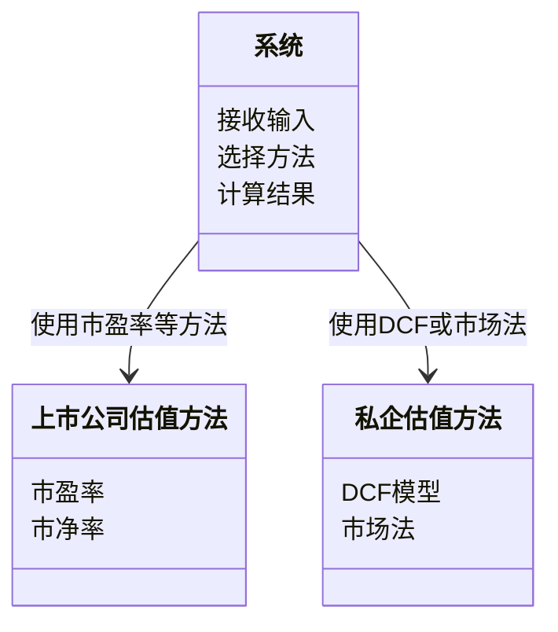
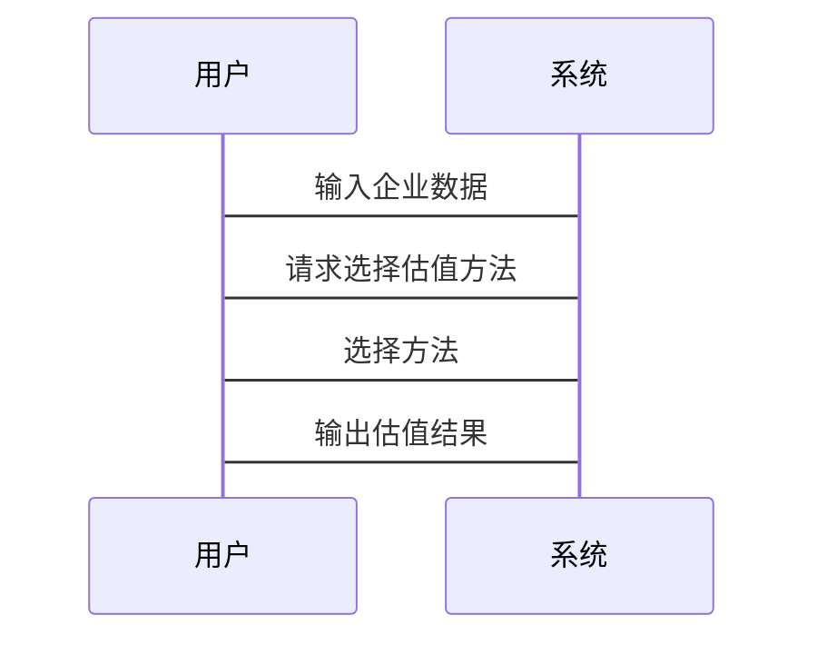

                 


# 上市公司估值方法与私企估值的区别

## 关键词：上市公司估值、私企估值、市盈率、DCF模型、EV/EBITDA

## 摘要：  
本文详细探讨了上市公司与私企在估值方法上的区别。通过分析上市公司的公开透明数据与私企的非公开特性，揭示了市盈率、市净率等方法在上市公司中的广泛应用，以及私企常用的股权自由现金流模型和市场法的差异。文章还结合数学模型和系统设计，深入剖析了不同估值方法的适用场景，并通过实际案例展示了如何在不同企业类型中选择合适的估值方法。

---

# 第一部分: 上市公司估值方法与私企估值的区别概述

## # 第1章: 背景介绍

### 1.1 核心概念

#### 1.1.1 问题背景
企业估值是金融领域的核心问题之一，其目的是确定企业的内在价值或市场价值。上市公司和私企在估值方法上有显著区别，主要体现在数据透明度、流动性、目标和适用性上。

#### 1.1.2 问题描述
- **上市公司**：公开透明的财务数据和市场信息，流动性高，适合使用基于财务指标的估值方法（如市盈率、市净率）。
- **私企**：数据不透明，缺乏流动性，适合使用现金流模型或市场法。

#### 1.1.3 问题解决
- 选择合适的估值方法，确保结果准确。
- 考虑企业类型和数据特性，优化估值模型。

#### 1.1.4 边界与外延
- **边界**：仅限于企业整体估值，不考虑部分股权。
- **外延**：可扩展到并购、融资等场景。

#### 1.1.5 概念结构与核心要素组成
- **估值方法**：市盈率、DCF模型等。
- **核心要素**：现金流、折现率、财务指标。

### 1.2 问题解决思路

- **分析数据特性**：上市公司数据透明，私企数据不透明。
- **选择方法**：根据数据特性选择合适方法。
- **验证结果**：通过交叉验证确保准确性。

---

## # 第2章: 核心概念与联系

### 2.1 核心概念原理

#### 2.1.1 上市公司估值方法
- **市盈率（P/E）模型**：使用股价与每股收益的比值。
  - 公式：$$ P/E = \frac{\text{股价}}{\text{每股收益}} $$
- **市净率（P/B）模型**：股价与每股净资产的比值。
  - 公式：$$ P/B = \frac{\text{股价}}{\text{每股净资产}} $$
- **EV/EBITDA模型**：企业价值与息税折旧及摊销前利润的比值。
  - 公式：$$ EV/EBITDA = \frac{\text{企业价值}}{\text{EBITDA}} $$

#### 2.1.2 私企估值方法
- **股权自由现金流模型（DCF）**：基于未来现金流的折现。
  - 公式：$$ FV = \sum_{t=1}^{n} \frac{CF_t}{(1+r)^t} $$
- **市场法**：基于可比交易或可比企业的平均倍数。
- **收益法**：基于未来收益的折现。
- **资产基础法**：基于资产负债表进行调整。

### 2.2 概念属性特征对比

```markdown
| 比较维度       | 上市公司估值方法                     | 私企估值方法                       |
|----------------|------------------------------------|------------------------------------|
| 数据透明度     | 高                                 | 低                                 |
| 流动性         | 高                                 | 低                                 |
| 适用场景       | 确定市场价值                       | 确定内在价值                       |
| 方法选择       | 市盈率、市净率等                   | DCF模型、市场法等                 |
| 限制条件       | 数据容易获取，但可能受市场情绪影响 | 数据获取困难，且需假设合理性       |
```

### 2.3 ER实体关系图架构

```mermaid
erDiagram
    actor 投资者 {
        <属性>
        股票代码
        市盈率
        每股收益
    }
    actor 私企 {
        <属性>
        股权现金流
        可比企业数据
    }
    actor 估值结果 {
        <属性>
        企业价值
        股权价值
    }
    投资者 --> 上市公司估值方法 : 使用市盈率等方法
    私企 --> 私企估值方法 : 使用DCF或市场法
    上市公司估值方法 --> 估值结果 : 计算企业价值
    私企估值方法 --> 估值结果 : 计算股权价值
```

---

## # 第3章: 算法原理讲解

### 3.1 上市公司估值方法的算法原理

#### 3.1.1 市盈率模型
- **步骤**：
  1. 收集企业的财务数据（如净利润）。
  2. 计算每股收益（EPS）。
  3. 使用可比企业的平均市盈率乘以EPS，得到目标股价。
  - 公式：$$ \text{目标股价} = \text{平均市盈率} \times \text{EPS} $$

#### 3.1.2 DCF模型
- **步骤**：
  1. 预测未来现金流。
  2. 确定合适的折现率。
  3. 计算终值。
  4. 折现并求和，得到企业价值。

### 3.2 私企估值方法的算法原理

#### 3.2.1 股权自由现金流模型
- **步骤**：
  1. 预测未来股权自由现金流。
  2. 确定股权折现率。
  3. 计算终值。
  4. 折现并求和，得到股权价值。

#### 3.2.2 市场法
- **步骤**：
  1. 收集可比交易或企业的数据。
  2. 计算可比企业的平均倍数。
  3. 应用于目标企业，得到股权价值。

---

## # 第4章: 系统分析与架构设计方案

### 4.1 系统功能设计

#### 4.1.1 功能模块
- **数据输入**：用户输入企业数据。
- **模型选择**：选择估值方法。
- **计算结果**：输出估值结果。

#### 4.1.2 领域模型


### 4.2 系统架构设计

#### 4.2.1 架构图
```mermaid
container 系统架构 {
    组件1：数据输入模块
    组件2：模型选择模块
    组件3：计算模块
    组件4：输出模块
}
```

### 4.3 接口设计与交互

#### 4.3.1 接口设计
- **输入接口**：用户输入企业数据。
- **输出接口**：显示估值结果。

#### 4.3.2 交互流程


---

## # 第5章: 项目实战

### 5.1 环境安装

- **工具**：Python、Pandas、Matplotlib。
- **库**：安装numpy、pandas、scipy。

### 5.2 系统核心实现源代码

#### 5.2.1 上市公司估值代码

```python
import pandas as pd
import numpy as np

def calculate_pe_ratio(ticker):
    # 获取数据
    df = pd.read_csv(f'data/{ticker}.csv')
    eps = df['EPS'].mean()
    market_price = df['Close'].mean()
    pe_ratio = market_price / eps
    return pe_ratio

# 示例
ticker = 'AAPL'
pe = calculate_pe_ratio(ticker)
print(f"PE Ratio for {ticker}: {pe}")
```

#### 5.2.2 私企估值代码

```python
def calculate_fcf_fv(fcf_list, discount_rate):
    n = len(fcf_list)
    terminal_value = fcf_list[-1] * (1 + discount_rate)
    present_value = 0
    for i in range(n):
        if i == n-1:
            present_value += terminal_value / (1 + discount_rate)**i
        else:
            present_value += fcf_list[i] / (1 + discount_rate)**i
    return present_value

# 示例
fcf = [100, 110, 120]
discount_rate = 0.1
fv = calculate_fcf_fv(fcf, discount_rate)
print(f"Final Value: {fv}")
```

### 5.3 案例分析

#### 5.3.1 上市公司案例

- 公司：苹果（AAPL）
- 数据：历史股价、EPS。
- 计算：市盈率 = 股价 / EPS。

#### 5.3.2 私企案例

- 公司：某科技创业公司。
- 数据：预测现金流。
- 计算：股权价值 = 现金流折现。

### 5.4 代码应用解读与分析

- **上市公司代码**：使用历史数据计算市盈率，评估市场价值。
- **私企代码**：基于预测现金流，计算内在价值。

---

## # 第6章: 总结与展望

### 6.1 总结

- **核心发现**：上市公司和私企估值方法的差异源于数据特性。
- **主要结论**：选择合适的方法至关重要。

### 6.2 展望

- **未来研究**：结合AI优化估值模型。
- **发展方向**：探索更精准的估值方法。

### 6.3 最佳实践 tips

- **上市公司**：优先使用市盈率、市净率。
- **私企**：DCF模型是首选。
- **注意事项**：数据质量影响结果准确性。

### 6.4 小结

本文系统地分析了上市公司与私企估值的区别，提供了实用的估值方法和系统设计，帮助读者在实际中选择合适的策略。

---

## # 参考文献

- Smith, R. (2020). *Financial Valuation Methods*. John Wiley & Sons.
- Fama, E. (1970). *Efficient Capital Markets: A Review of Theory and Practice*. Journal of Finance.

---

通过以上结构，我们可以清晰地看到上市公司与私企估值的区别，并在实际应用中灵活选择合适的方法。

