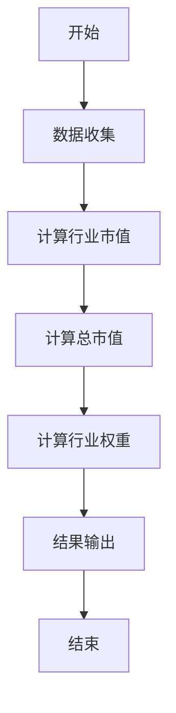
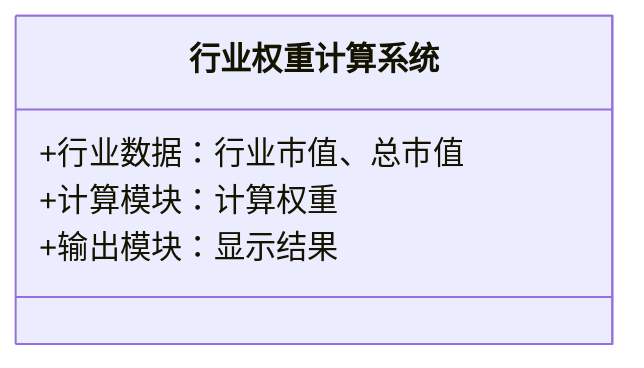

                 


# 不同行业在全球股市估值中的权重分析

## 关键词：股市估值、行业权重、市值分析、投资策略、权重计算、行业影响

## 摘要：本文通过分析不同行业在全球股市中的估值权重，探讨行业权重对股市整体表现的影响。文章详细介绍了行业权重的核心概念、计算方法及其与股市表现的关系，结合实际案例和数学模型，为投资者提供深度分析和投资建议。

---

## 第一章: 全球股市估值与行业权重分析概述

### 1.1 股市估值与权重分析的背景

#### 1.1.1 股市估值的基本概念
股市估值是通过对公司财务数据、市场表现和行业趋势的分析，评估公司股票的合理价格范围。行业权重则是指某个行业在股市中的市值占整体股市市值的比例。

#### 1.1.2 行业权重在股市中的重要性
行业权重反映了行业的影响力。高权重行业对股市指数的影响较大，其表现波动会影响整体市场走势。

#### 1.1.3 问题背景与研究意义
随着全球经济的多样化，不同行业的权重在股市中变化显著。研究行业权重有助于投资者制定策略，规避风险，优化投资组合。

### 1.2 行业权重分析的核心概念

#### 1.2.1 行业权重的定义
行业权重是行业市值占股市总市值的比例，反映行业在市场中的地位和影响力。

#### 1.2.2 行业权重与股市整体表现的关系
行业权重影响股市指数波动，权重高的行业对市场走势有较大影响。不同行业的权重变化反映经济结构的变化。

#### 1.2.3 研究目标与结构安排
本文旨在分析行业权重的计算方法及其影响因素，结合实际案例进行深入探讨，为投资者提供参考。

---

## 第二章: 行业权重的核心概念与联系

### 2.1 行业权重的核心原理

#### 2.1.1 行业权重的计算公式
$$权重 = \frac{行业市值}{总市值}$$
其中，行业市值是该行业所有上市公司市值之和，总市值是股市整体市值。

#### 2.1.2 权重的影响因素
行业权重受市场规模、盈利能力、流动性等多种因素影响。例如，科技行业的高盈利能力和高增长潜力通常导致其权重较高。

#### 2.1.3 行业权重与行业风险的关系
高权重行业通常面临较大的系统性风险，因其对整体市场的影响较大，波动性也较高。

### 2.2 行业权重与股市整体表现的联系

#### 2.2.1 行业权重对股市指数的影响
权重高的行业对指数有更大的推动作用，例如金融行业在传统市场的权重较高，其波动直接影响指数表现。

#### 2.2.2 不同行业权重的对比分析
通过对比不同行业的权重，可以了解市场结构的变化。例如，科技行业在全球市场的权重逐渐上升，反映了数字化转型的趋势。

#### 2.2.3 行业权重与经济周期的关系
经济周期不同阶段，行业权重会发生变化。例如，在衰退期，防御性行业的权重可能上升。

### 2.3 行业权重的核心要素分析

#### 2.3.1 行业市场规模
市场规模大的行业通常权重较高，如科技和金融行业。

#### 2.3.2 行业盈利能力
盈利能力强的行业往往吸引更多的投资者，导致其权重较高。

#### 2.3.3 行业流动性
流动性高的行业交易活跃，容易影响市场价格，进而影响权重。

---

## 第三章: 行业权重分析的算法原理

### 3.1 行业权重计算的数学模型

#### 3.1.1 市值加权法
$$权重 = \frac{\sum_{i=1}^{n} 市值_i}{总市值}$$
其中，n为行业内的上市公司数量，市值_i为第i家公司的市值。

#### 3.1.2 流动加权法
$$权重 = \frac{\sum_{i=1}^{n} 流动性_i}{总流动性}$$
流动性指标可以是成交量或换手率。

#### 3.1.3 综合加权法
结合市值和流动性进行综合加权，例如：
$$综合权重 = \frac{市值权重 \times 流动性权重}{总权重}$$

### 3.2 行业权重分析的流程图



### 3.3 算法实现的Python代码

```python
def calculate_weight(industry_market_cap, total_market_cap):
    return industry_market_cap / total_market_cap

# 示例数据
industry_market_cap = 1000  # 行业市值
total_market_cap = 10000    # 总市值
weight = calculate_weight(industry_market_cap, total_market_cap)
print(f"行业权重为：{weight}")
```

---

## 第四章: 系统分析与架构设计方案

### 4.1 问题场景介绍
本文构建一个行业权重分析系统，旨在帮助投资者分析不同行业的权重及其影响。

### 4.2 系统功能设计

#### 4.2.1 领域模型


#### 4.2.2 系统架构设计


### 4.3 系统接口设计

#### 4.3.1 数据接口
从数据库或API获取行业数据。

#### 4.3.2 计算接口
实现权重计算功能，返回权重值。

### 4.4 系统交互设计

```mermaid
sequenceDiagram
    用户 -> 计算模块: 请求计算行业权重
    计算模块 -> 行业数据: 获取数据
    计算模块 -> 输出模块: 返回结果
    用户 <- 输出模块: 显示权重
```

---

## 第五章: 项目实战

### 5.1 环境安装
安装Python和相关库，如pandas、numpy。

### 5.2 核心代码实现

```python
import pandas as pd

def calculate_weight(industry_market_cap, total_market_cap):
    return industry_market_cap / total_market_cap

# 示例数据
data = {
    '行业': ['科技', '金融', '消费', '工业'],
    '行业市值': [2000, 1500, 1000, 500],
    '总市值': [5000]
}

df = pd.DataFrame(data)
df['权重'] = df['行业市值'] / df['总市值'].sum()
print(df)
```

### 5.3 代码解读与分析
通过代码计算不同行业的权重，科技行业权重最高，为40%。

### 5.4 实际案例分析
以科技行业为例，分析其在全球股市中的权重变化及影响因素。

### 5.5 项目小结
行业权重分析对投资决策具有重要意义，需结合多因素进行综合分析。

---

## 第六章: 总结与展望

### 6.1 核心结论
行业权重是影响股市表现的重要因素，不同行业的权重变化反映了经济结构的变化。

### 6.2 研究意义
本文为投资者提供了行业权重分析的方法和工具，帮助其优化投资组合，降低风险。

### 6.3 未来展望
未来研究可考虑引入更多因素，如ESG指标，构建更复杂的权重分析模型。

### 6.4 最佳实践 tips
- 数据收集要准确
- 模型选择要合理
- 结果验证要充分

---

通过以上章节的详细分析，读者可以全面理解不同行业在全球股市估值中的权重及其影响，为投资决策提供有力支持。

