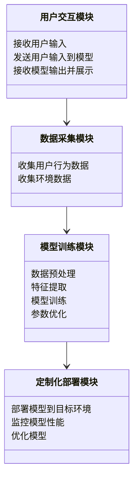

                 


# 个性化定制：打造独特风格的AI Agent

---

## 关键词：  
AI Agent, 个性化定制, 人工智能, 机器学习, 自然语言处理, 系统架构

---

## 摘要：  
个性化定制的AI Agent是人工智能领域的重要研究方向。随着AI技术的不断发展，用户对AI Agent的需求日益多样化和个性化。本文从AI Agent的基本概念出发，详细探讨了个性化定制的核心问题、技术原理、系统架构设计以及项目实现的关键步骤。通过理论分析与实践结合，本文为读者提供了一套打造独特风格AI Agent的方法论，帮助技术开发者更好地理解个性化定制的实现路径与实际应用。

---

## 正文：

### 第一部分：个性化定制AI Agent的背景与核心概念

#### 第1章：个性化定制AI Agent的背景与问题背景

##### 1.1 AI Agent的基本概念

AI Agent（人工智能代理）是指能够感知环境、自主决策并执行任务的智能实体。AI Agent可以是软件程序、机器人或其他智能系统，其核心目标是通过智能算法解决问题并提供服务。随着技术的进步，AI Agent已广泛应用于自动驾驶、智能客服、推荐系统等领域。

个性化定制的AI Agent是指根据用户的特定需求，量身打造具备独特风格和功能的AI代理。这种定制化的AI Agent能够更好地满足用户的个性化需求，提升用户体验和效率。

##### 1.2 个性化定制的核心问题背景

个性化定制的必要性源于用户需求的多样性。不同用户在使用AI Agent时可能有不同的偏好、习惯和应用场景。例如，一位用户可能需要AI Agent具备强大的自然语言处理能力，而另一位用户则可能更关注其数据分析能力。传统的通用AI Agent难以满足这些多样化的需求，因此个性化定制成为必然趋势。

个性化定制的核心问题包括：
1. 如何高效地收集和分析用户的个性化需求？
2. 如何在AI Agent的设计和训练过程中融入这些需求？
3. 如何确保定制化的AI Agent在实际应用中具备稳定性和可扩展性？

##### 1.3 个性化定制AI Agent的目标与意义

个性化定制AI Agent的目标是打造具备独特风格、高度契合用户需求的智能代理。通过个性化定制，AI Agent能够更精准地理解用户意图、提供更个性化的服务，并在复杂环境中表现出更强的适应能力。

个性化定制的意义主要体现在以下几个方面：
- 提升用户体验：通过定制化服务，用户能够获得更符合其需求的AI代理。
- 增强竞争力：个性化定制使AI Agent在市场中更具差异化，能够更好地满足特定行业或场景的需求。
- 促进技术创新：个性化定制推动了AI Agent在算法、架构和应用层面的创新，为人工智能技术的发展注入新的动力。

---

### 第二部分：个性化定制AI Agent的核心概念与技术原理

#### 第2章：个性化定制AI Agent的核心概念

##### 2.1 AI Agent的结构与功能

AI Agent的结构通常包括以下几个关键模块：
- **感知模块**：负责收集和处理环境中的信息，例如通过传感器或API获取数据。
- **推理模块**：基于感知模块获取的信息，利用算法进行分析和推理，得出决策。
- **执行模块**：根据推理结果，执行具体的任务或操作。
- **学习模块**：通过与环境的交互，不断优化自身的模型和策略。

个性化定制的核心在于对AI Agent的结构和功能进行调整，使其更符合特定需求。例如，针对自然语言处理任务的AI Agent可能需要增强语言理解和生成能力，而针对图像处理任务的AI Agent则需要强化视觉识别功能。

##### 2.2 个性化定制的方法与技术

个性化定制AI Agent的主要方法包括数据驱动、算法驱动和模型微调等。

1. **数据驱动的个性化定制**：通过收集和分析用户的行为数据，提取用户的偏好和习惯，从而调整AI Agent的模型参数或训练数据。这种方法适用于基于监督学习或强化学习的AI Agent。
2. **算法驱动的个性化定制**：通过设计和优化算法，使其更适合特定场景或用户需求。例如，针对推荐系统的个性化定制可以通过改进推荐算法（如协同过滤、深度学习模型）来实现。
3. **模型微调与参数调节**：在已有模型的基础上，通过微调参数或优化模型结构，使其更符合用户的个性化需求。这种方法通常适用于迁移学习场景。

##### 2.3 个性化定制的实现流程

个性化定制的实现流程可以分为以下几个步骤：
1. **需求分析**：了解用户的个性化需求，明确定制的目标和范围。
2. **数据收集**：收集与用户需求相关的数据，包括用户行为数据、环境数据等。
3. **模型训练**：基于收集的数据，训练或微调AI Agent的模型。
4. **模型优化**：通过验证和测试，优化模型的性能和用户体验。
5. **部署与应用**：将定制化的AI Agent部署到实际环境中，并进行持续监控和优化。

---

### 第三部分：个性化定制AI Agent的算法原理与数学模型

#### 第3章：个性化定制AI Agent的算法原理

##### 3.1 数据预处理与特征提取

数据预处理是个性化定制AI Agent的第一步。通过数据清洗、标准化和特征提取等步骤，可以将原始数据转化为适合模型训练的格式。

1. **数据清洗**：去除噪声数据、处理缺失值和异常值。
2. **特征提取**：从原始数据中提取有助于模型训练的特征，例如文本中的关键词、图像中的边缘特征等。

##### 3.2 模型训练与参数优化

个性化定制AI Agent的核心在于模型训练与参数优化。通过深度学习、强化学习等技术，可以训练出适合特定需求的模型。

1. **深度学习模型训练**：使用神经网络模型（如LSTM、Transformer）进行训练，提取数据中的深层特征。
2. **参数微调**：在已有预训练模型的基础上，通过微调模型参数，使其更适应特定任务。
3. **超参数优化**：通过网格搜索、随机搜索或贝叶斯优化等方法，找到最优的超参数组合。

##### 3.3 个性化定制的数学模型

个性化定制的数学模型可以通过以下公式表示：

$$
\text{预测结果} = f_{\theta}(x)
$$

其中，$f_{\theta}$ 表示个性化定制的模型，$\theta$ 表示模型参数，$x$ 表示输入数据。

---

### 第四部分：个性化定制AI Agent的系统架构与设计

#### 第4章：个性化定制AI Agent的系统架构

##### 4.1 系统模块划分

个性化定制AI Agent的系统架构通常包括以下几个模块：

1. **数据采集模块**：负责收集用户行为数据、环境数据等。
2. **模型训练模块**：负责对数据进行预处理、特征提取和模型训练。
3. **定制化部署模块**：将训练好的模型部署到实际环境中。
4. **用户交互模块**：负责与用户的交互，接收用户指令并返回结果。

##### 4.2 系统功能设计

系统功能设计可以通过领域模型（mermaid类图）来表示：



##### 4.3 系统架构设计

系统架构设计可以通过以下mermaid图表示：


---

### 第五部分：个性化定制AI Agent的项目实战

#### 第5章：个性化定制AI Agent的项目实战

##### 5.1 项目介绍

本项目旨在打造一个具备个性化推荐功能的AI Agent，能够根据用户的阅读习惯推荐个性化文章。

##### 5.2 环境安装

需要安装以下工具和库：
- Python 3.8+
- TensorFlow或Keras
- Scikit-learn
- Mermaid图生成工具
- Git版本控制工具

##### 5.3 核心实现代码

以下是一个简单的个性化推荐系统的代码示例：

```python
import numpy as np
from sklearn.metrics.pairwise import cosine_similarity

# 示例数据：用户行为数据矩阵，行表示用户，列表示文章
X = np.array([[1, 0, 1, 0],
              [0, 1, 1, 1],
              [1, 1, 0, 0]])

# 计算余弦相似度
similarity = cosine_similarity(X)

# 定义推荐函数
def recommend(user_id, similarity_matrix):
    user_profile = X[user_id]
    similarity_scores = similarity_matrix[user_id]
    recommended_indices = np.argsort(-similarity_scores)
    return recommended_indices[recommended_indices != user_id]

# 示例用户ID
user_id = 0
recommendations = recommend(user_id, similarity)
print("推荐的文章索引：", recommendations)
```

##### 5.4 实际案例分析

以个性化推荐系统为例，假设用户ID为0，其阅读习惯与用户ID为2的用户相似度较高。通过计算余弦相似度，可以发现用户ID为0的用户可能对文章3感兴趣。

##### 5.5 项目小结

本项目通过简单的机器学习算法实现了个性化推荐功能，展示了个性化定制AI Agent的基本实现方法。实际应用中，可以进一步优化算法、增加数据维度，以提升推荐的准确性和用户体验。

---

### 第六部分：个性化定制AI Agent的最佳实践与小结

#### 第6章：个性化定制AI Agent的最佳实践

##### 6.1 最佳实践 tips

- 在数据收集阶段，确保数据的多样性和代表性。
- 在模型训练阶段，合理选择算法和优化策略。
- 在部署阶段，注重模型的可解释性和可扩展性。

##### 6.2 小结

个性化定制AI Agent是一项复杂但极具价值的工程。通过本文的探讨，我们了解了个性化定制的核心概念、技术原理和实现方法。个性化定制不仅能够提升用户体验，还能为AI Agent的技术发展注入新的动力。

##### 6.3 注意事项

- 在个性化定制过程中，需注意用户隐私和数据安全问题。
- 定期监控和优化模型性能，确保其稳定性和可用性。

##### 6.4 拓展阅读

推荐以下书籍和论文，以进一步深入学习个性化定制AI Agent的相关技术：
1. 《深度学习》——Ian Goodfellow
2. 《机器学习实战》——Peter Harrington
3. "Personalized recommendation systems: A survey" —— ACM Transactions on Intelligent Systems and Technology

---

## 结语

个性化定制AI Agent是人工智能领域的重要研究方向，通过本文的系统探讨，我们深入了解了其核心概念、技术原理和实现方法。未来，随着技术的不断进步，个性化定制的AI Agent将在更多领域得到广泛应用，为人类社会创造更大的价值。

