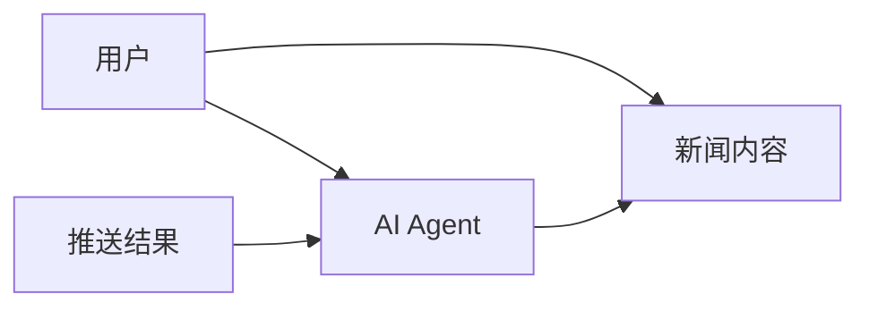
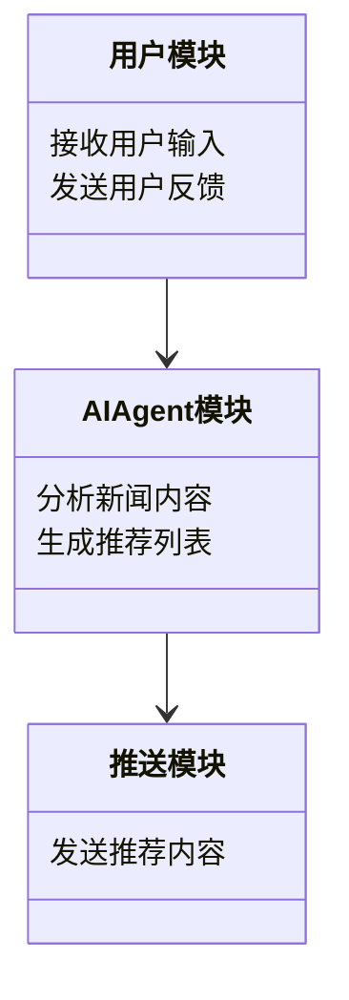

                 


# 个性化新闻推送：AI Agent的内容筛选

> **关键词：**个性化新闻推送，AI Agent，内容筛选，信息检索，推荐系统，自然语言处理

> **摘要：**  
个性化新闻推送是通过AI Agent对新闻内容进行智能筛选和推荐的过程，旨在为用户提供高度定制化的阅读体验。本文从背景、核心概念、算法原理、系统架构设计到项目实战，全面解析个性化新闻推送的技术实现。通过向量空间模型、BM25和DSSM等算法的详细讲解，结合系统架构设计和实际案例，帮助读者理解如何利用AI技术实现高效的内容筛选。

---

# 第1章: 背景与核心概念

## 1.1 个性化新闻推送的背景

### 1.1.1 传统新闻推送的局限性
传统新闻推送主要依赖人工编辑和固定分类，难以满足用户的个性化需求。用户可能只会接收到与自己兴趣相关的内容，但推送的内容往往缺乏多样性，导致用户体验较差。

### 1.1.2 个性化推送的需求驱动
随着用户对信息获取的需求日益增长，个性化推送成为提升用户阅读体验的重要手段。用户希望看到与自己兴趣相关的内容，同时也能接触到多样化的信息。

### 1.1.3 AI技术在新闻推送中的作用
AI技术能够通过自然语言处理和推荐系统，实现对海量新闻内容的智能筛选和个性化推荐。AI Agent能够实时分析用户的阅读习惯和兴趣偏好，动态调整推送策略。

## 1.2 个性化新闻推送的核心问题

### 1.2.1 用户需求的多样性
用户有不同的兴趣爱好和阅读习惯，如何准确捕捉用户需求是个性化推送的核心挑战。

### 1.2.2 内容筛选的复杂性
新闻内容繁杂多样，如何快速筛选出与用户兴趣相关的内容是技术难点。

### 1.2.3 推送效果的评估标准
推送效果需要通过用户点击率、阅读时长等指标进行评估，如何优化这些指标是关键。

## 1.3 AI Agent的核心概念

### 1.3.1 信息检索
信息检索是AI Agent的核心功能之一，通过关键词匹配和语义分析，快速定位与用户兴趣相关的内容。

### 1.3.2 自然语言处理
自然语言处理技术用于分析新闻内容的语义和情感，帮助AI Agent更好地理解内容含义。

### 1.3.3 推荐系统
推荐系统通过协同过滤、基于内容的推荐和混合推荐，为用户个性化推荐新闻内容。

---

# 第2章: AI Agent的核心概念对比分析

## 2.1 核心概念对比分析

### 2.1.1 信息检索与推荐系统的对比

| 对比维度 | 信息检索 | 推荐系统 |
|----------|----------|----------|
| 输入 | 关键词或查询 | 用户行为数据 |
| 输出 | 相关内容列表 | 个性化推荐列表 |
| 基础 | 基于关键词匹配 | 基于用户偏好 |

### 2.1.2 基于规则与基于模型的对比

| 对比维度 | 基于规则 | 基于模型 |
|----------|----------|----------|
| 实现复杂度 | 低 | 高 |
| 灵活性 | 低 | 高 |
| 适应性 | 低 | 高 |

### 2.1.3 实时性与延迟性分析

| 对比维度 | 实时推荐 | 延迟推荐 |
|----------|----------|----------|
| 实现复杂度 | 高 | 低 |
| 响应速度 | 快 | 慢 |
| 适用场景 | 短暂性需求 | 长期需求 |

## 2.2 实体关系图



---

# 第3章: 个性化新闻推送的算法原理

## 3.1 向量空间模型

### 3.1.1 向量空间模型的数学表示
向量空间模型将文本表示为向量，通过计算向量之间的相似度进行内容筛选。

$$\text{相似度} = \frac{\vec{u} \cdot \vec{v}}{|\vec{u}| \cdot |\vec{v}|}$$

### 3.1.2 余弦相似度的计算公式
$$\text{相似度} = \frac{\sum_{i=1}^{n} u_i v_i}{\sqrt{\sum_{i=1}^{n} u_i^2} \cdot \sqrt{\sum_{i=1}^{n} v_i^2}}$$

## 3.2 BM25算法

### 3.2.1 BM25的基本原理
BM25是一种基于概率的检索算法，通过计算关键词在文档中的出现频率和相关性进行排序。

### 3.2.2 BM25的公式表示
$$\text{BM25}(t, d, D) = \frac{f(t, d) \cdot (k_1 + 1)}{f(t, D) + k_1} \cdot \frac{(k_2 + 1) \cdot f(t, d)}{k_2 + f(t, d)}$$

## 3.3 DSSM模型

### 3.3.1 DSSM的输入表示
DSSM将文本表示为词向量序列，通过深度学习模型进行语义匹配。

### 3.3.2 DSSM的训练目标
$$\text{损失函数} = -\log P(y|x)$$

---

# 第4章: 系统架构设计

## 4.1 系统组成

### 4.1.1 用户模块
用户模块负责接收用户的输入和反馈，包括用户的阅读历史和兴趣偏好。

### 4.1.2 AI Agent模块
AI Agent模块负责对新闻内容进行分析和筛选，生成个性化推荐列表。

### 4.1.3 推送模块
推送模块负责将推荐内容发送给用户，支持多种推送渠道。

## 4.2 功能模块

### 4.2.1 信息检索模块
信息检索模块通过关键词匹配和语义分析快速定位相关内容。

### 4.2.2 推荐系统模块
推荐系统模块基于用户行为和内容特征，生成个性化推荐列表。

### 4.2.3 评估模块
评估模块通过用户点击率和阅读时长等指标，评估推送效果。

## 4.3 系统架构图



---

# 第5章: 项目实战

## 5.1 环境搭建

### 5.1.1 Python环境
安装Python 3.8及以上版本，安装必要的库：numpy、pandas、scikit-learn、tensorflow。

### 5.1.2 数据集准备
准备新闻数据集，包括新闻标题、正文和标签。

## 5.2 代码实现

### 5.2.1 信息检索模块

```python
import numpy as np
from sklearn.metrics.pairwise import cosine_similarity

# 示例文本向量化
def vectorize_text(text):
    # 假设text已经转换为向量表示
    return text_vector

# 计算余弦相似度
def compute_cosine_similarity(vec1, vec2):
    return cosine_similarity(vec1.reshape(1, -1), vec2.reshape(1, -1))[0][0]

# 示例使用
text1 = "Breaking news: AI breakthrough in medical research"
text2 = "Scientists discover new AI algorithm for disease prediction"
similarity = compute_cosine_similarity(vectorize_text(text1), vectorize_text(text2))
print(f"Similarity: {similarity}")
```

### 5.2.2 推荐系统模块

```python
from sklearn.neighbors import NearestNeighbors

# 示例数据集
news_data = [
    {"title": "AI in healthcare", "content": "..."},
    {"title": "Machine learning in finance", "content": "..."},
    # 更多数据...
]

# 训练模型
model = NearestNeighbors(n_neighbors=5).fit(content_vectors)

# 查询推荐
query_vector = vectorize_text("AI applications")
neighbors = model.kneighbors(query_vector, return_distance=True)
print(neighbors)
```

---

# 第6章: 最佳实践与小结

## 6.1 最佳实践

### 6.1.1 数据质量
确保新闻数据的多样性和准确性，避免信息偏差。

### 6.1.2 模型调优
根据实际效果不断调整模型参数，优化推荐算法。

### 6.1.3 用户隐私
严格保护用户数据隐私，遵守相关法律法规。

## 6.2 小结

个性化新闻推送是AI技术在信息筛选领域的典型应用，通过向量空间模型、BM25和DSSM等算法的结合，能够实现高效的内容筛选和个性化推荐。系统架构设计需要综合考虑用户需求、内容特征和推荐策略，确保推送效果的优化。

---

# 附录: 参考文献与扩展阅读

### 1. BM25算法论文
https://dl.acm.org/doi/abs/10.1145/368166.368175

### 2. DSSM论文
https://arxiv.org/abs/1409.1202

### 3. 推荐系统综述
https://dl.acm.org/doi/10.1145/3038548

---

通过以上步骤，我们详细解析了个性化新闻推送的实现过程，从背景到算法，从系统架构到项目实战，为读者提供了一套完整的解决方案。

