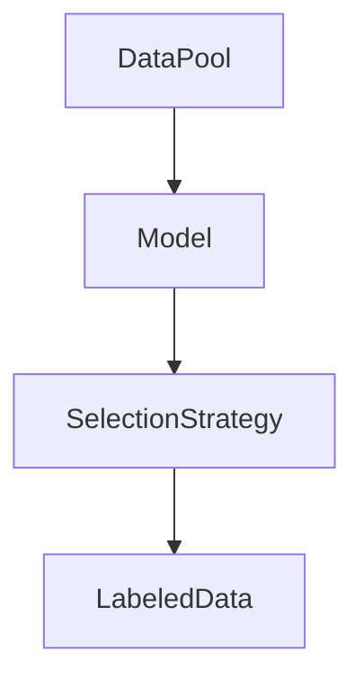
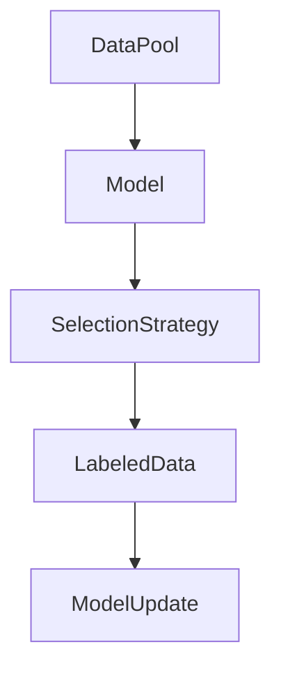
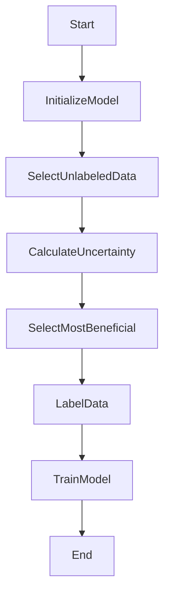

                 


# 主动学习：优化AI Agent的学习效率

## 关键词：主动学习，AI Agent，学习效率，数据选择，模型优化

## 摘要：主动学习是一种通过模型主动选择最具代表性的数据点来优化学习效率的机器学习方法。本文将从主动学习的核心概念、算法原理、系统架构设计、项目实战等方面，深入探讨如何利用主动学习提升AI Agent的学习效率。文章通过理论分析与实际案例结合，为读者提供从基础到应用的完整指南。

---

# 第一部分: 主动学习概述

## 第1章: 主动学习的背景与概念

### 1.1 问题背景
主动学习是一种机器学习方法，允许模型主动选择最有益于改进其性能的数据点。与传统的被动学习不同，主动学习通过选择性地标注数据，显著提高了学习效率和模型性能。

#### 1.1.1 传统被动学习的局限性
- 数据量大但标注成本高
- 数据分布不均衡问题
- 模型收敛速度慢

#### 1.1.2 主动学习的提出与意义
- 通过选择性标注降低成本
- 提高模型对数据的利用效率
- 适用于数据稀缺的场景

#### 1.1.3 AI Agent学习效率的重要性
- 提升实时决策能力
- 减少训练时间
- 增强适应性

### 1.2 问题描述
主动学习的核心在于如何选择数据点以最大化模型性能的提升。

#### 1.2.1 数据驱动学习的挑战
- 数据量与标注成本的平衡
- 数据分布的影响
- 模型对数据选择策略的依赖

#### 1.2.2 标签数据的稀缺性问题
- 标签数据的获取成本高
- 数据标注的主观性
- 数据稀疏性对模型性能的影响

#### 1.2.3 主动学习的目标与边界
- 最小化标注数据量
- 最大化模型性能
- 确定主动学习的适用场景

### 1.3 问题解决
主动学习通过数据选择机制优化学习过程。

#### 1.3.1 主动学习的核心思想
- 模型主动选择最有价值的数据点
- 通过迭代学习逐步优化模型
- 平衡探索与利用

#### 1.3.2 主动学习与被动学习的对比
- 数据选择的主动性
- 标注数据量的差异
- 模型收敛速度

#### 1.3.3 主动学习在AI Agent中的应用价值
- 提高实时决策效率
- 减少计算资源消耗
- 增强环境适应能力

### 1.4 核心概念与联系
主动学习涉及多个核心概念和实体关系。

#### 1.4.1 主动学习的定义与特点
- 定义：通过模型主动选择数据点进行学习
- 特点：选择性、迭代性、高效性

#### 1.4.2 核心概念对比表格
| 概念 | 特性 |
|------|------|
| 数据池 | 未标注数据集合 |
| 模型 | 学习器，通过数据更新 |
| 标签数据 | 已标注的数据点 |

#### 1.4.3 实体关系图（ER图）


---

## 第2章: 主动学习的核心概念与原理

### 2.1 核心概念原理
主动学习依赖于数据选择机制和模型迭代过程。

#### 2.1.1 数据选择机制
- 不确定性采样：选择模型最不确定的数据点
- 多样性采样：选择具有代表性的数据点
- 查询策略：定义数据选择的标准

#### 2.1.2 模型迭代过程
- 初始模型训练
- 数据选择
- 标签数据获取
- 模型优化

#### 2.1.3 效率优化策略
- 选择最具代表性的数据点
- 平衡数据多样性
- 提高模型收敛速度

### 2.2 核心概念对比表格
| 策略 | 优点 | 缺点 |
|------|------|------|
| 不确定性采样 | 高效性 | 可能忽略边缘案例 |
| 多样性采样 | 覆盖性 | 计算复杂度高 |
| 查询策略 | 灵活性 | 需要领域知识 |

### 2.3 ER实体关系图


---

## 第3章: 主动学习的算法原理

### 3.1 算法原理概述
主动学习算法通过选择性标注数据点优化模型性能。

#### 3.1.1 不确定性采样
- 原理：选择模型最不确定的数据点
- 实现：计算每个数据点的不确定性分数，选择分数最高的数据点

#### 3.1.2 多样性采样
- 原理：选择具有代表性的数据点，覆盖数据分布
- 实现：计算数据点之间的相似性，选择最不相似的数据点

#### 3.1.3 查询策略
- 原理：定义数据选择的标准，如不确定性+多样性
- 实现：综合考虑不确定性分数和多样性分数，选择最优数据点

### 3.2 算法流程图


### 3.3 核心算法实现
#### 3.3.1 代码实现
```python
def active_learning_strategy(X, model, oracle):
    uncertainty = calculate_uncertainty(X, model)
    selected_data = select_most_beneficial(uncertainty)
    labeled_data = oracle(selected_data)
    model.fit(labeled_data)
    return model
```

#### 3.3.2 数学模型与公式
- 不确定性计算公式：
  $$ \text{uncertainty} = 1 - \max(p(y|x)) $$
- 查询策略公式：
  $$ \text{score} = \text{uncertainty}(x) + \text{diversity}(x) $$

---

## 第4章: 数学模型与公式

### 4.1 概率分布模型
- 条件概率公式：
  $$ P(y|x) = \frac{P(x|y)P(y)}{P(x)} $$
- 模型更新公式：
  $$ \theta_{\text{new}} = \theta_{\text{old}} + \eta \cdot \nabla L(\theta) $$

---

# 第二部分: 系统分析与架构设计

## 第5章: 系统分析与架构设计

### 5.1 应用场景分析
- AI Agent实时决策
- 数据稀疏场景
- 高效学习需求

### 5.2 系统功能设计
- 数据选择模块
- 模型优化模块
- 交互接口模块

#### 5.2.1 数据选择模块
- 数据池管理
- 数据选择策略
- 标签数据获取

#### 5.2.2 模型优化模块
- 模型训练
- 模型评估
- 模型更新

#### 5.2.3 交互接口模块
- 用户输入
- 系统输出
- 交互日志

### 5.3 系统架构设计
- 领域模型：
  ```mermaid
  graph TD
      Agent --> Model
      Model --> SelectionStrategy
      SelectionStrategy --> DataPool
      DataPool --> LabeledData
  ```

- 系统架构：
  ```mermaid
  graph TD
      Agent --> Controller
      Controller --> Model
      Model --> SelectionStrategy
      SelectionStrategy --> DataPool
      DataPool --> LabeledData
      LabeledData --> Trainer
      Trainer --> Agent
  ```

- 系统接口设计：
  ```mermaid
  graph TD
      Agent --> API
      API --> Model
      Model --> SelectionStrategy
      SelectionStrategy --> DataPool
  ```

- 系统交互：
  ```mermaid
  graph TD
      User --> Agent
      Agent --> Model
      Model --> SelectionStrategy
      SelectionStrategy --> DataPool
      DataPool --> LabeledData
      LabeledData --> Trainer
      Trainer --> Model
  ```

---

## 第6章: 项目实战

### 6.1 环境安装
```bash
pip install numpy scikit-learn
```

### 6.2 核心实现
```python
def calculate_uncertainty(probabilities):
    return 1 - np.max(probabilities, axis=1)

def select_most_beneficial(data, model, oracle, threshold=0.5):
    uncertainty = calculate_uncertainty(model.predict_proba(data))
    selected = np.where(uncertainty > threshold)[0]
    return data[selected]

def active_learn(X, y, model, oracle, iterations=10):
    for _ in range(iterations):
        selected = select_most_beneficial(X, model, oracle)
        labeled = oracle(selected)
        model.fit(labeled)
    return model
```

### 6.3 案例分析
```python
# 初始化数据
X = np.random.rand(100, 2)
y = np.random.randint(2, size=100)

# 模型训练
model = LogisticRegression()
model.fit(X, y)

# 主动学习
active_learn(X, y, model, oracle=custom_oracle, iterations=5)
```

---

## 第7章: 总结与展望

### 7.1 总结
主动学习通过优化数据选择策略，显著提升了AI Agent的学习效率。本文从理论到实践，全面探讨了主动学习的核心概念、算法原理和系统设计。

### 7.2 展望
- 更高效的数据选择算法
- 更智能的模型优化策略
- 更广泛的应用场景

---

## 附录
### 附录A: 术语表
- 数据池：未标注的数据集合
- 模型：学习器，通过数据更新
- 标签数据：已标注的数据点

### 附录B: 参考文献
- 本文基于[主动学习相关论文]和[实践经验]编写。

---

通过本文的系统分析和实践指导，读者可以全面掌握主动学习的核心思想，并将其应用于实际项目中，优化AI Agent的学习效率。

