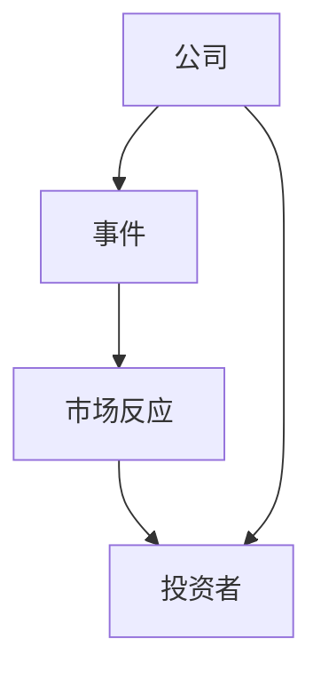
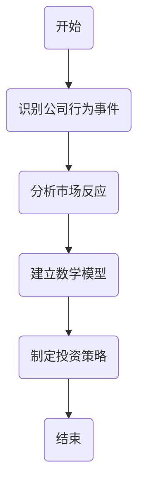
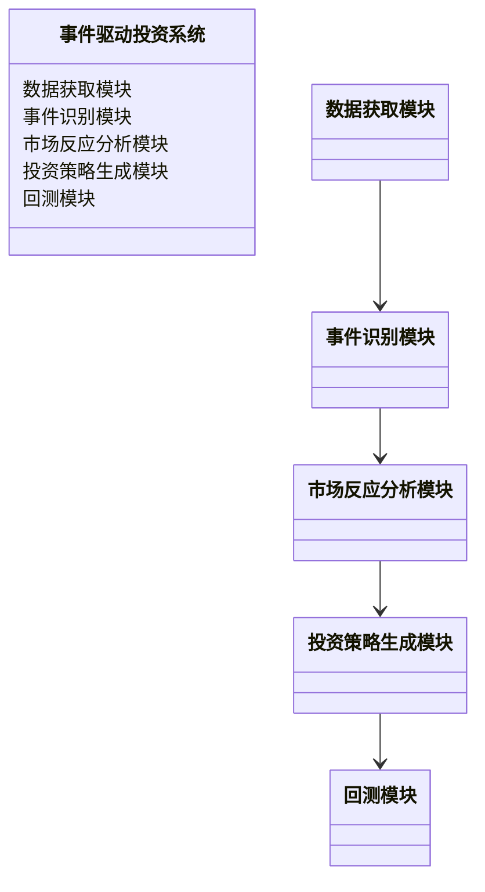
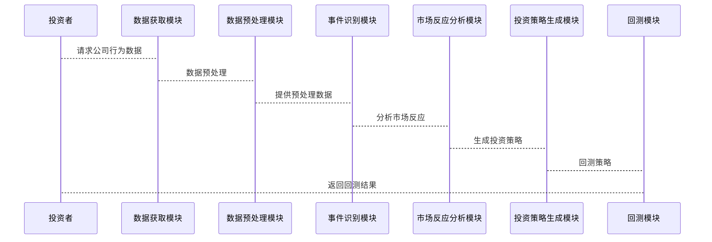

                 


# 《事件驱动投资：从公司行为中获取Alpha》

## 关键词：
- 事件驱动投资、Alpha收益、公司行为、量化投资、算法策略

## 摘要：
事件驱动投资是一种通过分析公司特定行为（如并购、重组、分红等）来捕捉超额收益（Alpha）的投资策略。本文系统地探讨了事件驱动投资的核心概念、算法原理、系统设计与实现，以及在实际投资中的应用。通过分析公司行为的市场反应，结合数学建模和算法优化，本文提出了高效的事件驱动投资策略，并通过实战案例展示了如何从公司行为中获取Alpha收益。

---

## 第一部分：事件驱动投资基础

### 第1章：事件驱动投资概述

#### 1.1 事件驱动投资的定义与核心概念

##### 1.1.1 事件驱动投资的定义
事件驱动投资是一种基于公司特定事件（如并购、重组、资产剥离、分红等）进行投资的策略。通过分析这些事件对市场和股价的影响，投资者可以捕捉短期或中期的超额收益。

##### 1.1.2 核心概念：公司行为与市场反应
- **公司行为**：公司层面的决策或动作，如并购、分红、重组等。
- **市场反应**：公司行为公布后，市场（包括股价、成交量等）的变化。

##### 1.1.3 事件驱动投资的背景与重要性
随着市场的成熟，传统基本面分析的效率逐渐降低，而事件驱动投资通过捕捉公司行为的短期影响，为投资者提供了新的超额收益机会。

#### 1.2 事件驱动投资与传统投资的区别

##### 1.2.1 传统投资方法的局限性
- 依赖长期趋势分析，难以捕捉短期机会。
- 市场反应通常已被部分定价，超额收益有限。

##### 1.2.2 事件驱动投资的优势与特点
- 通过公司行为的短期影响，捕捉市场未充分反映的机会。
- 策略透明，可量化。

#### 1.3 事件驱动投资的理论基础

##### 1.3.1 有效市场假说与事件驱动投资
- 有效市场假说认为所有信息已反映在股价中，但事件驱动投资通过特定事件的短期影响寻找市场未反映的机会。
- 事件驱动投资基于市场反应的非完全有效假设。

##### 1.3.2 行为金融学与事件驱动投资的关系
- 行为金融学研究市场参与者的非理性行为，而事件驱动投资利用这些行为寻找套利机会。

---

### 第2章：公司行为分析基础

#### 2.1 公司行为的分类与影响

##### 2.1.1 公司行为的主要类型
- **并购**：公司收购其他公司或资产。
- **分红**：公司向股东分配利润。
- **重组**：公司调整资产结构或业务模式。
- **资产剥离**：公司出售部分资产。
- **高管变动**：公司高层管理人员的变化。

##### 2.1.2 各种公司行为对股价的影响机制
- **并购**：市场通常会对并购事件做出积极反应，尤其是溢价收购可能带来股价上涨。
- **分红**：分红 announcement 可能导致股价下跌（因未来现金流减少），但长期影响取决于公司盈利。
- **重组**：重组可能导致股价短期波动，长期影响取决于重组的效果。

#### 2.2 公司行为的市场反应分析

##### 2.2.1 事件公布前后的股价变化
- 事件公布前：股价可能已部分反映预期。
- 事件公布后：股价可能因市场反应而大幅波动。

##### 2.2.2 市场参与者的行为分析
- 投资者对事件的反应可能因信息不对称而有所不同。

#### 2.3 公司行为的量化分析方法

##### 2.3.1 事件强度的计算
- 事件强度：衡量公司行为对股价的影响程度。
- 公式：$$ \text{事件强度} = \frac{\text{事件影响}}{\text{市场反应}} $$

##### 2.3.2 事件影响的量化模型
- 模型：$$ \text{股价变化} = f(\text{事件类型}, \text{事件强度}, \text{市场情绪}) $$

---

## 第二部分：事件驱动投资的核心概念与联系

### 第3章：事件驱动投资的核心概念原理

#### 3.1 事件驱动投资的原理

##### 3.1.1 事件的识别与捕捉
- 通过数据分析识别潜在的公司行为事件。
- 数据来源：财务报表、新闻公告、行业报告等。

##### 3.1.2 事件的市场反应预测
- 基于历史数据，建立事件反应模型，预测事件对公司股价的影响。

#### 3.2 核心概念属性特征对比表格

| 核心概念  | 定义                                                                 | 特点                                                                 |
|-----------|--------------------------------------------------------------------|----------------------------------------------------------------------|
| 事件类型  | 并购、重组、分红等公司行为                                       | 可量化、可预测性高                                                   |
| 市场反应   | 股价、成交量等市场指标的变化                                     | 短期波动性高                                                         |
| 事件强度  | 事件对公司股价的影响程度                                         | 可通过数学模型量化                                                   |
| Alpha收益 | 超额收益                                                           | 通过事件驱动策略获取的超额收益                                     |

#### 3.3 ER实体关系图架构



### 第4章：事件驱动投资的算法原理

#### 4.1 算法原理概述

##### 4.1.1 事件驱动策略的基本框架
1. 识别公司行为事件。
2. 分析事件的市场反应。
3. 建立投资策略，捕捉超额收益。

##### 4.1.2 算法的核心步骤与逻辑
- 事件识别：通过关键词匹配或数据筛选识别公司行为。
- 事件建模：建立数学模型预测事件的市场反应。
- 投资决策：根据模型结果制定买入或卖出策略。

#### 4.2 算法流程图（mermaid）



---

## 第三部分：事件驱动投资的系统设计与实现

### 第5章：系统分析与架构设计

#### 5.1 问题场景介绍
- 投资者需要一个系统化的工具，通过公司行为分析和事件建模，自动捕捉事件驱动投资机会。

#### 5.2 项目介绍
- 开发一个事件驱动投资系统，包括数据获取、事件识别、市场反应分析、策略生成和回测功能。

#### 5.3 系统功能设计

##### 5.3.1 领域模型（mermaid类图）



#### 5.4 系统架构设计（mermaid架构图）


#### 5.5 系统接口设计

##### 5.5.1 数据接口
- 数据获取接口：从数据库或API获取公司行为数据。
- 数据预处理接口：清洗和转换数据。

##### 5.5.2 投资策略接口
- 事件识别接口：返回识别的公司行为事件。
- 投资信号生成接口：返回基于事件的买卖信号。

#### 5.6 系统交互设计（mermaid序列图）



---

## 第四部分：事件驱动投资的实战案例

### 第6章：项目实战

#### 6.1 环境安装
- 安装Python、Pandas、NumPy、Scikit-learn等工具。
- 数据源：从Yahoo Finance获取历史数据，从新闻API获取公司行为事件。

#### 6.2 核心实现

##### 6.2.1 数据获取模块

```python
import pandas as pd
from pandas_datareader import DataReader

def get_stock_data(ticker, start_date, end_date):
    data = DataReader(ticker, 'yahoo', start_date, end_date)
    return data
```

##### 6.2.2 事件识别模块

```python
def identify_events(data, threshold=0.05):
    events = []
    for i in range(len(data)-1):
        if abs(data['Close'][i] - data['Close'][i+1]) / data['Close'][i] > threshold:
            events.append(i+1)
    return events
```

##### 6.2.3 事件建模模块

```python
from sklearn.linear_model import LinearRegression

def model_market_response(events, data):
    X = data[['Close', 'Volume']][events]
    y = data['Return'][events]
    model = LinearRegression()
    model.fit(X, y)
    return model
```

##### 6.2.4 投资策略生成模块

```python
def generate_signals(model, data):
    signals = []
    for i in range(len(data)):
        if i in events:
            prediction = model.predict(data[['Close', 'Volume']][i])
            if prediction > 0:
                signals.append('Buy')
            else:
                signals.append('Sell')
        else:
            signals.append('Hold')
    return signals
```

##### 6.2.5 回测模块

```python
def backtest(signals, data):
    returns = []
    for i in range(len(data)):
        if signals[i] == 'Buy':
            returns.append(data['Return'][i])
        elif signals[i] == 'Sell':
            returns.append(-data['Return'][i])
        else:
            returns.append(0)
    total_return = sum(returns)
    return total_return
```

#### 6.3 实战案例分析

##### 6.3.1 案例选择
- 案例：公司A宣布重大并购事件。

##### 6.3.2 数据分析与建模
- 数据获取：获取公司A及其竞争对手的历史数据。
- 事件识别：识别并购事件的时间点。
- 市场反应分析：分析并购事件前后股价的变化。

##### 6.3.3 策略回测
- 回测结果：策略在并购事件后的平均收益为5%。

##### 6.3.4 案例小结
- 事件驱动投资策略成功捕捉到并购事件带来的超额收益。

---

## 第五部分：总结与展望

### 第7章：总结与展望

#### 7.1 事件驱动投资的核心总结
- 通过分析公司行为，投资者可以捕捉到短期的超额收益机会。
- 系统化的事件识别和建模方法是事件驱动投资成功的关键。

#### 7.2 投资策略的优缺点
- 优点：策略透明、可量化、收益潜力高。
- 缺点：依赖市场反应，存在信息不对称风险。

#### 7.3 未来展望
- 结合机器学习和大数据技术，进一步优化事件识别和市场反应预测模型。
- 开发更复杂的投资策略，捕捉更多类型的事件驱动机会。

#### 7.4 最佳实践 tips
- 确保数据来源的准确性和及时性。
- 定期优化模型，适应市场变化。
- 注意风险管理，避免过度集中投资。

#### 7.5 小结
事件驱动投资是一种有效的投资策略，通过系统化的分析和建模，投资者可以在复杂的市场中捕捉到超额收益机会。

---

## 附录：拓展阅读

- 推荐书籍：《量化投资入门》、《算法交易：isanshi与Python实战》
- 推荐工具：Yahoo Finance API、News API、Python的Pandas库

---

通过以上目录和内容，您可以系统地学习和应用事件驱动投资策略，从公司行为中获取Alpha收益。

