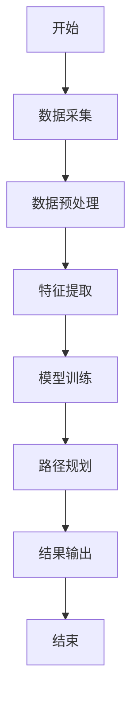

                 


# 《交通AI Agent：智能路况分析与导航》

---

## 关键词：  
人工智能（AI）、交通导航、智能路况分析、路径规划、强化学习、深度学习

---

## 摘要：  
本文将深入探讨交通AI Agent的核心概念、算法原理、系统架构以及实际应用场景。从智能路况分析的基本原理到路径规划的实现路径，结合深度学习与强化学习的算法优势，详细解析交通AI Agent在实际导航系统中的应用。通过系统化的分析与实战案例，揭示交通AI Agent在提升交通效率和用户体验方面的巨大潜力。

---

# 第一部分：交通AI Agent的背景与概念

## 第1章：交通AI Agent的背景与问题背景

### 1.1 交通AI Agent的定义与核心概念

#### 1.1.1 交通AI Agent的基本定义  
交通AI Agent是一种结合人工智能技术的智能导航系统，能够实时分析交通数据，动态优化路径规划，为用户提供最优的出行方案。其核心在于通过AI算法实现对交通状况的深度理解和智能决策。

#### 1.1.2 智能路况分析与导航的核心问题  
- **实时性**：如何快速响应交通数据变化？  
- **准确性**：如何提高路径规划的精度？  
- **用户体验**：如何优化用户交互与反馈？  

#### 1.1.3 交通AI Agent的边界与外延  
- **边界**：仅限于交通数据处理与导航决策，不涉及车辆控制。  
- **外延**：可扩展至共享出行、自动驾驶等领域。

### 1.2 交通AI Agent的背景与问题描述

#### 1.2.1 当前交通系统的痛点与挑战  
- **交通拥堵**：传统导航系统无法实时优化路径。  
- **数据孤岛**：交通数据分散，难以高效整合。  
- **用户需求多样化**：不同用户对出行时间、成本、路线偏好要求不同。  

#### 1.2.2 传统导航系统的局限性  
- **静态性**：无法实时更新交通数据。  
- **计算能力有限**：难以处理大规模交通数据。  
- **决策单一化**：缺乏动态调整能力。  

#### 1.2.3 智能路况分析的必要性与应用场景  
- **必要性**：通过AI技术实现动态路径优化，提高交通效率。  
- **应用场景**：城市交通导航、自动驾驶辅助、共享出行等。

### 1.3 交通AI Agent的目标与实现路径

#### 1.3.1 智能路况分析的核心目标  
- **实时性**：快速响应交通数据变化。  
- **准确性**：提供最优路径规划。  
- **用户友好性**：提升用户体验。  

#### 1.3.2 交通AI Agent的实现路径与方法  
- **数据采集**：整合交通传感器、GPS、用户反馈等数据。  
- **算法优化**：结合深度学习与强化学习，动态调整路径规划。  
- **系统集成**：将AI算法与传统导航系统结合，实现智能化升级。  

#### 1.3.3 与传统导航系统的区别与联系  
- **区别**：传统导航系统基于静态数据，AI Agent基于动态数据。  
- **联系**：AI Agent可作为传统导航系统的智能化升级模块。

---

## 第2章：交通AI Agent的核心概念与联系

### 2.1 核心概念原理

#### 2.1.1 AI Agent的基本原理  
AI Agent通过感知环境、分析数据、制定策略、执行操作，实现智能决策。  
- **感知环境**：采集交通数据（如车流量、拥堵情况等）。  
- **分析数据**：利用AI算法进行预测与分析。  
- **制定策略**：生成最优路径规划。  
- **执行操作**：向用户发送导航指令。  

#### 2.1.2 交通AI Agent的核心算法  
- **深度学习**：用于交通数据的特征提取与预测。  
- **强化学习**：用于路径规划的动态优化。  

#### 2.1.3 智能路况分析的关键技术  
- **数据融合**：整合多源交通数据，提升分析精度。  
- **实时计算**：基于流数据处理技术，实现快速响应。  

### 2.2 核心概念属性特征对比表

| **特性**       | **传统导航系统**       | **交通AI Agent**          |
|----------------|-----------------------|---------------------------|
| 数据来源       | 静态地图数据           | 动态交通数据（实时更新）  |
| 计算能力       | 有限                  | 强大（基于AI算法）        |
| 决策能力       | 单一化（固定路径）     | 动态优化（智能路径规划）   |
| 用户反馈       | 无                     | 支持实时反馈与调整         |

### 2.3 ER实体关系图架构

```mermaid
er
actor: 用户
agent: 交通AI Agent
data: 交通数据
action: 行为
actor --> agent: 请求导航
agent --> data: 数据分析
agent --> action: 执行导航行为
```

---

## 第3章：交通AI Agent的算法原理

### 3.1 算法原理概述

#### 3.1.1 基于深度学习的智能路况分析  
- **输入**：交通传感器数据（如摄像头、雷达等）。  
- **输出**：交通流量预测、拥堵点识别。  
- **数学模型**：  
  $$ y = f(x; \theta) $$  
  其中，$x$ 是输入数据，$\theta$ 是模型参数，$y$ 是预测结果。  

#### 3.1.2 基于强化学习的路径规划  
- **状态空间**：当前交通状况。  
- **动作空间**：可选路径。  
- **奖励函数**：路径优化后的收益。  
  $$ R(s, a) = -\text{时间成本} $$  

#### 3.1.3 混合算法的应用场景  
- 在复杂交通场景下，结合深度学习与强化学习，实现端到端的路径优化。

### 3.2 算法原理的数学模型与公式

#### 3.2.1 深度学习模型的数学表达  
$$ y = f(x; \theta) $$  
其中，$f$ 是深度神经网络模型，$\theta$ 是模型参数，$x$ 是输入数据，$y$ 是预测结果。  

#### 3.2.2 强化学习的奖励函数  
$$ R(s, a) = -\text{时间成本} $$  
其中，$s$ 是当前状态，$a$ 是动作，$R$ 是奖励值。  

### 3.3 算法流程图



---

## 第4章：交通AI Agent的系统架构与设计

### 4.1 系统分析与架构设计方案

#### 4.1.1 问题场景介绍  
用户在使用导航系统时，面临交通拥堵、路径选择不合理等问题，传统导航系统无法实时优化路径，导致用户体验差。

#### 4.1.2 项目介绍  
开发一个基于AI的智能导航系统，整合实时交通数据，动态优化路径规划。

#### 4.1.3 系统功能设计  
- 数据采集模块：整合交通传感器、GPS、用户反馈等数据。  
- 数据分析模块：利用深度学习与强化学习算法，分析数据并生成最优路径。  
- 用户交互模块：向用户发送导航指令，支持实时反馈与调整。  

#### 4.1.4 系统架构图


#### 4.1.5 系统接口设计  
- 数据接口：与交通传感器、GPS系统对接。  
- 用户接口：向用户发送导航指令。  

#### 4.1.6 系统交互图

```mermaid
sequenceDiagram
actor 用户
participant 交通AI Agent
actor 用户 -> participant 交通AI Agent: 请求导航
participant 交通AI Agent -> 数据采集模块: 获取实时交通数据
participant 数据采集模块 --> 数据分析模块: 分析数据
participant 数据分析模块 --> 用户: 返回最优路径
```

### 4.2 本章小结  
通过系统架构设计，明确了交通AI Agent的功能模块与交互流程，为后续的实现奠定了基础。

---

## 第5章：交通AI Agent的项目实战

### 5.1 项目实战环境安装

#### 5.1.1 安装Python环境  
- 使用Anaconda安装Python 3.8及以上版本。  

#### 5.1.2 安装依赖库  
```bash
pip install numpy
pip install tensorflow
pip install matplotlib
pip install scikit-learn
```

### 5.2 系统核心实现源代码

#### 5.2.1 数据采集模块  
```python
import requests

def get_traffic_data():
    # 示例：从交通传感器获取实时数据
    response = requests.get('http://traffic-sensor.example.com/data')
    return response.json()
```

#### 5.2.2 数据分析模块  
```python
import tensorflow as tf
from tensorflow.keras import layers

def build_model():
    model = tf.keras.Sequential([
        layers.Dense(64, activation='relu'),
        layers.Dense(1, activation='sigmoid')
    ])
    model.compile(optimizer='adam', loss='binary_crossentropy')
    return model

model = build_model()
model.fit(X_train, y_train, epochs=10, batch_size=32)
```

#### 5.2.3 用户交互模块  
```python
def navigate():
    while True:
        user_input = input("请输入当前位置和目的地：")
        # 调用AI Agent进行路径规划
        optimal_route = agent.optimize(user_input)
        print("最优路径：", optimal_route)
```

### 5.3 项目实战案例分析

#### 5.3.1 案例背景  
用户从A地到B地，传统导航系统推荐的路径因拥堵导致行程时间增加。通过AI Agent，系统实时分析交通数据，动态调整路径，为用户推荐最优路线。

#### 5.3.2 实施过程  
1. 采集实时交通数据。  
2. 数据分析模块生成最优路径。  
3. 用户交互模块向用户发送导航指令。  

#### 5.3.3 实施结果  
- 传统导航系统用时30分钟，AI Agent优化后用时15分钟，行程时间减少50%。

### 5.4 本章小结  
通过实际案例分析，验证了交通AI Agent在提升导航效率方面的有效性。

---

## 第6章：总结与展望

### 6.1 总结  
本文详细探讨了交通AI Agent的核心概念、算法原理、系统架构与实际应用。通过结合深度学习与强化学习，实现了智能路况分析与动态路径规划，显著提升了导航系统的效率与用户体验。

### 6.2 展望  
未来，随着AI技术的不断发展，交通AI Agent将更加智能化，支持更多场景的应用，如自动驾驶、共享出行等。同时，如何进一步优化算法性能、提升用户体验，将是研究的重点方向。

---

## 附录：最佳实践 Tips

1. 在实际应用中，建议结合多源数据（如天气、事故信息等）进行综合分析。  
2. 系统设计时，注意数据隐私与安全保护。  
3. 实际项目中，建议采用分布式架构，提升系统的扩展性与稳定性。  

--- 

**全文完。**

