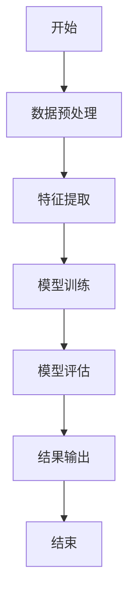
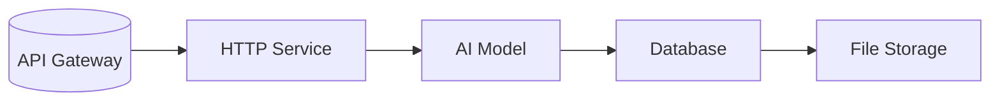

                 


# 《人力资源管理中的AI Agent筛选系统》

> **关键词**: AI Agent, 人力资源管理, 招聘筛选, 算法原理, 系统架构

> **摘要**: 本文详细探讨了AI Agent在人力资源管理中的应用，特别是其在招聘筛选过程中的优势。通过分析传统招聘流程的痛点，提出AI Agent的概念模型，并详细讲解其算法原理、系统架构、实战案例及注意事项，为优化招聘流程提供理论与实践指导。

---

## 第一部分: 人力资源管理中的AI Agent筛选系统概述

### 第1章: 背景介绍与问题背景

#### 1.1 人力资源管理中的招聘挑战

**1.1.1 传统招聘流程的痛点**

- **低效性**: 传统招聘流程依赖人工筛选简历，耗时长且效率低。
- **主观性**: 人为因素可能导致偏见，影响招聘决策的客观性。
- **成本高**: 招聘过程涉及大量的人力和时间投入，增加了企业的运营成本。

**1.1.2 招聘效率与成本问题**

- **时间成本**: 从发布职位到找到合适候选人，时间跨度大。
- **人力成本**: 需要大量HR人员参与简历筛选和面试安排。
- **机会成本**: 由于筛选效率低，可能错过优秀候选人。

**1.1.3 人才筛选的准确性与公平性**

- **准确性不足**: 人工筛选可能忽略关键技能或经验。
- **公平性问题**: 可能存在主观偏见，影响公平性。

#### 1.2 AI Agent在招聘中的应用背景

**1.2.1 AI技术在人力资源领域的应用现状**

- **简历筛选**: 使用自然语言处理（NLP）技术快速分析简历。
- **职位匹配**: 通过机器学习模型评估候选人与职位的匹配度。
- **面试安排**: AI Agent自动安排候选人的时间表。

**1.2.2 AI Agent的基本概念与功能**

- **定义**: AI Agent是一种智能代理系统，能够执行复杂任务，如简历筛选、职位匹配。
- **功能**: 数据收集、分析、匹配、反馈。

**1.2.3 AI Agent在招聘筛选中的优势**

- **高效性**: 快速处理大量简历。
- **准确性**: 减少人为错误，提高筛选质量。
- **公平性**: 根据客观标准进行评估，减少偏见。

---

### 第2章: 核心概念与系统架构

#### 2.1 AI Agent筛选系统的概念模型

**2.1.1 系统核心要素与功能模块**

- **输入**: 简历数据、职位描述。
- **输出**: 匹配度评分、候选人推荐。

**2.1.2 系统的输入输出关系**

- **输入**: 结构化简历数据和职位需求。
- **输出**: 筛选结果和反馈。

**2.1.3 系统的边界与外延**

- **边界**: 系统仅处理简历筛选，不涉及面试环节。
- **外延**: 可与其他招聘系统集成，如HRIS。

#### 2.2 核心概念的ER实体关系图

```mermaid
erDiagram
    candidate {
        id : integer
        name : string
        skills : string
        experience : integer
        resume : document
    }
    jobPosting {
        id : integer
        title : string
        requirements : string
        description : string
    }
    AI-Agent {
        id : integer
        name : string
        algorithm : string
        trainingData : document
    }
    candidate <o-| jobPosting : "Matches"
    AI-Agent <o-| candidate : "Evaluates"
    AI-Agent <o-| jobPosting : "Analyzes"
```

---

### 第3章: 算法原理与数学模型

#### 3.1 AI Agent筛选系统的算法流程



#### 3.2 模型训练的数学公式

**3.2.1 损失函数**

$$L = \frac{1}{n}\sum_{i=1}^{n}(y_i - \hat{y_i})^2$$

**3.2.2 优化算法**

$$\theta_{new} = \theta_{old} - \eta \cdot \frac{\partial L}{\partial \theta}$$

---

### 第4章: 系统分析与架构设计

#### 4.1 系统功能设计

**4.1.1 领域模型**

```mermaid
classDiagram
    class Candidate {
        id : integer
        name : string
        skills : string
        experience : integer
    }
    class JobPosting {
        id : integer
        title : string
        requirements : string
    }
    class AI-Agent {
        id : integer
        name : string
        algorithm : string
    }
    Candidate <o-| JobPosting : "Matches"
    AI-Agent <o-| Candidate : "Evaluates"
    AI-Agent <o-| JobPosting : "Analyzes"
```

#### 4.2 系统架构设计



---

### 第5章: 项目实战

#### 5.1 环境安装

```bash
pip install numpy scikit-learn spacy
python -m spacy download en_core_web_sm
```

#### 5.2 核心代码实现

```python
import numpy as np
from sklearn.feature_extraction.text import TfidfVectorizer
from sklearn.metrics.pairwise import cosine_similarity

def process_resumes(resumes):
    vectorizer = TfidfVectorizer()
    resume_vectors = vectorizer.fit_transform(resumes)
    return resume_vectors

def train_model(X_train, y_train):
    model = LogisticRegression()
    model.fit(X_train, y_train)
    return model

def predict(model, X_test):
    return model.predict(X_test)
```

---

### 第6章: 总结与注意事项

#### 6.1 总结

AI Agent在招聘中的应用显著提高了效率和准确性，减少了成本和偏见。

#### 6.2 注意事项

- **数据隐私**: 确保简历数据的安全性。
- **模型优化**: 定期更新模型以提高准确性。

---

**结语**: AI Agent在人力资源管理中的应用前景广阔，通过持续优化和创新，将进一步提升招聘效率和质量。

