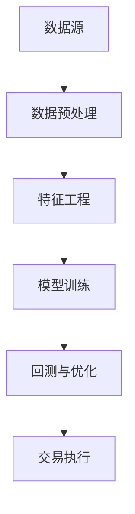
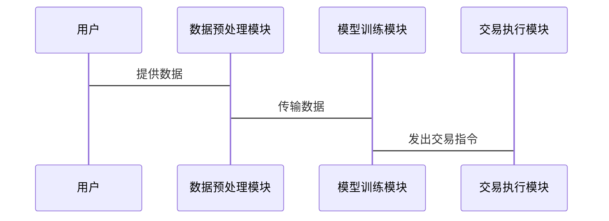

                 


# 人工智能在量化投资中的应用与挑战

> 关键词：量化投资，人工智能，机器学习，时间序列分析，算法交易，金融数据分析

> 摘要：  
量化投资通过利用数学模型和算法进行投资决策，而人工智能的引入进一步提升了其效率和准确性。本文详细探讨了人工智能在量化投资中的应用，包括机器学习算法、时间序列分析和自然语言处理等技术，并分析了在实际应用中面临的挑战，如数据质量、模型过拟合和交易成本等。通过系统化的架构设计和实际案例分析，本文为读者提供了深入的理论支持和实践指导。

---

## 第1章 量化投资与人工智能概述

### 1.1 量化投资的基本概念

#### 1.1.1 量化投资的定义与特点
量化投资是一种基于数学模型的投资方法，通过分析市场数据来寻找投资机会。其特点包括：
- **数据驱动**：依赖历史数据进行分析。
- **自动化**：从数据处理到交易决策，大部分过程可自动化。
- **高频交易**：利用算法快速执行交易，捕捉短期市场波动。

#### 1.1.2 量化投资的核心要素
- **数据**：市场数据（如价格、成交量）、新闻数据、社交媒体数据等。
- **模型**：用于预测市场走势或发现交易机会的数学模型。
- **交易系统**：从数据处理到交易执行的完整流程。

#### 1.1.3 量化投资的历史发展
从早期的简单技术分析到现代的复杂算法交易，量化投资经历了从手工计算到计算机辅助的转变。

### 1.2 人工智能的基本概念

#### 1.2.1 人工智能的定义与特点
人工智能（AI）是指计算机系统模拟人类智能的能力，包括学习、推理和自我改进。

#### 1.2.2 机器学习的核心原理
机器学习通过数据训练模型，使其能够从经验中学习并做出预测或决策。

#### 1.2.3 深度学习的基本概念
深度学习是一种基于人工神经网络的机器学习方法，能够处理复杂的数据模式。

### 1.3 人工智能在量化投资中的结合

#### 1.3.1 量化投资与人工智能的契合点
- 数据处理能力：AI能够快速分析大量非结构化数据。
- 模型复杂度：AI擅长处理复杂的市场关系。

#### 1.3.2 人工智能在量化投资中的优势
- **高效性**：快速处理和分析数据。
- **准确性**：通过历史数据优化投资策略。
- **适应性**：能够实时调整模型以应对市场变化。

#### 1.3.3 当前的应用现状与发展趋势
目前，AI在量化投资中的应用主要集中在预测市场走势、识别交易信号和风险管理等方面。

---

## 第2章 人工智能在量化投资中的核心技术

### 2.1 机器学习在量化投资中的应用

#### 2.1.1 监督学习在量化投资中的应用
- **回归分析**：用于预测资产价格。
- **分类模型**：用于判断市场趋势。

#### 2.1.2 非监督学习在量化投资中的应用
- **聚类分析**：识别市场中的相似资产。

#### 2.1.3 强化学习在量化投资中的应用
- **策略优化**：通过强化学习优化交易策略。

### 2.2 时间序列分析与预测

#### 2.2.1 时间序列的基本概念
时间序列是指按时间顺序排列的数据。

#### 2.2.2 常见的时间序列预测模型
- **ARIMA模型**：用于预测未来的趋势。
- **LSTM网络**：适合处理长期依赖关系。

#### 2.2.3 基于机器学习的时间序列预测
通过训练模型识别时间序列中的模式。

### 2.3 自然语言处理在金融中的应用

#### 2.3.1 NLP的基本概念
自然语言处理用于理解和生成人类语言。

#### 2.3.2 金融文本分析
- **新闻分析**：从新闻中提取市场信息。

#### 2.3.3 市场情绪分析
通过社交媒体数据预测市场情绪。

---

## 第3章 量化投资中的机器学习算法原理

### 3.1 线性回归模型

#### 3.1.1 线性回归的数学模型
$$ y = \beta_0 + \beta_1 x + \epsilon $$

#### 3.1.2 最小二乘法的原理
通过最小化预测误差的平方和来估计参数。

#### 3.1.3 线性回归在量化投资中的应用
用于预测资产价格。

### 3.2 支持向量机（SVM）

#### 3.2.1 SVM的基本原理
通过构建超平面将数据分为不同类别。

#### 3.2.2 核函数的作用与选择
- **线性核**：适用于线性可分的数据。
- **多项式核**：适用于非线性数据。

#### 3.2.3 SVM在量化投资中的应用
用于分类市场趋势。

### 3.3 随机森林与梯度提升树

#### 3.3.1 随机森林的原理
通过构建多棵决策树并集成结果。

#### 3.3.2 XGBoost算法
一种高效的梯度提升方法。

#### 3.3.3 在量化投资中的应用
用于预测资产回报率。

---

## 第4章 系统分析与架构设计方案

### 4.1 问题场景介绍
设计一个基于AI的量化投资系统，目标是通过历史数据预测未来的价格走势。

### 4.2 系统功能设计

#### 4.2.1 数据采集模块
- **数据来源**：市场数据、新闻数据。
- **数据预处理**：清洗和转换数据。

#### 4.2.2 特征工程模块
- **特征选择**：提取有用特征。
- **特征变换**：标准化或归一化。

#### 4.2.3 模型训练模块
- **模型选择**：选择合适的算法。
- **模型调优**：优化参数。

#### 4.2.4 回测与优化模块
- **回测策略**：验证模型的有效性。
- **风险控制**：管理投资风险。

### 4.3 系统架构设计



### 4.4 系统接口设计
- **数据接口**：与数据源对接。
- **交易接口**：与交易系统对接。

### 4.5 系统交互设计



---

## 第5章 项目实战

### 5.1 环境安装
- **Python**：安装Python 3.8及以上版本。
- **库安装**：使用pip安装numpy、pandas、scikit-learn、xgboost等库。

### 5.2 核心代码实现

#### 5.2.1 数据预处理
```python
import pandas as pd
import numpy as np

# 加载数据
data = pd.read_csv('stock_data.csv')

# 删除缺失值
data = data.dropna()

# 标准化处理
from sklearn.preprocessing import StandardScaler
scaler = StandardScaler()
scaled_data = scaler.fit_transform(data)
```

#### 5.2.2 模型训练
```python
from sklearn.model_selection import train_test_split
from sklearn.linear_model import LinearRegression

# 划分训练集和测试集
X_train, X_test, y_train, y_test = train_test_split(scaled_data, data['price'], test_size=0.2)

# 训练模型
model = LinearRegression()
model.fit(X_train, y_train)

# 预测
y_pred = model.predict(X_test)
```

#### 5.2.3 结果分析
```python
from sklearn.metrics import mean_squared_error

mse = mean_squared_error(y_test, y_pred)
print(f"均方误差: {mse}")
```

### 5.3 实际案例分析
通过实际数据测试模型的预测能力，并分析结果。

### 5.4 项目小结
总结项目实施过程中的经验和教训，提出改进建议。

---

## 第6章 挑战与解决方案

### 6.1 数据质量的问题
- **解决方法**：数据清洗和特征选择。

### 6.2 模型过拟合的问题
- **解决方法**：交叉验证和正则化。

### 6.3 交易成本的问题
- **解决方法**：优化交易策略和减少交易频率。

---

## 结语

人工智能在量化投资中的应用正在不断深化，但仍面临诸多挑战。通过不断优化算法和系统架构，我们可以更好地利用人工智能提升投资效率和准确性。未来，随着技术的发展，人工智能在量化投资中的潜力将得到进一步释放。

--- 

希望这篇文章能够为读者提供全面的理论支持和实践指导，帮助他们在量化投资领域更好地应用人工智能技术。

