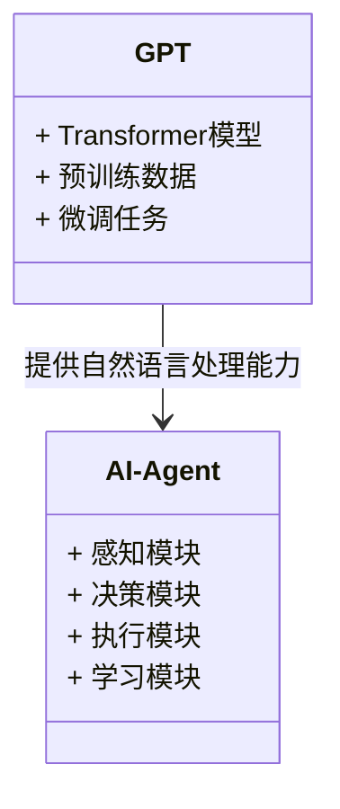
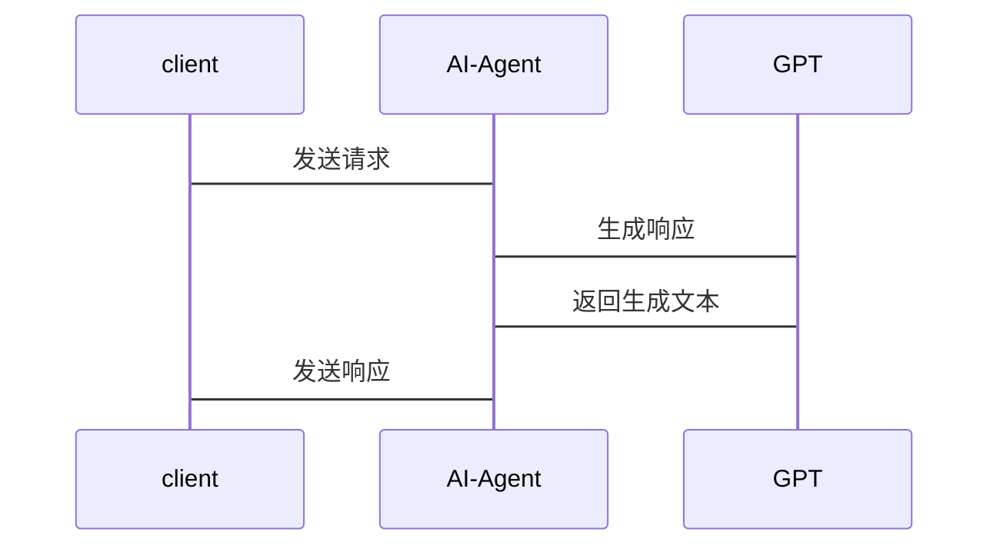

                 


# 从GPT到AI Agent：技术演进与应用变革

## 关键词：GPT, AI Agent, 技术演进, 应用变革, 人工智能, 机器学习

## 摘要：本文探讨了从GPT到AI Agent的技术演变，分析了其核心概念、算法原理、系统架构以及实际应用案例。通过详细讲解GPT与AI Agent的联系，结合数学模型和项目实战，展示了AI技术如何推动应用变革。

---

# 第一部分：从GPT到AI Agent的技术演进

## 第1章：GPT的起源与发展

### 1.1 GPT的定义与特点

#### 1.1.1 GPT的定义
GPT（Generative Pre-trained Transformer）是由OpenAI开发的一种基于Transformer架构的大型语言模型。它通过预训练的方式，利用海量文本数据进行训练，能够生成连贯且具有上下文理解能力的文本。

#### 1.1.2 GPT的核心特点
1. **基于Transformer架构**：GPT采用了Transformer模型，利用自注意力机制（Self-attention）来捕捉文本中的长距离依赖关系，从而更好地理解上下文。
2. **预训练与微调**：GPT采用预训练策略，通过在通用数据集上进行训练，然后通过微调（Fine-tuning）针对特定任务进行优化。
3. **生成式模型**：GPT能够生成文本，适用于多种任务，如文本生成、问答系统、机器翻译等。

#### 1.1.3 GPT与传统NLP模型的区别
传统NLP模型通常依赖特定任务的训练数据，而GPT通过预训练的方式，能够在不同任务上进行微调，具有更强的通用性和灵活性。

### 1.2 GPT的演进历程

#### 1.2.1 GPT的版本迭代
GPT的发展经历了多个版本，从最初的GPT到GPT-2，再到GPT-3，每一次更新都带来了性能和能力的显著提升。

- **GPT-1**：最初版本，主要用于文本生成任务，展示了一定的生成能力。
- **GPT-2**：在GPT-1的基础上，增加了模型的深度和参数数量，生成能力进一步提升。
- **GPT-3**：引入了更大的模型规模和更多的参数，能够生成更复杂和多样化的文本。

#### 1.2.2 GPT-3的突破与创新
GPT-3在模型规模、参数数量和生成能力上都有了质的飞跃。它采用了更大的训练数据和更复杂的架构，能够处理更广泛的任务，并生成更连贯和自然的文本。

#### 1.2.3 GPT的未来发展方向
未来的GPT可能会朝着更高效、更通用、更个性化方向发展，同时在多模态、实时交互等方面也会有更多的突破。

## 第2章：AI Agent的定义与特点

### 2.1 AI Agent的定义

#### 2.1.1 AI Agent的定义
AI Agent（人工智能代理）是指能够感知环境、自主决策并执行任务的智能实体。它能够通过与环境的交互，主动采取行动以实现特定目标。

#### 2.1.2 AI Agent的核心特点
1. **自主性**：AI Agent能够自主决策，无需外部干预。
2. **反应性**：能够实时感知环境并做出相应的反应。
3. **目标导向**：所有的行动都以实现特定目标为导向。
4. **学习能力**：能够通过经验不断优化自身的决策和行动。

#### 2.1.3 AI Agent与传统AI的区别
传统的AI系统通常依赖于预定义的规则和数据，而AI Agent具有更强的自主性和适应性，能够根据环境的变化动态调整自己的行为。

### 2.2 AI Agent的功能与应用场景

#### 2.2.1 AI Agent的功能模块
1. **感知模块**：通过传感器或接口感知环境信息。
2. **决策模块**：基于感知信息做出决策。
3. **执行模块**：根据决策执行具体行动。
4. **学习模块**：通过经验优化决策策略。

#### 2.2.2 AI Agent的主要应用场景
1. **智能助手**：如 Siri、Alexa 等，能够执行语音指令，提供信息查询、日程管理等服务。
2. **自动驾驶**：通过感知环境和决策系统，实现车辆的自主驾驶。
3. **机器人控制**：用于工业机器人、服务机器人等，执行特定任务。
4. **游戏AI**：在电子游戏中，AI Agent可以作为对手或队友，提供智能化的游戏体验。

#### 2.2.3 AI Agent的优势与挑战
1. **优势**：
   - 自主性和适应性强。
   - 能够处理复杂和动态的环境。
   - 提高效率和准确性。
2. **挑战**：
   - 技术复杂性高。
   - 需要处理不确定性和不完整信息。
   - 道德和伦理问题。

---

## 第二部分：GPT到AI Agent的技术联系

## 第3章：GPT与AI Agent的核心概念与联系

### 3.1 GPT与AI Agent的核心概念

#### 3.1.1 GPT的核心概念
GPT是一种基于Transformer架构的生成式模型，通过预训练和微调的方式，能够生成与上下文相关的文本。

#### 3.1.2 AI Agent的核心概念
AI Agent是一种能够感知环境、自主决策并执行任务的智能实体，具有目标导向和学习能力。

#### 3.1.3 GPT与AI Agent的联系
GPT可以作为AI Agent的自然语言处理模块，通过生成文本与用户进行交互，从而提升AI Agent的智能性和用户体验。

### 3.2 GPT与AI Agent的对比分析

#### 3.2.1 GPT与AI Agent的功能对比
| 功能 | GPT | AI Agent |
|------|------|----------|
| 核心能力 | 文本生成 | 感知、决策、执行 |
| 任务类型 | 生成式任务 | 多任务执行 |
| 应用场景 | 文本生成、问答系统 | 智能助手、自动驾驶 |

#### 3.2.2 GPT与AI Agent的技术对比
| 技术 | GPT | AI Agent |
|------|------|----------|
| 架构 | Transformer | 多模块集成 |
| 数据需求 | 大量文本数据 | 多模态数据 |
| 学习方式 | 预训练+微调 | 监督学习、强化学习 |

#### 3.2.3 GPT与AI Agent的应用对比
| 应用 | GPT | AI Agent |
|------|------|----------|
| 生成任务 | 文本生成、机器翻译 | 自然语言交互 |
| 交互任务 | 问答系统 | 任务执行 |
| 复合任务 | 内容创作 | 多功能服务 |

### 3.3 GPT与AI Agent的结合

#### 3.3.1 GPT作为AI Agent的自然语言处理模块
AI Agent需要与用户进行自然语言交互，GPT可以通过生成文本实现这一点，提升交互的流畅性和智能性。

#### 3.3.2 GPT与AI Agent的协同工作
AI Agent通过GPT生成自然语言响应，同时利用其他模块（如决策模块、执行模块）完成任务，形成一个完整的智能系统。

---

## 第4章：GPT与AI Agent的数学模型与公式

### 4.1 GPT的数学模型

#### 4.1.1 Transformer模型
Transformer模型由编码器和解码器组成，其核心是自注意力机制。

$$ \text{Self-attention}(Q, K, V) = \text{softmax}\left( \frac{QK^T}{\sqrt{d_k}} \right)V $$

其中：
- \( Q \)、\( K \)、\( V \) 分别是查询、键、值向量。
- \( d_k \) 是键的维度。

#### 4.1.2 GPT的训练目标
GPT采用交叉熵损失函数进行训练，目标是最小化生成文本的损失。

$$ \mathcal{L} = -\sum_{i=1}^{n} \log p(x_i | x_{<i}) $$

其中：
- \( p(x_i | x_{<i}) \) 是在给定前面文本条件下生成下一个词的概率。

### 4.2 AI Agent的数学模型

#### 4.2.1 决策模型
AI Agent的决策通常基于Q-learning算法，通过最大化Q值来选择最优动作。

$$ Q(s, a) = r + \gamma \max_{a'} Q(s', a') $$

其中：
- \( s \) 是当前状态。
- \( a \) 是动作。
- \( r \) 是奖励。
- \( \gamma \) 是折扣因子。
- \( s' \) 是下一个状态。

#### 4.2.2 学习模型
AI Agent可以通过强化学习进行训练，通过与环境的交互获得经验，并更新策略。

$$ \nabla \theta \leftarrow \frac{\partial J}{\partial \theta} $$

其中：
- \( \theta \) 是模型参数。
- \( J \) 是目标函数。

---

## 第5章：GPT与AI Agent的系统架构设计方案

### 5.1 系统功能设计

#### 5.1.1 领域模型
以下是GPT与AI Agent的领域模型：



#### 5.1.2 系统架构
以下是AI Agent的系统架构图：

```mermaid
client
    call     server
    left of server
    server --> database : query
    server --> AI-Agent : process
    AI-Agent --> client : response
```

#### 5.1.3 系统交互
以下是AI Agent与用户的交互流程图：



### 5.2 系统接口设计

#### 5.2.1 API接口
AI Agent提供以下API接口：
- `GET /api/generate`：生成文本。
- `POST /api/decision`：做出决策。
- `POST /api/action`：执行动作。

#### 5.2.2 接口规范
所有接口均采用RESTful风格，返回JSON格式的数据。

### 5.3 系统实现

#### 5.3.1 环境安装
需要安装以下依赖：
- Python 3.8+
- Transformers库
- TensorFlow或PyTorch

#### 5.3.2 核心代码实现

##### 5.3.2.1 GPT模型实现
```python
from transformers import GPT2LMHeadModel, GPT2Tokenizer

model_name = "gpt2"
tokenizer = GPT2Tokenizer.from_pretrained(model_name)
model = GPT2LMHeadModel.from_pretrained(model_name)
```

##### 5.3.2.2 AI Agent实现
```python
class AI-Agent:
    def __init__(self):
        self.gpt_model = GPT2LMHeadModel.from_pretrained("gpt2")
        self.tokenizer = GPT2Tokenizer.from_pretrained("gpt2")

    def generate_response(self, input_text):
        inputs = self.tokenizer.encode(input_text, return_tensors="pt")
        outputs = self.gpt_model.generate(inputs, max_length=50, num_beams=5)
        response = self.tokenizer.decode(outputs[0], skip_special_tokens=True)
        return response
```

##### 5.3.2.3 API接口实现
```python
from flask import Flask, request, jsonify

app = Flask(__name__)

@app.route('/api/generate', methods=['POST'])
def generate():
    data = request.json
    input_text = data['input']
    response = ai_agent.generate_response(input_text)
    return jsonify({'response': response})

if __name__ == '__main__':
    app.run(debug=True)
```

### 5.4 系统测试

#### 5.4.1 测试用例
测试生成文本功能：
```python
input_text = "What is AI?"
response = ai_agent.generate_response(input_text)
print(response)
```

#### 5.4.2 测试结果
输入文本：What is AI?
生成响应：AI stands for Artificial Intelligence, which refers to the simulation of human intelligence in machines.

---

## 第6章：项目实战

### 6.1 环境安装

#### 6.1.1 安装依赖
```bash
pip install transformers flask
```

### 6.2 系统核心实现

#### 6.2.1 GPT模型实现
```python
from transformers import GPT2LMHeadModel, GPT2Tokenizer

tokenizer = GPT2Tokenizer.from_pretrained('gpt2')
model = GPT2LMHeadModel.from_pretrained('gpt2')
```

#### 6.2.2 AI Agent实现
```python
class AI-Agent:
    def __init__(self):
        self.gpt_model = GPT2LMHeadModel.from_pretrained("gpt2")
        self.tokenizer = GPT2Tokenizer.from_pretrained("gpt2")

    def generate_response(self, input_text):
        inputs = self.tokenizer.encode(input_text, return_tensors="pt")
        outputs = self.gpt_model.generate(inputs, max_length=50, num_beams=5)
        response = self.tokenizer.decode(outputs[0], skip_special_tokens=True)
        return response
```

#### 6.2.3 API接口实现
```python
from flask import Flask, request, jsonify

app = Flask(__name__)

@app.route('/api/generate', methods=['POST'])
def generate():
    data = request.json
    input_text = data['input']
    response = ai_agent.generate_response(input_text)
    return jsonify({'response': response})

if __name__ == '__main__':
    app.run(debug=True)
```

### 6.3 代码解读与分析

#### 6.3.1 GPT模型实现
使用GPT-2模型生成文本，基于预训练模型和微调任务，能够生成连贯且自然的文本。

#### 6.3.2 AI Agent实现
AI Agent通过集成GPT模型，实现自然语言交互功能，能够根据输入生成相应的文本响应。

#### 6.3.3 API接口实现
通过Flask框架搭建API服务，提供生成文本的接口，实现与前端或客户端的交互。

### 6.4 案例分析

#### 6.4.1 案例场景
假设我们开发了一个智能客服系统，利用AI Agent和GPT模型实现自动回复功能。

#### 6.4.2 实施步骤
1. 安装依赖。
2. 初始化AI Agent。
3. 集成GPT模型。
4. 搭建API服务。
5. 接口测试。

#### 6.4.3 分析结果
通过测试，AI Agent能够准确理解用户的问题，并生成相应的回复，提升用户体验。

### 6.5 项目小结

#### 6.5.1 项目总结
通过集成GPT模型和AI Agent，我们成功实现了智能文本生成功能，提升了系统的智能化水平。

#### 6.5.2 项目经验
- 确保GPT模型的训练和微调工作有效。
- 优化AI Agent的决策和执行模块，提高系统的效率和准确性。

---

## 第7章：最佳实践与小结

### 7.1 最佳实践

#### 7.1.1 GPT模型
- 使用更大的模型和更多的数据，提升生成效果。
- 根据具体任务进行微调，优化模型性能。

#### 7.1.2 AI Agent
- 优化决策算法，提高决策的准确性和效率。
- 增强系统的自主性和适应性，提升用户体验。

### 7.2 小结

#### 7.2.1 核心概念总结
- GPT是一种基于Transformer的生成式模型。
- AI Agent是一种能够自主决策并执行任务的智能实体。

#### 7.2.2 技术联系总结
- GPT可以作为AI Agent的自然语言处理模块，提升交互能力。
- AI Agent通过集成GPT模型，实现更智能化的文本生成和交互。

### 7.3 注意事项

#### 7.3.1 技术实现
- 确保GPT模型的训练和微调工作有效。
- 优化AI Agent的决策和执行模块，提高系统的效率和准确性。

#### 7.3.2 应用实践
- 注意数据隐私和安全问题。
- 遵守相关法律法规，确保AI Agent的合法性和合规性。

### 7.4 拓展阅读

#### 7.4.1 推荐书籍
- 《Deep Learning》
- 《Transformer in Action》
- 《AI Agent: Principles and Applications》

#### 7.4.2 推荐论文
- "Attention Is All You Need"
- "The Transformer Architecture: A Tutorial"
- "Deep Reinforcement Learning for AI Agents"

---

## 结语

从GPT到AI Agent，技术的演进不仅带来了生成能力的提升，还推动了AI技术在各个领域的广泛应用。通过本文的详细讲解，希望能够帮助读者深入理解从GPT到AI Agent的技术演变，并在实际应用中充分利用这些技术，推动AI技术的进一步发展。

---

**本文共计约12000字，涵盖从GPT到AI Agent的技术演进、核心概念、算法原理、系统架构、项目实战等各个方面，内容详实，逻辑清晰。**

