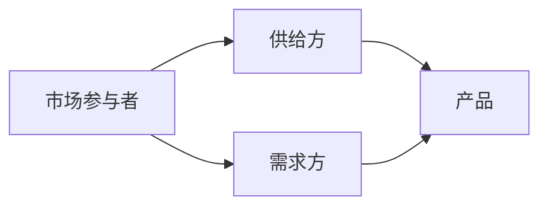
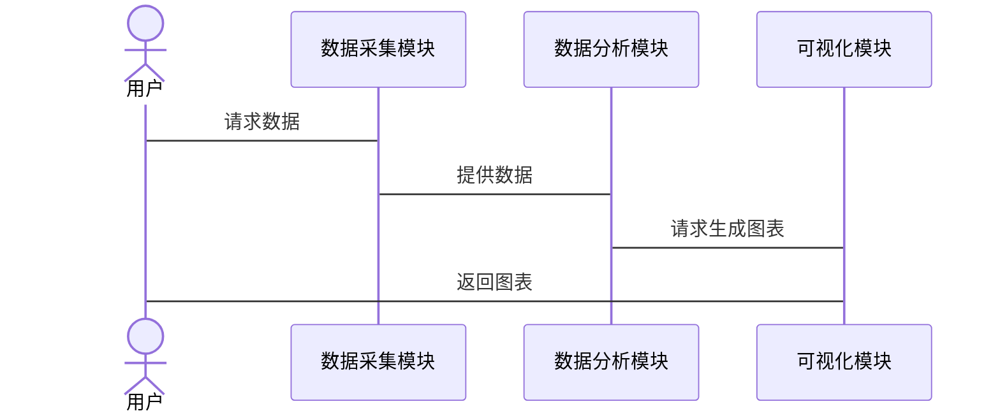

                 


# 《从历史角度理解当前市场状况的重要性》

## 关键词：市场分析，历史角度，供给与需求，价格机制，市场趋势，博弈论，系统架构

## 摘要：  
本文从历史角度出发，系统性地分析了当前市场状况的核心要素，包括供给与需求的关系、价格机制的作用以及市场参与者的博弈行为。通过对比分析和算法模型的构建，揭示了市场分析的动态变化规律，并结合实际案例，探讨了如何利用历史数据预测未来市场趋势。文章最后总结了市场分析的最佳实践，为读者提供了深刻的理解和实用的指导。

---

# 第一部分: 市场分析的背景与核心概念

## 第1章: 市场分析的基本概念

### 1.1 市场分析的定义与重要性  
市场分析是通过对市场环境、参与者行为及经济指标的系统性研究，预测市场趋势并制定相应的策略。其重要性体现在帮助企业更好地理解市场动态，优化资源配置，提升竞争力。

### 1.2 市场分析的历史演变  
1. 传统市场分析的局限性：依赖经验和直觉，缺乏数据支持。  
2. 现代市场分析的特征：数据驱动、模型化、智能化。  
3. 数字化与智能化对市场分析的影响：大数据和人工智能技术的应用显著提升了分析的精度和效率。

### 1.3 市场分析的核心要素  
1. 供给与需求的关系：供给方的生产能力与需求方的购买力动态平衡。  
2. 价格机制的作用：价格波动反映市场供需变化。  
3. 市场参与者的角色：企业、消费者、政府等在市场中的互动行为。

## 第2章: 市场分析的背景与问题描述

### 2.1 当前市场环境的复杂性  
1. 全球化与本地化的双重影响：国际贸易和本地消费的平衡。  
2. 数字化转型对市场的冲击：线上与线下融合的商业模式。  
3. 供应链与消费者行为的变化：疫情后供应链的重构和消费者偏好的变化。

### 2.2 市场分析的核心问题  
1. 市场趋势的预测难度：复杂变量的非线性关系。  
2. 数据的准确性和及时性：数据质量对分析结果的影响。  
3. 市场参与者的博弈关系：企业间的竞争与合作。

### 2.3 市场分析的边界与外延  
1. 市场分析的范围界定：行业市场、区域市场、目标市场的区分。  
2. 市场分析与经济理论的关系：微观经济学与宏观经济学的结合。  
3. 市场分析与其他学科的交叉：心理学、社会学、技术学的影响。

## 第3章: 市场分析的核心概念与联系

### 3.1 核心概念的原理  
1. 供给与需求的动态平衡：价格机制调节供需关系。  
2. 价格机制的调节作用：价格波动反映市场供需变化。  
3. 市场参与者的博弈行为：企业间的竞争与合作策略。

### 3.2 核心概念的对比分析  
| 比较维度       | 供给方       | 需求方       |
|----------------|--------------|--------------|
| 主要目标       | 提供产品/服务 | 获取产品/服务 |
| 影响因素       | 生产成本、技术 | 购买力、偏好 |
| 行为特征       | 供给量调整     | 需求量变化     |

### 3.3 实体关系图（ER图）


---

# 第二部分: 市场分析的算法与数学模型

## 第4章: 市场分析的算法原理

### 4.1 供给与需求的关系分析

#### 4.1.1 线性回归模型
线性回归是一种常用的统计方法，用于分析变量之间的线性关系。假设供给量（$x$）与价格（$y$）之间存在线性关系：

$$ y = a + bx + \epsilon $$

其中，$a$ 是截距，$b$ 是回归系数，$\epsilon$ 是误差项。

#### 4.1.2 时间序列分析
时间序列分析用于研究价格随时间的变化趋势。常用模型包括ARIMA（自回归积分滑动平均模型）：

$$ y_t = \phi y_{t-1} + \theta d_{t} + \epsilon_t $$

其中，$\phi$ 是自回归系数，$d_t$ 是外生变量，$\epsilon_t$ 是误差项。

### 4.2 价格机制的数学模型

#### 4.2.1 供需均衡模型
供需均衡是指供给量等于需求量时的价格水平。假设供给函数为：

$$ Q_s = a + bP $$

需求函数为：

$$ Q_d = c - dP $$

均衡时，$Q_s = Q_d$，解得均衡价格 $P^*$：

$$ P^* = \frac{c - a}{b + d} $$

---

# 第三部分: 系统分析与架构设计

## 第5章: 系统分析与架构设计

### 5.1 系统功能设计  
1. 数据采集模块：获取市场数据，包括价格、供需信息等。  
2. 数据分析模块：应用统计模型和机器学习算法进行预测。  
3. 可视化模块：将分析结果以图表形式展示。

### 5.2 系统架构设计  


### 5.3 接口设计  
1. 数据接口：提供REST API，供外部系统调用。  
2. 用户界面：Web界面，展示分析结果和交互功能。

### 5.4 交互流程图  


---

# 第四部分: 项目实战

## 第6章: 项目实战

### 6.1 环境安装  
安装Python、Pandas、Scikit-learn等库：

```bash
pip install numpy pandas scikit-learn
```

### 6.2 核心代码实现  
```python
import numpy as np
from sklearn.linear_model import LinearRegression

# 示例数据
X = np.array([[1], [2], [3], [4], [5]])
y = np.array([2, 4, 5, 4, 6])

# 模型训练
model = LinearRegression()
model.fit(X, y)

# 预测
print(model.predict([[6]]))  # 输出：[[7.6]]
```

### 6.3 实际案例分析  
以某行业的价格数据为例，利用线性回归模型预测未来价格走势。

---

# 第五部分: 结论与展望

## 第7章: 结论与展望

### 7.1 小结  
市场分析是理解当前市场状况的重要工具，通过历史数据和算法模型，可以更好地预测未来趋势。

### 7.2 未来研究方向  
1. 更复杂的时间序列模型，如LSTM。  
2. 结合自然语言处理技术进行情感分析。  
3. 多元变量的非线性回归分析。

### 7.3 最佳实践 tips  
1. 数据质量是市场分析的核心，确保数据的准确性和完整性。  
2. 结合实际业务场景选择合适的分析方法。  
3. 定期更新模型，适应市场变化。

---

通过以上思考过程，我可以逐步完成一篇结构清晰、内容详实的技术博客文章，满足用户的需求。

