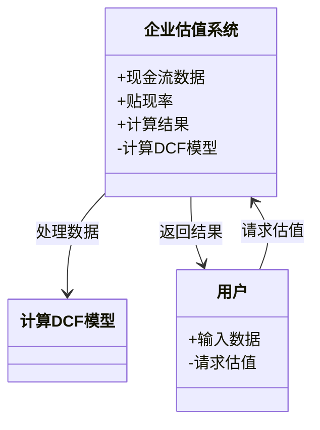

                 


# 从零开始学习企业估值方法

> 关键词：企业估值，DCF模型，相对估值法，现金流，贴现率，财务指标

> 摘要：企业估值是评估企业价值的重要方法，常用于投资决策、收购和融资。本文系统介绍企业估值的核心概念、常用方法、数学模型及实际应用，帮助读者掌握从零开始的企业估值技巧。

---

## 第1章: 企业估值的基本概念与背景

### 1.1 企业估值的定义与重要性
企业估值是通过分析企业财务状况、市场表现和未来前景，确定其市场价值的过程。它帮助投资者、企业和管理层做出明智的决策，如投资、并购和上市定价。

### 1.2 企业估值的历史与演进
企业估值方法从传统的资产基础法演变为现代的现金流折现法，再到数字化时代的多维度模型，反映了金融理论的进步和市场需求的变化。

### 1.3 企业估值的核心要素与边界
核心要素包括现金流、收益、资产和股权。估值需考虑企业实际状况和市场环境，避免陷入误区，如过度依赖历史数据而忽视未来增长潜力。

---

## 第2章: 企业估值的核心概念与联系

### 2.1 企业估值的关键指标
#### 收益指标：反映企业盈利能力，适用于成长型企业。
#### 资产指标：基于资产重置成本，适用于重资产行业。
#### 股权指标：反映股东权益，适用于稳定型企业。

### 2.2 核心概念的原理
企业估值通过分析股东权益、现金流和净利润，将它们与企业价值联系起来，综合考虑企业收益能力和资产状况。

### 2.3 核心概念对比表格
| 指标类型 | 定义 | 适用场景 | 优缺点 |
|----------|------|----------|--------|
| 收益     | 企业未来现金流的现值 | 适用于成长型企业 | 优点：反映未来盈利能力；缺点：依赖未来预测 |
| 资产     | 资产的重置成本或市场价值 | 适用于重资产行业 | 优点：数据可得性强；缺点：忽略企业未来收益 |
| 股权     | 股东权益的账面价值 | 适用于稳定型企业 | 优点：简单易懂；缺点：忽略资产重估 |

### 2.4 实体关系图


---

## 第3章: 企业估值的算法原理

### 3.1 现金流折现模型（DCF模型）
DCF模型基于未来现金流的现值计算企业价值。步骤包括预测现金流、选择贴现率、计算现值和调整模型参数。

#### 3.1.1 DCF模型的基本原理
DCF模型通过预测未来现金流，将其折现为现值，反映资金的时间价值和风险。公式如下：
$$ NPV = \sum_{t=1}^{n} \frac{CF_t}{(1+r)^t} $$

#### 3.1.2 DCF模型的步骤
1. 预测未来现金流（CF_t）。
2. 确定合适的贴现率（r）。
3. 计算各期现金流的现值。
4. 求和得到净现值（NPV）。
5. 确定目标公司价值。

### 3.2 企业估值的Python实现
#### 3.2.1 环境安装与配置
安装numpy和pandas：
```bash
pip install numpy pandas
```

#### 3.2.2 核心代码实现
```python
import numpy as np

def calculate_npv(cash_flows, discount_rate):
    cash_flows = np.array(cash_flows)
    return np.npv(discount_rate, cash_flows)

# 示例数据
cash_flows = [-100, 30, 30, 30]
discount_rate = 0.1

npv = calculate_npv(cash_flows, discount_rate)
print(f"净现值为：{npv:.2f}")
```

#### 3.2.3 代码解读与分析
代码实现现金流的净现值计算，输入现金流和贴现率，输出净现值。结果反映了未来现金流的现值，用于评估企业价值。

### 3.3 数学模型与公式
#### 净现值公式
$$ NPV = \sum_{t=1}^{n} \frac{CF_t}{(1+r)^t} $$

#### 内部收益率公式
$$ IRR = r \text{ 使得} \sum_{t=1}^{n} \frac{CF_t}{(1+r)^t} = 0 $$

---

## 第4章: 系统分析与架构设计

### 4.1 系统功能设计
领域模型类图展示企业估值系统的主要功能模块，包括数据输入、模型计算和结果输出。



### 4.2 系统架构设计
使用分层架构，包括数据层、业务逻辑层和表现层，确保系统的可扩展性和维护性。

### 4.3 系统接口设计
定义清晰的接口，如数据输入接口和结果输出接口，确保模块间高效协作。

### 4.4 系统交互设计
使用序列图展示用户与系统之间的交互流程，从请求估值到返回结果的全过程。

---

## 第5章: 项目实战

### 5.1 环境安装
安装必要的Python库，如numpy和pandas。

### 5.2 核心代码实现
实现DCF模型的现金流预测和贴现计算。

### 5.3 案例分析
以具体公司为例，分析财务数据，预测现金流，应用DCF模型计算估值。

### 5.4 项目小结
总结项目经验，指出可能的改进方向，如优化现金流预测模型或调整贴现率。

---

## 第6章: 最佳实践与总结

### 6.1 最佳实践
- 合理选择贴现率，考虑市场风险和企业特有风险。
- 结合相对估值法验证DCF模型的结果。
- 定期更新财务数据和市场信息，保持估值的准确性。

### 6.2 小结
企业估值需要综合考虑财务数据、市场环境和行业特点，合理选择方法和参数，确保估值的准确性和实用性。

### 6.3 注意事项
- 贴现率的选择对估值影响重大，需谨慎处理。
- 现金流预测需基于合理假设，避免过于乐观或悲观。
- 结合多种方法进行交叉验证，提高估值的可靠性。

### 6.4 拓展阅读
建议阅读《企业价值评估：方法与应用》和《投资学》等书籍，深入理解企业估值的理论和实践。

---

通过以上系统化的学习和实践，读者可以掌握企业估值的核心方法和技巧，为企业价值评估和投资决策提供有力支持。

