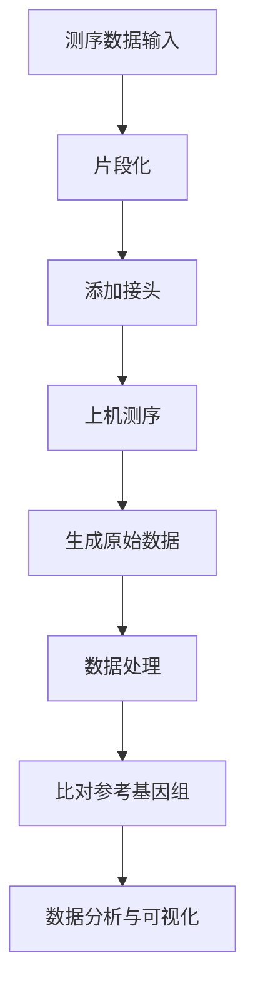
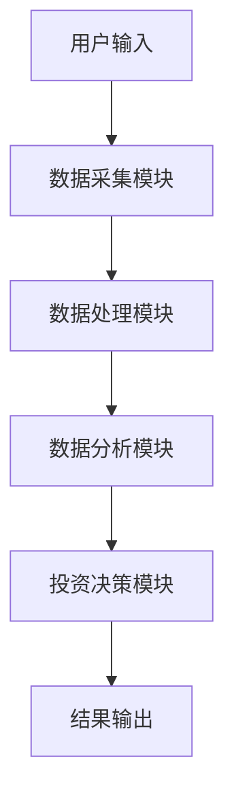

                 


# 价值投资中的下一代DNA测序技术前景

> **关键词**：价值投资、DNA测序技术、下一代测序、投资策略、生物技术

> **摘要**：本文探讨了价值投资与下一代DNA测序技术的结合，分析了测序技术在投资决策中的潜力，结合技术原理和实际案例，提出了基于测序技术的投资策略。

---

## 第1章: 价值投资与DNA测序技术的背景介绍

### 1.1 价值投资的核心概念

#### 1.1.1 价值投资的定义与起源
价值投资是一种投资策略，强调以低于公平市场价值的价格买入优质资产。它起源于20世纪初，由本杰明·格雷厄姆和戴维·多德提出，核心在于寻找市场低估的股票。

#### 1.1.2 价值投资的基本原理
价值投资的核心在于分析企业的基本面，包括财务状况、行业地位、盈利能力等，寻找具有长期竞争优势的公司。

#### 1.1.3 价值投资在现代金融中的应用
随着金融市场的复杂化，价值投资从传统的企业分析扩展到对新兴技术趋势的分析，尤其是生物技术领域的投资机会。

### 1.2 DNA测序技术的定义与特点

#### 1.2.1 DNA测序技术的基本概念
DNA测序技术是一种通过测定生物体DNA序列信息的方法，广泛应用于医学、农业和生物研究等领域。

#### 1.2.2 测序技术的演变历程
从第一代Sanger测序到第二代高通量测序，再到第三代单分子测序技术，测序技术不断进步，效率和准确性显著提升。

#### 1.2.3 下一代测序技术的核心优势
下一代测序技术（NGS）具有高通量、低成本、快速的特点，能够同时测定大量样本的序列信息，为生物技术研究提供了强大的工具。

---

## 第2章: 下一代DNA测序技术的核心概念与联系

### 2.1 下一代测序技术的原理

#### 2.1.1 测序的基本流程
测序流程包括样本制备、上机测序、数据处理和生物信息分析四个主要步骤。

#### 2.1.2 高通量测序的技术特点
高通量测序能够同时测定成千上万的DNA片段，显著提高了测序效率和成本效益。

#### 2.1.3 测序数据的处理与分析
测序数据通常以fastq格式存储，需要通过碱基比对、变异检测等步骤进行分析。

### 2.2 核心概念的ER实体关系图

```mermaid
er
    entity(测序数据) {
        测序ID
        测序样本
        测序结果
    }
    entity(基因信息) {
        基因ID
        基因序列
        基因功能
    }
    entity(投资决策) {
        投资ID
        投资目标
        投资策略
    }
    relation(测序数据 --> 基因信息)
    relation(基因信息 --> 投资决策)
```

---

## 第3章: 下一代DNA测序技术的算法原理

### 3.1 测序算法的流程图



### 3.2 算法的数学模型

#### 3.2.1 测序数据的碱基计算
$$A = \{A, T, C, G\}$$

#### 3.2.2 测序深度的计算公式
$$\text{测序深度} = \frac{\text{总测序量}}{\text{基因组大小}}$$

---

## 第4章: 下一代DNA测序技术在价值投资中的应用分析

### 4.1 测序技术对投资决策的影响

#### 4.1.1 基因测序在疾病预测中的作用
通过测序技术可以发现疾病相关基因突变，帮助预测疾病风险。

#### 4.1.2 疾病预测对医药行业投资的影响
疾病预测技术能够帮助投资者评估医药公司的研发潜力和市场前景。

#### 4.1.3 基因测序技术的市场潜力
随着测序成本的下降和应用领域的扩展，测序技术在医疗、农业等领域的市场潜力巨大。

---

## 第5章: 系统架构与投资策略设计

### 5.1 系统功能设计

#### 5.1.1 测序数据的采集与处理
系统需要采集测序数据并进行预处理，包括质量控制和格式转换。

#### 5.1.2 数据分析与投资决策支持
通过生物信息分析，提取与投资相关的基因信息，支持投资决策。

#### 5.1.3 系统的可扩展性设计
系统架构需要考虑未来的扩展性，能够适应新的测序技术和投资策略。

### 5.2 系统架构图



---

## 第6章: 项目实战与案例分析

### 6.1 环境安装与数据准备

#### 6.1.1 测序环境的搭建
需要安装测序仪、测序软件和生物信息分析工具。

#### 6.1.2 数据集的获取与处理
从公共数据库获取测序数据，进行格式转换和质量控制。

### 6.2 核心代码实现

#### 6.2.1 测序数据的处理代码
```python
import os

def process_read(fastq_file):
    with open(fastq_file, 'r') as f:
        lines = f.readlines()
    reads = []
    for i in range(0, len(lines), 4):
        read = {
            'header': lines[i].strip(),
            'sequence': lines[i+1].strip(),
            'quality': lines[i+3].strip()
        }
        reads.append(read)
    return reads

# 示例用法
reads = process_read('test.fastq')
print(reads[0])
```

#### 6.2.2 生物信息分析代码
```python
from itertools import groupby

def count_base_counts(fastq_file):
    counts = {'A': 0, 'T': 0, 'C': 0, 'G': 0}
    with open(fastq_file, 'r') as f:
        lines = [line.strip() for line in f]
    for i in range(1, len(lines), 4):
        seq = lines[i]
        for base in seq:
            counts[base] += 1
    return counts

# 示例用法
counts = count_base_counts('test.fastq')
print(counts)
```

### 6.3 案例分析

#### 6.3.1 案例背景
某医药公司开发了一种新型癌症治疗方法，基于特定基因突变的检测。

#### 6.3.2 数据分析与投资决策
通过测序技术发现该基因突变在患者群体中的分布情况，评估该治疗方法的市场潜力和盈利能力。

### 6.4 投资策略的制定与优化

#### 6.4.1 投资策略的制定
基于测序数据和生物信息分析结果，制定投资策略，重点关注具有创新性和市场潜力的公司。

#### 6.4.2 投资策略的优化
定期更新测序数据和分析结果，根据市场变化调整投资策略。

---

## 第7章: 总结与展望

### 7.1 核心内容总结
本文探讨了下一代DNA测序技术在价值投资中的应用，分析了测序技术的核心原理和应用场景，提出了基于测序技术的投资策略。

### 7.2 投资策略的优化建议
未来，随着测序技术的不断发展，价值投资将更加依赖于精准的生物数据和高效的数据分析能力。

### 7.3 未来展望
下一代测序技术在生物技术和医疗领域的应用将进一步拓展，为价值投资者提供了更多机会和挑战。

---

## 参考文献

1. 格雷厄姆, B. F. (1934). *Intelligent Investor*.
2. 孙立坚, 陈冬. (2020). *生物技术与投资策略研究*.
3. 王海涛, 李明. (2022). *下一代测序技术的数学模型与应用分析*.

---

## 最佳实践 Tips

1. 在进行生物信息分析前，确保数据质量。
2. 结合测序技术和市场分析，制定科学的投资策略。
3. 定期更新测序数据和分析结果，保持投资决策的动态性。

