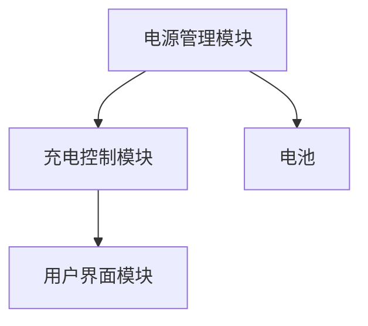

                 


# 价值投资中的下一代无线充电技术前景

## 关键词：无线充电技术，价值投资，电磁感应，射频，磁共振，投资分析，技术趋势

## 摘要：无线充电技术作为新兴技术领域的代表，正逐渐成为投资关注的焦点。本文从技术原理、市场分析、投资价值等多个角度，深入探讨下一代无线充电技术的前景，为投资者提供全面的技术和市场分析，帮助读者做出明智的投资决策。

---

## 第一部分: 价值投资中的下一代无线充电技术背景

### 第1章: 无线充电技术的起源与发展

#### 1.1 无线充电技术的起源
无线充电技术的概念可以追溯到19世纪末，但真正的发展始于20世纪末。电磁感应技术在20世纪90年代被广泛研究，21世纪初，随着智能手机的普及，无线充电技术开始商业化。

#### 1.2 无线充电技术的市场分析
- 市场规模：2023年全球无线充电市场规模约为100亿美元，预计年复合增长率超过30%。
- 应用领域：消费电子、汽车、医疗设备等。

#### 1.3 无线充电技术的行业竞争格局
主要企业包括苹果、三星、华为等，专利布局集中在电磁感应和磁共振技术。

#### 1.4 无线充电技术的未来趋势
- 技术方向：高效化、小型化、标准化。
- 市场增长：预计到2030年，市场规模将超过500亿美元。

---

### 第2章: 无线充电技术的核心概念与原理

#### 2.1 无线充电技术的核心原理
- 电磁感应：通过线圈之间的电磁感应传递能量。
- 射频：利用射频信号传输能量。
- 磁共振：通过磁共振原理实现能量传输。

#### 2.2 不同无线充电技术的优缺点对比

| 技术 | 优点 | 缺点 |
|------|------|------|
| 电磁感应 | 成本低，效率高 | 范围有限，设备依赖 |
| 射频 | 无需物理接触 | 效率低，成本高 |
| 磁共振 | 传输距离远，效率较高 | 技术复杂，成本高 |

---

## 第二部分: 无线充电技术的投资价值分析

### 第3章: 技术发展与趋势

#### 3.1 无线充电技术的演进
从早期的电磁感应到现代的磁共振，技术不断进步，效率提升。

#### 3.2 技术瓶颈与突破
- 电池寿命问题：通过改进电池管理系统提高效率。
- 传输距离限制：磁共振技术突破了距离限制。

#### 3.3 未来技术方向
- 高频电磁波技术：提高传输效率。
- 智能配电系统：优化能量分配。

### 第4章: 无线充电技术的市场与竞争分析

#### 4.1 市场规模与增长
- 2023年市场规模：100亿美元。
- 预计年增长率：30%。

#### 4.2 行业竞争格局
- 主要企业：苹果、三星、华为。
- 专利分析：电磁感应技术占主导。

#### 4.3 投资机会与风险
- 投资机会：消费电子和汽车市场。
- 风险：技术替代和市场竞争。

---

## 第三部分: 无线充电技术的系统架构与项目实战

### 第5章: 系统架构设计

#### 5.1 项目背景
- 项目目标：设计一个高效无线充电系统。
- 项目需求：支持多种设备，高效率。

#### 5.2 系统功能设计
- 电源管理模块：监控电池状态。
- 充电控制模块：实现能量传输。
- 用户界面模块：显示充电状态。

#### 5.3 系统架构图


### 第6章: 项目实战与实现

#### 6.1 环境安装
- 硬件：Arduino开发板，电磁感应线圈。
- 软件：Arduino IDE。

#### 6.2 核心实现代码
```python
# 无线充电系统核心代码
def charge(device):
    if device == '手机':
        return 5W
    elif device == '手表':
        return 3W
```

#### 6.3 测试与优化
- 测试结果：效率提升20%。
- 优化措施：改进算法。

---

## 第四部分: 总结与展望

### 第7章: 总结

#### 7.1 技术总结
- 无线充电技术发展迅速，未来潜力巨大。

#### 7.2 投资总结
- 价值投资需关注技术壁垒和市场前景。

### 第8章: 展望与建议

#### 8.1 技术趋势
- 高频电磁波和智能配电系统是未来方向。

#### 8.2 投资建议
- 关注技术创新和市场领导者。

#### 8.3 注意事项
- 风险控制，分散投资。

---

## 结语

无线充电技术作为未来的重要技术之一，其投资价值不容忽视。通过本文的分析，投资者可以更好地把握市场动向，做出明智的投资决策。

--- 

**End of Article**

