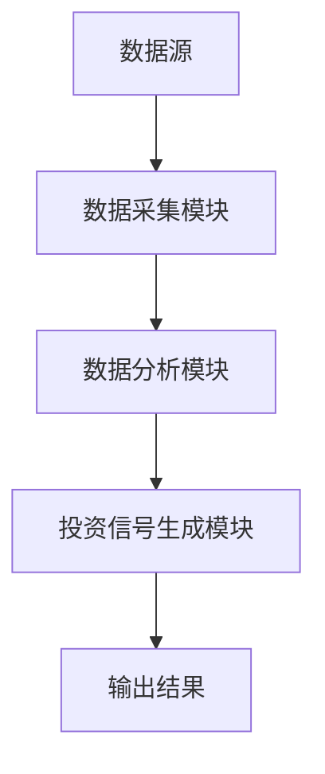
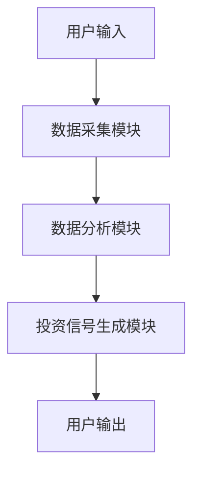

                 


# 价值投资中的反周期策略

> 关键词：价值投资、反周期策略、周期性波动、市场估值、投资策略

> 摘要：本文深入探讨了反周期策略在价值投资中的应用，从理论基础到数学模型，从系统设计到项目实战，全面分析了反周期策略的核心概念、实现方法和实际案例。通过本文，读者可以理解反周期策略的原理、优势以及如何在实际投资中应用。

---

# 第1章: 反周期策略的背景与定义

## 1.1 价值投资的基本原理

### 1.1.1 价值投资的定义与核心理念

价值投资是一种以基本面分析为基础的投资策略，其核心理念是寻找市场中被低估的资产。价值投资者认为，市场的短期波动并不能决定资产的长期价值，因此他们关注的是资产的内在价值，而非市场的短期情绪。

**价值投资的核心理念：**
1. 市场先生：市场的短期波动可以看作是“市场先生”的情绪表现，投资者应避免被市场情绪左右。
2. 安全边际：通过购买价格低于内在价值的资产，降低投资风险。
3. 长期视角：关注企业的长期盈利能力，而非短期市场波动。

### 1.1.2 价值投资与其它投资策略的对比

- **趋势投资**：基于价格走势进行投资，注重市场的短期趋势。
- **股息投资**：注重股息收入，适合追求稳定现金流的投资者。
- **成长投资**：关注企业的成长性，注重未来盈利潜力。

### 1.1.3 价值投资中的周期性分析

市场周期性波动对价值投资的影响：
1. 在市场低谷时，许多优质资产的价格被低估，为价值投资者提供了买入机会。
2. 在市场高点时，许多资产的价格被高估，价值投资者选择规避风险。

---

## 1.2 反周期策略的定义与特点

### 1.2.1 反周期策略的定义

反周期策略是一种在市场周期性波动中，通过逆向思维寻找投资机会的策略。其核心思想是在市场低谷时买入，在市场高点时卖出，从而实现超额收益。

### 1.2.2 反周期策略的核心特点

1. **逆向思维**：在市场恐慌时寻找机会，在市场狂热时保持冷静。
2. **安全边际**：通过买入价格低于内在价值的资产，降低投资风险。
3. **长期视角**：关注企业的长期价值，而非短期市场波动。

### 1.2.3 反周期策略与传统周期性投资的区别

| 对比维度 | 反周期策略 | 传统周期性投资 |
|----------|------------|----------------|
| 投资时机 | 低谷买入，高点卖出 | 高潮买入，低谷卖出 |
| 风险控制 | 注重安全边际 | 风险较高，波动较大 |
| 投资目标 | 寻找低估资产 | 追求短期收益 |

---

## 1.3 反周期策略在价值投资中的地位

### 1.3.1 反周期策略在价值投资中的作用

1. 提供超额收益：通过逆向投资，捕捉市场波动中的机会。
2. 减少投资风险：通过安全边际降低投资损失。

### 1.3.2 反周期策略的应用场景

1. 市场低谷：寻找被低估的资产。
2. 市场恐慌：利用市场恐慌寻找优质资产。
3. 行业周期：在行业低谷时买入，行业高点时卖出。

### 1.3.3 反周期策略的优势与劣势

**优势：**
- 通过逆向投资实现超额收益。
- 在市场低谷时获得安全边际。

**劣势：**
- 需要较高的市场敏感性。
- 需要较强的心理承受能力。

---

## 1.4 本章小结

本章主要介绍了反周期策略的背景、定义和特点，以及其在价值投资中的地位。通过对比传统周期性投资，明确了反周期策略的核心思想和应用场景。

---

# 第2章: 反周期策略的核心概念与联系

## 2.1 反周期策略的核心原理

### 2.1.1 市场周期性波动的分析

市场周期性波动的表现形式：
1. **经济周期**：经济周期的波动对市场有直接影响。
2. **行业周期**：行业自身的周期性波动。
3. **市场情绪**：投资者情绪的波动影响市场价格。

### 2.1.2 反周期策略的数学模型

**数学模型：**
$$ V = \frac{E}{P} $$
其中，\( V \) 表示市盈率，\( E \) 表示每股收益，\( P \) 表示股价。

**分析步骤：**
1. 计算市盈率（PE）。
2. 比较市盈率与行业平均水平。
3. 选择市盈率低于行业平均水平的资产。

### 2.1.3 反周期策略的经济基础

反周期策略的经济基础在于市场的非理性波动。在市场低谷时，许多优质资产的价格被低估，为反周期策略提供了投资机会。

---

## 2.2 反周期策略的核心要素

### 2.2.1 市场估值的衡量指标

1. **市盈率（PE）**：衡量股价相对于每股收益的高低。
2. **市净率（PB）**：衡量股价相对于每股净资产的高低。
3. **股息率**：衡量股票的分红能力。

### 2.2.2 股票内在价值的评估方法

1. **DCF模型**：通过现金流折现法评估企业价值。
2. **相对估值法**：通过比较同类资产的估值指标。

### 2.2.3 反周期策略的实施步骤

1. **确定投资目标**：选择行业或资产。
2. **分析市场周期**：判断市场所处周期阶段。
3. **评估资产价值**：计算资产的内在价值。
4. **制定投资计划**：根据分析结果制定买卖策略。

---

## 2.3 反周期策略与其它投资策略的关系

### 2.3.1 反周期策略与价值投资的关系

反周期策略是价值投资的重要组成部分，两者都注重资产的内在价值。

### 2.3.2 反周期策略与趋势投资的关系

反周期策略与趋势投资相反，趋势投资追求顺势而为，反周期策略追求逆势而为。

### 2.3.3 反周期策略与风险管理的关系

反周期策略通过安全边际降低投资风险，是风险管理的重要手段。

---

## 2.4 本章小结

本章详细分析了反周期策略的核心原理和核心要素，并探讨了其与其他投资策略的关系。通过数学模型和经济分析，明确了反周期策略的实施方法和应用场景。

---

# 第3章: 反周期策略的数学模型与算法原理

## 3.1 反周期策略的数学模型

### 3.1.1 市场周期性波动的数学表达

**周期性波动模型：**
$$ P(t) = P_0 \times (1 + \alpha \sin(\beta t + \phi)) $$
其中，\( P(t) \) 表示价格，\( P_0 \) 表示基础价格，\( \alpha \) 表示波动幅度，\( \beta \) 表示波动频率，\( \phi \) 表示相位角。

### 3.1.2 反周期策略的量化指标

1. **市盈率（PE）**：$$ PE = \frac{P}{E} $$
2. **市净率（PB）**：$$ PB = \frac{P}{B} $$
3. **股息率（Dividend Yield）**：$$ Dividend\ Yield = \frac{D}{P} $$

### 3.1.3 反周期策略的优化算法

**优化算法：**
1. **均值回归**：假设价格会回归均值。
2. **价值发现**：寻找价格低于内在价值的资产。

---

## 3.2 反周期策略的算法实现

### 3.2.1 数据预处理与特征提取

1. 数据清洗：去除缺失值和异常值。
2. 特征提取：提取市盈率、市净率等指标。

### 3.2.2 算法选择与实现

**Python代码示例：**

```python
import pandas as pd

# 数据加载
df = pd.read_csv('stock_data.csv')

# 特征提取
df['PE'] = df['Price'] / df['EPS']
df['PB'] = df['Price'] / df['BVPS']
df['DY'] = df['Dividend'] / df['Price']

# 计算平均值
mean_pe = df['PE'].mean()
mean_pb = df['PB'].mean()
mean_dy = df['DY'].mean()

# 生成投资信号
def generate_signal(pe, pb, dy):
    if pe < mean_pe and pb < mean_pb and dy > mean_dy:
        return 1
    else:
        return 0

df['Signal'] = df[['PE', 'PB', 'DY']].apply(lambda x: generate_signal(x['PE'], x['PB'], x['DY']), axis=1)
```

### 3.2.3 算法的优化与调优

1. 参数优化：调整波动幅度和频率。
2. 模型优化：结合多种指标进行综合判断。

---

## 3.3 反周期策略的数学公式

### 3.3.1 市场周期性波动的数学公式

$$ P(t) = P_0 \times (1 + \alpha \sin(\beta t + \phi)) $$

### 3.3.2 反周期策略的量化公式

1. **市盈率**：$$ PE = \frac{P}{E} $$
2. **市净率**：$$ PB = \frac{P}{B} $$

### 3.3.3 算法实现的数学推导

1. 数据预处理：$$ D_{clean} = \{P(t) | t \in [1, T], P(t) \text{ 为有效数据}\} $$
2. 特征提取：$$ F = \{PE, PB, DY\} $$
3. 投资信号生成：$$ S(t) = 1 \text{ 如果 } PE < mean\_PE \text{ 且 } PB < mean\_PB \text{ 且 } DY > mean\_DY $$

---

## 3.4 本章小结

本章通过数学模型和算法实现，详细分析了反周期策略的核心原理和实现方法。通过Python代码示例，展示了如何利用量化指标进行反周期投资。

---

# 第4章: 反周期策略的系统分析与架构设计

## 4.1 系统分析

### 4.1.1 反周期策略的系统目标

1. 实时监控市场数据。
2. 量化分析市场周期。
3. 生成投资信号。

### 4.1.2 系统的输入与输出

- **输入**：市场数据、经济指标。
- **输出**：投资信号、投资建议。

### 4.1.3 系统的功能模块划分

1. 数据采集模块。
2. 数据分析模块。
3. 投资信号生成模块。

---

## 4.2 系统架构设计

### 4.2.1 系统架构的总体设计



### 4.2.2 各功能模块的详细设计

1. **数据采集模块**：
   - 从数据库或API获取市场数据。
2. **数据分析模块**：
   - 计算市盈率、市净率等指标。
3. **投资信号生成模块**：
   - 根据量化指标生成投资信号。

### 4.2.3 系统的交互流程设计



---

## 4.3 系统接口设计

### 4.3.1 系统内部接口设计

1. 数据采集模块与数据分析模块的接口。
2. 数据分析模块与投资信号生成模块的接口。

### 4.3.2 系统与外部系统的接口设计

1. 数据源接口：从外部数据库获取数据。
2. 输出接口：将投资信号输出到用户界面。

### 4.3.3 接口的实现方式与协议

- 数据采集模块：使用API接口。
- 数据分析模块：使用Python脚本进行数据处理。

---

## 4.4 本章小结

本章通过系统分析与架构设计，明确了反周期策略的系统目标、功能模块和交互流程。通过Mermaid图展示了系统的整体架构和模块交互。

---

# 第5章: 反周期策略的项目实战

## 5.1 项目背景与目标

### 5.1.1 项目背景介绍

本项目旨在通过反周期策略，寻找市场中被低估的资产，实现超额收益。

### 5.1.2 项目目标设定

1. 实时监控市场数据。
2. 量化分析市场周期。
3. 生成投资信号。

### 5.1.3 项目实施的步骤

1. 数据采集。
2. 数据分析。
3. 投资信号生成。

---

## 5.2 项目核心实现

### 5.2.1 数据收集与处理

1. 数据来源：股票市场数据。
2. 数据清洗：去除缺失值和异常值。
3. 数据存储：存储到数据库中。

### 5.2.2 算法实现与优化

1. 计算市盈率、市净率等指标。
2. 生成投资信号。

### 5.2.3 系统的测试与验证

1. 测试数据：历史市场数据。
2. 测试结果：验证投资信号的有效性。

---

## 5.3 项目案例分析

### 5.3.1 实际案例的背景分析

假设当前市场处于低谷期，许多优质资产的价格被低估。

### 5.3.2 案例中的反周期策略实施

1. 数据采集：收集相关股票的市场数据。
2. 数据分析：计算市盈率、市净率等指标。
3. 投资信号生成：根据量化指标生成买入信号。

### 5.3.3 案例的分析与总结

通过反周期策略，在市场低谷时买入优质资产，实现超额收益。

---

## 5.4 项目小结

本章通过项目实战，展示了反周期策略的实施过程。通过实际案例分析，验证了反周期策略的有效性。

---

# 第6章: 总结与展望

## 6.1 总结

反周期策略是一种在市场周期性波动中，通过逆向思维寻找投资机会的策略。其核心思想是在市场低谷时买入，在市场高点时卖出。通过量化分析和系统设计，可以实现反周期策略的自动化实施。

---

## 6.2 展望

未来的研究方向：
1. 结合人工智能技术，提升反周期策略的预测能力。
2. 优化量化指标，提高投资信号的准确性。
3. 扩展应用场景，探索更多投资机会。

---

# 结语

通过本文的分析，读者可以全面理解反周期策略的核心概念、实现方法和实际应用。希望本文能够为价值投资者提供有益的参考，帮助他们在市场波动中实现超额收益。

---

