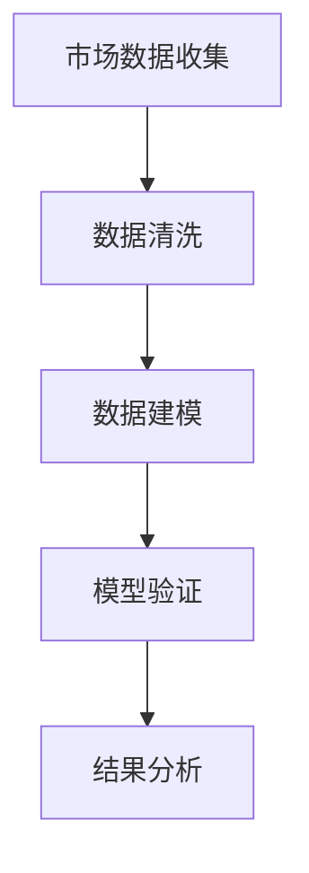
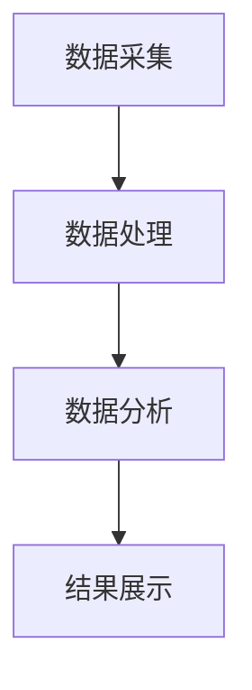

                 


# 价值投资中的可穿戴设备市场分析

> 关键词：价值投资、可穿戴设备、市场分析、投资策略、技术分析、投资回报

> 摘要：本文通过技术分析的方法，研究可穿戴设备市场的价值投资机会。通过对市场趋势、企业财务数据和行业竞争格局的深入分析，帮助投资者制定科学的投资策略，实现长期收益。

---

## 第一部分: 价值投资中的可穿戴设备市场分析背景介绍

### 第1章: 可穿戴设备市场概述

#### 1.1 可穿戴设备的定义与分类

##### 1.1.1 可穿戴设备的定义
可穿戴设备是指佩戴在身体或 clothing 上，能够通过传感器、智能芯片和互联网连接，提供健康监测、运动追踪、智能助手等功能的设备。常见的可穿戴设备包括智能手表、智能手环、健身追踪器、智能眼镜等。

##### 1.1.2 可穿戴设备的分类
- **按功能分类**：
  - 健康监测类：如智能手表、健康手环，主要用于心率、血压、睡眠监测等。
  - 运动追踪类：如运动手表，主要用于记录运动数据，如步数、距离、卡路里消耗等。
  - 智能助手类：如智能眼镜、智能手表，主要用于信息处理、语音助手、导航等。

- **按技术分类**：
  - 硬件技术：包括传感器、芯片、显示屏等。
  - 软件技术：包括操作系统、数据分析、应用程序等。

##### 1.1.3 可穿戴设备的市场现状
根据市场研究机构的数据，全球可穿戴设备市场近年来增长迅速。2023年全球可穿戴设备出货量达到**5亿台**，市场规模约为**800亿美元**。主要推动因素包括：
  - 健康意识的提升。
  - 智能手机的普及和物联网技术的发展。
  - 企业创新和产品多样化。

---

#### 1.2 价值投资的核心概念

##### 1.2.1 价值投资的定义
价值投资是一种投资策略，强调以低于内在价值的价格买入优质资产，长期持有，等待其价值回归。其核心在于寻找被市场低估的企业，关注企业的基本面，而不是市场的短期波动。

##### 1.2.2 价值投资的基本原则
  - **长期视角**：关注企业的长期增长潜力。
  - **安全边际**：买入价格低于内在价值，确保投资的安全性。
  - **基本面分析**：分析企业的财务状况、盈利能力、市场地位等。

##### 1.2.3 价值投资在科技领域的应用
科技行业具有高成长性和高波动性，价值投资在该领域面临更大的挑战和机遇。投资者需要关注企业的技术创新能力、市场竞争力和可持续发展能力。

---

## 第2章: 可穿戴设备市场的价值投资背景

### 2.1 可穿戴设备市场的现状与趋势

#### 2.1.1 市场规模分析
- **市场规模**：近年来，全球可穿戴设备市场保持快速增长，预计到2025年市场规模将超过**1000亿美元**。
- **增长驱动因素**：
  - 健康监测需求增加。
  - 智能手表和智能手环的普及。
  - 技术进步推动产品创新。

#### 2.1.2 市场增长驱动因素
- **技术进步**：传感器、芯片和人工智能技术的进步，提高了设备的功能和准确性。
- **用户需求多样化**：消费者对健康监测、运动追踪、智能助手等功能的需求增加。
- **企业竞争加剧**：苹果、谷歌、华为、Fitbit等企业纷纷进入市场，推动了产品创新和价格竞争。

#### 2.1.3 市场竞争格局
- **主要参与者**：
  - 苹果（Apple）：占据智能手表市场的主导地位。
  - 华为（Huawei）：在中国市场具有较强的竞争力。
  - Fitbit：谷歌旗下，专注于健康追踪设备。
  - 小米（Xiaomi）：在中低端市场具有较强的竞争力。

---

### 2.2 价值投资在可穿戴设备市场的可行性

#### 2.2.1 可穿戴设备市场的投资机会
- **技术创新**：传感器、人工智能和物联网技术的进一步发展将推动产品升级。
- **健康监测需求**：随着人们对健康的关注增加，健康监测设备的需求将持续增长。
- **市场渗透率提升**：可穿戴设备在新兴市场的渗透率较低，未来增长空间大。

#### 2.2.2 价值投资与市场波动的关系
可穿戴设备市场具有较高的波动性，价值投资者需要关注市场的短期波动，但更应关注企业的长期价值。通过分析企业的基本面，寻找被低估的投资机会。

#### 2.2.3 投资者如何识别市场价值
- **关注企业的盈利能力**：分析企业的净利润率、毛利率等指标。
- **关注企业的市场地位**：分析企业在市场中的竞争地位。
- **关注企业的技术创新能力**：分析企业的研发投入和技术创新能力。

---

## 第二部分: 可穿戴设备市场分析的核心概念与联系

### 第3章: 可穿戴设备市场的核心概念

#### 3.1 市场分析的关键指标

##### 3.1.1 市盈率（PE）
市盈率是衡量企业股票是否被高估或低估的重要指标，计算公式为：
$$ PE = \frac{市价}{每股收益} $$

##### 3.1.2 市净率（PB）
市净率是衡量企业股票价值的另一个重要指标，计算公式为：
$$ PB = \frac{市价}{每股净资产} $$

##### 3.1.3 市销率（P/S）
市销率是衡量企业股票价值的指标，计算公式为：
$$ P/S = \frac{市价}{每股销售额} $$

---

#### 3.2 价值评估的核心要素

##### 3.2.1 盈利能力分析
盈利能力分析是评估企业价值的重要部分，主要包括：
- 净利润率：$$ 净利润率 = \frac{净利润}{营业收入} $$
- 毛利率：$$ 毛利率 = \frac{毛利}{营业收入} $$

##### 3.2.2 财务健康状况
财务健康状况是评估企业价值的重要因素，主要包括：
- 资产负债率：$$ 资产负债率 = \frac{总负债}{总资产} $$
- 现金流状况：$$ 现金流净额 = \text{经营活动现金流净额} $$

##### 3.2.3 市场地位与竞争优势
市场地位和竞争优势是评估企业价值的重要因素，主要包括：
- 市场占有率：$$ 市场占有率 = \frac{企业销售额}{行业销售额} $$
- 竞争优势：包括技术创新、品牌影响力、成本优势等。

---

### 第4章: 市场分析与价值评估的关系

#### 4.1 市场分析的层次结构

##### 4.1.1 宏观市场分析
宏观市场分析是研究市场整体趋势和外部环境，包括：
- 宏观经济环境：GDP增长率、通货膨胀率等。
- 行业政策：政府对科技行业的政策支持。

##### 4.1.2 中观行业分析
中观行业分析是研究行业内企业的竞争状况，包括：
- 行业集中度：$$ 行业集中度 = \sum \left( \frac{企业销售额}{行业销售额} \right)^2 $$
- 行业增长潜力：分析行业的未来增长空间。

##### 4.1.3 微观企业分析
微观企业分析是研究具体企业的财务状况和经营情况，包括：
- 企业财务数据：净利润、营业收入、资产负债率等。
- 企业竞争优势：技术创新、品牌影响力等。

---

#### 4.2 价值评估的模型与方法

##### 4.2.1 现金流折现模型
现金流折现模型是评估企业价值的重要方法，主要包括：
- 自由现金流：$$ 自由现金流 = 营业收入 - 付现成本 - 税费 $$
- 折现率：$$ 折现率 = WACC（加权平均资本成本） $$

##### 4.2.2 市盈率模型
市盈率模型是基于市盈率进行价值评估的方法，主要包括：
- 可比公司分析：选择与目标公司相似的企业进行比较。
- 市盈率倍数：$$ 市盈率倍数 = 目标公司市盈率 \times 可比公司平均市盈率 $$

##### 4.2.3 市净率模型
市净率模型是基于市净率进行价值评估的方法，主要包括：
- 可比公司分析：选择与目标公司相似的企业进行比较。
- 市净率倍数：$$ 市净率倍数 = 目标公司市净率 \times 可比公司平均市净率 $$

---

#### 4.3 市场分析与价值评估的联系

##### 4.3.1 数据驱动的决策
市场分析提供数据支持，帮助投资者做出科学的决策。

##### 4.3.2 市场趋势对价值评估的影响
市场趋势影响企业的未来盈利能力，进而影响企业的价值评估。

##### 4.3.3 价值投资的长期视角
价值投资注重企业的长期价值，市场分析提供长期趋势和基本面数据支持。

---

## 第三部分: 可穿戴设备市场分析的算法原理

### 第5章: 可穿戴设备市场分析的数学模型

#### 5.1 市场分析的基本公式

##### 5.1.1 市盈率公式
$$ PE = \frac{Price}{Earnings} $$

##### 5.1.2 市净率公式
$$ PB = \frac{Price}{Book\ Value} $$

##### 5.1.3 市销率公式
$$ P/S = \frac{Price}{Sales} $$

#### 5.2 市场分析的回归模型

##### 5.2.1 线性回归模型
$$ Y = aX + b $$

##### 5.2.2 多元回归模型
$$ Y = a_1X_1 + a_2X_2 + \dots + a_nX_n + b $$

#### 5.3 算法原理的流程图


---

### 第6章: 价值投资中的可穿戴设备市场分析算法实现

#### 6.1 算法实现的步骤

##### 6.1.1 数据收集
收集可穿戴设备市场的相关数据，包括：
- 企业的财务数据。
- 市场的销售数据。
- 产品的技术参数。

##### 6.1.2 数据清洗
对收集到的数据进行清洗，包括：
- 去除重复数据。
- 填补缺失值。
- 处理异常值。

##### 6.1.3 数据建模
根据市场分析的数学模型，建立回归模型或其它模型。

##### 6.1.4 模型验证
通过历史数据验证模型的准确性。

##### 6.1.5 结果分析
根据模型的预测结果，分析企业的价值潜力。

---

#### 6.2 算法实现的代码

##### 6.2.1 数据收集与清洗
```python
import pandas as pd
import numpy as np

# 数据收集
df = pd.read_csv('wearable_data.csv')

# 数据清洗
df.drop_duplicates(inplace=True)
df['Revenue'].fillna(df['Revenue'].mean(), inplace=True)
df = df[df['Profit'] > 0]
```

##### 6.2.2 数据建模
```python
from sklearn.linear_model import LinearRegression

# 建立线性回归模型
model = LinearRegression()
model.fit(df[['Revenue', 'Profit']], df['Market_Value'])
```

##### 6.2.3 模型验证
```python
# 预测结果
predictions = model.predict(df[['Revenue', 'Profit']])
# 计算均方误差
from sklearn.metrics import mean_squared_error
mse = mean_squared_error(df['Market_Value'], predictions)
print(f"均方误差：{mse}")
```

---

## 第四部分: 可穿戴设备市场分析的系统架构设计

### 第7章: 系统架构设计

#### 7.1 系统功能模块

##### 7.1.1 数据采集模块
负责收集可穿戴设备市场的相关数据。

##### 7.1.2 数据处理模块
对数据进行清洗和预处理。

##### 7.1.3 数据分析模块
根据数据建立模型，进行市场分析和价值评估。

##### 7.1.4 结果展示模块
将分析结果以图表和报告的形式展示。

#### 7.2 系统架构图


---

## 第五部分: 价值投资中的可穿戴设备市场分析项目实战

### 第8章: 项目实战

#### 8.1 项目背景
某可穿戴设备公司希望对其产品进行市场分析和价值评估，以制定科学的投资策略。

#### 8.2 项目实施

##### 8.2.1 数据收集
收集该公司的财务数据和市场数据。

##### 8.2.2 数据分析
使用回归模型进行市场分析和价值评估。

##### 8.2.3 结果展示
根据分析结果，生成市场分析报告和投资建议。

#### 8.3 实际案例分析
通过对某公司的数据分析，得出其市场价值被低估，建议买入。

---

## 第六部分: 价值投资中的可穿戴设备市场分析最佳实践

### 第9章: 最佳实践

#### 9.1 小结
总结全文，强调价值投资在可穿戴设备市场中的重要性。

#### 9.2 注意事项
- 关注企业的长期价值。
- 保持对市场的敏感性。
- 风险控制。

#### 9.3 拓展阅读
推荐相关书籍和资源，供读者进一步学习。

---

# 结语
通过本文的分析，投资者可以更好地理解可穿戴设备市场的价值投资机会，掌握市场分析和价值评估的方法，制定科学的投资策略，实现长期收益。

