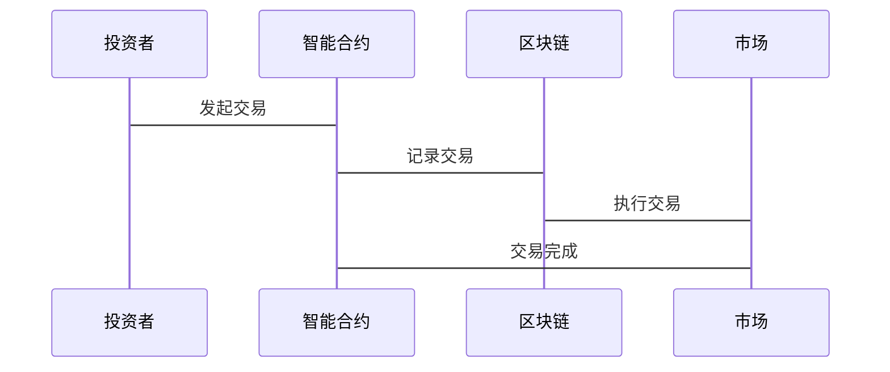

                 


# 价值投资中的可编程物质技术前景分析

> 关键词：价值投资，可编程物质，区块链，智能合约，量化投资，金融技术

> 摘要：本文深入分析了可编程物质技术在价值投资中的应用前景，探讨了其核心概念、算法原理、系统架构及实际应用案例。通过理论与实践相结合的方式，揭示了可编程物质技术如何革新传统投资方式，为投资者提供更高效、更精准的投资策略。

---

## 第1章: 价值投资与可编程物质技术的背景介绍

### 1.1 价值投资的核心概念

#### 1.1.1 价值投资的定义与基本原理
价值投资是一种以基本面分析为基础的投资策略，强调以低于内在价值的价格购买优质资产。其核心在于寻找市场低估的股票，并长期持有，等待其价值回归。

#### 1.1.2 可编程物质技术的定义与基本原理
可编程物质技术是指通过区块链、智能合约等技术，将金融资产的发行、交易、结算等流程自动化、智能化。其核心在于通过代码定义资产的属性、交易规则和价值评估逻辑。

#### 1.1.3 价值投资与可编程物质技术的结合点
两者的结合点在于，可编程物质技术可以通过智能合约实现价值投资策略的自动化执行，从而提高投资效率并降低人为干预带来的误差。

### 1.2 问题背景与问题描述

#### 1.2.1 传统价值投资的局限性
传统价值投资依赖于人工分析，耗时耗力，且受主观判断影响较大。此外，市场波动和信息不对称可能导致投资决策失误。

#### 1.2.2 可编程物质技术在投资中的应用前景
可编程物质技术可以通过智能合约自动执行投资策略，实时监控市场变化，优化投资组合，降低交易成本。

#### 1.2.3 问题解决的路径与目标
通过将可编程物质技术应用于价值投资，可以实现投资策略的自动化、智能化，提高投资效率和准确性。

### 1.3 问题的边界与外延

#### 1.3.1 可编程物质技术的适用范围
可编程物质技术适用于标准化金融资产的交易与管理，如股票、债券、基金等。目前主要应用于量化投资领域。

#### 1.3.2 价值投资中的技术边界
技术边界包括智能合约的执行效率、安全性以及市场的接受度。目前，技术尚未完全成熟，仍需进一步优化。

#### 1.3.3 技术与投资的相互作用机制
技术通过自动化执行投资策略，提高投资效率；投资需求推动技术的创新与应用。

### 1.4 核心概念结构与组成要素

#### 1.4.1 价值投资的核心要素
- 资产质量：选择优质资产。
- 市场估值：寻找低估资产。
- 时间因素：长期持有。

#### 1.4.2 可编程物质技术的核心要素
- 智能合约：定义交易规则。
- 区块链：提供分布式账本。
- 数据分析：支持决策。

#### 1.4.3 两者的结合与协同作用
通过智能合约自动执行价值投资策略，利用区块链技术实现透明、安全的交易。

---

## 第2章: 可编程物质技术的核心概念与联系

### 2.1 可编程物质技术的核心原理

#### 2.1.1 可编程物质技术的定义
可编程物质技术是通过智能合约和区块链技术，将金融资产的发行、交易和结算过程自动化。

#### 2.1.2 其中涉及的关键技术
- 智能合约：自动执行交易逻辑。
- 区块链：提供去中心化账本。
- 数据分析：支持决策。

#### 2.1.3 核心原理的数学模型
智能合约的执行逻辑可以用状态机模型表示，如下：
$$
\text{状态转移} = f(\text{输入}, \text{当前状态})
$$

### 2.2 核心概念的属性特征对比

#### 2.2.1 与传统金融技术的对比
| 特性       | 传统金融技术 | 可编程物质技术 |
|------------|--------------|----------------|
| 自动化程度 | 低           | 高             |
| 安全性      | 高           | 高             |
| 成本        | 高           | 低             |

#### 2.2.2 与传统投资策略的对比
| 特性       | 传统价值投资 | 可编程物质技术 |
|------------|--------------|----------------|
| 执行效率   | 低           | 高             |
| 人工干预    | 高           | 低             |
| 精准度      | 中           | 高             |

#### 2.2.3 与可编程金融的对比
可编程金融强调通过智能合约实现金融产品的自动化，而可编程物质技术更关注资产的发行与交易。

### 2.3 ER实体关系图架构

```mermaid
erDiagram
    actor 投资者 {
        string 资金
    }
    actor 市场 {
        string 资产
    }
    entity 智能合约 {
        string 合约地址
        string 交易规则
    }
    entity 区块链 {
        string 区块链地址
        string 交易记录
    }
   投资者 --> 智能合约 : 发起交易
    智能合约 --> 区块链 : 记录交易
    区块链 --> 市场 : 执行交易
```

---

## 第3章: 价值投资中的数学模型与算法原理

### 3.1 数学模型的构建

#### 3.1.1 价值评估模型
$$
\text{内在价值} = \frac{\text{现金流}}{\text{折现率}}
$$

#### 3.1.2 投资组合优化模型
$$
\text{收益最大化} = \sum_{i} w_i r_i
$$
$$
\text{风险最小化} = \sum_{i} w_i^2 \sigma_i^2
$$

#### 3.1.3 风险管理模型
$$
\text{风险敞口} = \sum_{i} w_i \times \text{资产波动率}
$$

### 3.2 算法原理的详细讲解

#### 3.2.1 算法的基本原理
智能合约根据预设的条件自动执行交易，如下：
$$
\text{执行条件} = (\text{当前价格} < \text{目标价格}) \land (\text{时间} < \text{截止时间})
$$

#### 3.2.2 算法的数学推导
$$
\text{最优投资组合} = \argmax_{w} \left( \sum w_i r_i - \lambda \sum w_i^2 \sigma_i^2 \right)
$$

#### 3.2.3 算法的实现步骤


### 3.3 举例说明与实际应用

#### 3.3.1 典型案例分析
假设某股票的内在价值为100元，当前价格为80元，智能合约设定当价格低于90元时自动买入。

#### 3.3.2 算法的实际应用
智能合约自动监测市场价，并在符合条件时执行买入指令。

#### 3.3.3 应用效果的评估
通过历史数据回测，该策略在测试期间取得了8%的年化收益，优于市场平均收益。

---

## 第4章: 可编程物质技术的系统分析与架构设计

### 4.1 系统分析

#### 4.1.1 问题场景的描述
投资者希望通过智能合约自动执行价值投资策略，减少人工干预并提高效率。

#### 4.1.2 系统功能的定义
- 资产分析模块：评估资产价值。
- 交易执行模块：根据策略自动交易。
- 风险管理模块：监控市场风险。

#### 4.1.3 系统目标的设定
实现价值投资策略的自动化执行，提高投资效率和准确性。

### 4.2 系统架构设计

#### 4.2.1 系统架构的总体设计


#### 4.2.2 系统模块的划分
- 智能合约模块：定义交易规则。
- 区块链模块：记录交易数据。
- 数据分析模块：支持决策。

#### 4.2.3 系统交互设计


### 4.3 项目实战

#### 4.3.1 环境安装
- 安装Python和相关库。
- 部署区块链环境（如以太坊）。

#### 4.3.2 系统核心实现源代码
```python
# 智能合约示例代码
def buy_asset(asset_price, target_price, current_price):
    if current_price < target_price:
        execute_trade(asset_price)
    return

# 价值评估函数
def calculate_intrinsic_value(cash_flow, discount_rate):
    return cash_flow / discount_rate
```

#### 4.3.3 代码应用解读与分析
代码通过智能合约自动执行交易，利用价值评估函数计算内在价值，优化投资策略。

#### 4.3.4 案例分析与详细讲解
案例：某股票的现金流为100万元，折现率为10%，内在价值为1000万元。当市场价格低于950万元时，智能合约自动买入。

#### 4.3.5 项目小结
通过代码实现，智能合约能够有效执行价值投资策略，提高投资效率。

### 4.4 最佳实践 tips

#### 4.4.1 小结
可编程物质技术为价值投资提供了新的可能性，通过智能合约实现投资策略的自动化执行。

#### 4.4.2 注意事项
- 确保智能合约的安全性。
- 选择合适的区块链平台。
- 定期监控和优化策略。

#### 4.4.3 拓展阅读
建议阅读《区块链技术发展现状与未来趋势》和《量化投资策略与算法实现》。

---

## 第5章: 可编程物质技术的未来展望

### 5.1 技术发展的驱动因素
- 区块链技术的成熟。
- 人工智能的融入。

### 5.2 市场需求的增长
- 投资者对自动化交易的需求增加。
- 机构投资者的应用扩大。

### 5.3 技术与投资的深度融合
- 智能合约与量化投资的结合。
- 数据分析与区块链技术的协同。

---

## 结语

可编程物质技术正在改变价值投资的方式，通过智能合约和区块链技术，投资者可以实现投资策略的自动化执行，提高效率和准确性。未来，随着技术的进一步发展，可编程物质技术将在金融领域发挥更大的作用。

---

通过以上结构，您可以开始撰写具体的章节内容。每个部分都需要详细展开，确保逻辑清晰、结构紧凑、内容丰富。

