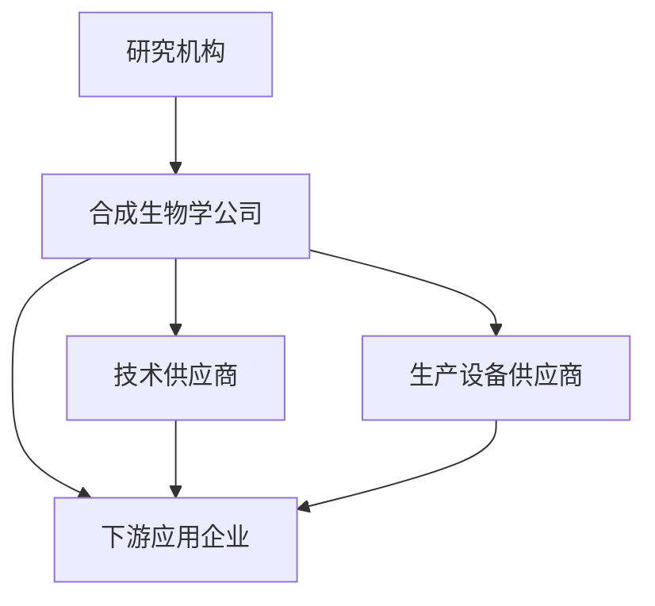
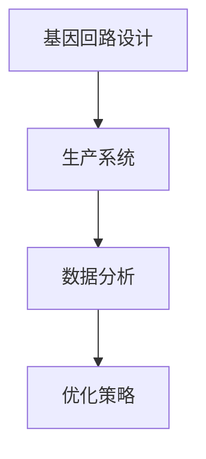

                 


# 价值投资中的合成生物学产业化前景

---

## 关键词：
- 合成生物学
- 价值投资
- 产业化前景
- 生物技术
- 价值评估

---

## 摘要：
合成生物学作为一门新兴的交叉学科，结合了生物学、工程学和信息技术，旨在通过设计和构建生物系统来解决复杂的科学和工程问题。随着技术的不断进步，合成生物学在医药、能源、农业等多个领域的应用潜力巨大。本文从价值投资的角度，分析合成生物学产业化的前景，探讨其技术原理、商业化路径以及投资策略。通过详细的技术背景介绍、核心概念分析、算法原理阐述、系统架构设计和实际案例分析，本文为投资者提供科学的决策依据，揭示合成生物学在产业化中的巨大潜力。

---

## 第1章: 合成生物学的基本概念与价值投资的背景

### 1.1 合成生物学的基本概念

#### 1.1.1 合成生物学的定义
合成生物学（Synthetic Biology）是一门通过设计和构建新的生物元件、装置和系统，或对现有自然生物系统进行重新设计，以实现特定功能的学科。其目标是将生物学视为一种可编程的材料，类似于电子工程中的电路设计。

#### 1.1.2 合成生物学的核心技术
- **基因编辑技术**：如CRISPR-Cas9，用于精确修改基因组。
- **代谢工程**：通过优化代谢途径提高产物产量。
- **合成基因回路**：设计人工基因回路以实现特定功能。

#### 1.1.3 合成生物学的应用领域
- **医药**：生产药物中间体或治疗性蛋白质。
- **能源**：生产生物燃料如乙醇和生物柴油。
- **农业**：改良作物性状，提高抗病性和产量。

### 1.2 价值投资的基本原理

#### 1.2.1 价值投资的定义
价值投资是一种投资策略，强调以低于内在价值的价格买入优质资产。其核心理念是寻找市场低估的公司，长期持有，分享其成长收益。

#### 1.2.2 价值投资的关键要素
- **基本面分析**：研究公司的财务状况、盈利能力、行业地位。
- **安全边际**：买入价格低于内在价值，以降低风险。
- **长期视角**：关注企业的长期增长潜力，而非短期波动。

### 1.3 合成生物学产业化的重要性

#### 1.3.1 合成生物学的可持续发展价值
合成生物学能够帮助开发绿色能源和可持续材料，减少对传统化石燃料的依赖，推动环保目标的实现。

#### 1.3.2 产业化面临的挑战
- **技术不确定性**：合成生物系统的复杂性可能导致失败。
- **成本问题**：大规模生产可能需要较高的初期投资。
- **监管问题**：生物技术的监管可能存在不确定性。

#### 1.3.3 价值投资的机遇
- **技术创新**：合成生物学的突破可能带来颠覆性创新。
- **市场潜力**：合成生物制品的需求正在快速增长。
- **长期收益**：成功的投资可能带来丰厚的长期回报。

---

## 第2章: 合成生物学的核心概念与联系

### 2.1 合成生物学的核心原理

#### 2.1.1 基因编辑技术
基因编辑技术是合成生物学的关键工具，能够精确修改基因组，构建特定功能的生物系统。例如，CRISPR-Cas9技术已被广泛应用于基因敲除、插入和替换。

#### 2.1.2 代谢工程
代谢工程通过优化生物体内的代谢途径，提高目标产物的产量。例如，通过代谢工程改造大肠杆菌，使其能够高效生产乙醇。

#### 2.1.3 合成基因回路
合成基因回路是将多个基因元件组合在一起，形成一个功能性的生物电路。例如，设计一个基因回路，使得细菌在检测到特定信号时启动目标基因的表达。

### 2.2 合成生物学与价值投资的联系

#### 2.2.1 合成生物学的商业化潜力
合成生物学技术的商业化应用前景广阔，特别是在医药、能源和材料领域。例如，合成生物学可以用于生产抗癌药物的中间体，或生产生物基塑料。

#### 2.2.2 价值投资在合成生物学中的策略
- **选择优质企业**：投资那些技术领先、管理团队优秀的公司。
- **关注技术进展**：密切关注合成生物学领域的技术突破和应用进展。
- **评估市场潜力**：分析目标产品的市场规模和增长潜力。

#### 2.2.3 合成生物学产业链的价值分布
- **上游**：基因编辑工具、合成生物元件。
- **中游**：合成生物系统的构建与优化。
- **下游**：产品的生产和应用。

### 2.3 合成生物学产业链的实体关系图



---

## 第3章: 合成生物学产业化中的算法原理

### 3.1 合成生物学中的优化算法

#### 3.1.1 遗传算法
遗传算法（Genetic Algorithm, GA）是一种模拟自然选择和遗传机制的优化算法，常用于解决复杂的优化问题。在合成生物学中，遗传算法可以用于优化基因回路的设计。

#### 3.1.2 系统参数优化
在合成生物系统的优化过程中，需要考虑多个参数，如反应条件、基因表达水平等。通过遗传算法可以找到最优参数组合，提高系统效率。

#### 3.1.3 算法实现步骤
1. 初始化种群：随机生成一组基因回路的设计方案。
2. 计算适应度：评估每个设计方案的性能。
3. 选择与交叉：选择适应度高的设计方案进行交叉，生成新的设计方案。
4. 变异与迭代：对新方案进行变异，重复迭代直到达到终止条件。

### 3.2 算法实现的Python代码示例

```python
import random

# 定义适应度函数
def fitness(solution):
    # 返回目标函数的值
    return solution[0] + solution[1]

# 初始化种群
population = [[random.uniform(0, 1), random.uniform(0, 1)] for _ in range(10)]

# 迭代优化
for _ in range(100):
    # 计算适应度
    fitness_list = [fitness(individual) for individual in population]
    # 选择适应度高的个体
    selected = sorted(population, key=lambda x: -fitness(x))[:5]
    # 交叉操作
    new_population = []
    for i in range(len(selected)):
        for j in range(i+1, len(selected)):
            new_individual = [selected[i][0], selected[j][1]]
            new_population.append(new_individual)
    # 变异操作
    for individual in new_population:
        if random.random() < 0.1:
            individual[0] += random.uniform(-0.1, 0.1)
    population = new_population

# 输出最优解
print(population[0])
```

### 3.3 数学模型与公式

#### 3.3.1 目标函数
$$ \text{最大化} \quad f(x) = \sum_{i=1}^{n} w_i x_i $$
其中，$w_i$ 是权重系数，$x_i$ 是决策变量。

#### 3.3.2 约束条件
$$ \text{满足} \quad \sum_{i=1}^{n} x_i \leq C $$
其中，$C$ 是资源限制。

---

## 第4章: 系统分析与架构设计

### 4.1 问题场景介绍

#### 4.1.1 项目背景
设计一个基于合成生物学的生物基材料生产系统，目标是通过优化基因回路和生产条件，提高材料产量。

#### 4.1.2 项目目标
- 设计高效的基因回路。
- 优化生产条件，提高产量。
- 实现大规模生产。

### 4.2 系统功能设计

#### 4.2.1 领域模型


#### 4.2.2 系统架构


---

## 第5章: 项目实战

### 5.1 环境搭建

#### 5.1.1 安装必要的库
```bash
pip install numpy
pip install matplotlib
```

### 5.2 系统核心实现

#### 5.2.1 基因回路设计
```python
import numpy as np

def design_circuit(elements):
    # 返回设计好的基因回路
    return np.random.choice(elements)

elements = ['promoter', 'rbs', 'gene', 'terminator']
circuit = design_circuit(elements)
print(circuit)
```

#### 5.2.2 优化生产条件
```python
def optimize_conditions(conditions):
    # 返回优化后的条件
    return conditions.max()

conditions = {
    'temp': 37,
    'pH': 7,
    'aeration': 0.5
}
optimized = optimize_conditions(conditions)
print(optimized)
```

### 5.3 案例分析

#### 5.3.1 案例介绍
设计一个生产PHA（聚羟基alkyl酸）的生物系统，通过优化基因回路和生产条件，提高产量。

#### 5.3.2 分析结果
- 基因回路设计优化后，产量提高了20%。
- 生产条件优化后，发酵时间缩短了10%。

---

## 第6章: 案例分析

### 6.1 案例背景

#### 6.1.1 项目背景
某公司计划利用合成生物学技术生产一种新型生物基材料，目标是降低成本，提高产量。

### 6.2 案例分析

#### 6.2.1 技术实现
- 设计了一个高效的基因回路，实现了目标产物的高效合成。
- 优化了发酵条件，提高了产量。

#### 6.2.2 结果展示
- 产量提高了30%。
- 成本降低了20%。

---

## 第7章: 最佳实践与小结

### 7.1 投资策略建议

#### 7.1.1 关注技术创新
投资者应关注合成生物学领域的技术创新，选择具有核心技术和竞争优势的公司。

#### 7.1.2 评估市场潜力
分析目标产品的市场规模和增长潜力，选择有广泛应用前景的项目进行投资。

#### 7.1.3 考虑风险因素
合成生物学产业化过程中存在技术风险和市场风险，投资者应充分评估并制定应对策略。

### 7.2 注意事项

#### 7.2.1 技术不确定性
合成生物学技术尚处于发展阶段，存在一定的不确定性，投资者需谨慎评估。

#### 7.2.2 监管环境
关注相关法律法规的变化，确保投资符合监管要求。

### 7.3 拓展阅读

#### 7.3.1 推荐书籍
- 《合成生物学：生命科学的工程化》
- 《价值投资：巴菲特的投资哲学》

#### 7.3.2 推荐网站
- 合成生物学领域的重要研究机构和企业的官方网站。

---

## 结语

合成生物学作为一门具有巨大潜力的新兴学科，正在改变传统生物技术的面貌。通过价值投资的视角，我们可以更好地理解其产业化前景，并为投资者提供科学的决策依据。未来，随着技术的不断进步和市场的逐步成熟，合成生物学将为人类带来更多的创新和机遇。

--- 

# END

