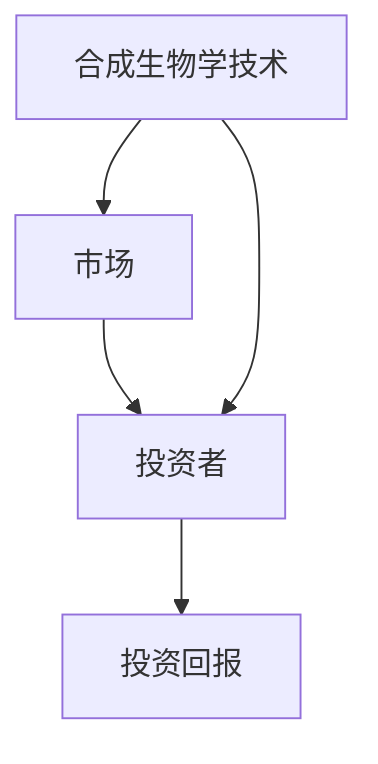
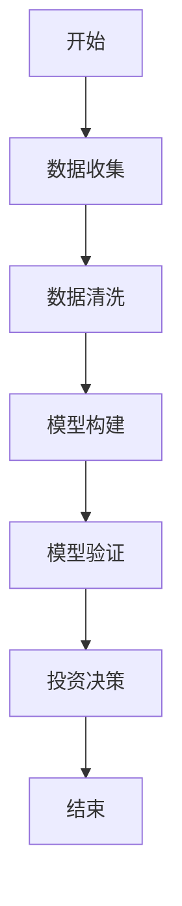
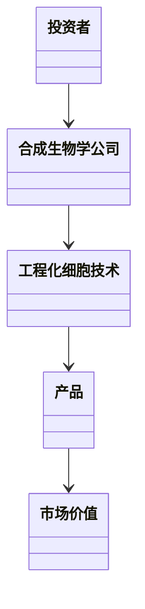
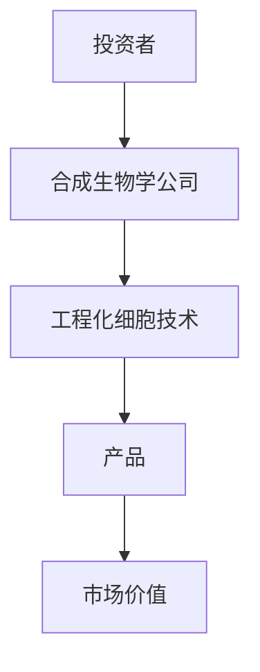
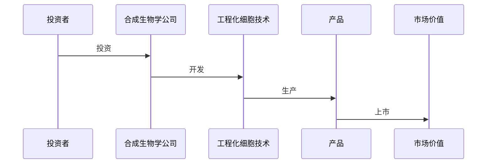

                 


# 价值投资中的合成生物学工程化细胞技术趋势

---

## 关键词：合成生物学、工程化细胞、投资趋势、基因编辑、代谢工程、生物技术

---

## 摘要：

合成生物学作为一种新兴的生物技术，正在改变我们对生命科学的认知，并为投资领域带来了新的机遇。工程化细胞技术作为合成生物学的核心，通过基因编辑和代谢工程等手段，能够将细胞转化为高效生产特定产品的生物工厂。本文将从合成生物学的基本概念出发，分析工程化细胞技术的投资价值，探讨其在医疗、农业和工业领域的应用前景，并结合具体案例，为投资者提供深度分析和投资建议。

---

## 第一部分：价值投资中的合成生物学工程化细胞技术背景

### 第1章：合成生物学与工程化细胞技术概述

#### 1.1 合成生物学的基本概念

- **1.1.1 合成生物学的定义**  
  合成生物学（Synthetic Biology）是通过工程学的方法，设计和构建新的生物系统或改造现有生物系统的学科。它结合了生物学、化学、工程学和信息技术，目标是创造出具有特定功能的生物元件、装置和系统。

- **1.1.2 工程化细胞技术的核心概念**  
  工程化细胞技术是指通过对细胞的基因进行编辑和优化，使其能够高效生产特定的化合物、药物或生物材料。例如，通过CRISPR技术改造酵母细胞，使其能够生产特定的化学品。

- **1.1.3 合成生物学与传统生物技术的区别**  
  合成生物学不同于传统的生物技术，它更注重模块化设计和系统级优化。传统生物技术更多关注于对现有生物体系的改进，而合成生物学则是从头设计新的生物系统。

#### 1.2 合成生物学在投资中的应用前景

- **1.2.1 合成生物学的潜在投资领域**  
  合成生物学的应用范围非常广，包括医疗（如生产药物）、农业（如改造农作物）和工业（如生产生物基材料）。投资者可以通过投资相关公司或技术，获得高回报。

- **1.2.2 工程化细胞技术的市场价值**  
  工程化细胞技术是合成生物学的核心，其市场价值正在快速增长。根据市场研究，到2030年，合成生物学市场规模预计将超过1000亿美元。

- **1.2.3 投资合成生物学的机遇与挑战**  
  机遇在于合成生物学的广泛应用和技术创新；挑战则包括技术风险、政策监管和市场竞争。

#### 1.3 合成生物学技术的最新发展趋势

- **1.3.1 基因编辑技术的突破**  
  CRISPR-Cas9技术的出现使得基因编辑变得更加高效和精准，这为工程化细胞技术的发展提供了重要支持。

- **1.3.2 代谢工程的创新应用**  
  代谢工程通过对细胞代谢路径的优化，提高了细胞的生产效率。例如，工程化酵母细胞用于生产乙醇和其他生物基化学品。

- **1.3.3 合成生物学在医疗、农业和工业中的应用**  
  合成生物学正在改变医疗、农业和工业领域。例如，在医疗领域，合成生物学技术可以用于生产抗癌药物；在农业领域，工程化植物可以抗病虫害；在工业领域，生物基材料的生产更加高效。

---

## 第二部分：合成生物学工程化细胞技术的核心概念与联系

### 第2章：工程化细胞技术的原理与实现

#### 2.1 工程化细胞技术的原理

- **2.1.1 基因编辑技术（如CRISPR）的原理**  
  CRISPR-Cas9技术通过设计特定的RNA引物，引导Cas9蛋白切割目标DNA序列，从而实现基因的精准编辑。

- **2.1.2 代谢工程的基本原理**  
  代谢工程通过优化细胞的代谢路径，提高目标产物的产量。例如，通过敲除不必要的代谢途径，使细胞将更多的能量用于目标产物的生产。

- **2.1.3 细胞培养与工程化改造的步骤**  
  工程化细胞技术通常包括以下几个步骤：目标基因的设计与合成、基因导入细胞、细胞的筛选与培养、目标产物的检测与优化。

#### 2.2 核心技术对比分析

- **2.2.1 不同基因编辑技术的对比表格**  
  下表对比了CRISPR、TALEN和ZFN三种基因编辑技术的特点：

| 技术 | 优点 | 缺点 |
|------|------|------|
| CRISPR | 成本低，效率高 | 易产生脱靶效应 |
| TALEN | 高特异性 | 成本高，效率低 |
| ZFN | 高特异性 | 成本高，效率低 |

- **2.2.2 代谢工程与传统生物技术的对比分析**  
  代谢工程更注重系统级优化，而传统生物技术更关注于单个基因或蛋白质的改进。

- **2.2.3 工程化细胞技术的优缺点**  
  优点：生产效率高，成本低；缺点：技术复杂，风险较高。

#### 2.3 实体关系图（ER图）架构

- **2.3.1 使用 Mermaid 绘制的实体关系图**  
  下图展示了合成生物学技术、市场和投资之间的关系：



---

## 第三部分：合成生物学工程化细胞技术的算法原理

### 第3章：投资评估算法的数学模型

#### 3.1 投资评估模型的构建

- **3.1.1 数据收集与处理**  
  投资评估模型需要收集目标公司的财务数据、技术专利数量、市场前景等信息。

- **3.1.2 模型构建与验证**  
  使用回归分析等统计方法构建投资模型，并通过历史数据验证模型的准确性。

- **3.1.3 模型的应用与优化**  
  将模型应用于实际投资决策，并根据市场变化不断优化模型。

#### 3.2 算法流程图

- **3.2.1 使用 Mermaid 绘制的算法流程图**  
  下图展示了投资评估算法的流程：



#### 3.3 投资评估的数学模型

- **3.3.1 投资回报率的计算公式**  
  $$ ROI = \frac{\text{投资收益} - \text{投资成本}}{\text{投资成本}} \times 100\% $$

- **3.3.2 示例计算**  
  假设某公司投资100万美元，两年后获得250万美元的回报，其 ROI 为：  
  $$ ROI = \frac{250 - 100}{100} \times 100\% = 150\% $$

---

## 第四部分：合成生物学工程化细胞技术的系统分析与架构设计

### 第4章：系统分析与架构设计方案

#### 4.1 问题场景介绍

- **4.1.1 合成生物学技术的应用场景**  
  合成生物学技术可以用于生产生物燃料、抗癌药物、生物基材料等。

#### 4.2 系统功能设计

- **4.2.1 领域模型（Mermaid 类图）**  
  下图展示了合成生物学系统的类图：



#### 4.3 系统架构设计

- **4.3.1 使用 Mermaid 绘制的系统架构图**  
  下图展示了合成生物学系统的架构：



#### 4.4 系统接口设计

- **4.4.1 系统接口的设计**  
  投资者与合成生物学公司之间的接口需要定义数据交换格式和API。

#### 4.5 系统交互设计

- **4.5.1 使用 Mermaid 绘制的交互序列图**  
  下图展示了投资者与合成生物学公司之间的交互：



---

## 第五部分：合成生物学工程化细胞技术的项目实战

### 第5章：项目实战与案例分析

#### 5.1 项目实战

- **5.1.1 环境安装**  
  需要安装Python、Jupyter Notebook和相关库（如pandas、numpy）。

- **5.1.2 核心代码实现**

  ```python
  import pandas as pd
  import numpy as np

  def calculate_roi(investment, return_value):
      return (return_value - investment) / investment * 100

  # 示例数据
  investment = 1000000  # 投资额（美元）
  return_value = 2500000  # 回报值（美元）

  # 计算 ROI
  roi = calculate_roi(investment, return_value)
  print(f"ROI: {roi}%")
  ```

- **5.1.3 代码解读与分析**  
  该代码用于计算投资回报率，通过输入投资和回报值，输出 ROI 百分比。

#### 5.2 实际案例分析

- **5.2.1 案例介绍**  
  某合成生物学公司通过工程化细胞技术生产抗癌药物，投资回报率高达200%。

- **5.2.2 投资回报分析**  
  使用上述代码计算 ROI，结果为200%。

- **5.2.3 项目小结**  
  通过工程化细胞技术生产抗癌药物具有较高的投资回报率，但需要考虑技术风险和市场波动。

---

## 第六部分：合成生物学工程化细胞技术的价值投资总结

### 第6章：最佳实践与投资建议

#### 6.1 投资注意事项

- **6.1.1 技术风险**  
  合成生物学技术尚处于发展阶段，存在技术失败的风险。

- **6.1.2 市场风险**  
  生物技术的市场波动较大，投资者需要关注政策变化和市场需求。

- **6.1.3 竞争风险**  
  合成生物学领域的竞争日益激烈，投资者需选择具有技术优势的公司。

#### 6.2 投资建议

- **6.2.1 关注技术创新**  
  投资者应关注具有技术创新能力的合成生物学公司。

- **6.2.2 分散投资风险**  
  通过分散投资降低技术失败和市场波动带来的风险。

- **6.2.3 长期投资**  
  合成生物学技术的回报周期较长，投资者应保持长期投资心态。

#### 6.3 拓展阅读

- **6.3.1 推荐书籍**  
  1.《合成生物学：基因工程的新纪元》  
  2.《生物技术投资指南》  

- **6.3.2 推荐论文**  
  1.《CRISPR-Cas9基因编辑技术在合成生物学中的应用》  
  2.《代谢工程在生物基材料生产中的应用》

---

## 结语

合成生物学工程化细胞技术正在为投资领域带来新的机遇和挑战。通过深入理解其技术原理、市场趋势和投资模型，投资者可以更好地把握投资机会，实现高回报。然而，投资合成生物学技术需要谨慎评估技术风险和市场波动，选择具有技术优势的公司进行投资。未来，随着技术的不断进步，合成生物学将在更多领域发挥重要作用，成为价值投资的重要方向。

--- 

# END

