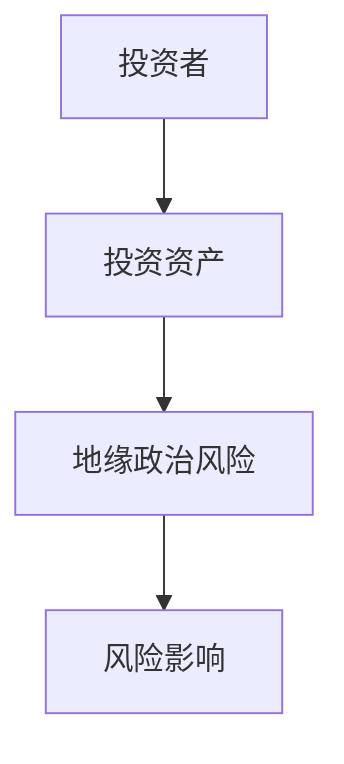
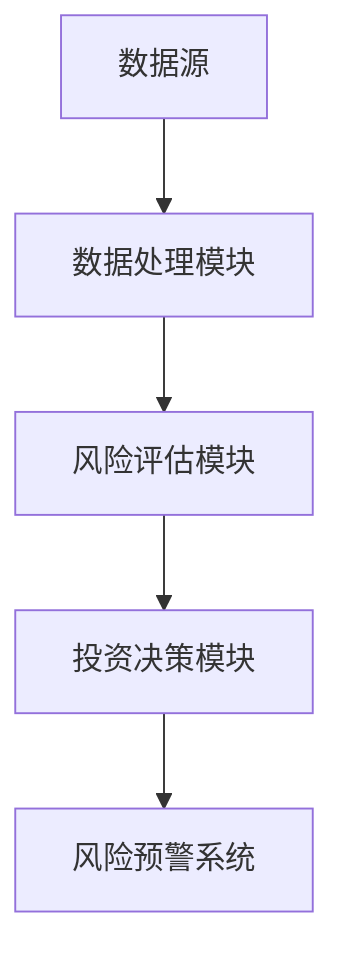

                 

# 《价值投资中的地缘政治风险管理》

---

## 关键词：
- 价值投资
- 地缘政治风险
- 风险管理
- 投资策略
- 风险评估

---

## 摘要：
本文探讨了地缘政治风险对价值投资的影响，并提出了系统化的风险管理框架。通过分析地缘政治风险的来源、评估方法及应对策略，本文为投资者提供了在复杂多变的地缘政治环境中做出明智投资决策的指导。

---

# 第一部分: 价值投资中的地缘政治风险管理基础

## 第1章: 地缘政治风险概述

### 1.1 地缘政治风险的定义与特征
地缘政治风险是指由于地理位置、政治格局、经济关系、文化冲突等因素引起的，可能对国家、企业或个人的经济活动产生负面影响的风险。其主要特征包括复杂性、长期性、不可预测性和广泛性。

### 1.2 价值投资的基本原理
价值投资是一种以低于资产内在价值的价格买入并长期持有的投资策略，强调基本面分析和安全边际。其核心理念是寻找市场误价的资产，并通过长期持有实现价值回归。

### 1.3 价值投资与地缘政治风险的结合
地缘政治风险可能影响企业的经营环境、资产价值和市场流动性，因此在价值投资中必须将其纳入考虑范围，以避免潜在损失并抓住潜在机会。

---

## 第2章: 地缘政治风险对投资的影响

### 2.1 地缘政治风险的来源
- **政治因素**：政府政策、选举、政局不稳等。
- **经济因素**：贸易摩擦、关税变化、经济制裁等。
- **文化与社会因素**：民族主义、社会动荡、文化冲突等。

### 2.2 地缘政治风险对资产价格的影响
- **股票市场**：地缘政治事件可能导致市场波动和个股价值贬损。
- **债券市场**：风险可能通过信用评级和利率变化影响债券价格。
- **外汇市场**：汇率波动可能加剧资产价格的波动。

### 2.3 地缘政治风险的传播机制
- **风险的传导路径**：从直接关联的国家扩散到全球市场。
- **风险的放大效应**：市场恐慌和连锁反应可能加剧风险。
- **风险的交叉影响**：不同地区的地缘政治事件可能相互影响。

---

# 第二部分: 地缘政治风险管理的分析框架

## 第3章: 地缘政治风险的识别与评估

### 3.1 地缘政治风险的识别方法
- **宏观分析法**：通过分析国际政治经济格局识别潜在风险。
- **微观分析法**：评估特定企业和资产的受冲击程度。
- **综合评估法**：结合定量和定性分析方法。

### 3.2 地缘政治风险的评估指标
- **风险概率评估**：分析事件发生的可能性。
- **风险影响程度评估**：量化事件对企业或资产的潜在影响。
- **综合风险指数**：综合考虑多因素构建的风险指标。

### 3.3 地缘政治风险的建模与模拟
- **风险模型的构建**：使用统计模型和情景分析工具。
- **风险模拟的工具与方法**：利用蒙特卡洛模拟和压力测试。
- **风险情景分析**：制定应对不同风险情景的策略。

---

## 第4章: 地缘政治风险管理的核心概念与联系

### 4.1 核心概念原理
- **地缘政治风险的主要驱动因素**：国际关系、经济政策、社会因素。
- **价值投资中的风险管理原则**：安全边际、分散投资、长期持有。
- **风险与收益的平衡点**：在考虑风险的基础上追求合理收益。

### 4.2 概念属性特征对比表格

| 概念 | 风险驱动因素 | 影响程度 | 时间跨度 | 可预测性 |
|------|--------------|----------|----------|----------|
| 地缘政治风险 | 政治、经济、文化 | 高 | 长期 | 低至中等 |

### 4.3 ER实体关系图（Mermaid流程图）

---

# 第三部分: 地缘政治风险管理的系统架构与技术实现

## 第5章: 数据收集与分析

### 5.1 数据来源
- **新闻媒体**：实时监控媒体报道。
- **政府公告**：关注政策变化。
- **市场数据**：分析资产价格波动。

### 5.2 数据分析工具
- **自然语言处理（NLP）**：用于分析文本数据。
- **大数据分析**：处理海量数据以识别潜在风险。

### 5.3 数据流与系统架构

---

## 第6章: 风险评估与预警

### 6.1 风险评估模型
- **数学模型**：使用线性回归、时间序列分析等方法。
- **案例分析**：通过历史数据验证模型的有效性。

### 6.2 风险预警系统
- **实时监控**：及时发现潜在风险。
- **预警触发机制**：设定阈值以提醒投资者。

---

## 第7章: 投资决策与风险管理策略

### 7.1 投资组合优化
- **分散投资**：降低单一资产的风险。
- **资产配置**：根据风险偏好调整资产比例。

### 7.2 对冲策略
- **金融衍生品**：使用期货、期权等工具对冲风险。
- **避险投资**：选择相对稳定的资产类别。

### 7.3 情景分析与压力测试
- **情景分析**：模拟不同风险情景下的投资表现。
- **压力测试**：评估投资组合在极端情况下的表现。

---

# 第四部分: 实战案例与最佳实践

## 第8章: 实战案例分析

### 8.1 案例一：中美贸易摩擦
- **背景**：中美贸易摩擦对全球供应链和市场的影响。
- **分析**：特定行业和企业的受冲击情况。
- **应对策略**：调整投资组合以规避风险。

### 8.2 案例二：俄乌冲突
- **背景**：俄乌冲突对能源市场和全球经济的影响。
- **分析**：能源价格波动对企业盈利和股票价格的影响。
- **应对策略**：动态调整投资策略以应对地缘政治风险。

---

## 第9章: 最佳实践与小结

### 9.1 最佳实践
- **持续关注地缘政治动态**：及时了解国际局势变化。
- **多元化投资**：分散投资以降低风险。
- **定期评估和调整**：根据地缘政治变化及时调整投资策略。

### 9.2 小结
地缘政治风险是价值投资中不可忽视的重要因素。通过建立完善的分析框架、有效的预警系统和灵活的投资策略，投资者可以在复杂多变的地缘政治环境中实现稳健的投资回报。

---

## 第10章: 展望与未来趋势

### 10.1 未来趋势
- **技术驱动的风险管理**：人工智能和大数据技术在地缘政治风险管理中的应用将更加广泛。
- **全球化的挑战与机遇**：地缘政治风险将更加复杂，但也将带来新的投资机会。

### 10.2 结语
地缘政治风险管理不仅是价值投资中的重要环节，更是投资者在复杂环境中实现长期稳健收益的关键。通过不断学习和创新，投资者可以更好地应对地缘政治风险，抓住投资机遇。

--- 

希望这篇文章能为您提供有价值的投资风险管理思路！

