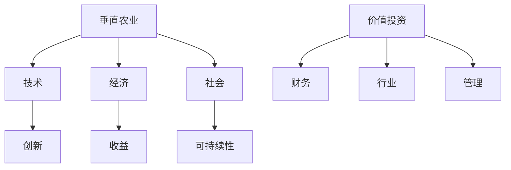
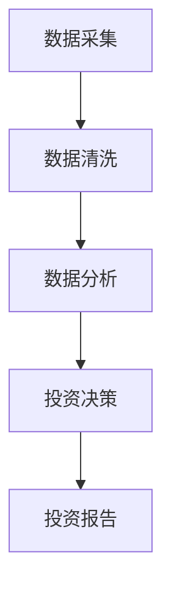
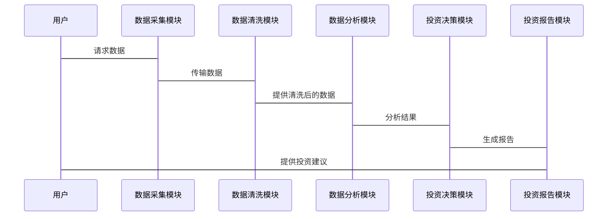

                 


# 价值投资中的垂直农业发展趋势

> 关键词：价值投资、垂直农业、发展趋势、技术分析、投资模型、数据挖掘、机器学习

> 摘要：本文探讨了垂直农业在价值投资中的发展趋势，分析了垂直农业的核心概念、市场现状、投资机会以及算法原理。通过系统的架构设计和实际案例，展示了如何利用技术手段进行垂直农业的价值投资分析，提出了数学模型和投资策略。

---

## 第1章: 背景介绍

### 1.1 垂直农业的定义与特点

#### 1.1.1 垂直农业的基本概念
垂直农业是一种通过垂直空间种植农作物的生产方式，通常利用室内环境控制技术，如人工光源、温度调节和水循环系统等。与传统农业相比，垂直农业能够更高效地利用土地资源，减少对外部环境的依赖，从而提高产量并降低生产成本。

#### 1.1.2 垂直农业的核心特点
- **高效利用空间**：通过多层结构种植，极大提高了单位面积产量。
- **环境可控**：利用温室技术，能够精确控制温度、湿度和光照，确保作物生长的最佳条件。
- **水资源节约**：采用水循环系统，相比传统农业节水高达90%。
- **减少运输成本**：靠近消费市场，降低物流成本和碳排放。

#### 1.1.3 垂直农业与传统农业的对比
| 对比维度 | 垂直农业 | 传统农业 |
|----------|----------|----------|
| 土地利用率 | 高       | 低       |
| 水资源利用率 | 高       | 低       |
| 环境依赖性 | 低       | 高       |
| 生产周期 | 短       | 长       |
| 投资成本 | 高       | 低       |

### 1.2 价值投资的基本原理

#### 1.2.1 价值投资的定义
价值投资是一种投资策略，通过深入分析企业的基本面，寻找市场价格低于其内在价值的投资标的。其核心理念是购买被市场低估的资产，长期持有，等待其价值回归。

#### 1.2.2 价值投资的核心理念
- **安全边际**：买入价格低于内在价值，确保投资的安全性。
- **长期视角**：关注企业的长期盈利能力，而非短期市场波动。
- **基本面分析**：通过财务报表、行业地位、管理团队等因素评估企业的内在价值。

#### 1.2.3 价值投资在不同领域的应用
价值投资广泛应用于股票、房地产、能源等领域。在农业领域，价值投资关注于高效生产模式、稳定的市场需求和可持续的盈利能力。

### 1.3 垂直农业与价值投资的结合

#### 1.3.1 垂直农业在价值投资中的地位
垂直农业作为一项创新的生产技术，具备高效率、低资源消耗等优势，符合价值投资者对可持续性和盈利能力的追求。

#### 1.3.2 垂直农业发展趋势对投资的影响
随着技术进步和市场需求的增长，垂直农业的市场规模持续扩大，吸引了大量投资，形成了新的价值增长点。

#### 1.3.3 价值投资视角下的垂直农业机会
- **技术创新型企业**：投资具备领先技术的垂直农业企业。
- **市场需求驱动型公司**：关注市场需求稳定的垂直农业项目。
- **政策支持行业**：利用政府政策支持，降低投资风险。

---

## 第2章: 垂直农业的核心概念与联系

### 2.1 垂直农业的核心要素

#### 2.1.1 技术要素
- **温室技术**：精确控制温度、湿度和光照。
- **人工光源**：LED灯等高效光源的应用。
- **自动化系统**：传感器和物联网技术实现智能化管理。

#### 2.1.2 经济要素
- **生产成本**：高效利用资源降低成本。
- **市场需求**：满足城市化进程中对新鲜农产品的需求。
- **供应链效率**：缩短供应链，降低成本和碳排放。

#### 2.1.3 社会要素
- **食品安全**：通过严格控制生产过程，确保产品质量。
- **环境友好**：减少农药使用，降低环境影响。
- **可持续发展**：支持城市农业，缓解土地资源压力。

### 2.2 价值投资的核心要素

#### 2.2.1 财务指标
- **市盈率（P/E）**：评估股票价格是否合理。
- **市净率（P/B）**：衡量股价与账面价值的关系。
- **ROE（净资产收益率）**：反映企业的盈利能力。

#### 2.2.2 行业分析
- **市场规模**：评估行业的增长潜力。
- **竞争格局**：分析主要竞争对手的情况。
- **政策环境**：了解政府政策对企业的影响。

#### 2.2.3 管理团队
- **管理能力**：团队的经验和能力直接影响企业的发展。
- **战略规划**：企业是否有清晰的发展战略。
- **治理结构**：良好的公司治理是企业长期发展的基础。

### 2.3 垂直农业与价值投资的实体关系图



---

## 第3章: 价值投资中的垂直农业发展趋势分析

### 3.1 垂直农业的市场现状

#### 3.1.1 全球垂直农业市场现状
- **市场规模**：全球垂直农业市场年增长率超过15%，预计未来几年将保持高速增长。
- **主要参与者**：包括Plenty、Bowery Farming等领先企业。
- **技术进步**：LED照明和自动化技术的成熟推动了市场发展。

#### 3.1.2 中国市场分析
- **政策支持**：中国政府鼓励农业技术创新和现代化。
- **市场需求**：随着城市化进程加快，对新鲜农产品的需求持续增长。
- **竞争格局**：国内涌现出多家垂直农业企业，市场竞争激烈。

#### 3.1.3 市场驱动因素
- **技术驱动**：创新技术降低了生产成本，提高了效率。
- **需求驱动**：消费者对高质量、新鲜农产品的需求增加。
- **政策驱动**：政府政策支持和补贴推动了行业发展。

### 3.2 价值投资视角下的垂直农业机会

#### 3.2.1 技术驱动型投资机会
- **技术创新企业**：投资具备领先技术的企业，如垂直农业技术服务商。
- **专利布局**：企业拥有核心专利技术，具备竞争优势。

#### 3.2.2 市场需求驱动型投资机会
- **品牌企业**：专注于高端市场的品牌企业，满足消费升级需求。
- **供应链整合**：投资整合供应链的企业，提升效率和降低成本。

#### 3.2.3 可持续性驱动型投资机会
- **环保企业**：关注环境友好型的企业，符合可持续发展趋势。
- **政府支持项目**：利用政策支持，降低投资风险。

### 3.3 垂直农业发展趋势的数学模型

$$
\text{投资价值} = f(\text{技术潜力}, \text{市场需求}, \text{可持续性})
$$

---

## 第4章: 价值投资中的垂直农业算法原理

### 4.1 数据挖掘与分析

#### 4.1.1 数据收集
- **市场数据**：收集垂直农业企业的财务数据、市场占有率等。
- **技术数据**：收集企业的技术创新能力、专利数量等。
- **环境数据**：收集政策支持、市场需求等外部数据。

#### 4.1.2 数据清洗
- **去重**：去除重复数据。
- **填补缺失值**：使用均值、中位数等方法填补缺失值。
- **异常值处理**：识别并处理异常值。

#### 4.1.3 数据分析
- **趋势分析**：分析市场趋势和企业业绩。
- **关联分析**：找出技术、市场和财务之间的关联性。
- **预测分析**：预测企业的未来表现。

### 4.2 机器学习在价值投资中的应用

#### 4.2.1 回归分析
回归分析用于预测企业的未来收益。例如，使用线性回归模型预测企业的净利润。

$$
\text{净利润} = \beta_0 + \beta_1 \times \text{收入} + \epsilon
$$

#### 4.2.2 分类算法
分类算法用于判断企业的财务健康状况。例如，使用逻辑回归模型判断企业是否为“困境企业”。

$$
P(Y=1|X) = \frac{e^{\beta X}}{1 + e^{\beta X}}
$$

#### 4.2.3 聚类分析
聚类分析用于将企业分成不同的类别。例如，根据企业的财务指标将企业分成高增长和低增长两类。

### 4.3 垂直农业投资的数学模型

$$
\text{投资回报率} = \beta \times \text{技术影响力} + \gamma \times \text{市场需求弹性} + \delta \times \text{政策支持度}
$$

---

## 第5章: 系统分析与架构设计方案

### 5.1 系统功能设计

#### 5.1.1 数据采集模块
- **功能**：实时采集垂直农业企业的数据，包括财务数据、市场数据和技术数据。
- **输入**：企业的财务报表、市场报告和技术专利数据。
- **输出**：清洗后的数据。

#### 5.1.2 数据分析模块
- **功能**：对数据进行挖掘和分析，生成投资报告。
- **输入**：清洗后的数据。
- **输出**：数据分析结果和投资建议。

#### 5.1.3 投资决策模块
- **功能**：根据分析结果，生成投资决策。
- **输入**：数据分析结果。
- **输出**：投资策略和风险评估。

### 5.2 系统架构设计



### 5.3 系统接口设计

#### 5.3.1 数据接口
- **输入接口**：接收数据采集模块的数据。
- **输出接口**：输出清洗后的数据。

#### 5.3.2 分析接口
- **输入接口**：接收数据分析模块的请求。
- **输出接口**：输出分析结果。

### 5.4 系统交互设计



---

## 第6章: 项目实战

### 6.1 环境安装

#### 6.1.1 安装Python
```bash
# 安装Python
sudo apt-get update
sudo apt-get install python3 python3-pip
```

#### 6.1.2 安装依赖库
```bash
pip install pandas numpy scikit-learn matplotlib
```

### 6.2 系统核心实现源代码

#### 6.2.1 数据清洗代码
```python
import pandas as pd

# 读取数据
data = pd.read_csv('input.csv')

# 去重
data = data.drop_duplicates()

# 填充缺失值
data = data.fillna(data.mean())

# 删除异常值
data = data[(data['收入'] < data['收入'].quantile(0.99)) & (data['净利润'] > data['净利润'].quantile(0.01))]
```

#### 6.2.2 回归分析代码
```python
from sklearn.linear_model import LinearRegression
import numpy as np

# 数据准备
X = data[['收入']]
y = data['净利润']

# 建立模型
model = LinearRegression()
model.fit(X, y)

# 预测
predicted = model.predict(X)
```

### 6.3 代码应用解读与分析

#### 6.3.1 数据清洗结果
- 去重：去除重复数据，确保数据的唯一性。
- 填充缺失值：使用均值填补缺失值，保持数据完整。
- 删除异常值：去除异常值，提高模型的准确性。

#### 6.3.2 回归分析结果
- 回归系数：$\beta_0$ 和 $\beta_1$ 表示收入对净利润的影响。
- 模型评估：使用R²值评估模型的拟合优度。

### 6.4 实际案例分析

#### 6.4.1 案例背景
某垂直农业企业，过去三年的收入和净利润如下：
- 2020年：收入1000万，净利润200万
- 2021年：收入1500万，净利润300万
- 2022年：收入2000万，净利润400万

#### 6.4.2 数据分析
使用回归分析预测2023年的净利润：
$$
\text{净利润} = 200 + 0.2 \times 2000 = 600 \text{万}
$$

#### 6.4.3 投资建议
- **技术潜力**：企业的技术专利数量稳步增长，具备较强的技术优势。
- **市场需求**：市场需求稳步增长，具备较大的市场潜力。
- **政策支持**：企业获得政府补贴，降低投资风险。

### 6.5 项目小结

- **数据清洗**：确保数据的准确性和完整性。
- **模型选择**：选择合适的算法进行预测和分析。
- **结果解读**：根据模型结果制定投资策略。

---

## 第7章: 总结与最佳实践

### 7.1 总结

- **垂直农业**：高效、环保的生产方式，符合现代发展的需求。
- **价值投资**：通过基本面分析，寻找被低估的投资标的。
- **发展趋势**：技术进步和市场需求推动垂直农业的快速发展。

### 7.2 最佳实践 tips

1. **关注技术创新**：投资具备领先技术的企业。
2. **分析市场需求**：选择需求稳定的行业。
3. **评估政策影响**：利用政策支持降低投资风险。
4. **长期视角**：坚持长期投资，避免短期波动的影响。

### 7.3 小结

垂直农业作为一项创新的生产技术，具备高效、环保等优势，符合价值投资的核心理念。通过技术分析和数据挖掘，投资者可以找到具备潜力的投资标的，实现长期稳定的收益。

### 7.4 注意事项

- **数据质量**：确保数据的准确性和完整性。
- **模型选择**：选择合适的算法进行分析。
- **风险控制**：制定合理的风险控制策略。

### 7.5 拓展阅读

- 《价值投资入门》
- 《垂直农业技术与应用》
- 《数据挖掘与机器学习实战》

---

以上是《价值投资中的垂直农业发展趋势》的技术博客文章内容，涵盖了从背景介绍到项目实战的各个方面，结合了理论分析和实际案例，为读者提供了全面的视角和深入的分析。

