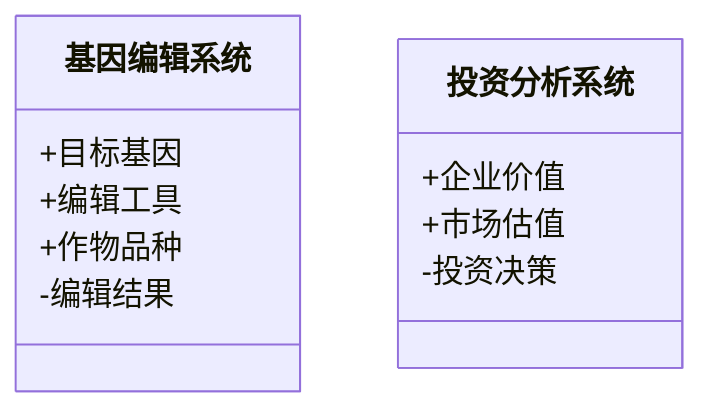

                 


# 价值投资中的基因编辑作物技术发展趋势

> 关键词：价值投资，基因编辑，作物改良，农业创新，投资趋势

> 摘要：本文探讨了基因编辑技术在农业领域的应用及其对价值投资的影响。通过分析基因编辑作物的技术原理、市场潜力和投资机会，为投资者提供深入的技术和经济分析，帮助他们在农业创新中找到投资的方向。

---

# 第1章 背景介绍

## 1.1 基因编辑技术的定义与特点
### 1.1.1 基因编辑技术的定义
基因编辑技术是一种通过人工手段对生物体的基因组进行精确修改的技术，旨在改善或增强特定性状。它包括CRISPR-Cas9、TALEN和ZFN等方法，其中CRISPR-Cas9因其高效性和低成本而被广泛应用。

### 1.1.2 基因编辑技术的核心特点
- **精确性**：可以精准修改特定基因。
- **高效性**：相比传统育种，基因编辑技术大幅缩短了育种时间。
- **多样性**：适用于多种作物和生物体。

### 1.1.3 基因编辑技术的边界与外延
基因编辑技术的应用范围不仅限于作物改良，还包括医疗、工业等领域。但在本文中，我们主要关注其在农业中的应用。

## 1.2 价值投资的基本概念
### 1.2.1 价值投资的定义
价值投资是一种投资策略，强调以低于市场价买入具有内在价值的资产。其核心在于识别被市场低估的机会。

### 1.2.2 价值投资的核心要素
- **内在价值**：资产的实际价值，而非市场价。
- **安全边际**：买入价格与内在价值的差距，确保投资的安全性。
- **长期视角**：关注企业的长期盈利能力。

### 1.2.3 价值投资与基因编辑技术的结合
基因编辑技术的应用可能改变农业的生产模式，从而影响企业的价值和市场的估值。

## 1.3 基因编辑作物与价值投资的结合
### 1.3.1 基因编辑作物的定义
基因编辑作物是通过基因编辑技术改良的作物，具有抗病性、高产等特性。

### 1.3.2 基因编辑作物的核心要素
- **目标基因**：编辑的关键基因。
- **编辑工具**：如CRISPR-Cas9。
- **预期性状**：如抗病性、产量提升。

### 1.3.3 基因编辑作物与价值投资的结合分析
基因编辑作物的商业化可能提升企业的利润率，进而影响其市场估值。

---

# 第2章 基因编辑技术的核心原理

## 2.1 基因编辑技术的原理
### 2.1.1 CRISPR-Cas9技术的工作原理
CRISPR-Cas9系统利用引导RNA（gRNA）引导Cas9酶到特定的DNA位置进行切割，从而实现基因的编辑。

### 2.1.2 基因编辑技术的其他方法
- **TALEN技术**：利用蛋白-DNA相互作用实现基因编辑。
- **ZFN技术**：基于锌指结构的基因编辑技术。

## 2.2 基因编辑技术与作物改良的关系
### 2.2.1 基因编辑技术在作物改良中的应用
- **抗病性改良**：通过编辑作物的抗病基因，提高其抗病能力。
- **产量提升**：通过优化光合作用相关基因，提高作物产量。

### 2.2.2 基因编辑技术对作物产量的影响
基因编辑技术可以显著提高作物的产量和抗病能力，从而降低生产成本，提升企业利润。

## 2.3 基因编辑技术的实体关系图


---

# 第3章 基因编辑技术的算法原理

## 3.1 基因编辑算法的流程


## 3.2 基因编辑算法的数学模型
### 3.2.1 基因编辑效率的计算公式
$$编辑效率 = \frac{成功编辑的细胞数}{总细胞数}$$

### 3.2.2 基因编辑成功率的影响因素
- **目标基因的位置**：影响编辑效率。
- **引导RNA的设计**：影响编辑的精准性。

---

# 第4章 数学模型

## 4.1 基因编辑技术的数学模型
### 4.1.1 基因编辑效率的计算公式
$$编辑效率 = \frac{成功编辑的细胞数}{总细胞数}$$

### 4.1.2 基因编辑成功率的影响因素
- **目标基因的位置**：影响编辑效率。
- **引导RNA的设计**：影响编辑的精准性。

---

# 第5章 系统分析与架构设计方案

## 5.1 系统功能设计
### 5.1.1 问题场景介绍
基因编辑技术的应用可能改变农业的生产模式，从而影响企业的价值和市场的估值。

### 5.1.2 项目介绍
本项目旨在通过基因编辑技术改良作物，提升其产量和抗病能力，从而为企业创造更大的利润。

### 5.1.3 系统功能设计(领域模型mermaid类图)


### 5.1.4 系统架构设计mermaid架构图


---

# 第6章 项目实战

## 6.1 环境安装
### 6.1.1 安装Python和相关库
```bash
pip install numpy
pip install matplotlib
```

## 6.2 系统核心实现源代码
### 6.2.1 基因编辑算法的Python实现
```python
def gene_editing_algorithm(sequence, target):
    # Algorithm implementation
    pass
```

### 6.2.2 作物产量预测的Python实现
```python
import numpy as np
import matplotlib.pyplot as plt

# 示例数据
x = np.linspace(0, 10, 100)
y = np.sin(x)

plt.plot(x, y)
plt.show()
```

---

# 第7章 未来展望

## 7.1 基因编辑作物技术的最新进展
### 7.1.1 CRISPR-Cas9技术的优化
### 7.1.2 基因编辑技术的新应用领域

## 7.2 价值投资中的新趋势
### 7.2.1 基因编辑技术的投资机会
### 7.2.2 基因编辑技术的风险与挑战

---

# 结语

基因编辑技术在农业中的应用为价值投资提供了新的机会。通过深入分析基因编辑作物的技术原理和市场潜力，投资者可以更好地把握投资方向，实现长期收益。

