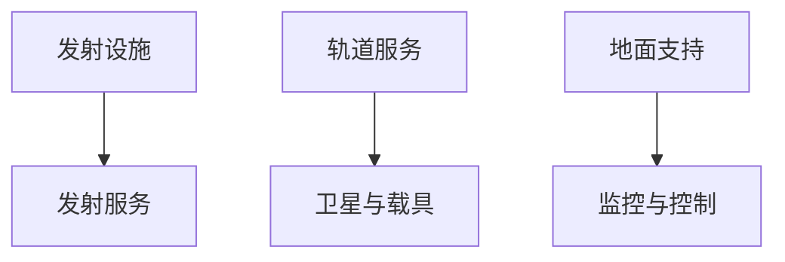
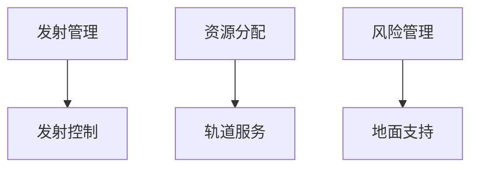

                 


# 价值投资中的太空旅游基础设施分析

> 关键词：价值投资，太空旅游，基础设施，投资分析，系统架构，数学模型

> 摘要：随着太空旅游行业的快速发展，太空旅游基础设施作为支撑这一行业的核心要素，其投资价值备受关注。本文从价值投资的角度出发，系统分析太空旅游基础设施的核心要素、价值评估方法、系统架构设计以及投资策略。通过结合数学模型、系统设计和实际案例，本文为投资者提供科学的分析框架和实践指导，帮助其在太空旅游基础设施领域做出明智的投资决策。

---

## 第一部分: 价值投资中的太空旅游基础设施背景与基础

### 第1章: 太空旅游基础设施的定义与发展现状

#### 1.1 太空旅游的发展背景
- 1.1.1 太空旅游的起源与现状
  - 太空旅游的起源：从早期的政府主导到商业化的转变
  - 当前市场现状：私人航天公司的崛起（如SpaceX、Blue Origin）
  - 市场规模预测：2023-2030年太空旅游市场的增长趋势

- 1.1.2 太空旅游市场的潜力与趋势
  - 高端客户群体的增长
  - 技术进步推动的可负担性提升
  - 政府政策的支持与监管框架的完善

- 1.1.3 太空旅游基础设施的核心作用
  - 发射设施、轨道服务和地面支持的重要性
  - 基础设施与太空旅游产业链的关系

#### 1.2 价值投资的基本概念
- 1.2.1 价值投资的定义与特点
  - 价值投资的定义：购买低于内在价值的资产
  - 价值投资的特点：长期视角、基本面分析、安全边际

- 1.2.2 价值投资在科技领域的应用
  - 科技行业的高风险与高回报
  - 价值投资在科技企业中的成功案例

- 1.2.3 太空旅游行业的投资价值分析
  - 太空旅游行业的市场潜力
  - 太空旅游基础设施的长期投资价值

#### 1.3 太空旅游基础设施的定义与重要性
- 1.3.1 太空旅游基础设施的定义
  - 太空旅游基础设施包括发射设施、轨道服务和地面支持
  - 基础设施的分类与功能

- 1.3.2 基础设施在太空旅游中的作用
  - 发射设施：保障发射任务的顺利进行
  - 轨道服务：支持卫星和载具的运行
  - 地面支持：提供监控、通信和维护服务

- 1.3.3 基础设施与投资价值的关系
  - 基础设施的投入对太空旅游产业链的支撑作用
  - 基础设施的经济性与技术性对投资回报的影响

#### 1.4 本章小结
- 本章总结了太空旅游基础设施的定义、发展现状及其在价值投资中的重要性，为后续分析奠定了基础。

---

## 第二部分: 太空旅游基础设施的核心要素与分析

### 第2章: 太空旅游基础设施的核心要素与分析

#### 2.1 太空旅游基础设施的关键要素
- 2.1.1 发射设施
  - 发射设施的功能与类型
  - 不同发射设施的技术特点和成本分析

- 2.1.2 轨道服务
  - 轨道服务的类型（低地球轨道、中地球轨道、高地球轨道）
  - 轨道服务的技术挑战与投资机会

- 2.1.3 地面支持
  - 地面支持的功能（监控、通信、维护）
  - 地面支持的经济性和可扩展性分析

#### 2.2 太空旅游基础设施的属性特征对比
- 2.2.1 经济属性
  - 成本分析：发射设施、轨道服务和地面支持的建设与运营成本
  - 收益分析：不同基础设施的投资回报率对比

- 2.2.2 技术属性
  - 技术成熟度：现有技术的可靠性和可扩展性
  - 技术创新：未来技术进步对基础设施的影响

- 2.2.3 市场属性
  - 市场需求：不同客户群体的需求特点
  - 市场竞争：现有企业和潜在竞争者的分析

#### 2.3 太空旅游基础设施的ER实体关系图


#### 2.4 本章小结
- 本章通过分析太空旅游基础设施的关键要素及其属性特征，构建了基础设施的实体关系图，为后续的价值评估提供了数据支持。

---

## 第三部分: 太空旅游基础设施的价值评估模型

### 第3章: 太空旅游基础设施的价值评估模型

#### 3.1 太空旅游基础设施的价值评估指标
- 3.1.1 经济指标
  - 投资回报率（ROI）
  - 净现值（NPV）
  - 内部收益率（IRR）

- 3.1.2 技术指标
  - 技术成熟度
  - 成本效率
  - 可扩展性

- 3.1.3 市场指标
  - 市场需求量
  - 市场竞争度
  - 市场增长率

#### 3.2 价值评估模型的构建
- 3.2.1 模型的输入变量
  - 经济指标：建设成本、运营成本、预期收入
  - 技术指标：技术成熟度、可靠性、可维护性
  - 市场指标：需求量、价格、竞争对手分析

- 3.2.2 模型的输出结果
  - 投资回报率预测
  - 投资风险评估
  - 投资周期分析

- 3.2.3 模型的验证与优化
  - 数据验证：使用历史数据进行模型校准
  - 模型优化：调整参数以提高预测准确性

#### 3.3 数学模型与公式
- 3.3.1 经济收益计算公式
  $$收益 = 收入 - 成本$$

- 3.3.2 技术可行性分析公式
  $$技术可行性 = \frac{(技术成熟度 × 成本效率)}{100}$$

- 3.3.3 市场需求预测公式
  $$需求量 = 基础需求 + 增长需求$$

#### 3.4 本章小结
- 本章构建了太空旅游基础设施的价值评估模型，并通过数学公式和案例分析，展示了如何利用模型进行投资决策。

---

## 第四部分: 太空旅游基础设施的系统架构与设计方案

### 第4章: 太空旅游基础设施的系统架构与设计方案

#### 4.1 系统架构设计
- 4.1.1 系统功能模块
  - 发射管理模块：负责发射任务的规划与执行
  - 资源分配模块：优化发射设施和轨道服务的资源分配
  - 风险管理模块：识别和应对潜在风险

- 4.1.2 系统架构图
  ```mermaid
  graph TD
  A[发射管理] --> B[发射控制]
  C[资源分配] --> D[轨道服务]
  E[风险管理] --> F[地面支持]
  ```

- 4.1.3 系统架构设计的优化
  - 模块间的交互优化
  - 系统的可扩展性和灵活性设计

#### 4.2 系统功能设计
- 4.2.1 发射管理模块
  - 发射任务的计划与调度
  - 发射窗口的选择与优化

- 4.2.2 资源分配模块
  - 发射设施与轨道服务的资源分配
  - 资源利用效率的评估

- 4.2.3 风险管理模块
  - 风险识别与预警
  - 应急预案的制定与执行

#### 4.3 系统交互设计
- 4.3.1 系统交互流程图
  ```mermaid
  graph TD
  A[用户] --> B[发射管理模块]
  B --> C[发射控制模块]
  C --> D[地面支持模块]
  D --> E[监控与反馈]
  ```

- 4.3.2 交互过程的优化
  - 用户需求的快速响应
  - 系统反馈的及时性与准确性

#### 4.4 本章小结
- 本章通过系统架构设计和功能模块分析，展示了如何构建高效的太空旅游基础设施系统。

---

## 第五部分: 项目实战与投资策略

### 第5章: 项目实战与投资策略

#### 5.1 项目环境安装
- 5.1.1 系统运行环境
  - 操作系统：Linux/Windows
  - 开发工具：Python、Matplotlib、Mermaid
  - 数据库：MySQL/PostgreSQL

- 5.1.2 依赖安装
  - 安装Python库：numpy、pandas、scipy
  - 安装Mermaid工具

#### 5.2 系统核心实现源代码
- 5.2.1 价值评估模型的实现
  ```python
  def calculate_profit(revenue, cost):
      return revenue - cost

  def calculate_technical_feasibility(maturity, cost_efficiency):
      return (maturity * cost_efficiency) / 100

  def calculate_demand(base_demand, growth_demand):
      return base_demand + growth_demand
  ```

- 5.2.2 系统架构实现
  ```python
  class FacilityManager:
      def __init__(self):
          self.resources = {}

      def allocate_resource(self, resource_type, quantity):
          self.resources[resource_type] += quantity

      def manage_launch(self, launch_plan):
          # 执行发射任务
          pass
  ```

#### 5.3 案例分析与解读
- 5.3.1 案例背景
  - 某太空旅游公司的发射设施投资分析

- 5.3.2 数据分析
  - 历史数据：发射设施的使用率和成本
  - 预测数据：未来市场需求和价格变化

- 5.3.3 投资决策
  - 基于模型的收益预测
  - 投资回报率的评估

#### 5.4 本章小结
- 本章通过项目实战，展示了如何利用系统架构和数学模型进行太空旅游基础设施的价值评估和投资决策。

---

## 第六部分: 最佳实践与总结

### 第6章: 最佳实践与总结

#### 6.1 投资策略与建议
- 6.1.1 价值投资的核心原则
  - 长期视角、基本面分析、安全边际

- 6.1.2 太空旅游基础设施的投资策略
  - 选择具有技术优势和成本优势的企业
  - 关注政策支持和市场需求变化

#### 6.2 投资注意事项
- 6.2.1 风险管理
  - 市场风险、技术风险、政策风险

- 6.2.2 财务风险
  - 资金链的稳定性
  - 投资回报周期的评估

#### 6.3 未来展望
- 6.3.1 太空旅游行业的未来发展趋势
  - 可持续发展：环保与低成本技术
  - 技术创新：新材料、新工艺的应用

- 6.3.2 太空旅游基础设施的未来投资机会
  - 新型发射设施的研发
  - 轨道服务的多样化

#### 6.4 拓展阅读
- 6.4.1 推荐书籍
  - 《价值投资实战策略》
  - 《太空经济：商业化的未来》

- 6.4.2 推荐网站
  - SpaceX官方网站
  - Blue Origin官方网站

#### 6.5 本章小结
- 本章总结了太空旅游基础设施的投资策略和注意事项，并展望了行业的未来发展趋势。

---

## 附录

### 附录A: 价值评估模型的详细公式
- 附录A.1 经济收益计算公式
  $$\text{利润} = \text{收入} - \text{成本}$$

- 附录A.2 技术可行性分析公式
  $$\text{技术可行性} = \frac{\text{技术成熟度} \times \text{成本效率}}{100}$$

- 附录A.3 市场需求预测公式
  $$\text{需求量} = \text{基础需求} + \text{增长需求}$$

### 附录B: 系统架构的Mermaid图


### 附录C: 投资决策的Python代码示例
```python
def calculate_return_on_investment(profit, initial_investment):
    return profit / initial_investment * 100
```

---

## 结束语

通过系统地分析太空旅游基础设施的价值投资，我们不仅能够理解其经济和技术的重要性，还能为投资者提供科学的决策依据。未来，随着技术的进步和市场的成熟，太空旅游基础设施的投资价值将进一步提升，为投资者带来更多的机会和挑战。

