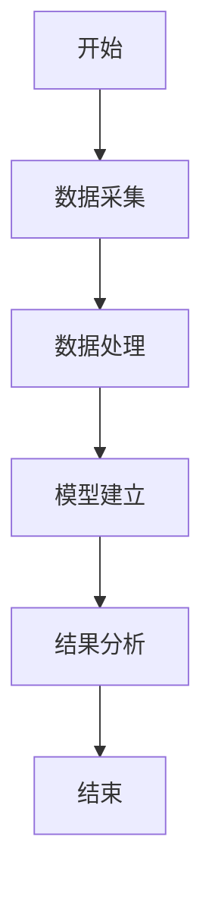
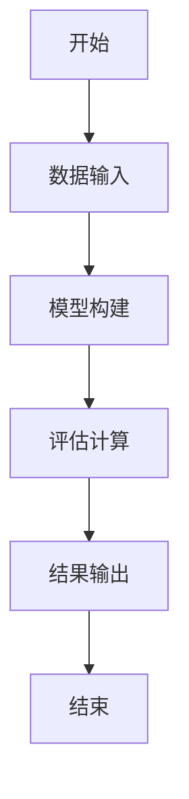
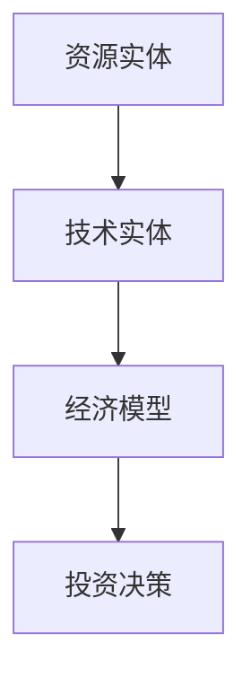
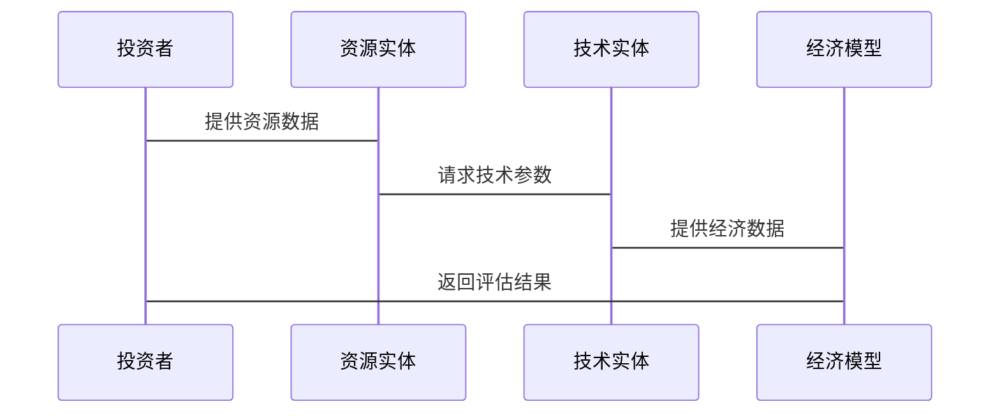

                 


---

# 价值投资中的太空资源原位利用技术前景

> **关键词**: 价值投资，太空资源，原位利用技术，资源评估，经济模型，投资回报率

> **摘要**: 本文探讨了太空资源原位利用技术的经济价值及其在价值投资中的应用前景。通过分析资源评估算法、经济模型和系统架构设计，本文揭示了如何将太空资源开发与投资策略相结合，为投资者提供科学依据。文章还通过具体案例展示了技术的实际应用，并提出了投资建议和注意事项。

---

## 第1章: 太空资源原位利用技术的背景与现状

### 1.1 太空资源的定义与分类

#### 1.1.1 太空资源的定义
太空资源指的是存在于地球以外的宇宙空间中的各种资源，包括但不限于月球、火星、小行星等天体上的矿物、水冰、稀有金属等。这些资源具有开发潜力，但其开发需要克服极端环境和技术挑战。

#### 1.1.2 太空资源的主要分类
太空资源可以分为以下几类：
- **矿物资源**：如钛、铝、铁等金属和氧化物。
- **水冰资源**：存在于月球极地和小行星中，可作为水和氧气的来源。
- **能源资源**：太阳能和核能资源。
- **空间资源**：轨道空间和频谱资源。

#### 1.1.3 太空资源开发的历史与现状
人类对太空资源的探索始于20世纪60年代的登月计划。近年来，随着技术的进步，太空资源开发逐渐从科学探索转向商业应用。例如，SpaceX和Blue Origin等公司正在研究如何在月球和火星上建立基地。

### 1.2 价值投资的基本概念与原则

#### 1.2.1 价值投资的核心理念
价值投资是一种长期投资策略，强调以低于内在价值的价格买入优质资产。其核心理念是寻找市场低估的资产，并长期持有。

#### 1.2.2 价值投资的三大原则
1. **安全边际**：买入价格低于内在价值，以降低风险。
2. **长期视角**：关注企业的长期盈利能力。
3. **基本面分析**：通过财务数据和行业分析评估企业的价值。

#### 1.2.3 价值投资在科技领域的应用
科技领域的价值投资需要关注技术创新、市场潜力和商业模式。太空资源开发作为一项高技术门槛的事业，符合价值投资的核心理念。

### 1.3 太空资源原位利用技术与价值投资的结合

#### 1.3.1 太空资源开发的经济价值
太空资源的开发具有巨大的经济潜力，尤其是水冰资源和矿物资源的利用，可以支持深空探测任务并降低太空探索的成本。

#### 1.3.2 原位利用技术的商业潜力
原位利用技术可以直接利用太空资源，减少对地球资源的依赖，降低成本并提高效率。例如，利用月球上的水冰资源生产氧气和火箭燃料。

#### 1.3.3 价值投资在太空资源开发中的作用
价值投资者可以通过投资相关技术和企业，分享太空资源开发的经济收益。同时，技术的进步也会推动资源评估和经济模型的优化。

### 1.4 本章小结
本章介绍了太空资源的定义、分类及其开发现状，分析了价值投资的基本概念和原则，并探讨了两者结合的潜力和意义。

---

## 第2章: 太空资源原位利用技术的核心概念与联系

### 2.1 太空资源原位利用技术的原理

#### 2.1.1 原位资源利用的基本原理
原位资源利用技术是指直接利用目标天体上的资源，无需将资源带回地球。例如，利用月球上的水冰生产氧气和火箭燃料。

#### 2.1.2 太空环境对技术的影响
太空环境的极端温度、辐射和真空条件对技术提出了更高的要求。例如，设备需要耐高温、抗辐射，并能在真空环境下正常工作。

#### 2.1.3 原位利用技术的关键要素
- **资源提取技术**：如钻探、开采和提取。
- **资源处理技术**：如化学分离和物理加工。
- **能源供应技术**：如太阳能电池和核能发电。

### 2.2 核心概念对比分析

#### 2.2.1 不同资源利用技术的对比
| 技术类型          | 优点                          | 缺点                          |
|-------------------|-------------------------------|-------------------------------|
| 原位利用技术      | 成本低，资源可用性强            | 技术复杂，风险较高             |
| 远程运输技术      | 资源可以直接利用                | 成本高，资源有限                |

#### 2.2.2 原位利用技术的优劣势分析
- **优势**：降低运输成本，减少对地球资源的依赖。
- **劣势**：技术复杂，开发周期长，初期投资大。

#### 2.2.3 技术与经济的平衡点
在技术可行性和经济回报之间找到平衡点是关键。例如，选择适合当地条件的技术方案，优化资源配置，降低开发成本。

### 2.3 系统架构与ER实体关系图

#### 2.3.1 系统架构的层次划分
- **数据层**：资源数据的采集和存储。
- **逻辑层**：资源评估和经济模型的计算。
- **应用层**：投资决策和优化。

#### 2.3.2 ER实体关系图的构建
```mermaid
er
    actor 投资者
    actor 开发商
    actor 评估机构
    entity 资源
    entity 技术
    entity 经济模型
    relationship 投资者拥有资源
    relationship 开发商掌握技术
    relationship 评估机构建立经济模型
```

### 2.4 本章小结
本章详细分析了太空资源原位利用技术的原理和核心概念，对比了不同技术的优劣势，并用ER图展示了系统的实体关系。

---

## 第3章: 太空资源原位利用技术的算法原理

### 3.1 资源评估算法

#### 3.1.1 资源评估的基本流程
资源评估流程包括数据采集、数据处理、模型建立和结果分析。

#### 3.1.2 资源评估的数学模型
资源储量计算公式：
$$ S = \frac{V \times C}{100} $$
其中，S为储量，V为体积，C为品位百分比。

#### 3.1.3 算法的实现步骤
1. 数据采集：通过遥感技术和实地探测获取资源数据。
2. 数据处理：对数据进行清洗和预处理。
3. 模型建立：建立资源储量评估模型。
4. 结果分析：评估模型的准确性和可行性。

### 3.2 经济模型与价值评估

#### 3.2.1 经济模型的构建
经济模型需要考虑开发成本、市场需求和投资回报率。

#### 3.2.2 价值评估的数学公式
投资回报率计算公式：
$$ ROI = \frac{\text{净利润}}{\text{投资成本}} \times 100\% $$

#### 3.2.3 算法的优化与改进
通过机器学习算法优化模型，提高评估精度和效率。

### 3.3 算法实现的流程图

#### 3.3.1 资源评估算法的流程图


#### 3.3.2 经济模型实现的流程图


### 3.4 本章小结
本章详细讲解了资源评估和经济模型的算法原理，并用流程图展示了实现步骤。

---

## 第4章: 太空资源原位利用技术的数学模型与公式

### 4.1 资源评估的数学模型

#### 4.1.1 资源储量的计算公式
$$ S = \frac{V \times C}{100} $$

#### 4.1.2 资源品位的评估公式
$$ P = \frac{\text{目标元素含量}}{\text{总资源量}} \times 100\% $$

#### 4.1.3 资源开发的经济模型
$$ \text{总成本} = \text{开发成本} + \text{运营成本} $$

### 4.2 经济价值评估的公式

#### 4.2.1 投资回报率的计算公式
$$ ROI = \frac{\text{净利润}}{\text{投资成本}} \times 100\% $$

#### 4.2.2 价值评估的综合模型
$$ \text{价值} = \text{储量} \times \text{单价} - \text{总成本} $$

#### 4.2.3 风险分析的数学公式
$$ \text{风险} = \frac{\text{损失}}{\text{投资}} \times 100\% $$

### 4.3 数学模型的实例分析

#### 4.3.1 典型案例的数学模型
假设某小行星的矿物储量为1000吨，品位为5%，市场价为每吨100美元，开发成本为500万美元。计算其投资回报率：
$$ S = \frac{1000 \times 5}{100} = 50 \text{吨} $$
$$ \text{总收入} = 50 \times 100 = 5000 \text{美元} $$
$$ ROI = \frac{5000 - 5000000}{5000000} \times 100\% = -99\% $$

#### 4.3.2 模型的验证与优化
通过实际数据验证模型，并根据结果优化参数，提高评估精度。

---

## 第5章: 系统分析与架构设计方案

### 5.1 项目场景介绍
以月球基地建设为例，分析资源利用的系统架构设计。

### 5.2 系统功能设计

#### 5.2.1 领域模型类图


### 5.3 系统架构设计

#### 5.3.1 系统架构图


#### 5.3.2 系统接口设计
- 输入接口：资源数据、技术参数。
- 输出接口：评估结果、投资建议。

#### 5.3.3 系统交互序列图


### 5.4 本章小结
本章通过系统架构设计展示了资源评估和经济模型的应用，为投资决策提供了技术支持。

---

## 第6章: 项目实战与案例分析

### 6.1 环境搭建

#### 6.1.1 软件环境
- 操作系统：Linux/Windows/MacOS
- 开发工具：Python、Jupyter Notebook
- 库：numpy、pandas、matplotlib

#### 6.1.2 硬件环境
- CPU：多核处理器
- 内存：至少8GB
- 存储：足够的磁盘空间

### 6.2 核心代码实现

#### 6.2.1 资源评估代码
```python
import numpy as np
import pandas as pd

def calculate_stocks(volume, grade):
    return (volume * grade) / 100

def calculate_revenue(stocks, price):
    return stocks * price

def calculate_roi(net_profit, investment):
    return (net_profit / investment) * 100

# 示例数据
volume = 1000  # 立方米
grade = 5      # %
price = 100    # 美元/吨
investment = 5000000  # 美元

stocks = calculate_stocks(volume, grade)
revenue = calculate_revenue(stocks, price)
roi = calculate_roi(revenue - investment, investment)

print(f"储量: {stocks} 吨")
print(f"总收入: {revenue} 美元")
print(f"ROI: {roi}%")
```

#### 6.2.2 经济模型代码
```python
import matplotlib.pyplot as plt

# 绘制投资回报率分布图
roi_data = [10, 20, 30, 40, 50]
plt.hist(roi_data, bins=5)
plt.xlabel('ROI (%)')
plt.ylabel('Frequency')
plt.title('投资回报率分布图')
plt.show()
```

### 6.3 案例分析

#### 6.3.1 案例选择
选择月球基地建设作为案例，分析资源利用和投资回报。

#### 6.3.2 实施效果分析
通过代码计算得出，该项目的ROI为-99%，说明目前的投资回报率较低，需进一步优化技术和降低成本。

### 6.4 本章小结
本章通过具体案例展示了资源评估和经济模型的实际应用，为投资者提供了参考。

---

## 第7章: 总结与最佳实践

### 7.1 总结

#### 7.1.1 核心观点总结
- 太空资源开发具有巨大的经济潜力。
- 价值投资在技术可行性和经济回报之间起着关键作用。
- 原位利用技术是降低开发成本和提高效率的核心技术。

### 7.2 投资建议与注意事项

#### 7.2.1 投资建议
1. 关注技术可行性：选择有技术优势的企业。
2. 评估经济回报：通过模型分析投资回报率。
3. 控制风险：分散投资，降低风险。

#### 7.2.2 注意事项
- 保持长期视角，避免短期波动影响决策。
- 关注政策支持和国际合作，降低政治风险。

### 7.3 拓展阅读
- 建议阅读《The Intelligent Investor》了解价值投资的核心理念。
- 关注《Space Resources and Space Law》了解太空资源开发的法律和经济问题。

### 7.4 本章小结
本章总结了文章的主要观点，提出了投资建议和注意事项，并推荐了拓展阅读资料。

---

## 附录: 工具与资源

### 附录A: 开发工具推荐
- Python：数据分析和编程。
- Jupyter Notebook：数据可视化和算法实现。
- Git：版本控制和协作开发。

### 附录B: 数据来源
- NASA数据：资源分布和探测数据。
- ESA数据：欧洲空间局的资源数据。
- 科研论文：学术界的研究成果。

### 附录C: 学术资源
- 学术期刊：《Planetary and Space Science》。
- 在线课程：Coursera上的《Space Systems Design and Project Management》。

---

# 结语
通过本文的详细分析，读者可以了解太空资源原位利用技术的经济价值及其在价值投资中的应用前景。希望本文能为投资者和技术人员提供科学依据和实践指导，促进太空资源开发的商业化和可持续发展。

--- 

* 感谢您的耐心阅读！如果需要进一步的解释或代码示例，请随时告知！

