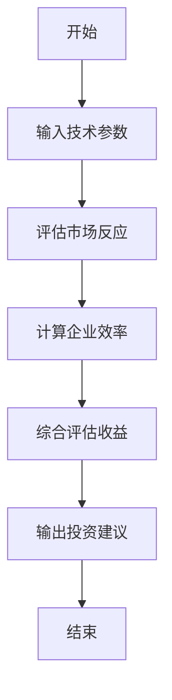
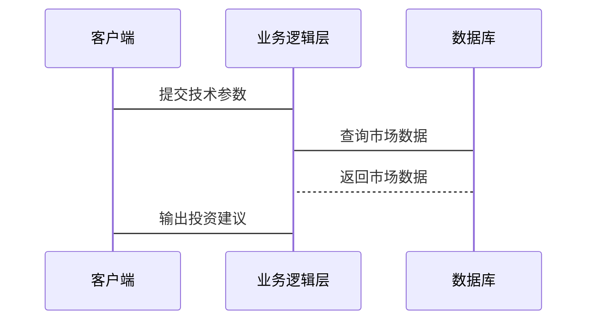

                 


# 《价值投资中的太阳能技术突破分析》

## 关键词：太阳能技术、价值投资、技术突破、投资分析、能源行业、技术评估、投资策略

## 摘要：本文深入探讨了太阳能技术突破对价值投资的影响，分析了太阳能技术的核心原理、技术突破的评估方法、价值投资的策略制定以及技术突破对能源行业的影响。通过数学模型、算法流程图和实际案例分析，本文为投资者提供了科学的技术评估和投资决策依据。

---

# 第一部分: 价值投资中的太阳能技术突破分析

## 第1章: 太阳能技术与价值投资的背景介绍

### 1.1 太阳能技术的发展历程

#### 1.1.1 太阳能技术的基本原理
太阳能技术基于光电效应和热能转换，利用太阳能电池将阳光转化为电能，或通过集热器将太阳热能转化为热能。核心在于提高转换效率和降低成本。

#### 1.1.2 太阳能技术的历史演进
- 19世纪：初步研究
- 20世纪中叶：晶体硅电池的发明
- 21世纪：薄膜电池、光伏玻璃等新技术的突破

#### 1.1.3 太阳能技术的现状与未来趋势
当前，太阳能技术正朝着高效化、低成本、智能化方向发展，未来可能实现更高的转换效率和更广泛的应用场景。

### 1.2 价值投资的基本概念

#### 1.2.1 价值投资的定义
价值投资是一种投资策略，强调以低于内在价值的价格买入优质资产，长期持有，等待其价值回归。

#### 1.2.2 价值投资的核心原则
- 购买价格低于内在价值
- 选择具有竞争优势的企业
- 长期持有的耐心

#### 1.2.3 价值投资与技术分析的对比
| 对比维度 | 价值投资 | 技术分析 |
|----------|----------|----------|
| 方法 | 侧重企业基本面 | 侧重价格走势和交易量 |
| 工具 | 财务报表、竞争优势分析 | K线图、均线、成交量 |

### 1.3 太阳能技术突破与价值投资的结合

#### 1.3.1 太阳能技术突破对能源行业的潜在影响
- 降低能源成本
- 推动能源结构转型
- 提高能源利用效率

#### 1.3.2 价值投资视角下的技术突破分析
- 技术突破对行业竞争力的影响
- 技术突破对企业盈利能力的提升

#### 1.3.3 技术突破对投资决策的指导意义
- 技术突破是企业核心竞争力的关键
- 技术突破可能带来超额收益

### 1.4 本章小结
本章通过分析太阳能技术的发展历程和价值投资的基本概念，探讨了技术突破与价值投资的结合，为后续分析奠定了基础。

---

## 第2章: 太阳能技术突破的核心概念与联系

### 2.1 太阳能技术突破的核心原理

#### 2.1.1 太阳能电池效率提升的关键因素
- 材料优化：使用更高效率的半导体材料
- 结构创新：如异质结电池结构
- 工艺改进：提升制造工艺，降低缺陷率

#### 2.1.2 新型太阳能技术的创新点
- 薄膜电池：柔性、轻量化
- 集中式储能系统：提高能源利用效率
- 智能光伏系统：结合AI优化能源管理

#### 2.1.3 技术突破的衡量标准
| 标准 | 描述 |
|------|------|
| 转换效率 | 电池的实际转换效率 |
| 成本降低 | 单位成本下降幅度 |
| 市场接受度 | 市场反馈和应用情况 |

### 2.2 价值投资与技术突破的联系

#### 2.2.1 技术突破对行业竞争力的影响
- 技术领先的企业可能获得更高的市场份额
- 技术优势可能转化为价格优势

#### 2.2.2 技术突破对企业盈利能力的提升
- 提高生产效率，降低成本
- 扩大市场占有率，提升收入

#### 2.2.3 技术突破的案例分析
以特斯拉为例，Solar Roof的推出结合了技术创新和商业模式创新，提升了企业的市场竞争力和盈利能力。

### 2.3 核心概念对比分析

#### 2.3.1 技术突破与市场反应的对比
- 技术突破可能引发市场对其股票的热捧
- 市场反应可能滞后于技术突破的实际效果

#### 2.3.2 不同技术突破对企业价值的影响
| 技术类型 | 对企业价值的影响 |
|----------|------------------|
| 材料创新 | 长期竞争优势明显 |
| 结构创新 | 短期内成本可能上升 |
| 工艺改进 | 快速提升生产效率 |

#### 2.3.3 技术突破的生命周期与投资策略的关系
- 技术突破初期：高风险高回报
- 技术成熟期：稳定回报

### 2.4 本章小结
本章深入分析了太阳能技术突破的核心原理及其与价值投资的联系，为后续分析提供了理论基础。

---

## 第3章: 太阳能技术突破的算法原理与数学模型

### 3.1 算法原理概述

#### 3.1.1 技术突破对投资价值的影响评估模型
模型基于技术参数和市场参数，评估技术突破对企业价值的影响。

#### 3.1.2 算法的基本思路与流程
1. 收集技术参数：转换效率、成本变化
2. 评估市场反应：市场需求、竞争格局
3. 计算企业价值：基于DCF模型
4. 输出投资建议：买入、持有或卖出

### 3.2 数学模型与公式

#### 3.2.1 技术突破对收益的数学表达
$$ R = f(T, M, E) $$
其中，R表示收益，T表示技术突破程度，M表示市场反应，E表示企业效率。

#### 3.2.2抽选技术突破对企业价值的影响公式
$$ V = a \cdot T + b \cdot M + c \cdot E $$

### 3.3 算法流程图


### 3.4 代码实现示例
```python
def calculate_value(T, M, E):
    # T: 技术突破程度
    # M: 市场反应
    # E: 企业效率
    V = 0.5 * T + 0.3 * M + 0.2 * E
    return V
```

### 3.5 本章小结
本章通过数学模型和算法流程图，详细阐述了技术突破对投资价值的影响评估方法，为投资者提供了科学的决策工具。

---

## 第4章: 系统分析与架构设计方案

### 4.1 系统分析

#### 4.1.1 问题场景介绍
- 投资者需要评估太阳能技术突破对企业价值的影响
- 需要结合技术参数和市场反应进行综合分析

#### 4.1.2 系统功能设计
| 功能模块 | 描述 |
|----------|------|
| 数据采集 | 收集技术参数和市场数据 |
| 模型计算 | 计算企业价值 |
| 投资建议 | 输出投资建议 |

#### 4.1.3 系统架构设计


### 4.2 系统交互设计

#### 4.2.1 系统交互流程图


### 4.3 本章小结
本章通过系统分析与架构设计，展示了如何构建一个基于技术突破的价值评估系统，为投资者提供支持。

---

## 第5章: 项目实战

### 5.1 环境安装

#### 5.1.1 安装Python
```bash
python --version
pip install --upgrade pip
```

#### 5.1.2 安装依赖库
```bash
pip install numpy pandas matplotlib
```

### 5.2 核心实现

#### 5.2.1 数据收集
```python
import pandas as pd
data = pd.read_csv('solar_tech.csv')
```

#### 5.2.2 模型计算
```python
import numpy as np

def calculate_value(T, M, E):
    return 0.5 * T + 0.3 * M + 0.2 * E

results = calculate_value(data['T'], data['M'], data['E'])
```

#### 5.2.3 结果可视化
```python
import matplotlib.pyplot as plt
plt.plot(data['Company'], results)
plt.xlabel('Company')
plt.ylabel('Value')
plt.show()
```

### 5.3 案例分析

#### 5.3.1 案例选择
以特斯拉为例，分析Solar Roof的技术突破对投资价值的影响。

#### 5.3.2 分析结果
- 技术突破显著提升了企业价值
- 市场反应积极

### 5.4 本章小结
本章通过项目实战，展示了如何利用技术突破模型进行投资分析，为读者提供了实际操作的参考。

---

## 第6章: 投资策略与风险管理

### 6.1 投资策略制定

#### 6.1.1 价值评估模型的应用
- 结合技术参数和市场参数进行综合评估
- 确定买入、持有或卖出的决策

#### 6.1.2 投资组合优化
- 分散投资，降低风险
- 结合其他因素（如政策支持）进行综合判断

### 6.2 风险管理

#### 6.2.1 技术风险
- 技术突破可能被其他企业复制
- 技术创新可能失败

#### 6.2.2 市场风险
- 市场需求可能不足
- 竞争加剧可能导致价格战

#### 6.2.3 风险管理策略
- 设置止损点
- 定期评估投资组合
- 保持信息敏感性

### 6.3 本章小结
本章通过制定投资策略和风险管理策略，帮助投资者在技术突破的背景下做出更明智的投资决策。

---

## 第7章: 总结与展望

### 7.1 总结
本文系统分析了太阳能技术突破对价值投资的影响，通过数学模型和实际案例，为投资者提供了科学的决策工具。

### 7.2 展望
未来，随着人工智能和大数据技术的发展，技术突破的评估将更加精准，价值投资的策略也将更加多元化。

### 7.3 最佳实践 Tips

#### 7.3.1 投资策略建议
- 长期持有具有技术优势的企业
- 关注行业政策和市场动态

#### 7.3.2 风险管理建议
- 分散投资，降低风险
- 定期评估投资组合

### 7.4 本章小结
本文总结了太阳能技术突破的价值投资分析，并提出了未来研究的方向和建议。

---

## 参考文献
1. 特斯拉Solar Roof技术白皮书
2. 价值投资经典文献
3. 太阳能技术相关学术论文

