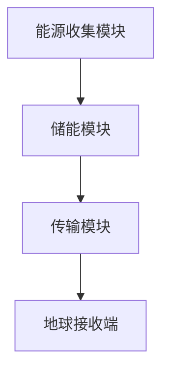

                 


```markdown
# 价值投资中的太阳能空间站技术发展前景

> 关键词：价值投资、太阳能空间站、技术分析、投资策略、系统架构、算法原理、项目实战

> 摘要：本文从价值投资的角度深入分析了太阳能空间站技术的发展前景。首先介绍了太阳能空间站的核心概念和技术背景，然后从技术分析、投资价值评估、系统架构设计等多维度展开讨论。通过数学模型和实际案例分析，结合算法原理和系统设计，为投资者提供了科学的决策依据和投资建议。

---

# 第一部分: 价值投资中的太阳能空间站技术背景与概念

## 第1章: 太阳能空间站技术概述

### 1.1 太阳能空间站的定义与核心概念

#### 1.1.1 太阳能空间站的定义
太阳空间站是一种利用太阳能技术，通过空间环境部署的能源收集、储存和传输系统。其核心目标是为地球提供稳定的清洁能源供应。

#### 1.1.2 太阳能空间站的核心技术要素
- **太阳能收集技术**：包括太阳能电池板和能量转换装置。
- **储能技术**：用于存储收集的太阳能，确保能源的稳定供应。
- **能源传输技术**：通过无线方式将能源传输到地球。

#### 1.1.3 太阳能空间站的系统架构与功能模块
- **能源收集模块**：负责太阳能的收集。
- **储能模块**：存储多余的能量。
- **传输模块**：将能源传输到地球。

### 1.2 价值投资的基本概念

#### 1.2.1 价值投资的定义
价值投资是一种投资策略，通过分析企业的内在价值，寻找被市场低估的投资标的。

#### 1.2.2 价值投资的核心原则
- 价格与价值的差异是投资机会的来源。
- 长期投资，避免短期市场波动的影响。

#### 1.2.3 价值投资在科技领域的应用
科技领域的价值投资需要关注技术创新、市场前景和企业盈利能力。

### 1.3 太阳能空间站技术的背景与发展现状

#### 1.3.1 太阳能技术的历史演变
从地面太阳能发电到空间太阳能的演变过程。

#### 1.3.2 太阳能空间站在现代科技中的地位
作为未来清洁能源的重要组成部分，太阳能空间站在能源结构转型中的作用。

#### 1.3.3 当前发展现状
- **技术成熟度**：部分关键技术已取得突破。
- **市场关注度**：逐渐成为投资热点。
- **政策支持**：各国政府纷纷出台支持政策。

---

# 第二部分: 太阳能空间站技术的核心分析

## 第2章: 太阳能空间站技术的核心分析

### 2.1 太阳能收集技术的分析

#### 2.1.1 太阳能电池板的工作原理
- 太阳能电池板将太阳光转化为电能。
- 光电转换效率是衡量其性能的关键指标。

#### 2.1.2 能量转换效率的数学模型
$$\text{效率} = \frac{\text{输出功率}}{\text{输入功率}}$$

#### 2.1.3 提高转换效率的关键技术
- 使用新型材料。
- 优化电池板结构设计。

### 2.2 储能技术的分析

#### 2.2.1 储能技术的分类
- 电池储能。
- 超级电容器储能。
- 热储能。

#### 2.2.2 储能系统的优化设计
- **能量密度**：储能系统的容量。
- **充放电效率**：储能系统的能量转换效率。

#### 2.2.3 储能技术的数学模型
$$E = V \times C$$
其中，\(E\) 表示储能容量，\(V\) 表示电压，\(C\) 表示电容。

### 2.3 能源传输技术的分析

#### 2.3.1 无线能量传输技术
- **激光传输**：利用激光将能量传输到地面接收器。
- **微波传输**：通过微波将能量传输到地面。

#### 2.3.2 传输效率的优化
- **传输距离**：距离越长，效率越低。
- **传输介质**：空气中的损耗。

#### 2.3.3 传输技术的数学模型
$$\text{传输效率} = \frac{\text{接收功率}}{\text{发射功率}}$$

---

# 第三部分: 价值投资视角下的太阳能空间站技术分析

## 第3章: 价值投资视角下的技术分析

### 3.1 太阳能空间站技术的市场容量评估

#### 3.1.1 全球能源市场现状
- 石油、天然气等化石能源的占比逐步下降。
- 清洁能源的需求持续增长。

#### 3.1.2 太阳能空间站的市场容量
- 技术成熟后，市场容量巨大。
- 竞争格局尚未稳定，具备较大的投资潜力。

### 3.2 技术成熟度分析

#### 3.2.1 技术成熟度评估标准
- **技术可行性**：是否具备实际应用条件。
- **成本效益**：技术的成本与收益比。
- **商业化潜力**：是否能够实现盈利。

#### 3.2.2 技术风险分析
- **技术风险**：技术尚未完全成熟，存在失败的可能性。
- **政策风险**：政策变化可能影响技术发展。

### 3.3 投资价值评估

#### 3.3.1 投资回报率分析
- **初期投资高**：技术开发和空间站建设成本高昂。
- **后期收益大**：技术成熟后，市场需求大，收益稳定。

#### 3.3.2 价值评估模型
$$\text{投资价值} = \text{收益} - \text{成本}$$

#### 3.3.3 投资策略建议
- **长期持有**：等待技术成熟和市场需求增长。
- **分散投资**：降低单一项目的投资风险。

---

# 第四部分: 太阳能空间站技术的系统架构与设计

## 第4章: 太阳能空间站技术的系统架构与设计

### 4.1 系统功能设计

#### 4.1.1 功能模块划分
- 能源收集模块。
- 储能模块。
- 传输模块。

#### 4.1.2 功能模块之间的关系
- **能源收集模块**向 **储能模块** 提供能量。
- **储能模块** 根据需求向 **传输模块** 提供能量。

### 4.2 系统架构设计

#### 4.2.1 系统架构图


#### 4.2.2 系统架构的关键设计点
- **模块化设计**：便于维护和升级。
- **高可靠性**：确保系统长期稳定运行。

### 4.3 系统接口设计

#### 4.3.1 接口定义
- **输入接口**：接收太阳辐射的能量。
- **输出接口**：向地球传输能量。

#### 4.3.2 接口协议
- **通信协议**：确保模块之间的数据传输。
- **能量传输协议**：规范能量的传输方式。

### 4.4 系统交互设计

#### 4.4.1 系统交互流程图
```mermaid
sequenceDiagram
actor 用户
participant 能源收集模块
participant 储能模块
participant 传输模块
用户 -> 能源收集模块: 发出能量收集指令
能源收集模块 -> 储能模块: 传输收集到的能量
储

