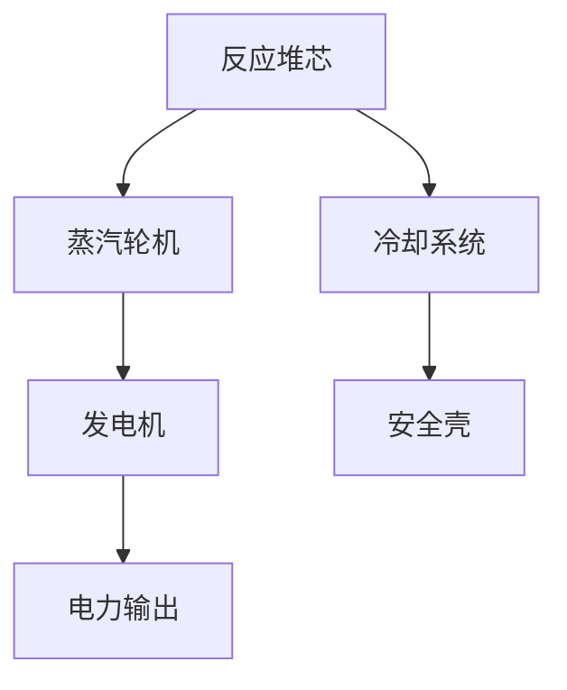

                 

# 价值投资中的小型模块化核反应堆技术前景

## 关键词：小型模块化核反应堆、价值投资、核能技术、能源市场、投资分析

## 摘要：  
随着全球能源需求的增长和对可再生能源的关注，小型模块化核反应堆因其高效、安全、灵活的特点，逐渐成为能源市场的重要组成部分。本文从技术、市场和投资角度，深入分析小型模块化核反应堆的前景，探讨其在价值投资中的潜力和挑战，为投资者提供参考。

---

# 第一部分：小型模块化核反应堆技术背景

## 第1章：小型模块化核反应堆技术概述

### 1.1 小型模块化核反应堆的定义与特点

#### 1.1.1 小型模块化核反应堆的定义  
小型模块化核反应堆（Small Modular Reactors, SMRs）是指功率在 300 MW 以下的核反应堆，具有模块化设计、可扩展性和灵活性的特点。与传统大型核反应堆相比，SMRs 的设计更加紧凑，建造周期短，成本较低。

#### 1.1.2 小型模块化核反应堆的核心特点  
- **模块化设计**：各部分可以独立制造，便于运输和安装。  
- **安全性高**：采用非能动安全系统，减少人为干预的需求。  
- **灵活性强**：适用于不同规模的能源需求，可作为备用电源或主电源。  
- **建造周期短**：模块化设计使得建造时间缩短，通常为 3-5 年。  

#### 1.1.3 小型模块化核反应堆与传统核电站的对比  
| 对比维度       | 小型模块化核反应堆 (SMRs)       | 传统大型核反应堆 (LWRs)       |  
|----------------|----------------------------------|-------------------------------|  
| 单机容量（MW） | 300 MW 以下                     | 1000 MW 以上                 |  
| 建造周期（年）  | 3-5 年                          | 6-8 年                       |  
| 单位成本（美元/千瓦） | 较低                          | 较高                         |  

---

## 第2章：小型模块化核反应堆的技术原理

### 2.1 核反应堆的基本原理

#### 2.1.1 核裂变反应的基本过程  
核裂变是重原子核（如铀-235）吸收一个中子后分裂成两个较轻的原子核，并释放出能量的过程。释放的能量以热量形式储存，用于驱动涡轮机发电。

#### 2.1.2 核反应堆的组成部分  
- **反应堆芯**：包含燃料棒、控制棒和 moderators。  
- **冷却系统**：用于移除反应堆芯产生的热量，通常是水或气体。  
- **安全壳**：保护反应堆免受外部冲击和极端环境的影响。  

### 2.2 小型模块化核反应堆的技术特点

#### 2.2.1 模块化设计的优势  
模块化设计使得 SMRs 可以在工厂预制，现场组装，大幅缩短了建设周期。此外，模块化设计还可以根据需求灵活扩展，降低初始投资成本。

#### 2.2.2 小型模块化核反应堆的安全性  
SMRs 采用非能动安全系统，例如自然对流冷却系统，即使在断电情况下也能保持安全。此外，SMRs 的设计使得放射性物质更难泄漏，提高了整体安全性。

#### 2.2.3 小型模块化核反应堆的经济性  
由于 SMRs 的模块化设计和紧凑结构，其建造成本和时间都低于传统核电站。此外，SMRs 可以根据需求灵活调整输出功率，提高了能源利用效率。

### 2.3 小型模块化核反应堆与传统核电站的技术对比  

| 技术参数       | 小型模块化核反应堆 (SMRs)       | 传统大型核反应堆 (LWRs)       |  
|----------------|----------------------------------|-------------------------------|  
| 单机容量（MW） | 300 MW 以下                     | 1000 MW 以上                 |  
| 建造周期（年）  | 3-5 年                          | 6-8 年                       |  
| 单位成本（美元/千瓦） | 较低                          | 较高                         |  
| 安全性          | 高                             | 较高                         |  

---

# 第二部分：小型模块化核反应堆的投资分析

## 第3章：小型模块化核反应堆的市场分析

### 3.1 全球能源市场的变化

#### 3.1.1 全球能源需求的增长  
随着全球人口的增长和经济的发展，能源需求持续增加。根据国际能源署（IEA）的数据，到 2040 年，全球能源需求将增长 1.3% 年均复合增长率。

#### 3.1.2 可再生能源的崛起  
尽管可再生能源（如风能和太阳能）快速发展，但由于其间歇性问题，核能仍然是全球能源结构的重要组成部分。

#### 3.1.3 小型模块化核反应堆的市场需求  
SMRs 的灵活性和高效性使其适用于多种场景，例如偏远地区的能源供应、工业过程热能供应等。

### 3.2 小型模块化核反应堆的政策支持

#### 3.2.1 各国政府的政策支持  
许多国家（如美国、英国和中国）都对 SMRs 技术进行了政策支持和资金投入。

#### 3.2.2 国际合作与技术标准  
SMRs 的发展需要国际间的合作，以确保技术标准和安全规范的统一。

### 3.3 小型模块化核反应堆的竞争格局

#### 3.3.1 主要参与者  
- **美国**：美国是 SMRs 技术的领先国家，拥有西屋电气和通用电气等公司。  
- **英国**：英国政府也大力支持 SMRs 技术，并计划在 2030 年前实现 SMRs 的商业化应用。  
- **中国**：中国的 SMRs 技术也在快速发展，例如中国核工业集团（CNNC）和中国广核集团（CGN）。  

#### 3.3.2 技术与成本的竞争  
SMRs 的成本和技术门槛较高，因此技术先进的企业将更具竞争力。

---

## 第4章：小型模块化核反应堆的投资分析

### 4.1 价值投资的核心逻辑

#### 4.1.1 长期需求驱动  
随着全球能源需求的增长和对可再生能源的依赖，SMRs 的需求将逐步增加。

#### 4.1.2 技术壁垒与竞争优势  
SMRs 技术的复杂性和高门槛使得具备技术优势的企业更具竞争力。

#### 4.1.3 行业整合与集中度提升  
随着 SMRs 技术的成熟，行业集中度将逐步提高，具备规模优势的企业将占据主导地位。

### 4.2 财务指标与投资价值评估

#### 4.2.1 市盈率（P/E）分析  
市盈率是衡量企业投资价值的重要指标。通常，市盈率低于行业平均水平的企业具有较高的投资价值。

#### 4.2.2 净利润增长率  
净利润增长率是衡量企业盈利能力的重要指标。高净利润增长率表明企业具有较强的增长潜力。

#### 4.2.3 资产负债率分析  
资产负债率是衡量企业财务健康状况的重要指标。较低的资产负债率表明企业财务风险较低，具有较高的投资价值。

---

## 第5章：小型模块化核反应堆的投资策略

### 5.1 投资前的准备工作

#### 5.1.1 市场调研与分析  
投资者需要对 SMRs 的市场需求、竞争格局和技术发展进行深入调研。

#### 5.1.2 技术评估与筛选  
投资者需要对潜在投资企业进行技术评估，选择技术先进、具有竞争优势的企业。

#### 5.1.3 财务分析与风险评估  
投资者需要对潜在投资企业的财务状况和风险进行分析，选择财务健康、风险可控的企业。

### 5.2 投资组合的构建

#### 5.2.1 多元化投资策略  
投资者可以通过多元化投资策略降低投资风险，例如投资于多个 SMRs 企业和相关产业。

#### 5.2.2 长期投资策略  
SMRs 技术的成熟和商业化需要较长时间，因此投资者需要采取长期投资策略。

### 5.3 投资风险与管理

#### 5.3.1 技术风险  
SMRs 技术的复杂性和高门槛使得技术风险较高。投资者需要选择技术先进、研发能力强的企业。

#### 5.3.2 市场风险  
SMRs 市场需求的不确定性较高。投资者需要对市场需求进行深入分析，选择具有较强市场需求前景的企业。

#### 5.3.3 财务风险  
SMRs 企业的财务风险较高，投资者需要选择财务健康、资产负债率低的企业。

---

# 第三部分：小型模块化核反应堆的系统架构与设计方案

## 第6章：小型模块化核反应堆的系统架构

### 6.1 系统功能设计

#### 6.1.1 电力生产系统  
SMRs 的电力生产系统包括反应堆芯、蒸汽轮机和发电机等部分。

#### 6.1.2 冷却系统  
冷却系统是 SMRs 的核心系统之一，负责移除反应堆芯产生的热量。

#### 6.1.3 安全系统  
安全系统包括非能动安全系统和应急冷却系统，确保 SMRs 的安全性。

### 6.2 系统架构设计

#### 6.2.1 系统架构图  

#### 6.2.2 系统优化  
系统优化包括对各部分的优化设计，例如提高冷却系统的效率、优化反应堆芯的结构等。

### 6.3 接口设计与交互

#### 6.3.1 系统接口  
SMRs 的系统接口包括与电网的接口、与冷却系统的接口等。

#### 6.3.2 系统交互  
系统交互包括电力输出、冷却系统与反应堆芯的交互等。

---

## 第7章：小型模块化核反应堆的项目实战

### 7.1 项目背景与目标

#### 7.1.1 项目背景  
本项目旨在研究和开发一种新型的小型模块化核反应堆，满足市场需求。

#### 7.1.2 项目目标  
- 开发一种高效、安全的小型模块化核反应堆。  
- 实现 SMRs 的商业化应用。  

### 7.2 项目实施步骤

#### 7.2.1 需求分析  
需求分析包括市场调研、技术评估等。

#### 7.2.2 系统设计  
系统设计包括反应堆芯设计、冷却系统设计等。

#### 7.2.3 系统实现  
系统实现包括各部分的制造和组装。

#### 7.2.4 测试与优化  
测试与优化包括系统测试、性能优化等。

### 7.3 项目总结

#### 7.3.1 项目成果  
- 成功开发了一种高效、安全的小型模块化核反应堆。  
- 实现了 SMRs 的商业化应用。  

#### 7.3.2 项目经验  
- 项目实施过程中需要注重系统设计和优化。  
- 项目团队需要具备跨学科的技能和经验。  

---

## 第8章：小型模块化核反应堆的未来展望

### 8.1 未来技术发展

#### 8.1.1 新型核燃料的研究与开发  
新型核燃料的研究与开发将提高 SMRs 的效率和安全性。

#### 8.1.2 智能化核反应堆的开发  
智能化核反应堆的开发将提高 SMRs 的自动化和智能化水平。

### 8.2 未来市场趋势

#### 8.2.1 全球能源市场的需求增长  
随着全球能源需求的增长，SMRs 的市场需求将逐步增加。

#### 8.2.2 国际合作与技术标准的统一  
SMRs 的发展需要国际间的合作，以确保技术标准和安全规范的统一。

### 8.3 投资建议与注意事项

#### 8.3.1 投资建议  
- 投资者应关注 SMRs 技术的发展和商业化进程。  
- 投资者应选择技术先进、财务健康的企业。  

#### 8.3.2 注意事项  
- 投资者应注重技术风险和市场风险。  
- 投资者应关注政策支持和技术标准的变化。  

---

# 结语

小型模块化核反应堆作为核能技术的重要组成部分，具有广阔的发展前景和投资潜力。随着技术的成熟和商业化进程的推进，SMRs 将在能源市场中发挥越来越重要的作用。投资者应注重技术风险和市场风险，选择技术先进、财务健康的企业进行投资。

