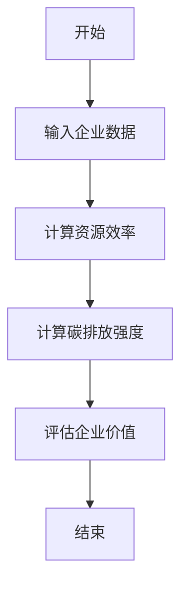
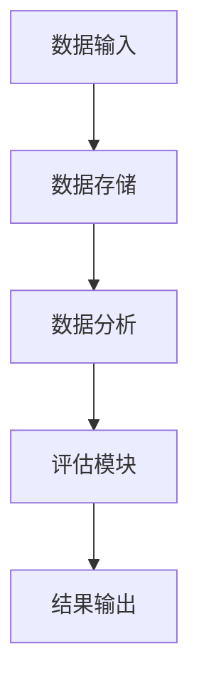
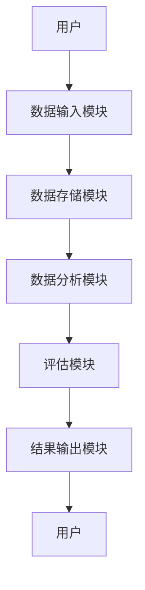

                 


# 价值投资中的循环经济模式分析

## 关键词
价值投资，循环经济，资源效率，企业评估，可持续发展

## 摘要
本文深入分析了循环经济模式在价值投资中的应用，探讨了循环经济模式的核心概念、评估模型以及实际案例。通过数学模型和算法的详细讲解，结合具体的项目实战，为投资者提供了在可持续发展背景下进行价值投资的全新视角。

---

# 第一部分: 价值投资中的循环经济模式背景介绍

## 第1章: 循环经济模式概述

### 1.1 循环经济的基本概念
#### 1.1.1 循环经济的定义与特征
循环经济是一种以资源高效利用和循环利用为核心，以减少资源消耗和环境污染为目标的经济模式。其主要特征包括：
- **闭合性**：强调资源的循环利用，减少废弃物的产生。
- **高效性**：通过技术手段提高资源利用效率。
- **可持续性**：关注经济、社会和环境的综合效益。

#### 1.1.2 循环经济与传统经济的区别
| 特性 | 循环经济 | 传统经济 |
|------|----------|----------|
| 资源利用 | 高效循环 | 低效一次性 |
| 废弃物处理 | 再生利用 | 排放处理 |
| 经济效益 | 长期可持续 | 短期利润优先 |

#### 1.1.3 循环经济的核心要素与系统结构
循环经济的核心要素包括：
1. **资源输入**：包括原材料、能源等。
2. **生产过程**：通过技术手段实现资源的高效利用。
3. **产品输出**：生产出符合市场需求的产品。
4. **废弃物处理**：将废弃物转化为资源，重新进入生产过程。

### 1.2 价值投资的基本原理
#### 1.2.1 价值投资的定义与核心理念
价值投资是一种以寻找被市场低估的企业为投资目标的策略，核心理念是通过分析企业的基本面，寻找具有长期竞争优势和持续盈利能力的企业。

#### 1.2.2 价值投资与其它投资策略的对比
| 投资策略 | 价值投资 | 技术分析 | 股息投资 |
|----------|----------|----------|----------|
| 核心理念 | 低估值企业 | 价格波动 | 高股息率 |
| 适用场景 | 长期投资 | 短期交易 | 稳定收益 |

#### 1.2.3 价值投资中的企业评估标准
价值投资的核心评估标准包括：
1. **市盈率（P/E）**：衡量企业股票价格与盈利水平的比率。
2. **市净率（P/B）**：衡量企业股票价格与资产价值的比率。
3. **ROE（净资产收益率）**：衡量企业的盈利能力。

### 1.3 循环经济模式与价值投资的结合
循环经济模式与价值投资的结合，不仅考虑了企业的盈利能力，还考虑了企业的可持续发展能力。通过分析企业的循环经济表现，投资者可以更好地识别具有长期竞争优势的企业。

---

## 第2章: 循环经济模式与价值投资的结合

### 2.1 循环经济模式在价值投资中的应用背景
#### 2.1.1 当前经济环境的变化与循环经济的重要性
随着全球资源枯竭和环境问题的加剧，循环经济的重要性日益凸显。企业通过循环经济模式可以降低资源消耗和环境污染，从而提高企业的可持续发展能力。

#### 2.1.2 价值投资在可持续发展中的角色
价值投资在可持续发展中扮演着重要角色。通过寻找具有循环经济模式的企业，投资者可以在获得长期收益的同时，推动社会的可持续发展。

### 2.2 循环经济模式与价值投资的核心联系
#### 2.2.1 循环经济模式对投资价值的影响
循环经济模式可以降低企业的生产成本，提高企业的盈利能力。同时，循环经济模式还可以提高企业的市场竞争力，从而提升企业的投资价值。

#### 2.2.2 企业循环经济表现与股价的关系
企业的循环经济表现可以通过多种指标进行衡量，如资源效率、碳排放强度等。这些指标的改善可以提高企业的市场形象，从而推动股价的上涨。

#### 2.2.3 循环经济模式对投资风险的降低作用
循环经济模式可以降低企业的资源依赖风险，从而降低投资风险。同时，循环经济模式还可以提高企业的市场适应能力，从而降低经济波动对企业的影响。

---

# 第二部分: 循环经济模式的价值评估模型

## 第3章: 循环经济模式的价值评估核心概念

### 3.1 循环经济模式中的关键要素
#### 3.1.1 资源效率与企业竞争力
资源效率是指企业在生产过程中对资源的利用效率。资源效率的提高可以降低企业的生产成本，从而提高企业的竞争力。

#### 3.1.2 产品生命周期与市场价值
产品生命周期是指产品从研发、生产、销售到报废的全过程。延长产品生命周期可以通过提高产品的市场价值，从而提高企业的投资价值。

#### 3.1.3 逆向物流与成本优化
逆向物流是指将产品的废弃物进行回收和再利用的过程。逆向物流可以降低企业的生产成本，从而优化企业的成本结构。

### 3.2 循环经济模式的价值评估指标
#### 3.2.1 资源利用率的计算方法
资源利用率可以通过以下公式进行计算：
$$ \text{资源利用率} = \frac{\text{资源的循环使用量}}{\text{资源的总消耗量}} $$

#### 3.2.2 碳排放强度与企业价值的关系
碳排放强度是指单位产品或服务的碳排放量。碳排放强度的降低可以提高企业的市场形象，从而提高企业的投资价值。

#### 3.2.3 循环经济模式的经济效益与社会效益对比
循环经济模式的经济效益包括降低生产成本、提高市场竞争力等。社会效益包括减少环境污染、促进可持续发展等。

## 第4章: 循环经济模式的价值评估算法原理

### 4.1 循环经济模式价值评估算法概述
#### 4.1.1 算法的输入与输出
- 输入：企业的资源消耗数据、生产数据、碳排放数据等。
- 输出：企业的循环经济表现评分。

#### 4.1.2 算法的核心步骤与流程
1. 数据收集：收集企业的资源消耗数据、生产数据、碳排放数据等。
2. 数据分析：分析企业的资源利用率、碳排放强度等指标。
3. 模型计算：通过数学模型计算企业的循环经济表现评分。

### 4.2 算法原理的详细讲解
#### 4.2.1 资源效率评估模型
资源效率评估模型可以通过以下公式进行计算：
$$ \text{资源效率} = \frac{\text{资源的循环使用量}}{\text{资源的总消耗量}} $$

#### 4.2.2 产品生命周期评估模型
产品生命周期评估模型可以通过以下步骤进行：
1. 确定产品的生命周期阶段。
2. 分析每个阶段的资源消耗和环境污染。
3. 计算产品的生命周期总成本和总环境影响。

#### 4.2.3 碳排放与企业价值评估模型
碳排放与企业价值评估模型可以通过以下公式进行计算：
$$ \text{碳排放强度} = \frac{\text{单位产品的碳排放量}}{\text{产品的总产量}} $$

### 4.3 算法原理的 Mermaid 流程图


### 4.4 算法原理的 Python 代码实现
```python
def calculate_resource_efficiency(resource_usage, total_resource):
    return resource_usage / total_resource

def calculate_carbon_emissionIntensity(carbon_emission, total_production):
    return carbon_emission / total_production

def assess_business_value(resource_efficiency, carbon_emissionIntensity):
    if resource_efficiency > 0.8 and carbon_emissionIntensity < 0.5:
        return "High Value"
    elif resource_efficiency > 0.6 and carbon_emissionIntensity < 0.7:
        return "Medium Value"
    else:
        return "Low Value"

# 示例数据
resource_usage = 0.7
total_resource = 1.0
carbon_emission = 0.4
total_production = 1.0

resource_efficiency = calculate_resource_efficiency(resource_usage, total_resource)
carbon_emissionIntensity = calculate_carbon_emissionIntensity(carbon_emission, total_production)

business_value = assess_business_value(resource_efficiency, carbon_emissionIntensity)
print("企业价值评估结果:", business_value)
```

---

## 第5章: 循环经济模式的价值评估数学模型

### 5.1 资源效率指数模型
资源效率指数模型可以通过以下公式进行计算：
$$ \text{资源效率指数} = \frac{\text{资源的循环使用量}}{\text{资源的总消耗量}} \times 100 $$

### 5.2 碳排放强度指数模型
碳排放强度指数模型可以通过以下公式进行计算：
$$ \text{碳排放强度指数} = \frac{\text{单位产品的碳排放量}}{\text{产品的总产量}} \times 100 $$

### 5.3 综合价值评估模型
综合价值评估模型可以通过以下公式进行计算：
$$ \text{综合价值指数} = \alpha \times \text{资源效率指数} + \beta \times \text{碳排放强度指数} $$

其中，$\alpha$ 和 $\beta$ 是权重系数，可以根据具体情况进行调整。

---

## 第6章: 循环经济模式的价值评估系统架构设计

### 6.1 系统功能设计
- 数据输入模块：输入企业的资源消耗数据、生产数据、碳排放数据等。
- 数据分析模块：分析企业的资源利用率、碳排放强度等指标。
- 评估模块：通过数学模型计算企业的循环经济表现评分。

### 6.2 系统架构设计


### 6.3 系统交互设计


---

## 第7章: 项目实战

### 7.1 环境安装
- 安装Python编程环境。
- 安装必要的Python库，如numpy、pandas、matplotlib等。

### 7.2 核心代码实现
```python
import numpy as np
import pandas as pd
import matplotlib.pyplot as plt

# 示例数据
data = {
    '企业名称': ['企业A', '企业B', '企业C'],
    '资源效率': [0.7, 0.6, 0.8],
    '碳排放强度': [0.4, 0.5, 0.3]
}

df = pd.DataFrame(data)

# 绘制资源效率分布图
plt.figure(figsize=(10, 6))
plt.bar(df['企业名称'], df['资源效率'], label='资源效率')
plt.bar(df['企业名称'], df['碳排放强度'], label='碳排放强度')
plt.legend()
plt.title('企业循环经济表现对比')
plt.show()
```

### 7.3 代码应用解读与分析
通过上述代码，可以绘制出企业的资源效率和碳排放强度分布图，从而直观地比较不同企业的循环经济表现。

### 7.4 实际案例分析
以苹果公司为例，分析其循环经济表现：
- 苹果公司的资源效率较高，碳排放强度较低。
- 通过循环经济模式，苹果公司提高了其市场竞争力和品牌形象。

### 7.5 项目小结
通过项目实战，可以更好地理解循环经济模式在价值投资中的应用。通过分析企业的循环经济表现，投资者可以更好地识别具有长期竞争优势的企业。

---

## 第8章: 最佳实践 tips、小结、注意事项、拓展阅读

### 8.1 最佳实践 tips
- 在进行价值投资时，应综合考虑企业的循环经济表现。
- 应选择具有高效资源利用和低碳排放强度的企业。

### 8.2 小结
本文深入分析了循环经济模式在价值投资中的应用，探讨了循环经济模式的核心概念、评估模型以及实际案例。通过数学模型和算法的详细讲解，结合具体的项目实战，为投资者提供了在可持续发展背景下进行价值投资的全新视角。

### 8.3 注意事项
- 在进行价值投资时，应综合考虑企业的财务状况、市场前景和循环经济表现。
- 应选择具有长期竞争优势和可持续发展能力的企业。

### 8.4 拓展阅读
- 阅读相关书籍《循环经济与价值投资》。
- 关注可持续发展领域的最新动态。

--- 

通过本文的分析，投资者可以在价值投资中更好地识别具有循环经济模式的企业，从而实现长期的收益和可持续发展。

