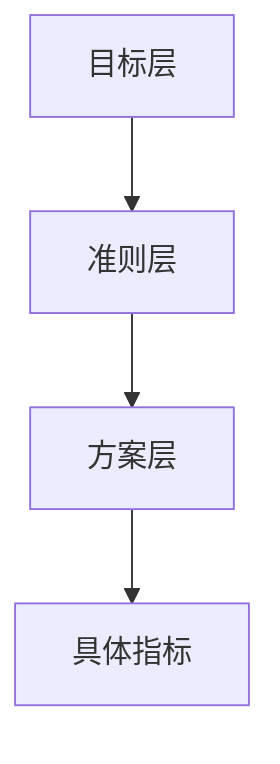
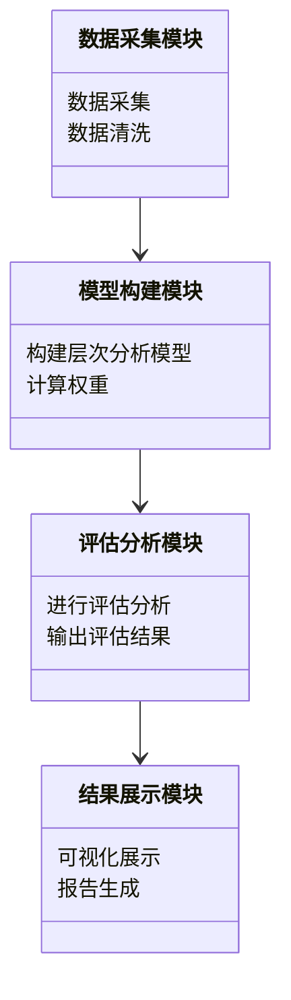
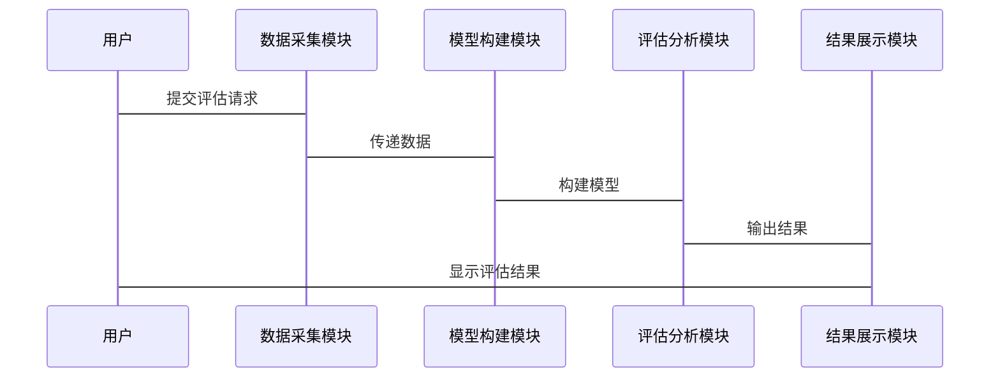

                 


# 价值投资中的技术创新评估

> 关键词：价值投资，技术创新，评估模型，层次分析法，模糊综合评价法

> 摘要：本文探讨了在价值投资中如何评估技术创新的重要性。通过分析技术创新评估的核心概念、算法原理、系统架构以及实际项目案例，展示了如何将技术创新评估整合到投资决策过程中，以实现更精准的投资策略。

---

## 第1章：价值投资与技术创新评估的背景

### 1.1 价值投资的基本概念

#### 1.1.1 价值投资的定义与核心理念
价值投资是一种投资策略，强调以低于内在价值的价格购买优质资产。其核心理念在于寻找市场低估的公司，通过长期持有实现超额收益。价值投资不仅关注当前的财务指标，还注重公司的长期发展潜力和竞争优势。

#### 1.1.2 技术创新在价值投资中的重要性
技术创新是推动企业成长和行业变革的核心动力。在价值投资中，技术创新评估可以帮助投资者识别那些具备持续创新能力的公司，这些公司往往能够在市场中占据领先地位，从而为投资者带来更高的回报。

#### 1.1.3 价值投资与技术创新的结合意义
技术创新评估为价值投资提供了新的视角。通过分析公司的技术创新能力，投资者可以更好地判断其竞争优势和未来增长潜力，从而做出更为明智的投资决策。

### 1.2 技术创新评估的基本概念

#### 1.2.1 技术创新的定义与特征
技术创新是指在现有技术基础上进行改进或创新，以实现更好的产品性能、更低的成本或更高的效率。其主要特征包括创新性、实用性、可扩展性和可持续性。

#### 1.2.2 技术创新评估的目的与作用
技术创新评估的目的是通过量化和分析技术的优劣，帮助企业或投资者做出更科学的决策。其作用包括识别技术优势、评估技术风险、预测技术发展趋势等。

#### 1.2.3 技术创新评估的边界与外延
技术创新评估的边界在于技术本身的可行性和应用范围，而外延则涉及技术的经济价值、市场潜力和行业影响。

---

## 第2章：技术创新评估的核心概念与联系

### 2.1 技术创新评估的核心原理

#### 2.1.1 技术创新评估的主要方法
技术创新评估主要采用定性和定量相结合的方法，包括层次分析法（AHP）、模糊综合评价法、回归分析等。

#### 2.1.2 技术创新评估的关键要素
技术创新评估的关键要素包括技术的先进性、实用性和可扩展性，以及公司的研发能力、市场定位和财务状况。

#### 2.1.3 技术创新评估的指标体系
技术创新评估的指标体系通常包括技术成熟度、市场潜力、研发团队能力、专利数量等。

### 2.2 技术创新与价值投资的关系

#### 2.2.1 技术创新对价值投资的影响
技术创新直接影响企业的盈利能力、市场竞争力和增长潜力，从而影响其内在价值和投资价值。

#### 2.2.2 价值投资中技术创新评估的逻辑框架
技术创新评估的逻辑框架包括识别技术优势、评估技术风险、预测技术发展趋势，并结合企业的财务状况和市场环境进行综合评估。

#### 2.2.3 技术创新评估对投资决策的指导作用
技术创新评估为投资者提供了科学的决策依据，帮助其识别具备持续创新能力的公司，从而提高投资的准确性和收益率。

---

## 第3章：技术创新评估的数学模型与算法原理

### 3.1 技术创新评估的数学模型

#### 3.1.1 层次分析法（AHP）
层次分析法是一种用于结构化决策问题的层次结构模型，通过构建决策层次结构并计算各因素的权重，最终得出最优选择。

#### 3.1.2 模糊综合评价法
模糊综合评价法是一种基于模糊数学的评价方法，适用于评价对象模糊、评价指标较多的情况。

#### 3.1.3 技术创新评分模型
技术创新评分模型通过将技术创新的各个因素进行量化评分，并根据权重计算总分，从而评估技术创新的整体水平。

### 3.2 技术创新评估的算法原理

#### 3.2.1 层次分析法（AHP）的流程图



#### 3.2.2 模糊综合评价法的实现步骤
模糊综合评价法的实现步骤包括：构建模糊评价矩阵、计算模糊权重、计算模糊合成结果、确定最优方案。

#### 3.2.3 技术创新评分模型的数学公式

技术创新评分模型的总分为：
$$
S = \sum_{i=1}^{n} w_i \cdot s_i
$$
其中，$w_i$ 是第 $i$ 个因素的权重，$s_i$ 是第 $i$ 个因素的评分。

---

## 第4章：技术创新评估的系统分析与架构设计

### 4.1 问题场景介绍

#### 4.1.1 技术创新评估的典型应用场景
技术创新评估的典型应用场景包括高科技企业的估值、新兴行业的投资决策、技术创新型企业的风险评估等。

#### 4.1.2 投资决策中的技术创新评估需求
在投资决策中，技术创新评估的需求包括：识别技术创新的核心竞争力、评估技术创新的市场潜力、预测技术创新的生命周期等。

#### 4.1.3 系统设计的目标与范围
系统设计的目标是构建一个支持技术创新评估的决策支持系统，其范围包括数据采集、模型构建、评估分析和结果展示。

### 4.2 系统功能设计

#### 4.2.1 系统功能模块划分
系统功能模块包括数据采集模块、模型构建模块、评估分析模块和结果展示模块。

#### 4.2.2 系统功能的领域模型（Mermaid类图）



#### 4.2.3 系统功能的交互流程（Mermaid序列图）



### 4.3 系统架构设计

#### 4.3.1 系统架构的总体设计
系统架构总体设计采用分层架构，包括数据层、逻辑层和表现层。

#### 4.3.2 系统架构的分层设计
分层设计包括数据层（数据存储和处理）、逻辑层（模型构建和评估分析）、表现层（用户交互和结果展示）。

#### 4.3.3 系统架构的模块交互（Mermaid架构图）


---

## 第5章：技术创新评估的项目实战

### 5.1 项目环境与工具安装

#### 5.1.1 开发环境的搭建
开发环境包括Python编程环境、Jupyter Notebook和相关数据处理工具。

#### 5.1.2 依赖工具的安装与配置
安装依赖工具包括Python的Pandas、Scipy、Pyplotlib等库，以及Mermaid和Latex的编辑工具。

#### 5.1.3 数据采集
数据采集包括从公开数据源获取企业技术创新相关数据，如专利数量、研发投入、技术成熟度等。

### 5.2 系统核心实现源代码

#### 5.2.1 层次分析法（AHP）的Python代码实现

```python
import numpy as np

# 定义层次分析法的函数
def ahp(weight, criteria):
    matrix = np.zeros((len(criteria), len(criteria)))
    for i in range(len(criteria)):
        for j in range(len(criteria)):
            matrix[i, j] = weight[i] / weight[j]
    return matrix

# 示例数据
weight = [0.3, 0.2, 0.5]
criteria = ['技术创新', '市场潜力', '财务状况']

# 调用函数
matrix = ahp(weight, criteria)
print(matrix)
```

#### 5.2.2 模糊综合评价法的代码实现

```python
from scipy import fuzzy

def fuzzy_evaluation(criteria, data, weights):
    # 初始化模糊集
    fuzzy_sets = {}
    for i in range(len(criteria)):
        fuzzy_sets[criteria[i]] = fuzzy.fuzzynum()
    # 添加数据到模糊集
    for i in range(len(data)):
        criteria[i].add(data[i])
    # 计算模糊合成
    result = fuzzy.fuzzyor(fuzzy.fuzzyand(fuzzy_sets), weights)
    return result

# 示例数据
criteria = ['技术创新', '市场潜力', '财务状况']
data = [0.7, 0.6, 0.8]
weights = [0.3, 0.2, 0.5]

# 调用函数
result = fuzzy_evaluation(criteria, data, weights)
print(result)
```

---

## 第6章：总结与展望

### 6.1 本章总结
技术创新评估在价值投资中的应用为投资者提供了科学的决策工具，帮助其识别具备持续创新能力的公司，从而提高投资的准确性和收益率。

### 6.2 未来展望
随着人工智能和大数据技术的发展，技术创新评估将更加智能化和自动化，为价值投资提供更精准的决策支持。

### 6.3 最佳实践 tips
- 在技术创新评估中，建议结合企业的实际情况和市场环境，灵活调整评估模型和指标。
- 投资者应定期更新和优化技术创新评估的模型和数据，以适应市场和技术的变化。

---

## 附录：工具指南与文献推荐

### 附录1：相关工具指南
- **层次分析法（AHP）工具**：包括Excel插件、Python库（如`scipy`）等。
- **模糊综合评价法工具**：包括模糊数学库（如`fuzzy`）、专用软件（如Matlab）等。

### 附录2：文献推荐
- 层次分析法的经典文献：Saaty, T. L. (1980). The Analytic Hierarchy Process.
- 模糊综合评价法的经典文献：Zadeh, L. A. (1965). Fuzzy sets.

---

通过以上目录和内容，您可以撰写一篇详细且专业的技术博客文章，涵盖价值投资中的技术创新评估的各个方面。

