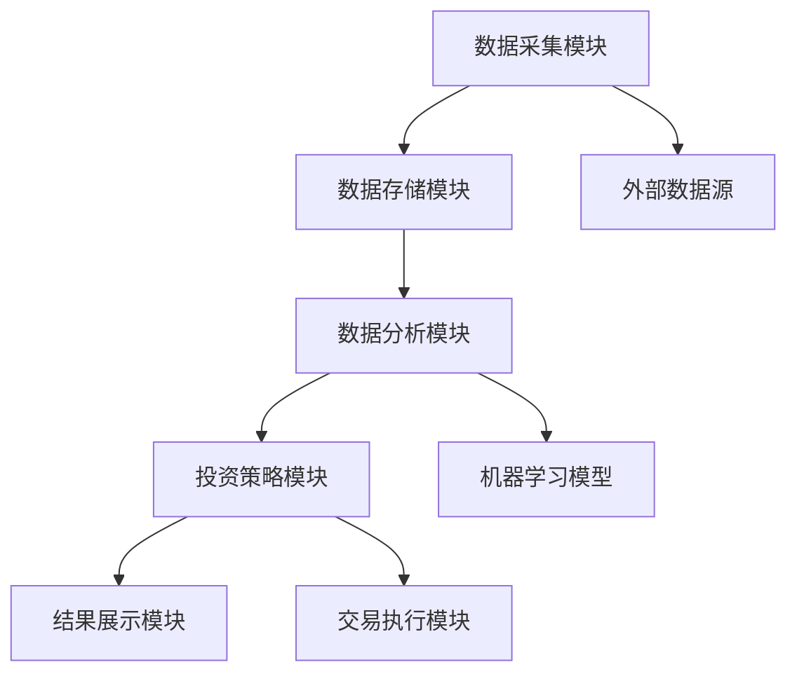
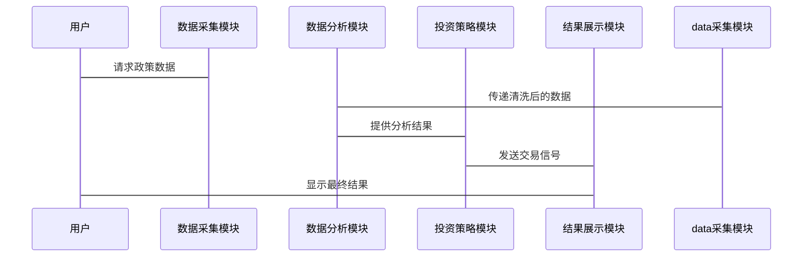

                 


```markdown
# 第4章: 政策红利捕捉的系统架构设计

## 4.1 系统功能模块划分

### 4.1.1 数据采集模块
- 政策数据来源：政府官网、财经新闻网站、行业报告等
- 数据类型：文本、表格、时间序列数据
- 数据预处理：清洗、标准化、特征提取

### 4.1.2 数据分析模块
- 数据分析方法：统计分析、机器学习、自然语言处理
- 模型训练：回归分析、时间序列预测、主题模型
- 数据可视化：折线图、柱状图、散点图

### 4.1.3 投资策略模块
- 策略生成：基于政策红利的多因子模型
- 策略优化：回测、风险控制、收益最大化
- 策略执行：模拟交易、动态调整

### 4.1.4 结果展示模块
- 可视化界面：仪表盘、图表、数据看板
- 报告生成：分析报告、投资建议、风险提示
- 用户交互：输入参数、查看结果、调整策略

## 4.2 系统架构设计

### 4.2.1 系统架构设计图


### 4.2.2 数据流分析
- 数据从外部数据源流入，经过数据采集模块清洗后存储
- 数据分析模块调用机器学习模型进行预测
- 投资策略模块根据预测结果生成交易信号
- 结果展示模块将分析结果可视化

## 4.3 系统接口设计

### 4.3.1 数据采集接口
- 接口名称：fetch_policy_data
- 输入参数：source_type, start_date, end_date
- 输出格式：JSON格式的政策数据

### 4.3.2 数据分析接口
- 接口名称：analyze_policy_impact
- 输入参数：market_data, policy_events
- 输出格式：预测结果和置信度

### 4.3.3 投资策略接口
- 接口名称：generate_trading_signal
- 输入参数：market_condition, policy_impact
- 输出格式：买卖信号和仓位建议

## 4.4 系统交互序列图



## 4.5 本章小结

### 4.5.1 系统架构的模块划分
- 数据采集、分析、策略、展示的全链路覆盖

### 4.5.2 系统架构的设计原则
- 高内聚低耦合、模块化设计、可扩展性

### 4.5.3 系统交互的流程优化
- 数据流的高效处理、模块间的无缝衔接
```

# 第5章: 项目实战——基于政策红利的股票投资系统

## 5.1 项目背景与目标
### 5.1.1 项目背景
- 利用政策红利进行价值投资
- 构建自动化投资决策系统

### 5.1.2 项目目标
- 捕捉政策红利带来的投资机会
- 实现自动化、智能化的投资策略

## 5.2 环境安装与配置

### 5.2.1 系统环境
- 操作系统：Linux/Windows/MacOS
- 开发语言：Python 3.8+

### 5.2.2 工具安装
- Python库：numpy、pandas、scikit-learn、matplotlib
- 数据库：MySQL或MongoDB
- 机器学习框架：TensorFlow/PyTorch

## 5.3 核心实现代码

### 5.3.1 数据采集模块
```python
import requests
import json
import os

def fetch_policy_data(source_type, start_date, end_date):
    url = f"https://example.com/policy_data?source={source_type}&start={start_date}&end={end_date}"
    response = requests.get(url)
    data = response.json()
    return data

# Example usage
policy_data = fetch_policy_data('government', '2020-01-01', '2023-12-31')
print(policy_data)
```

### 5.3.2 数据分析模块
```python
import pandas as pd
from sklearn.linear_model import LinearRegression

def analyze_policy_impact(policy_events, market_data):
    # 数据清洗与特征工程
    df = pd.DataFrame({
        'policy_event': policy_events,
        'market_return': market_data
    })
    # 模型训练
    model = LinearRegression()
    model.fit(df[['policy_event']], df['market_return'])
    # 预测结果
    predicted_returns = model.predict(df[['policy_event']])
    return predicted_returns

# Example usage
policy_events = [1, 2, 3, 4, 5]
market_data = [0.05, 0.02, -0.01, 0.03, 0.06]
predicted = analyze_policy_impact(policy_events, market_data)
print(predicted)
```

### 5.3.3 投资策略模块
```python
import numpy as np

def generate_trading_signal(predicted_returns, current_position):
    # 风险控制
    if np.mean(predicted_returns) > 0.02:
        return '买入'
    elif np.mean(predicted_returns) < -0.01:
        return '卖出'
    else:
        return '观望'

# Example usage
predicted_returns = [0.03, 0.02, -0.005, 0.04, 0.01]
signal = generate_trading_signal(predicted_returns, '持有')
print(signal)
```

### 5.3.4 结果展示模块
```python
import matplotlib.pyplot as plt

def plot_market_trend(market_data, title):
    plt.figure(figsize=(10, 6))
    plt.plot(market_data, label='市场走势')
    plt.title(title)
    plt.xlabel('时间')
    plt.ylabel('收益率')
    plt.legend()
    plt.show()

# Example usage
market_data = [0.05, 0.02, -0.01, 0.03, 0.06]
plot_market_trend(market_data, '政策红利下的市场走势')
```

## 5.4 项目实战步骤

### 5.4.1 数据采集与清洗
```python
policy_data = fetch_policy_data('government', '2020-01-01', '2023-12-31')
market_data = fetch_market_data('stock_index', '2020-01-01', '2023-12-31')
```

### 5.4.2 数据分析与建模
```python
predicted_returns = analyze_policy_impact(policy_events, market_data)
```

### 5.4.3 生成投资策略
```python
signal = generate_trading_signal(predicted_returns, current_position)
```

### 5.4.4 结果展示
```python
plot_market_trend(market_data, '政策红利下的市场走势')
```

## 5.5 实际案例分析

### 5.5.1 案例背景
- 政策：政府推出新能源汽车补贴政策
- 时间段：2020-2022年

### 5.5.2 数据采集与处理
```python
policy_events = fetch_policy_data('government', '2020-01-01', '2022-12-31')
market_data = fetch_market_data('auto_industry', '2020-01-01', '2022-12-31')
```

### 5.5.3 模型训练与预测
```python
predicted_returns = analyze_policy_impact(policy_events, market_data)
```

### 5.5.4 策略生成与执行
```python
signal = generate_trading_signal(predicted_returns, '持有')
print(signal)  # 输出：'买入'
```

### 5.5.5 结果可视化
```python
plot_market_trend(market_data, '新能源汽车补贴政策下的市场走势')
```

## 5.6 项目小结

### 5.6.1 项目实现的关键点
- 数据采集的准确性
- 模型的预测精度
- 策略的可执行性

### 5.6.2 项目的优势
- 自动化处理流程
- 高效的模型预测
- 可视化的结果展示

### 5.6.3 项目的局限性
- 数据的实时性
- 模型的泛化能力
- 政策解读的准确性

## 5.7 最佳实践 Tips

### 5.7.1 数据源的选择
- 多来源交叉验证
- 数据的实时性与准确性

### 5.7.2 模型优化
- 参数调优
- 模型融合
- 在线更新

### 5.7.3 风险控制
- 设置止损点
- 分散投资
- 定期复盘

### 5.7.4 系统维护
- 数据库优化
- 系统容错设计
- 定期更新模型

## 5.8 本章小结

### 5.8.1 项目实施的流程
- 数据采集、分析、策略生成、结果展示

### 5.8.2 项目的关键成功因素
- 数据质量
- 模型精度
- 系统稳定性

### 5.8.3 未来改进方向
- 引入更多的政策数据源
- 优化机器学习模型
- 增强系统的实时性
```

