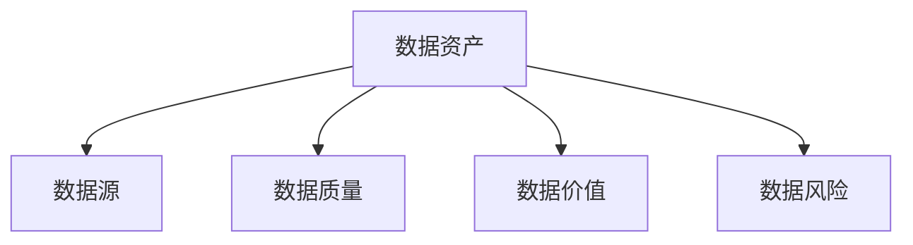

                 

# 价值投资中的数据资产评估

---

## 关键词：
数据资产评估, 价值投资, 数据资产, 投资评估, 数据驱动决策

---

## 摘要：
在当前数字化时代，数据已成为企业最重要的资产之一。本文将探讨如何在价值投资中对数据资产进行科学评估，分析数据资产评估的核心概念、算法原理、系统架构及实际应用。通过案例分析和最佳实践，本文将为投资者提供基于数据驱动的决策支持，帮助其在价值投资中实现更高效的资产管理和投资决策。

---

# 目录

1. 数据资产评估的背景与概念  
   1.1 数据资产的定义与特征  
   1.2 价值投资的基本原理  
   1.3 数据资产评估的必要性  
   1.4 数据资产评估的核心概念  

2. 数据资产评估的核心概念与联系  
   2.1 数据资产评估的核心概念原理  
   2.2 数据资产评估的核心概念属性特征对比  
   2.3 数据资产评估的ER实体关系图  
   2.4 本章小结  

3. 数据资产评估的算法原理  
   3.1 数据资产评估的基本算法  
   3.2 数据资产评估的数学模型与公式  
   3.3 数据资产评估的Python源代码实现  
   3.4 本章小结  

4. 数据资产评估的系统架构与设计  
   4.1 数据资产评估的系统功能设计  
   4.2 数据资产评估的系统架构设计  
   4.3 数据资产评估的系统接口设计  
   4.4 数据资产评估的系统交互设计  
   4.5 本章小结  

5. 数据资产评估的实战案例  
   5.1 数据资产评估的案例背景  
   5.2 数据资产评估的案例分析  
   5.3 数据资产评估的案例实现  
   5.4 数据资产评估的案例总结  
   5.5 本章小结  

6. 数据资产评估的最佳实践与注意事项  
   6.1 数据资产评估的最佳实践  
   6.2 数据资产评估的注意事项  
   6.3 数据资产评估的扩展阅读  
   6.4 本章小结  

---

## 第1章: 数据资产评估的背景与概念

### 1.1 数据资产的定义与特征

#### 1.1.1 数据资产的定义
数据资产是指企业在经营过程中产生的、具有价值的、可量化的数据资源。它不仅包括企业内部的业务数据，还包括外部获取的公开数据和第三方数据。

#### 1.1.2 数据资产的核心特征
数据资产具有以下核心特征：
1. **可量性**：数据资产可以通过特定的指标和方法进行量化评估。
2. **可增值性**：数据资产可以通过分析和应用产生更高的价值。
3. **可流动性**：数据资产可以在不同的业务场景中进行流动和应用。
4. **可扩展性**：数据资产可以通过积累和整合不断扩展其规模和价值。

#### 1.1.3 数据资产在价值投资中的作用
在价值投资中，数据资产的作用主要体现在以下几个方面：
1. **支持投资决策**：通过对数据资产的分析，投资者可以更好地识别投资机会和风险。
2. **提升投资效率**：数据资产可以帮助投资者快速获取信息，降低投资成本。
3. **增强投资效果**：通过数据资产的深度分析，投资者可以制定更加精准的投资策略。

---

### 1.2 价值投资的基本原理

#### 1.2.1 价值投资的定义
价值投资是一种投资策略，其核心思想是通过分析企业的内在价值，寻找被市场低估的投资标的进行长期投资。

#### 1.2.2 价值投资的核心理念
价值投资的核心理念包括以下几点：
1. **长期投资**：价值投资者通常关注企业的长期价值，而不是短期价格波动。
2. **安全边际**：投资者应以低于企业内在价值的价格买入股票。
3. **基本面分析**：通过对企业财务状况、行业地位、竞争优势等基本面因素的分析，评估企业的内在价值。

#### 1.2.3 数据资产与价值投资的结合
随着大数据技术的发展，数据资产在价值投资中的应用越来越广泛。通过数据资产的分析，投资者可以更全面地评估企业的基本面，发现潜在的投资机会。

---

### 1.3 数据资产评估的必要性

#### 1.3.1 数据资产在投资中的重要性
数据资产是企业的重要资源，其质量直接影响企业的经营成果。在价值投资中，数据资产的评估可以帮助投资者更好地了解企业的经营状况。

#### 1.3.2 数据资产评估的意义
1. **提高投资决策的准确性**：通过科学的数据资产评估，投资者可以更准确地评估企业的内在价值。
2. **降低投资风险**：数据资产评估可以帮助投资者识别潜在风险，避免盲目投资。
3. **提升投资效率**：数据资产评估可以提高投资决策的速度和效率。

#### 1.3.3 数据资产评估的挑战
1. **数据质量的不确定性**：数据资产的质量直接影响评估结果，但数据清洗和处理需要投入大量资源。
2. **评估方法的多样性**：不同数据资产的评估方法可能有所不同，选择合适的评估方法是关键。
3. **数据隐私和安全问题**：数据资产评估过程中需要保护数据隐私，避免数据泄露和滥用。

---

### 1.4 数据资产评估的核心概念

#### 1.4.1 数据资产评估的目标
数据资产评估的目标是通过对数据资产的量化分析，评估其对投资决策的贡献价值。

#### 1.4.2 数据资产评估的边界与外延
数据资产评估的边界包括：
1. **数据范围**：明确数据资产的范围和来源。
2. **评估指标**：确定评估的指标和标准。
3. **评估方法**：选择适合的评估方法和工具。

数据资产评估的外延包括：
1. **数据资产的生命周期管理**。
2. **数据资产的动态价值评估**。
3. **数据资产的组合优化**。

#### 1.4.3 数据资产评估的核心要素
1. **数据资产的质量**：包括准确性、完整性、及时性等。
2. **数据资产的使用场景**：不同场景下的数据资产价值可能不同。
3. **数据资产的生命周期**：数据资产的价值会随着生命周期的变化而变化。

---

## 第2章: 数据资产评估的核心概念与联系

### 2.1 数据资产评估的核心概念原理

#### 2.1.1 数据资产的内在价值
数据资产的内在价值是指其在特定场景下的实际价值，通常与数据的准确性、相关性和可用性密切相关。

#### 2.1.2 数据资产的外在价值
数据资产的外在价值是指其在市场上的交换价值，通常由市场供需关系决定。

#### 2.1.3 数据资产的综合价值
数据资产的综合价值是内在价值和外在价值的综合体现，反映了数据资产在实际应用中的整体价值。

---

### 2.2 数据资产评估的核心概念属性特征对比

#### 2.2.1 数据资产的质量特征
| 特征 | 描述 |
|------|------|
| 准确性 | 数据的正确性和可靠性 |
| 完整性 | 数据的完整性和全面性 |
| 及时性 | 数据的更新频率和时效性 |
| 相关性 | 数据与投资目标的相关性 |

#### 2.2.2 数据资产的使用特征
| 特征 | 描述 |
|------|------|
| 可用性 | 数据的可访问性和可利用性 |
| 可扩展性 | 数据的可扩展性和可扩展性 |
| 可定制性 | 数据的可定制性和可塑性 |

#### 2.2.3 数据资产的经济特征
| 特征 | 描述 |
|------|------|
| 价值性 | 数据资产对投资决策的贡献价值 |
| 风险性 | 数据资产可能带来的投资风险 |
| 流动性 | 数据资产的流动性及其变现能力 |

---

### 2.3 数据资产评估的ER实体关系图

---

### 2.4 本章小结

---

通过以上大纲，我们可以看到《价值投资中的数据资产评估》这篇文章将从背景、概念、算法、系统架构、实战案例到最佳实践等多个方面进行深入分析，帮助读者全面理解数据资产在价值投资中的重要作用和具体应用。

