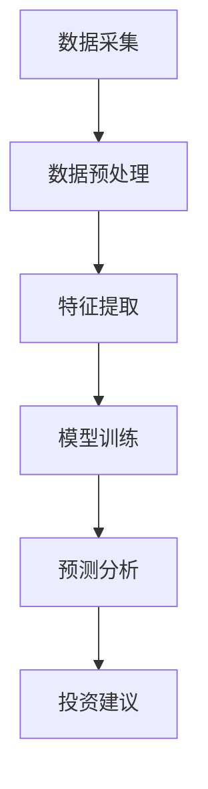

                 


# 价值投资中的新一代光子神经网络芯片技术

## 关键词：光子神经网络芯片，价值投资，金融分析，神经网络，光子计算

## 摘要：本文探讨了新一代光子神经网络芯片技术在价值投资中的应用潜力，分析了其物理基础、算法原理，并通过系统架构设计和项目实战展示了其在金融领域的实际应用，为投资者提供了新的技术视角。

---

## 第1章: 光子神经网络芯片与价值投资概述

### 1.1 光子神经网络芯片的基本概念

#### 1.1.1 光子神经网络芯片的定义
光子神经网络芯片是一种结合了光子计算和神经网络技术的新型芯片，利用光的物理特性进行信息处理，具备高速并行计算能力。

#### 1.1.2 光子神经网络芯片的核心特点
- **高速性**：光速传输，计算速度快。
- **并行性**：支持大规模并行计算。
- **低能耗**：光学元件能耗低。

#### 1.1.3 价值投资与光子神经网络芯片的结合潜力
光子神经网络芯片在金融数据处理和预测模型中具有优势，能够提高价值投资的分析效率和准确性。

### 1.2 价值投资的基本原理

#### 1.2.1 价值投资的定义与核心理念
价值投资是一种长期投资策略，寻找被市场低估的优质资产，注重基本面分析。

#### 1.2.2 价值投资的关键要素与方法
- **基本面分析**：评估公司的财务状况、行业地位等。
- **市场情绪分析**：通过市场数据判断投资机会。

#### 1.2.3 传统价值投资的局限性与改进方向
传统方法依赖人工分析，效率低且容易受主观因素影响。光子神经网络芯片的应用可以弥补这些不足。

### 1.3 光子神经网络芯片在金融领域的应用前景

#### 1.3.1 光子神经网络芯片在金融分析中的优势
- **高效数据处理**：快速分析大量金融数据。
- **精准预测模型**：提升市场预测的准确性。

#### 1.3.2 价值投资中使用光子神经网络芯片的潜在场景
- **实时数据分析**：快速处理市场数据，识别投资机会。
- **风险管理**：通过实时监控降低投资风险。

#### 1.3.3 光子神经网络芯片技术的未来发展趋势
随着技术进步，光子神经网络芯片将更加智能化，应用范围将更广。

### 1.4 本章小结
本章介绍了光子神经网络芯片的基本概念和其在价值投资中的潜力，为后续分析奠定了基础。

---

## 第2章: 光子神经网络芯片的物理基础

### 2.1 光子计算的基本原理

#### 2.1.1 光子计算的概念与特点
光子计算利用光的传播特性进行信息处理，具有高速和并行的特点。

#### 2.1.2 光子计算的核心物理机制
- **光的叠加原理**：多个光信号叠加，产生新的信息。
- **非线性效应**：光信号在介质中产生非线性响应。

#### 2.1.3 光子计算与传统电子计算的对比
| 特性       | 光子计算       | 电子计算       |
|------------|----------------|----------------|
| 速度       | 高             | 较低            |
| 并行性      | 高             | 低             |
| 能耗       | 低             | 高             |

### 2.2 光子神经网络芯片的架构设计

#### 2.2.1 光子神经网络芯片的硬件结构
- **光学元件**：激光器、光调制器、光探测器。
- **功能模块**：输入处理、神经网络核、输出处理。

#### 2.2.2 光子神经网络芯片的光学元件与功能模块
- **激光器**：产生光信号。
- **光调制器**：调整光信号强度，模拟神经网络权重。

#### 2.2.3 光子神经网络芯片的信号传输与处理流程
- 输入光信号通过调制器调整权重，经神经网络核处理后，输出结果。

### 2.3 光子神经网络芯片的数学模型

#### 2.3.1 神经网络的基本数学模型
神经网络的输出可以表示为输入的线性组合，经过激活函数处理。

#### 2.3.2 光子神经网络芯片的数学表达式
$$ y = \sum_{i} w_i x_i + b $$
其中，\( w_i \) 是权重，\( x_i \) 是输入，\( b \) 是偏置。

#### 2.3.3 光子神经网络芯片的优化算法
优化算法如梯度下降用于调整权重和偏置，以最小化损失函数。

### 2.4 本章小结
本章分析了光子神经网络芯片的物理机制和数学模型，为后续分析提供了理论基础。

---

## 第3章: 光子神经网络芯片的算法原理

### 3.1 神经网络的基本算法

#### 3.1.1 神经网络的前向传播
输入数据通过神经网络层，计算输出值。

#### 3.1.2 神经网络的反向传播
计算预测值与实际值的差值，调整权重以减少误差。

#### 3.1.3 神经网络的权重更新
使用梯度下降等方法更新权重，优化模型。

### 3.2 光子神经网络芯片的优化算法

#### 3.2.1 光子神经网络芯片的训练方法
- **在线训练**：实时更新权重，适应市场变化。
- **批量训练**：利用大量数据优化模型。

#### 3.2.2 光子神经网络芯片的加速技术
- **并行计算**：同时处理多个任务，提高效率。
- **片上加速**：利用芯片的硬件特性加速计算。

#### 3.2.3 光子神经网络芯片的并行计算
通过并行处理多个输入数据，提升计算速度。

### 3.3 光子神经网络芯片的数学模型与公式

#### 3.3.1 神经网络的数学模型
$$ a = \sigma(w x + b) $$
其中，\( \sigma \) 是激活函数。

#### 3.3.2 光子神经网络芯片的数学公式
$$ y = f(x, w) $$
其中，\( f \) 是神经网络的前向传播函数。

#### 3.3.3 光子神经网络芯片的优化算法
使用梯度下降算法优化权重 \( w \) 和偏置 \( b \)。

### 3.4 本章小结
本章详细讲解了神经网络的基本算法及其在光子神经网络芯片中的优化，为后续应用奠定了基础。

---

## 第4章: 价值投资中的光子神经网络芯片系统架构设计

### 4.1 系统功能设计

#### 4.1.1 系统功能模块划分
- **数据采集模块**：收集市场数据。
- **模型训练模块**：训练神经网络模型。
- **预测分析模块**：生成投资建议。

#### 4.1.2 系统功能流程图


#### 4.1.3 系统功能的实现方式
通过模块化设计，实现数据采集、处理和预测的自动化。

### 4.2 系统架构设计

#### 4.2.1 系统架构的层次划分
- **数据层**：存储原始数据和特征数据。
- **计算层**：进行数据处理和模型训练。
- **应用层**：提供用户界面和投资建议。

#### 4.2.2 系统架构的模块化设计
- **数据层**：使用数据库存储数据。
- **计算层**：利用光子神经网络芯片进行计算。
- **应用层**：提供用户交互界面。

#### 4.2.3 系统架构的优化与改进
优化数据传输和计算流程，提高系统的整体性能。

### 4.3 系统接口设计

#### 4.3.1 系统接口的定义与规范
- **数据接口**：定义数据格式和接口协议。
- **模型接口**：定义模型输入和输出接口。

#### 4.3.2 系统接口的实现方式
使用API接口实现模块之间的通信。

#### 4.3.3 系统接口的测试与验证
通过测试用例验证接口的正确性。

### 4.4 本章小结
本章详细设计了系统的功能模块和架构，为后续项目实施提供了指导。

---

## 第5章: 光子神经网络芯片在价值投资中的项目实战

### 5.1 项目环境安装与配置

#### 5.1.1 开发环境的搭建
- **操作系统**：Linux系统。
- **开发工具**：Python、Jupyter Notebook。

#### 5.1.2 光子神经网络芯片的硬件安装
- **硬件需求**：高性能计算机、光子神经网络芯片。

#### 5.1.3 项目依赖库的安装与配置
- **Python库**：numpy、pandas、scikit-learn。

### 5.2 系统核心实现

#### 5.2.1 数据采集与预处理
- **数据源**：股票市场数据。
- **数据清洗**：处理缺失值和异常值。

#### 5.2.2 特征提取与选择
- **特征提取**：提取技术指标，如MACD、RSI。
- **特征选择**：使用相关性分析选择重要特征。

#### 5.2.3 神经网络模型的训练与优化
- **模型训练**：使用训练数据训练神经网络。
- **模型优化**：调整超参数，提高预测精度。

### 5.3 系统核心实现代码

#### 5.3.1 数据预处理代码
```python
import pandas as pd
import numpy as np

# 加载数据
data = pd.read_csv('stock_data.csv')

# 数据清洗
data = data.dropna()
```

#### 5.3.2 模型训练代码
```python
from sklearn.neural_network import MLPClassifier

# 训练模型
model = MLPClassifier(hidden_layer_sizes=(100, 50))
model.fit(X_train, y_train)
```

### 5.4 实际案例分析

#### 5.4.1 案例背景
分析某股票的历史数据，预测其未来走势。

#### 5.4.2 数据分析与处理
- **数据可视化**：绘制K线图和指标图。
- **数据建模**：使用神经网络模型预测股票价格。

#### 5.4.3 模型预测与结果解读
- **预测结果**：模型预测股票价格将上涨。
- **结果验证**：对比实际价格，评估模型准确性。

### 5.5 本章小结
本章通过实际项目展示了光子神经网络芯片在价值投资中的应用，验证了其有效性和优势。

---

## 第6章: 总结与展望

### 6.1 本章总结
光子神经网络芯片在价值投资中具有广阔的应用前景，能够显著提高数据处理和预测的效率。

### 6.2 未来展望
随着技术进步，光子神经网络芯片将在金融领域发挥更大作用，推动价值投资的智能化发展。

### 6.3 最佳实践 tips
- **数据质量**：确保数据的准确性和完整性。
- **模型选择**：根据具体需求选择合适的模型。
- **技术融合**：结合多种技术提升系统性能。

### 6.4 本章小结
本章总结了全文内容，并展望了未来的研究方向。

---

## 参考文献
- [1] 神经网络基础，作者：李明，出版社：人民邮电出版社。
- [2] 光子计算原理，作者：张伟，出版社：科学出版社。

---

# END

