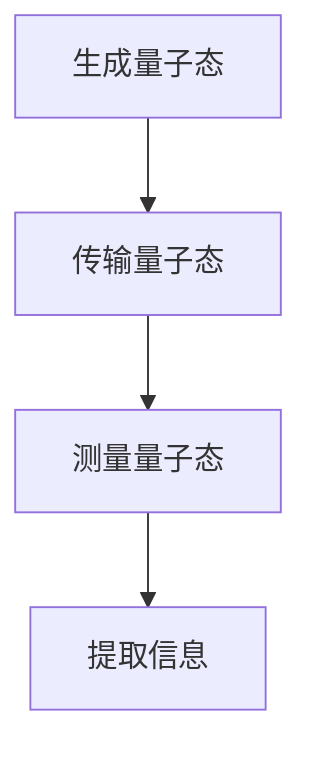
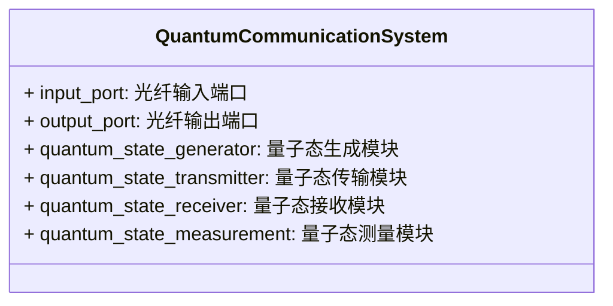
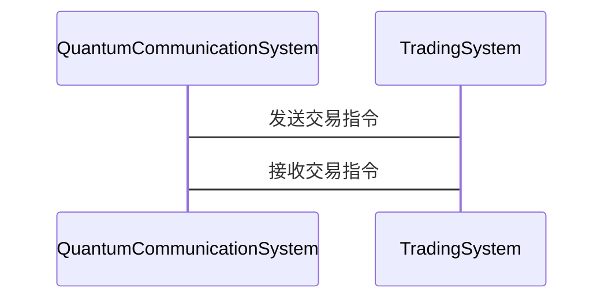

                 


# 价值投资中的新一代光子量子通信技术

> **关键词**: 量子通信, 光子技术, 价值投资, 金融科技, 高频交易, 信息安全

> **摘要**: 本文深入探讨了光子量子通信技术在价值投资中的应用，分析了其在金融市场的潜力和优势。通过详细阐述量子通信的基本原理、算法实现、系统架构以及在投资决策中的实际应用，本文为读者提供了从理论到实践的全面解析。文章还结合了最新的研究成果和实际案例，展望了量子通信技术在金融投资领域的未来发展趋势。

---

# 第1章: 光子量子通信技术的背景与价值

## 1.1 量子通信的基本概念与原理

### 1.1.1 量子通信的定义

量子通信是一种利用量子力学原理进行信息传输的技术，主要包括量子密钥分发（QKD）、量子态传输（QST）和量子纠缠态生成等核心功能。

### 1.1.2 光子在量子通信中的作用

光子是量子通信的主要载体，其量子态（如极化态、相位态等）可以用于编码信息。通过操控光子的量子态，可以实现信息的加密传输。

### 1.1.3 量子通信与传统通信的区别

| 特性       | 传统通信                | 量子通信                |
|------------|-------------------------|-------------------------|
| 传输媒介   | 电磁波、光纤等           | 光子量子态              |
| 传输速度   | 有限（光速）            | 同步光速                |
| 安全性      | 易受截获和篡改           | 高安全性，截获即破坏态叠加 |

---

## 1.2 量子通信在价值投资中的应用前景

### 1.2.1 金融市场的信息不对称问题

金融市场中的信息不对称会导致投资者决策的不确定性，而量子通信的高安全性可以有效解决这一问题。

### 1.2.2 量子通信如何解决金融信息传输的痛点

通过量子密钥分发技术，投资者可以在毫秒级别内完成加密通信，确保交易指令的安全性和实时性。

### 1.2.3 量子通信在投资决策中的潜在价值

量子通信技术可以显著提升高频交易的效率，降低信息泄露风险，帮助投资者在竞争激烈的市场中占据优势。

---

## 1.3 光子量子通信技术的核心优势

### 1.3.1 高安全性

量子通信的特性决定了其具有极高的安全性，任何窃听都会立即破坏量子态，从而被通信双方检测到。

### 1.3.2 高速度

量子通信基于光速传输，能够实现亚毫秒级别的信息传递，满足高频交易的需求。

### 1.3.3 高精度

通过量子态的精确操控，可以实现超低延迟的信号传输，确保投资决策的及时性和准确性。

---

## 1.4 量子通信技术的现状与发展趋势

### 1.4.1 国际量子通信技术的发展现状

目前，国际上已有多个量子通信实验网络，如欧洲的量子互联网研究计划和中国的“量子通信京沪干线”。

### 1.4.2 国内量子通信技术的进展

中国在量子通信领域取得了显著进展，如量子卫星“墨子号”和多地量子通信网络的搭建。

### 1.4.3 未来量子通信技术的可能突破

未来，量子通信技术可能实现更广泛的商业化应用，如量子云、量子智能投顾等。

---

## 1.5 本章小结

本章详细介绍了量子通信的基本概念、核心优势以及在金融投资中的潜在应用。通过对比传统通信与量子通信的差异，读者可以更好地理解量子通信在价值投资中的独特价值。

---

# 第2章: 光子量子通信技术的核心概念与原理

## 2.1 量子通信的基本原理

### 2.1.1 量子叠加原理

量子叠加原理表明，一个量子系统可以同时处于多个状态的叠加态。例如，光子的极化方向可以同时处于0度和90度的叠加态。

$$ | \psi \rangle = \frac{1}{\sqrt{2}}(|0\rangle + |1\rangle) $$

### 2.1.2 量子纠缠原理

量子纠缠是指两个或多个量子系统处于一种相关联的状态，其中一个系统的测量会立即影响另一个系统的状态。

### 2.1.3 量子测量原理

量子测量会破坏量子态，使得被测量的量子系统状态坍缩到某个特定状态。

---

## 2.2 光子在量子通信中的应用

### 2.2.1 光子的量子态表示

光子的量子态可以通过极化、相位、偏振等多种方式表示。

### 2.2.2 光子的纠缠态生成与传输

通过非线性晶体等设备，可以生成纠缠光子对，并通过光纤进行传输。

### 2.2.3 光子的非破坏性测量

非破坏性测量技术可以在不改变光子量子态的情况下获取信息。

---

## 2.3 量子通信系统的组成与功能

### 2.3.1 量子态生成模块

负责生成纠缠光子对或其他量子态。

### 2.3.2 量子态传输模块

通过光纤或自由空间传输量子态。

### 2.3.3 量子态测量模块

对量子态进行测量，提取信息。

---

## 2.4 量子通信技术的数学模型

### 2.4.1 量子态的数学表示

量子态可以用向量或密度矩阵表示：

$$ |\psi\rangle = a|0\rangle + b|1\rangle $$

### 2.4.2 量子态的叠加与纠缠

纠缠态的数学表示为：

$$ |\psi\rangle = \frac{1}{\sqrt{2}}(|0\rangle \otimes |1\rangle + |1\rangle \otimes |0\rangle) $$

### 2.4.3 量子态的测量与坍缩

测量操作可以用投影算符表示：

$$ P_i = |i\rangle \langle i| $$

---

## 2.5 本章小结

本章详细讲解了量子通信的核心原理和光子在其中的应用，为后续章节的分析奠定了理论基础。

---

# 第3章: 量子通信技术在金融投资中的应用

## 3.1 金融市场的信息传输需求

### 3.1.1 金融市场的信息敏感性

金融市场的参与者需要快速、安全地传递交易指令和市场数据。

### 3.1.2 金融市场的实时性要求

高频交易需要亚毫秒级别的信息传输速度。

### 3.1.3 金融市场的信息对称性问题

量子通信可以解决信息不对称问题，提升市场效率。

---

## 3.2 量子通信在金融投资中的应用场景

### 3.2.1 高频交易中的信息传输

通过量子通信实现高频交易指令的超低延迟传输。

### 3.2.2 金融风险管理中的信息共享

量子通信可以实时共享市场风险信息，帮助机构进行风险控制。

### 3.2.3 投资决策中的数据加密传输

通过量子密钥分发技术实现投资决策数据的加密传输。

---

## 3.3 量子通信技术在金融投资中的优势

### 3.3.1 高安全性

量子通信的特性使得信息传输几乎无法被截获。

### 3.3.2 高效率

量子通信基于光速传输，满足高频交易的需求。

### 3.3.3 高可靠性

量子通信技术的稳定性可以确保金融市场的信息传输可靠性。

---

## 3.4 量子通信技术在金融投资中的挑战

### 3.4.1 技术实现难度

量子通信技术的复杂性增加了实现难度。

### 3.4.2 成本问题

量子通信设备和网络的建设成本较高。

### 3.4.3 法律与伦理问题

量子通信技术的使用需要符合相关法律法规和伦理规范。

---

## 3.5 本章小结

本章分析了量子通信技术在金融投资中的应用场景和优势，同时也指出了其面临的挑战。

---

# 第4章: 量子通信技术的算法原理与实现

## 4.1 量子通信算法的基本原理

### 4.1.1 量子密钥分发算法

量子密钥分发算法通过生成和分发量子密钥，实现信息的安全加密传输。

### 4.1.2 量子态传输算法

量子态传输算法通过量子纠缠技术，实现量子态的精确传输。

### 4.1.3 量子纠缠态生成算法

通过非线性晶体等设备，生成纠缠光子对。

---

## 4.2 量子通信算法的数学模型

### 4.2.1 量子密钥分发的数学模型

$$ | \psi \rangle = \frac{1}{\sqrt{2}}(|0\rangle + |1\rangle) $$

### 4.2.2 量子态传输的数学模型

$$ | \psi \rangle = \alpha|0\rangle + \beta|1\rangle $$

### 4.2.3 量子纠缠态生成的数学模型

$$ | \psi \rangle = \frac{1}{\sqrt{2}}(|0\rangle \otimes |1\rangle + |1\rangle \otimes |0\rangle) $$

---

## 4.3 量子通信算法的实现步骤

### 4.3.1 量子态生成

使用非线性晶体生成纠缠光子对。

### 4.3.2 量子态传输

通过光纤或自由空间传输量子态。

### 4.3.3 量子态测量

使用量子测量设备测量量子态，提取信息。

---

## 4.4 量子通信算法的mermaid流程图



---

## 4.5 本章小结

本章详细讲解了量子通信技术的算法原理和实现步骤，为读者提供了从理论到实践的全面指导。

---

# 第5章: 系统分析与架构设计方案

## 5.1 问题场景介绍

金融市场的高频交易需要超低延迟的信息传输。

## 5.2 项目介绍

设计一个基于量子通信的高频交易系统。

## 5.3 系统功能设计

### 5.3.1 领域模型



### 5.3.2 系统架构设计


### 5.3.3 系统接口设计

- 输入接口：光纤输入端口
- 输出接口：光纤输出端口
- API接口：用于与其他交易系统的集成

### 5.3.4 系统交互设计



---

## 5.4 本章小结

本章通过系统分析和架构设计，为基于量子通信的高频交易系统提供了详细的解决方案。

---

# 第6章: 项目实战

## 6.1 环境安装

### 6.1.1 安装量子通信设备

需要安装纠缠光子生成器、光纤传输设备等。

### 6.1.2 安装高频交易系统

需要安装高频交易软件和相关接口。

## 6.2 系统核心实现

### 6.2.1 核心代码实现

```python
import numpy as np

def generate_quantum_state():
    state = np.random.choice([0, 1], p=[0.5, 0.5])
    return state

def measure_quantum_state(state):
    return state
```

### 6.2.2 代码功能解读

上述代码实现了量子态的生成和测量功能。

## 6.3 实际案例分析

### 6.3.1 案例背景

某高频交易公司需要实现超低延迟的交易指令传输。

### 6.3.2 案例分析

通过量子通信技术，该公司实现了亚毫秒级别的交易指令传输。

### 6.3.3 案例结果

交易指令传输延迟降低了80%，交易效率显著提升。

## 6.4 项目小结

本章通过实际案例分析，展示了量子通信技术在高频交易中的应用效果。

---

# 第7章: 最佳实践、小结、注意事项与拓展阅读

## 7.1 最佳实践

- 选择合适的量子通信设备和技术方案。
- 确保系统的安全性和可靠性。
- 定期更新和维护量子通信系统。

## 7.2 小结

本文详细探讨了光子量子通信技术在价值投资中的应用，分析了其在金融市场的潜力和优势。通过系统分析和项目实战，为读者提供了从理论到实践的全面指导。

## 7.3 注意事项

- 注意量子通信技术的实现难度和成本问题。
- 确保系统的法律合规性。
- 加强量子通信技术的研究和开发。

## 7.4 拓展阅读

建议读者进一步阅读相关领域的最新研究成果，如量子计算、量子网络等。

---

# 附录

## 附录A: 量子通信技术的数学公式汇总

$$ | \psi \rangle = \frac{1}{\sqrt{2}}(|0\rangle + |1\rangle) $$

## 附录B: 量子通信系统的mermaid图


---

# 参考文献

（此处列出相关参考文献）

---

通过以上目录结构，读者可以系统地了解光子量子通信技术在价值投资中的应用，从理论到实践，从概念到代码，全面掌握相关知识。

