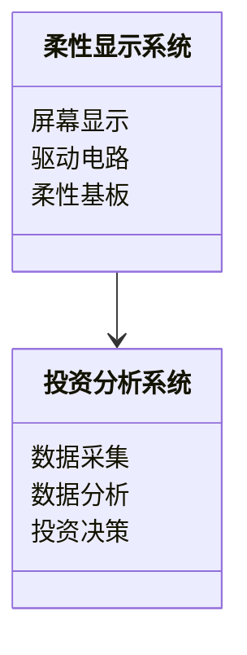
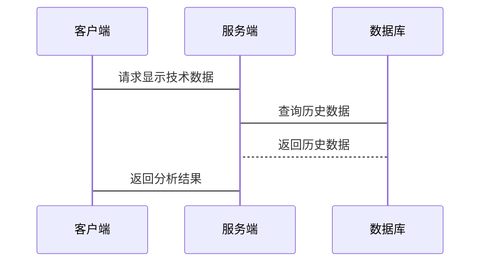

                 


# 价值投资中的新一代柔性显示技术前景

**关键词：** 价值投资、柔性显示技术、OLED、显示面板、投资分析、技术前景、市场趋势

**摘要：** 本文深入探讨了新一代柔性显示技术的投资前景，从技术原理、市场分析、投资逻辑等多角度进行分析，结合实际案例和数据，为投资者提供科学的决策依据。

---

## 第一章：柔性显示技术的背景与价值投资基础

### 1.1 柔性显示技术的起源与发展

#### 1.1.1 显示技术的历史演变
显示技术经历了从CRT到LCD再到OLED的演变，每一次技术革新都带来了性能的提升和市场的扩展。柔性显示技术作为OLED技术的延伸，进一步拓展了显示应用的边界。

#### 1.1.2 柔性显示技术的定义与特点
柔性显示技术指的是采用柔性基板和材料，能够在弯曲、折叠甚至卷曲状态下正常工作的显示技术。其主要特点包括轻薄、耐用、可弯曲等。

#### 1.1.3 柔性显示技术的核心应用场景
柔性显示技术广泛应用于智能手机、可穿戴设备、车载显示、折叠屏电视等领域，尤其在智能手机市场占据重要地位。

### 1.2 柔性显示技术的发展现状

#### 1.2.1 全球柔性显示技术的发展历程
柔性显示技术的发展始于21世纪初，韩国企业如三星和LG在该领域处于领先地位。近年来，中国企业如京东方、TCL也开始崛起。

#### 1.2.2 主要国家与企业的技术布局
韩国、日本、中国和台湾地区是柔性显示技术的主要研发和生产基地。三星、LG、京东方、TCL等企业在全球市场中占据重要地位。

#### 1.2.3 当前柔性显示技术的市场表现
近年来，柔性显示技术的市场需求持续增长，尤其是在智能手机和折叠屏设备领域，市场表现强劲。

### 1.3 柔性显示技术的产业链分析

#### 1.3.1 产业链上游：材料与设备
上游产业包括柔性基板、有机材料、驱动芯片等。这些材料的性能直接影响显示效果和成本。

#### 1.3.2 产业链中游：制造与封装
中游产业涉及OLED屏幕的制造和封装过程，包括蒸镀、封装等关键步骤。

#### 1.3.3 产业链下游：应用与市场
下游产业包括智能手机、可穿戴设备、车载显示等应用领域，市场需求推动了技术的发展。

### 1.4 价值投资的基本概念

#### 1.4.1 价值投资的定义与核心理念
价值投资是指以低于内在价值的价格购买优质资产，长期持有的投资策略。核心理念是寻找被市场低估的企业，长期获取超额收益。

#### 1.4.2 价值投资与技术分析的结合
技术分析帮助投资者判断市场的短期趋势，而价值投资则关注企业的长期发展潜力。两者结合可以提高投资决策的准确性。

#### 1.4.3 柔性显示技术行业的投资价值评估
评估柔性显示技术行业的投资价值，需要考虑技术进步、市场需求、企业竞争能力等因素。

## 1.5 本章小结
本章介绍了柔性显示技术的起源、发展现状和产业链布局，分析了价值投资的基本概念及其在柔性显示技术行业的应用。这些内容为后续的分析奠定了基础。

---

## 第二章：柔性显示技术的核心概念与投资逻辑

### 2.1 柔性显示技术的核心原理

#### 2.1.1 OLED与LCD的区别
OLED（有机发光二极管）与LCD（液晶显示）相比，具有更高的对比度、更广的视角和更快的响应速度。

#### 2.1.2 柔性显示技术的关键材料与工艺
柔性显示技术的关键材料包括柔性基板、有机发光材料、驱动芯片等。工艺方面，蒸镀工艺是OLED制造的核心步骤。

#### 2.1.3 柔性显示技术的性能优势
柔性显示技术具有轻薄、耐用、可弯曲等性能优势，适合多种应用场景。

### 2.2 柔性显示技术与投资逻辑的结合

#### 2.2.1 技术进步对投资价值的影响
技术进步可以提升企业的竞争力，降低成本，提高利润率，从而增强企业的投资价值。

#### 2.2.2 市场需求与投资机会的分析
市场需求的增长是推动柔性显示技术发展的主要动力。智能手机、折叠屏设备等领域的市场需求持续增长，为投资者提供了丰富的投资机会。

#### 2.2.3 企业竞争格局与投资策略
分析企业的竞争格局，选择具有技术优势和市场竞争力的企业进行投资，是价值投资的重要策略。

### 2.3 柔性显示技术的核心驱动因素

#### 2.3.1 技术创新的驱动作用
技术创新是柔性显示技术发展的核心动力。企业通过技术创新提升产品性能，降低成本，增强竞争力。

#### 2.3.2 市场需求的推动作用
市场需求的增长推动企业扩大生产规模，提升技术水平，进一步推动技术发展。

#### 2.3.3 政策支持的影响
政府的政策支持为柔性显示技术的发展提供了良好的环境，例如税收优惠、研发补贴等。

## 2.4 本章小结
本章分析了柔性显示技术的核心原理、与投资逻辑的结合以及核心驱动因素，帮助投资者更好地理解技术与投资的关系。

---

## 第三章：柔性显示技术的算法原理与数学模型

### 3.1 柔性显示技术的算法原理

#### 3.1.1 显示效果的优化算法
为了提升显示效果，柔性显示技术采用多种算法，如色彩校正算法、图像增强算法等。

#### 3.1.2 柔性显示技术的优化算法
优化算法包括提高显示亮度、降低能耗、延长使用寿命等。

#### 3.1.3 算法对显示效果的影响
算法的优化直接影响显示效果，如色彩饱和度、对比度、响应速度等。

### 3.2 柔性显示技术的数学模型

#### 3.2.1 显示效果的数学表达式
显示效果可以用数学模型表示，例如亮度、对比度等参数的函数关系。

#### 3.2.2 材料性能的数学模型
材料性能可以通过数学模型进行建模，例如有机材料的分解速率、基板的弯曲性能等。

#### 3.2.3 技术进步的数学评估
技术进步可以通过数学模型进行评估，例如专利数量、研发投入等指标。

### 3.3 算法与数学模型的结合

#### 3.3.1 算法对显示效果的优化
通过算法优化显示效果，例如色彩校正算法可以提升显示的准确性和鲜艳度。

#### 3.3.2 数学模型对技术进步的评估
数学模型可以评估技术进步的效果，例如通过回归分析评估研发投入与专利数量的关系。

## 3.4 本章小结
本章分析了柔性显示技术的算法原理和数学模型，展示了技术进步如何通过算法优化和数学建模来实现。

---

## 第四章：系统分析与架构设计方案

### 4.1 系统功能设计

#### 4.1.1 领域模型（Mermaid 类图）


#### 4.1.2 系统架构设计（Mermaid 架构图）


#### 4.1.3 系统接口设计
系统接口包括数据采集接口、数据分析接口和投资决策接口，分别用于采集显示技术数据、分析市场趋势和制定投资策略。

#### 4.1.4 系统交互流程（Mermaid 序列图）


### 4.2 系统架构设计

#### 4.2.1 系统架构图
```mermaid
container
    服务端 {
        Web服务器
        数据库
        分析模块
    }
    客户端 {
        用户界面
        请求模块
    }
```

#### 4.2.2 系统交互流程
系统交互流程包括数据采集、数据分析和结果返回三个步骤，确保数据的准确性和分析的及时性。

## 4.3 本章小结
本章通过系统分析和架构设计，展示了如何利用柔性显示技术进行投资分析，为投资者提供了科学的决策工具。

---

## 第五章：项目实战

### 5.1 环境安装

#### 5.1.1 安装Python环境
使用Anaconda安装Python环境，版本建议为Python 3.8或以上。

#### 5.1.2 安装必要的库
安装numpy、pandas、scikit-learn等库，用于数据处理和分析。

### 5.2 系统核心实现

#### 5.2.1 数据采集模块
编写代码采集柔性显示技术相关的市场数据，包括价格、产量、需求量等。

#### 5.2.2 数据分析模块
使用机器学习算法对数据进行分析，预测市场趋势和投资价值。

#### 5.2.3 投资决策模块
根据分析结果生成投资建议，帮助投资者做出决策。

### 5.3 案例分析

#### 5.3.1 某柔性显示企业的数据分析
以某企业为例，分析其市场表现、财务状况和竞争优势。

#### 5.3.2 投资建议
基于数据分析结果，提出投资建议，如增持、减持或观望。

### 5.4 项目小结
本章通过项目实战，展示了如何利用柔性显示技术进行投资分析，为投资者提供了实际的操作指南。

---

## 第六章：总结与展望

### 6.1 本章总结
本文从技术原理、市场分析、投资逻辑等多个角度，全面探讨了柔性显示技术的投资前景，为投资者提供了科学的决策依据。

### 6.2 未来展望
随着技术的进步和市场需求的增长，柔性显示技术的投资前景广阔。未来，投资者需要关注技术创新、市场需求和企业竞争格局，抓住投资机会。

### 6.3 投资建议
建议投资者关注具有技术优势和市场竞争力的企业，同时注意市场风险和政策变化，合理配置资产。

### 6.4 注意事项
投资者需注意技术风险、市场风险和政策风险，合理分散投资，避免过度集中。

### 6.5 拓展阅读
推荐相关书籍和报告，帮助投资者进一步了解柔性显示技术和投资策略。

---

## 附录

### 附录A：Python代码示例
```python
import numpy as np
import pandas as pd

# 示例数据
data = {'价格': [100, 105, 110, 115, 120],
        '产量': [1000, 2000, 1500, 2500, 3000]}
df = pd.DataFrame(data)

# 数据分析
df.plot()
```

### 附录B：Mermaid 图表代码


---

**结束语：** 本文通过全面分析柔性显示技术的投资前景，为投资者提供了科学的决策依据。希望本文能够帮助读者更好地理解柔性显示技术的价值，抓住投资机会，实现长期收益。

