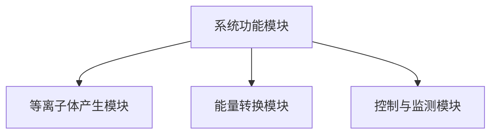

                 

# 价值投资中的新一代核聚变能源技术前景

## 关键词：核聚变能源、价值投资、能源技术、投资模型、能源市场

## 摘要：核聚变能源作为一种清洁、可持续的能源技术，近年来在能源市场中的潜力逐渐受到投资者的关注。本文从技术原理、投资价值评估、系统架构、项目实战和最佳实践等多个方面，详细分析核聚变能源的投资前景，帮助投资者更好地理解和把握这一领域的投资机会。

---

# 第1章: 核聚变能源的基本概念与投资背景

## 1.1 核聚变能源的基本概念

### 1.1.1 核聚变的基本原理

核聚变是指两个轻核原子在高温高压条件下结合成一个较重的原子核，并释放出巨大能量的过程。与核裂变不同，核聚变不产生长期放射性废料，且资源储量丰富，被认为是未来清洁能源的终极解决方案。

$$ E = mc^2 $$

### 1.1.2 核聚变与核裂变的区别

| 核聚变 | 核裂变 |
|-------|--------|
| 能量来源：氘、氚等轻核 | 能量来源：铀-235、钚-239等重核 |
| 优点：无放射性废料 | 缺点：产生放射性废料 |
| 反应条件：高温高压 | 反应条件：中子撞击 |

### 1.1.3 核聚变能源的优势与挑战

优势：
- 清洁能源，无碳排放。
- 能源密度高，资源丰富。
- 运行安全，不会发生类似核裂变的链式反应。

挑战：
- 技术复杂，研发成本高。
- 尚未实现商业化，仍处于试验阶段。
- 对高温超导材料和强磁场技术的要求极高。

## 1.2 核聚变能源的投资背景

### 1.2.1 全球能源结构的现状与未来趋势

- 当前能源结构以化石能源为主，但化石能源面临资源枯竭和环境问题。
- 可再生能源（如风能、太阳能）快速发展，但存在间歇性和储存问题。
- 核聚变能源被认为是解决能源危机的关键技术之一。

### 1.2.2 核聚变能源在能源市场中的潜力

- 核聚变能源一旦实现商业化，将彻底改变全球能源市场。
- 作为清洁能源，核聚变能源将推动能源结构向低碳化、可持续化转型。
- 投资核聚变能源企业将带来巨大的经济回报和社会价值。

### 1.2.3 投资者关注核聚变能源的驱动因素

- 环保需求：减少碳排放，应对气候变化。
- 能源安全：减少对化石能源的依赖，保障能源供应。
- 技术进步：核聚变技术的突破将带来巨大的投资机会。

## 1.3 核聚变能源的技术发展现状

### 1.3.1 国内外核聚变研究的进展

- 国际： ITER项目是目前最大的国际合作项目，致力于实现可控核聚变。
- 国内：中国在 EAST（托卡马克装置）上取得重要进展，成功实现了100秒的长脉冲高约束运行。

### 1.3.2 核聚变技术的关键突破点

- 高温超导材料：实现更强的磁场约束。
- 激光惯性约束：提高聚变效率。
- 智能化控制：提高聚变装置的稳定性和效率。

### 1.3.3 核聚变技术的商业化前景

- 尚处于研发阶段，距离商业化仍有距离。
- 需要大量资金投入和技术创新。
- 政府和企业的支持是核聚变能源商业化的重要推动力。

## 1.4 本章小结

本章介绍了核聚变能源的基本概念、优势与挑战、投资背景以及技术发展现状。核聚变能源作为未来清洁能源的核心技术，具有巨大的投资潜力，但也面临技术和商业化方面的挑战。

---

# 第2章: 核聚变能源的技术原理与核心要素

## 2.1 核聚变反应的基本原理

### 2.1.1 氘氚聚变反应的数学模型

$$ E = mc^2 $$

### 2.1.2 反应条件与能量释放

- 反应条件：高温（数亿摄氏度）、高压。
- 能量释放：主要以中子的形式释放能量，需通过热交换器转化为电能。

### 2.1.3 反应堆的设计与优化

- 磁约束聚变：利用强磁场将等离子体限制在特定区域内。
- 激光约束聚变：利用高能激光对目标进行压缩，使其发生聚变。

## 2.2 核聚变装置的核心技术

### 2.2.1 磁约束聚变装置（如托卡马克）

- 磁约束聚变装置通过环形磁场约束等离子体，实现持续的聚变反应。
- 托卡马克的设计是目前国际上最成功的磁约束聚变装置。

### 2.2.2 激光约束聚变装置（如国家点火装置）

- 激光约束聚变通过高能激光对氘氚目标进行压缩，使其瞬间达到聚变条件。
- 优点：能量转换效率高，但目前仍无法实现自持燃烧。

### 2.2.3 超导材料与强磁场技术

- 高温超导材料是实现强磁场约束的核心技术。
- 强磁场技术是磁约束聚变装置的关键。

## 2.3 核聚变能源系统的构成与优化

### 2.3.1 系统功能模块

- 等离子体产生与约束模块。
- 能量转换与储存模块。
- 控制与监测模块。

### 2.3.2 系统成本与经济性分析

- 研发成本高昂。
- 运行成本较低，但商业化之前仍需大量投入。

## 2.4 核聚变技术的创新与突破

### 2.4.1 新型聚变燃料的研究

- 氘-氚、氘-氘、氘-氢等燃料的研究与优化。
- 新型燃料的物理特性对聚变效率的影响。

### 2.4.2 高温超导材料的应用

- 高温超导材料的性能对聚变装置的磁场强度和稳定性影响巨大。

### 2.4.3 智能化聚变装置的开发

- 智能化控制技术的应用，提高聚变装置的运行效率和稳定性。

## 2.5 本章小结

本章详细介绍了核聚变能源的技术原理与核心要素，包括反应原理、装置类型、系统构成与优化、技术创新等。核聚变能源的技术复杂性和创新性是其投资价值的重要体现。

---

# 第3章: 核聚变能源投资价值的评估模型

## 3.1 投资价值评估的核心要素

### 3.1.1 技术可行性

- 技术成熟度：是否接近商业化。
- 研发团队的实力：是否具备持续创新能力。

### 3.1.2 市场需求

- 全球能源市场的增长潜力。
- 各国政府对核聚变能源的支持政策。

### 3.1.3 经济效益

- 项目的盈利能力：是否具备经济可行性。
- 投资回报周期：是否在可接受范围内。

## 3.2 核聚变能源投资的数学模型

### 3.2.1 项目净现值（NPV）模型

$$ NPV = \sum_{t=0}^{n} \frac{CF_t}{(1+r)^t} $$

### 3.2.2 内部收益率（IRR）模型

$$ IRR = r \text{ 使得 } NPV = 0 $$

### 3.2.3 投资回收期模型

$$ 投资回收期 = \frac{初始投资}{年均净收益} $$

## 3.3 核聚变能源投资的风险分析

### 3.3.1 技术风险

- 技术未成熟，商业化进程慢。
- 研发失败的风险。

### 3.3.2 市场风险

- 能源市场价格波动。
- 替代能源的竞争。

### 3.3.3 政策风险

- 政府政策的变化。
- 国际合作的不确定性。

## 3.4 本章小结

本章构建了核聚变能源投资价值的评估模型，包括净现值、内部收益率等指标，并分析了投资风险。投资者可以通过这些模型和分析，更好地评估核聚变能源的投资价值。

---

# 第4章: 核聚变能源技术的系统架构与实现

## 4.1 核聚变能源系统的整体架构

### 4.1.1 系统功能模块

- 等离子体产生模块：负责产生高温等离子体。
- 能量转换模块：将聚变反应释放的能量转化为电能。
- 控制与监测模块：实时监控系统运行状态。

### 4.1.2 系统架构设计

## 4.2 核聚变装置的实现

### 4.2.1 磁约束聚变装置的实现

- 托卡马克装置的结构设计。
- 高温超导线圈的应用。

### 4.2.2 激光约束聚变装置的实现

- 激光器的选择与配置。
- 目标设计与优化。

## 4.3 系统接口设计

### 4.3.1 能量转换模块接口

- 输入：高温等离子体。
- 输出：电能。

### 4.3.2 控制与监测模块接口

- 输入：系统运行状态数据。
- 输出：控制指令。

## 4.4 本章小结

本章详细介绍了核聚变能源系统的整体架构与实现，包括功能模块、系统设计、接口设计等。系统架构的设计对核聚变能源的商业化至关重要。

---

# 第5章: 核聚变能源技术的项目实战与最佳实践

## 5.1 项目实战

### 5.1.1 项目背景

- 投资标的：某核聚变能源公司。
- 项目目标：评估其投资价值。

### 5.1.2 数据收集

- 公司财务数据：收入、利润、研发投入等。
- 市场数据：能源市场价格、政策支持等。

### 5.1.3 投资评估

- 使用NPV模型评估项目的经济可行性。
- 使用IRR模型评估项目的投资回报。

### 5.1.4 风险分析

- 技术风险：聚变技术是否成熟。
- 市场风险：能源市场价格波动。

## 5.2 最佳实践

### 5.2.1 投资策略

- 长期投资：关注技术研发进展。
- 分散投资：降低风险。

### 5.2.2 风险管理

- 设立止损点：控制投资损失。
- 保持关注：及时了解行业动态。

### 5.2.3 长期趋势分析

- 核聚变技术的商业化进程。
- 全球能源市场的变化。

## 5.3 本章小结

本章通过实际案例分析，展示了如何在核聚变能源领域进行投资，并提出了最佳实践建议。投资者应关注技术发展、市场动态和政策变化，制定合理的投资策略。

---

# 总结

核聚变能源作为一种清洁、可持续的能源技术，具有巨大的投资潜力。然而，其技术和商业化进程仍面临诸多挑战。投资者在进行价值投资时，应结合技术可行性、市场需求和经济效益，制定合理的投资策略，并密切关注行业动态和政策变化。通过科学的投资评估和风险管理，投资者可以更好地把握核聚变能源的投资机会，实现长期的财富增长。

