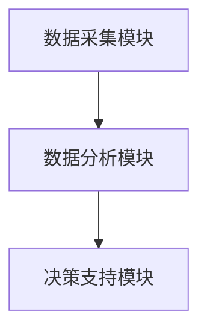
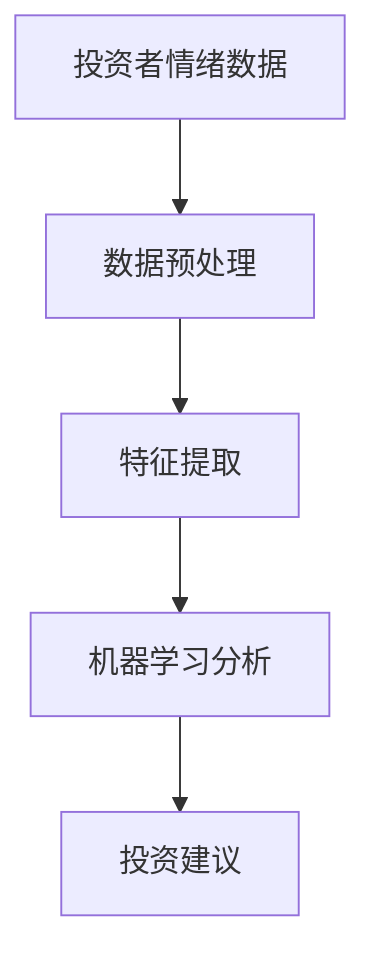

                 


# 价值投资中的新一代生物传感器技术前景

> 关键词：生物传感器技术，价值投资，数据分析，投资决策，科技与金融

> 摘要：本文探讨了生物传感器技术在价值投资中的应用前景，分析了生物传感器的核心原理及其在投资决策中的潜力。通过结合实际案例和系统架构设计，本文详细介绍了生物传感器技术如何革新投资策略，并展望了其在未来金融市场的广泛应用。

---

## 第一章: 生物传感器技术概述

### 1.1 生物传感器的基本概念

#### 1.1.1 生物传感器的定义与分类
生物传感器是一种能够检测生物分子或生理信号，并将其转化为可读数据的装置。根据检测目标的不同，生物传感器可以分为以下几类：
- **基于化学反应的传感器**：如电极传感器，用于检测pH值、离子浓度等。
- **基于生物分子识别的传感器**：如酶传感器、抗体传感器，用于检测特定生物分子。
- **基于生理信号的传感器**：如心率监测器、体温传感器。

#### 1.1.2 生物传感器的发展历史
生物传感器的概念可以追溯到20世纪60年代，随着纳米技术、微电子技术的进步，生物传感器的灵敏度和准确性得到了显著提升。近年来，生物传感器在医疗、环境监测和金融领域的应用逐渐扩展。

#### 1.1.3 生物传感器在投资中的应用
生物传感器技术可以用于检测投资者的情绪、市场趋势和实时数据，从而为投资决策提供更精准的依据。

### 1.2 价值投资的基本原理

#### 1.2.1 价值投资的核心理念
价值投资是一种基于对标的内在价值进行分析的投资策略，强调长期持有优质资产。其核心在于识别被市场低估的资产，并在价格回归合理区间时获利。

#### 1.2.2 投资者如何通过技术分析做出决策
传统价值投资依赖于财务数据和市场分析，而生物传感器技术可以通过实时数据和情绪分析为投资者提供额外的决策支持。

#### 1.2.3 生物传感器技术对投资决策的潜在影响
生物传感器技术可以捕捉投资者的生理反应，如心率、皮肤电反应等，从而分析市场情绪和投资者的心理状态，为投资决策提供参考。

---

## 第二章: 生物传感器技术的核心原理

### 2.1 生物传感器的检测机制

#### 2.1.1 生物分子识别原理
生物传感器通过特定的生物分子识别元件（如抗体、酶）与目标分子结合，产生可测量的信号。例如，免疫传感器利用抗体与抗原的特异性结合来检测特定生物分子。

#### 2.1.2 信号转换与放大技术
检测到的生物信号通常较弱，需要通过放大电路或信号处理技术进行增强。例如，电化学传感器通过电流放大技术将微弱的电信号放大到可测量的范围。

#### 2.1.3 数据采集与处理方法
生物传感器的数据采集过程包括信号采集、预处理和特征提取。预处理步骤通常包括滤波、去噪和归一化，以提高数据的准确性和可靠性。

### 2.2 生物传感器的数据分析方法

#### 2.2.1 数据预处理与特征提取
数据预处理包括去除噪声、填补缺失值和标准化。特征提取则是通过降维技术（如主成分分析）提取关键特征，以便后续分析。

#### 2.2.2 基于机器学习的分析模型
机器学习算法（如支持向量机、随机森林）可以用于分类、回归和聚类分析，帮助投资者识别市场趋势和潜在风险。

#### 2.2.3 数据可视化与决策支持
通过数据可视化工具（如折线图、散点图）展示数据，帮助投资者直观理解市场动态和投资机会。

---

## 第三章: 价值投资中的数据分析与决策优化

### 3.1 传统价值投资分析方法

#### 3.1.1 财务指标分析
传统的财务指标分析包括市盈率、市净率、ROE等，用于评估企业的财务健康状况。

#### 3.1.2 行业分析与市场趋势预测
通过宏观经济分析和行业趋势预测，投资者可以识别潜在的投资机会。

#### 3.1.3 投资组合优化策略
投资组合优化策略旨在通过分散投资降低风险，同时提高收益。

### 3.2 生物传感器技术在投资分析中的应用

#### 3.2.1 实时数据监控与市场反应
生物传感器可以实时监测市场参与者的生理反应，帮助投资者捕捉市场情绪的变化。

#### 3.2.2 基于生物传感器的投资者情绪分析
通过分析投资者的情绪指数，投资者可以预测市场的短期走势，优化投资策略。

#### 3.2.3 生物传感器技术对投资决策优化的潜力
生物传感器技术可以提供实时的市场反馈，帮助投资者快速调整投资策略，降低决策风险。

---

## 第四章: 生物传感器技术对投资策略的革新

### 4.1 生物传感器技术在风险管理中的应用

#### 4.1.1 市场风险的实时监测
通过实时监测市场参与者的生理反应，投资者可以提前识别市场风险，采取相应的风险管理措施。

#### 4.1.2 投资组合风险的动态评估
生物传感器技术可以动态评估投资组合的风险，帮助投资者优化资产配置。

#### 4.1.3 基于生物传感器的预警系统
生物传感器技术可以构建预警系统，及时提醒投资者潜在的市场风险。

### 4.2 生物传感器技术在投资机会发现中的作用

#### 4.2.1 新兴行业的早期识别
通过分析市场参与者的生理反应，投资者可以识别新兴行业的潜力。

#### 4.2.2 创新技术的市场潜力评估
生物传感器技术可以帮助投资者评估新技术的市场接受度和潜力。

#### 4.2.3 投资目标的精准筛选
通过分析投资者的情绪和市场反应，投资者可以更精准地筛选投资目标。

---

## 第五章: 生物传感器技术与投资决策的系统架构

### 5.1 系统功能设计

#### 5.1.1 数据采集模块
数据采集模块负责采集市场参与者的生理数据，如心率、皮肤电反应等。

#### 5.1.2 数据分析模块
数据分析模块对采集到的生理数据进行预处理、特征提取和机器学习分析，生成投资建议。

#### 5.1.3 决策支持模块
决策支持模块将分析结果呈现给投资者，帮助其做出投资决策。

### 5.2 系统架构设计

#### 5.2.1 系统整体架构图


#### 5.2.2 模块间交互流程图


#### 5.2.3 系统接口设计
系统接口包括数据采集接口、数据分析接口和决策支持接口，确保各模块协同工作。

---

## 第六章: 项目实战与案例分析

### 6.1 环境安装与配置

#### 6.1.1 开发环境搭建
- 操作系统：Windows/Mac/Linux
- 开发工具：Python、Jupyter Notebook
- 依赖库：NumPy、Pandas、Scikit-learn、Matplotlib

#### 6.1.2 数据采集模块实现
```python
import numpy as np
import pandas as pd
import matplotlib.pyplot as plt

# 示例数据：投资者情绪数据
data = pd.DataFrame({
    '时间': range(100),
    '情绪指数': np.random.normal(50, 10, 100)
})

# 数据可视化
plt.plot(data['时间'], data['情绪指数'])
plt.title('投资者情绪指数')
plt.xlabel('时间')
plt.ylabel('情绪指数')
plt.show()
```

#### 6.1.3 数据分析模块实现
```python
from sklearn.model_selection import train_test_split
from sklearn.linear_model import LinearRegression

# 数据分割
X = data['时间'].values.reshape(-1, 1)
y = data['情绪指数'].values

X_train, X_test, y_train, y_test = train_test_split(X, y, test_size=0.2)

# 线性回归模型
model = LinearRegression()
model.fit(X_train, y_train)

# 模型预测
y_pred = model.predict(X_test)

# 模型评估
print('回归系数:', model.coef_)
print('截距:', model.intercept_)
```

---

## 第七章: 总结与展望

### 7.1 本章总结
生物传感器技术在价值投资中的应用前景广阔，可以通过实时监测市场参与者的生理反应，帮助投资者做出更精准的投资决策。

### 7.2 未来展望
随着生物传感器技术的不断发展，未来可能会出现更多创新的应用场景，如虚拟现实环境中的投资决策支持和基于生物传感器的智能投顾系统。

### 7.3 最佳实践 Tips
- 投资者应关注生物传感器技术的发展，结合传统分析方法，优化投资策略。
- 开发者应加强生物传感器技术的研究，探索更多创新的应用模式。

---

通过以上章节的详细分析和实际案例，我们可以看到，生物传感器技术为价值投资带来了全新的可能性。未来，随着技术的进一步发展，生物传感器将在金融领域发挥更重要的作用，帮助投资者做出更明智的决策。

