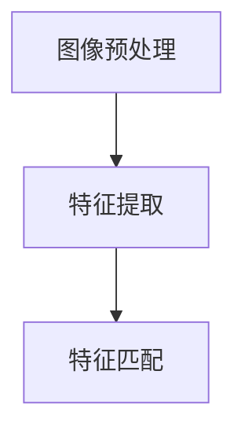
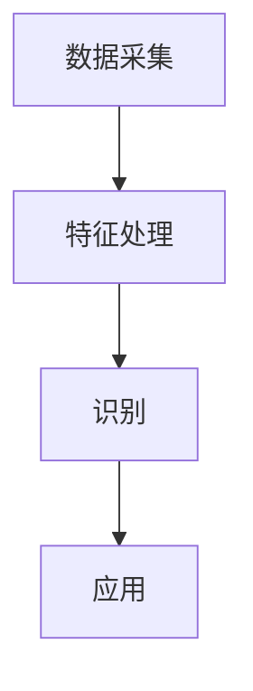

                 


# 价值投资中的新一代生物识别安全技术前景

> **关键词**：价值投资，生物识别技术，金融安全，身份验证，支付安全

> **摘要**：  
> 随着科技的不断进步，生物识别技术在金融领域的应用越来越广泛。本文探讨了生物识别技术在价值投资中的前景，重点分析了其在身份验证、支付安全和投资决策中的应用。通过详细的技术分析、算法原理和系统设计，本文展示了生物识别技术如何提升金融安全，并为投资者提供更加安全、便捷的服务。  

---

## 第一章：生物识别技术的概述

### 1.1 生物识别技术的基本概念

#### 1.1.1 生物识别技术的定义
生物识别技术是一种通过人的生理特征或行为特征进行身份验证的技术。这些特征包括指纹、虹膜、面部特征、声音、笔迹等，具有唯一性和不可复制性。

#### 1.1.2 生物识别技术的核心要素
- **唯一性**：每个人的生物特征都是独一无二的。
- **稳定性**：生物特征在一定时间内相对稳定。
- **安全性**：难以被伪造或窃取。

#### 1.1.3 生物识别技术的分类与特点
生物识别技术主要分为以下几类：
- **指纹识别**：基于指纹的细节特征。
- **面部识别**：基于面部特征，如眼睛、鼻子、嘴巴的形状和位置。
- **虹膜识别**：基于虹膜的纹理特征。
- **声音识别**：基于语音的特征，如音调、语速等。
- **笔迹识别**：基于手写签名的特征。

### 1.2 生物识别技术在价值投资中的应用前景

#### 1.2.1 价值投资的基本概念
价值投资是一种以基本面分析为基础的投资策略，通过分析公司的财务状况、行业地位和竞争优势，寻找被市场低估的投资标的。

#### 1.2.2 生物识别技术在金融安全中的作用
- **身份验证**：确保投资者身份的真实性，防止账户被盗用。
- **支付安全**：通过生物识别技术确保支付过程的安全性。
- **投资决策支持**：基于生物特征分析投资者的心理状态，辅助投资决策。

#### 1.2.3 生物识别技术如何提升投资决策的安全性
通过生物识别技术，投资者可以更安全地进行身份验证和支付操作，从而降低投资风险。此外，生物识别技术还可以用于监测投资者的情绪，帮助投资者做出更理性的决策。

### 1.3 生物识别技术的技术演进

#### 1.3.1 传统身份验证技术的局限性
传统身份验证技术（如密码、验证码）存在以下问题：
- 易被破解。
- 用户体验较差。
- 安全性较低。

#### 1.3.2 新一代生物识别技术的突破
新一代生物识别技术通过引入人工智能和大数据分析，显著提升了识别的准确性和安全性。

#### 1.3.3 生物识别技术的未来发展趋势
- **多模态识别**：结合多种生物特征进行识别，提高安全性。
- **实时识别**：通过实时数据分析，快速完成身份验证。
- **智能化**：结合人工智能，实现自主学习和优化。

---

## 第二章：生物识别技术的核心算法原理

### 2.1 生物特征的提取与处理

#### 2.1.1 生物特征的定义与分类
生物特征可以分为以下几类：
- **指纹特征**：指纹的细节特征，如嵴、谷、分叉点等。
- **面部特征**：面部的几何特征，如眼睛、鼻子、嘴巴的位置和形状。
- **虹膜特征**：虹膜的纹理特征。

#### 2.1.2 生物特征提取的数学模型
生物特征提取可以通过数学模型进行建模。例如，指纹特征提取可以通过以下步骤完成：
1. **图像预处理**：去除噪声，增强指纹特征。
2. **特征提取**：提取指纹的嵴、谷等特征点。
3. **特征匹配**：将提取的特征与数据库中的特征进行匹配。

#### 2.1.3 特征处理的算法流程图（Mermaid）


### 2.2 生物识别算法的实现

#### 2.2.1 特征匹配算法的原理
特征匹配算法通过将待识别的特征与数据库中的特征进行对比，找到最匹配的特征。

#### 2.2.2 基于深度学习的生物识别算法
深度学习算法可以通过训练大量的生物特征数据，学习特征的分布规律，从而实现高效的识别。

#### 2.2.3 算法实现的Python代码示例
以下是一个简单的指纹匹配算法示例：
```python
import numpy as np

def fingerprint_matching(query_feature, database_feature):
    # 计算特征的相似度
    similarity = np.sum(query_feature == database_feature)
    return similarity
```

### 2.3 算法性能评估与优化

#### 2.3.1 算法性能的评估指标
- **准确率**：识别正确的比例。
- **召回率**：识别出的真阳性比例。
- **F1分数**：准确率和召回率的调和平均数。

#### 2.3.2 算法优化的策略与方法
- **数据增强**：通过增加数据的多样性和质量，提高算法的鲁棒性。
- **模型优化**：通过调整模型的参数，提高识别的准确率。

#### 2.3.3 算法性能优化的数学模型
以下是一个优化的数学模型：
$$
\text{优化目标} = \arg \min_{\theta} \frac{1}{2m} \sum_{i=1}^{m} (y_i - \hat{y}_i)^2
$$

---

## 第三章：生物识别系统架构与设计

### 3.1 系统架构设计

#### 3.1.1 系统架构的分层设计
生物识别系统可以分为以下几层：
- **采集层**：采集生物特征数据。
- **处理层**：对采集的数据进行预处理和特征提取。
- **识别层**：对特征进行匹配和识别。
- **应用层**：将识别结果应用于具体业务场景。

#### 3.1.2 系统架构的模块划分
- **数据采集模块**：负责采集生物特征数据。
- **特征处理模块**：对采集的数据进行预处理和特征提取。
- **识别模块**：对特征进行匹配和识别。
- **应用模块**：将识别结果应用于具体业务场景。

#### 3.1.3 系统架构的Mermaid图示


### 3.2 系统功能设计

#### 3.2.1 用户身份验证功能
- **功能描述**：通过生物识别技术验证用户身份。
- **实现步骤**：
  1. 采集用户的生物特征数据。
  2. 对数据进行预处理和特征提取。
  3. 将提取的特征与数据库中的特征进行匹配。

#### 3.2.2 生物特征数据采集功能
- **功能描述**：采集用户的生物特征数据。
- **实现步骤**：
  1. 使用传感器或摄像头采集数据。
  2. 对数据进行初步处理，去除噪声。

#### 3.2.3 系统安全防护功能
- **功能描述**：通过生物识别技术提高系统的安全性。
- **实现步骤**：
  1. 对采集的数据进行加密处理。
  2. 对识别结果进行双重验证。

### 3.3 系统接口设计

#### 3.3.1 系统接口的定义与规范
- **输入接口**：接收用户的生物特征数据。
- **输出接口**：返回身份验证结果。

#### 3.3.2 接口交互流程的设计
- **步骤1**：用户提交生物特征数据。
- **步骤2**：系统对接收到的数据进行处理和识别。
- **步骤3**：系统返回验证结果。

#### 3.3.3 接口安全的设计与实现
- **数据加密**：对传输的数据进行加密处理。
- **访问控制**：通过权限控制确保只有授权用户可以访问系统。

---

## 第四章：生物识别技术在价值投资中的应用案例

### 4.1 价值投资中的身份认证

#### 4.1.1 身份认证在投资中的重要性
- **防止账户被盗用**：通过生物识别技术确保投资者身份的真实性。
- **提升交易安全性**：通过生物识别技术确保交易的安全性。

#### 4.1.2 生物识别技术在身份认证中的应用
- **指纹支付**：通过指纹识别技术进行支付验证。
- **面部识别**：通过面部识别技术进行身份验证。

#### 4.1.3 典型案例分析
- **案例1**：某证券公司通过指纹识别技术验证投资者身份，提升交易安全性。
- **案例2**：某银行通过面部识别技术进行远程开户，提升用户体验。

### 4.2 生物识别技术在支付安全中的应用

#### 4.2.1 支付安全的重要性
- **防止支付 fraud**：通过生物识别技术防止支付过程中的 fraud。
- **提升支付效率**：通过生物识别技术实现快速支付。

#### 4.2.2 生物识别技术在支付安全中的应用
- **指纹支付**：通过指纹识别技术进行支付验证。
- **声音识别**：通过声音识别技术进行支付验证。

#### 4.2.3 实际案例分析
- **案例1**：支付宝通过指纹识别技术实现快速支付。
- **案例2**：Apple Pay通过面部识别技术实现无密码支付。

---

## 总结

生物识别技术在价值投资中的应用前景广阔。通过生物识别技术，投资者可以更安全地进行身份验证和支付操作，从而降低投资风险。此外，生物识别技术还可以用于监测投资者的情绪，帮助投资者做出更理性的决策。未来，随着技术的不断进步，生物识别技术将在金融领域发挥更大的作用，为投资者提供更加安全、便捷的服务。

