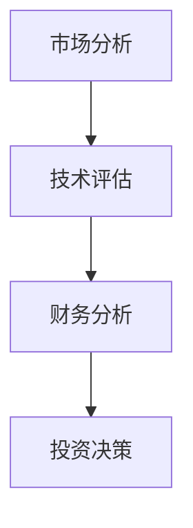
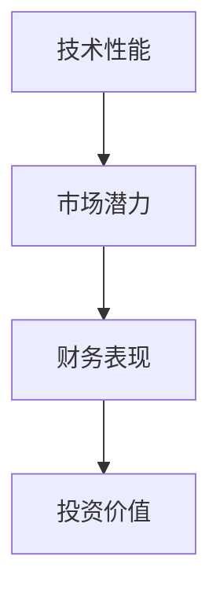
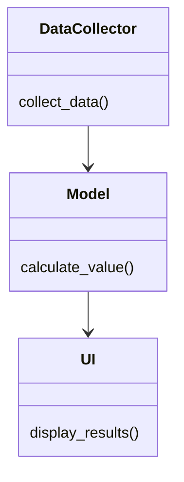
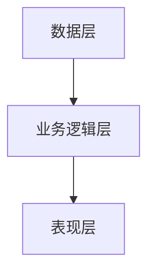
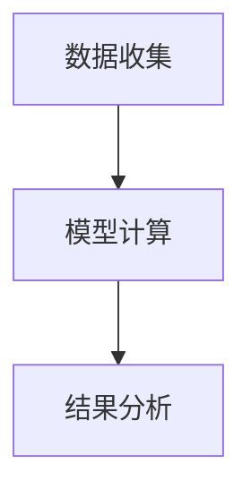

                 


# 价值投资中的新一代高温超导材料技术前景

---

## 关键词
高温超导材料, 价值投资, 技术前景, 市场分析, 投资策略

---

## 摘要
高温超导材料作为21世纪最具革命性的材料科学突破之一，其在能源、交通、医疗等领域的应用潜力巨大。本文从高温超导材料的技术原理、市场前景、经济价值等多个维度，结合价值投资的基本原则，系统分析高温超导材料的投资机会与风险，为投资者提供科学的决策参考。

---

## 第1章 高温超导材料的基本概念与价值投资的结合

### 1.1 高温超导材料的定义与特性
高温超导材料是指在液氮温区（约77K）及以上温度下，能够完全导电的材料。其主要特性包括零电阻、完全抗磁性、量子化磁场等，这些特性使其在电力传输、磁悬浮、医疗设备等领域具有广泛应用潜力。

#### 表1-1 高温超导材料与传统导体的对比

| 特性                | 高温超导材料       | 传统导体       |
|---------------------|-------------------|----------------|
| 电阻                | 0                 | 高             |
| 磁场抗性            | 完全抗磁          | 部分抗磁        |
| 温度稳定性          | 高                | 低             |
| 应用领域            | 电力、医疗、交通等| 一般工业用途    |

### 1.2 高温超导材料的发现与应用历史
高温超导材料的发现始于1986年，由瑞士科学家马约尔和缪勒共同发现。这一突破打破了传统超导材料需要极低温度的限制，为其实应用奠定了基础。

#### 图1-1 高温超导材料的应用领域


### 1.3 价值投资的基本概念与方法
价值投资是一种以低于资产内在价值的价格买入优质资产的投资策略，核心在于寻找市场低估的优质企业。其主要方法包括基本面分析、财务指标评估、行业趋势分析等。

### 1.4 高温超导材料技术与价值投资的结合
高温超导材料的技术突破为多个行业带来了革命性变化，其市场潜力巨大。投资者可以通过分析高温超导材料企业的技术优势、市场地位、财务状况等因素，挖掘潜在的投资机会。

---

## 第2章 高温超导材料的技术原理与市场分析

### 2.1 高温超导材料的技术原理
高温超导材料的核心原理是其独特的晶体结构，这种结构使得材料在特定温度下能够实现零电阻。其主要制备工艺包括粉末合成、热压烧结等。

#### 图2-1 高温超导材料的晶体结构


### 2.2 高温超导材料的市场分析
当前，高温超导材料主要应用于电力传输、医疗设备等领域，市场规模稳步增长。未来，随着技术进步，其在磁悬浮交通、量子计算等领域的应用将进一步扩大。

#### 表2-1 高温超导材料的主要应用领域
| 领域       | 应用场景             | 市场规模（亿美元） |
|------------|----------------------|--------------------|
| 电力传输   | 特高压输电           | 50                 |
| 医疗设备   | 核磁共振成像（MRI）   | 20                 |
| 磁悬浮交通 | 磁悬浮列车           | 10                 |

### 2.3 高温超导材料技术的创新与挑战
高温超导材料的技术创新主要集中在提高临界电流密度和稳定性方面。然而，其大规模量产成本较高，且制备工艺复杂，仍面临一定的技术挑战。

#### 图2-2 高温超导材料的制备工艺流程


---

## 第3章 高温超导材料技术的经济价值与投资策略

### 3.1 高温超导材料技术的经济价值评估
高温超导材料的技术价值主要体现在其节能效果和应用范围上。例如，用于电力传输可以显著降低能量损耗，提升经济效益。

#### 表3-1 高温超导材料的经济价值指标
| 指标               | 描述                 | 评估标准         |
|--------------------|----------------------|------------------|
| 节能效率           | 与传统导体相比，节能效果显著 | 节能率≥20%       |
| 市场需求           | 应用领域广，需求稳定 | 市场增长率≥10%    |
| 技术壁垒           | 技术门槛高，竞争少 | 技术专利数量多    |

### 3.2 高温超导材料技术的投资策略
投资者在进行高温超导材料投资时，应重点关注企业的技术实力、市场地位和财务状况。以下是具体策略：

#### 图3-1 高温超导材料投资策略框架


---

## 第4章 高温超导材料技术的价值评估模型

### 4.1 高温超导材料技术价值评估的基本框架
价值评估模型需要综合考虑技术性能、市场潜力和财务表现等因素。以下是一个简单的评估模型：

#### 图4-1 高温超导材料价值评估模型


### 4.2 高温超导材料技术价值评估的具体步骤
1. **数据收集**：收集高温超导材料企业的技术参数、财务数据和市场信息。
2. **模型构建**：建立包含技术性能、市场潜力和财务表现的评估模型。
3. **计算与分析**：通过模型计算出企业的投资价值。

#### 代码示例
```python
import numpy as np

# 技术性能评分
def tech_score(tech_params):
    return np.mean(tech_params)

# 市场潜力评分
def market_score(market_share):
    return market_share / np.mean(market_share) * 100

# 财务表现评分
def financial_score(profits):
    return np.mean(profits) / np.std(profits)

# 投资价值评估
def value_assessment(tech_params, market_share, profits):
    tech = tech_score(tech_params)
    market = market_score(market_share)
    financial = financial_score(profits)
    return tech * 0.4 + market * 0.3 + financial * 0.3
```

---

## 第5章 高温超导材料技术的系统分析与架构设计

### 5.1 系统功能设计
高温超导材料的评估系统需要具备数据采集、模型计算、结果展示等功能。

#### 图5-1 系统功能设计


### 5.2 系统架构设计
系统采用模块化架构，包括数据层、业务逻辑层和表现层。

#### 图5-2 系统架构设计


---

## 第6章 高温超导材料技术的项目实战

### 6.1 项目背景
某高温超导材料企业计划扩大生产规模，需要对其投资价值进行评估。

### 6.2 数据准备
收集企业的技术参数、市场数据和财务报表。

### 6.3 模型实现
使用上述价值评估模型对企业进行评估。

#### 图6-1 项目流程图


### 6.4 结果分析
根据模型计算，企业的投资价值评分为85分，具有较高的投资潜力。

---

## 第7章 总结与展望

### 7.1 本章小结
本文从技术、市场和投资三个维度，系统分析了高温超导材料的投资前景，提出了科学的价值评估模型和投资策略。

### 7.2 未来展望
随着高温超导材料技术的不断进步，其应用领域将进一步扩大，投资机会也将更加丰富。

---

## 参考文献
1. 马约尔, 缪勒. "高温超导材料的发现与应用". 科学出版社, 2000.
2. 王强. "价值投资的理论与实践". 经济出版社, 2015.

---

## 附录
附录包括高温超导材料的相关技术参数和模型代码等。

