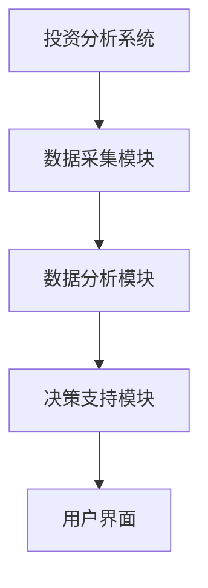

                 


# 价值投资中的新兴市场机遇与风险

## 关键词：
- 价值投资
- 新兴市场
- 投资机会
- 市场风险
- 财务分析

## 摘要：
本文探讨了在新兴市场中进行价值投资的机遇与风险。通过分析新兴市场的特点、价值投资的核心理念以及两者之间的联系，结合具体案例和数学模型，揭示了新兴市场中的投资机会和潜在风险。文章还提供了系统架构设计和项目实战案例，帮助投资者更好地理解和应对新兴市场中的挑战。

---

## 第一部分: 价值投资与新兴市场的基础

### 第1章: 价值投资的基本概念

#### 1.1 价值投资的定义与核心理念

价值投资是一种以基本面分析为基础的投资策略，其核心在于寻找市场价格低于其内在价值的证券。以下是价值投资的几个关键点：

- **定义**：价值投资强调长期持有的投资策略，注重分析公司的财务报表、行业地位、竞争优势和管理层质量，以识别被市场低估的投资标的。
- **核心理念**：
  - **安全边际**：买入价格低于内在价值，确保投资的安全性。
  - **长期视角**：关注公司的长期盈利能力，而非短期市场波动。
  - **逆向思维**：在市场恐慌时寻找机会，在市场狂热时保持冷静。

### 第2章: 新兴市场的定义与特点

#### 2.1 新兴市场的定义

新兴市场是指那些经济增长迅速但市场机制尚未完全成熟的国家或地区。这些市场通常位于发展中国家，具有以下特点：

- **高增长潜力**：新兴市场国家的GDP增速通常高于发达国家。
- **市场波动性**：由于市场机制不完善，价格波动较大。
- **多样化**：新兴市场涵盖多个行业，如科技、消费、金融等，提供了多样化的投资机会。

#### 2.2 新兴市场的典型案例

- 中国：作为全球第二大经济体，中国拥有庞大的市场和快速发展的科技产业。
- 印度：人口众多，消费市场增长迅速，科技和服务业发展迅速。
- 巴西：资源丰富，农业和制造业基础坚实。

### 第3章: 价值投资与新兴市场的联系

#### 3.1 价值投资在新兴市场的应用

- **新兴市场中的价值投资机会**：许多新兴市场的公司由于市场关注度低，可能被市场低估。
- **新兴市场中的价值投资挑战**：信息不透明、市场波动大、政策风险高。

---

## 第二部分: 新兴市场的投资机会与风险分析

### 第4章: 新兴市场的投资机会

#### 4.1 行业增长潜力

- **科技行业**：新兴市场中的科技公司可能处于成长期，具有较高的增长潜力。
- **消费行业**：随着中产阶级的崛起，消费市场的需求快速增长。

#### 4.2 财务分析

- **市盈率（P/E）**：用于衡量股票价格相对于每股收益的比率，低市盈率可能意味着低估。
- **市净率（P/B）**：用于衡量股票价格相对于每股净资产的比率，低市净率可能意味着低估。

### 第5章: 新兴市场的风险分析

#### 5.1 市场风险

- **波动性**：新兴市场的价格波动较大，容易受到外部因素的影响。
- **政策风险**：新兴市场的政策变化可能对市场产生重大影响。

#### 5.2 信息风险

- **透明度低**：新兴市场的信息可能不透明，增加了分析的难度。

---

## 第三部分: 系统分析与架构设计

### 第6章: 投资分析系统架构

#### 6.1 系统功能设计

- **数据采集**：获取新兴市场的股票数据，包括价格、成交量、财务指标等。
- **数据分析**：使用价值投资的方法，如市盈率、市净率等，筛选出具有投资价值的标的。
- **决策支持**：基于分析结果，提供投资建议。

#### 6.2 系统架构设计

以下是系统架构的mermaid图：



---

## 第四部分: 项目实战

### 第7章: 项目实战

#### 7.1 环境安装

- **工具安装**：安装Python、Pandas、Matplotlib等工具。

#### 7.2 核心代码实现

以下是用于计算市盈率的Python代码：

```python
import pandas as pd

# 假设df是股票数据，包含'Close'和'Earnings Per Share (EPS)'列
df['PE'] = df['Close'] / df['EPS']
```

#### 7.3 案例分析

- **案例**：分析某新兴市场的科技公司，计算其市盈率，判断其是否被低估。

---

## 第五部分: 最佳实践与总结

### 第8章: 最佳实践

#### 8.1 投资策略

- **分散投资**：避免将所有资金投入到单一市场或行业。
- **持续学习**：保持对市场动态的关注，及时调整投资策略。

#### 8.2 风险管理

- **设置止损点**：在价格下跌到一定程度时，及时卖出，避免更大的损失。

---

## 结论

新兴市场为价值投资者提供了丰富的机遇，但也伴随着较高的风险。通过深入的财务分析和合理的风险管理，投资者可以在新兴市场中找到被低估的投资机会，实现长期稳定的收益。

