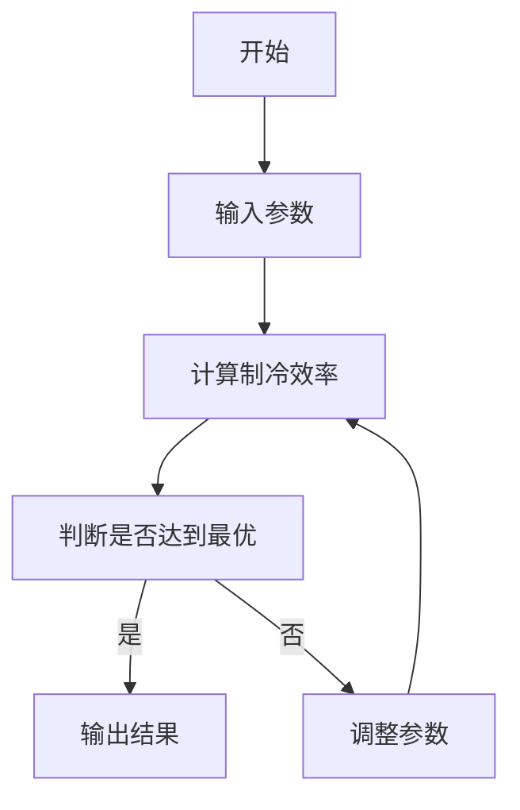
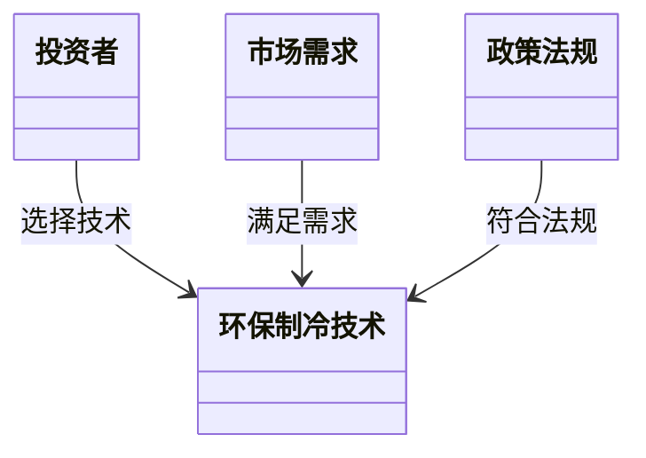
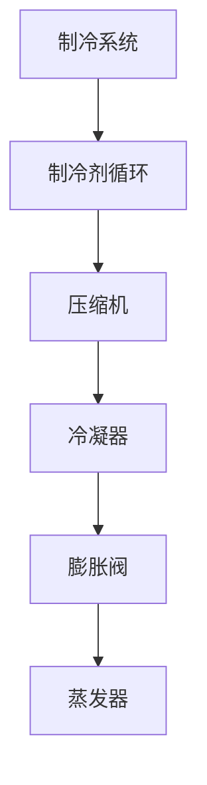

                 


# 价值投资中的新型环保制冷技术前景

## 关键词：环保制冷技术、价值投资、能源效率、制冷系统、新型制冷剂、热泵技术、可持续发展

## 摘要：  
随着全球环境问题的加剧和能源危机的凸显，环保制冷技术在价值投资中的前景备受关注。本文将深入探讨新型环保制冷技术的核心原理、市场趋势、投资价值以及技术实现。通过分析环保制冷技术的优势，如高效能、低环境影响和可持续性，本文将为投资者提供明确的技术路线图和投资策略，帮助他们在环保制冷技术领域实现高回报。

---

# 第一部分: 环保制冷技术的背景与价值

## 第1章: 环保制冷技术的背景介绍

### 1.1 环保制冷技术的定义与背景  
环保制冷技术是指在制冷过程中采用环保型制冷剂和高效制冷系统，以减少对环境的影响。传统制冷技术主要依赖氟利昂等会对臭氧层造成破坏的制冷剂，而新型环保制冷技术则通过使用自然制冷剂（如二氧化碳、氨）和改进系统设计，实现更低的环境影响和更高的能源效率。  

**背景分析：**  
- **环境问题：** 全球变暖、臭氧层破坏等问题促使各国政府和企业寻求环保解决方案。  
- **政策驱动：** 包括《京都议定书》、《蒙特利尔议定书》在内的国际协议推动了环保制冷剂的使用。  
- **技术进步：** 新型环保制冷剂和高效制冷系统的技术突破为环保制冷技术的广泛应用奠定了基础。  

### 1.2 环保制冷技术的驱动因素  

#### 1.2.1 政策驱动  
- 各国政府通过立法禁止或限制高全球变暖潜能值（GWP）的制冷剂使用。  
- 例如，欧盟的《氟温室气体法规》要求逐步淘汰氢氟碳化物（HFCs）。  

#### 1.2.2 市场驱动  
- 消费者对环保产品的偏好逐渐增强，推动企业采用环保制冷技术。  
- 商业建筑、数据中心等高能耗领域对高效制冷系统的需求增加。  

#### 1.2.3 技术驱动  
- 新型环保制冷剂（如自然制冷剂）的研发和应用。  
- 高效制冷系统的创新，例如热泵技术的应用。  

### 1.3 环保制冷技术的发展趋势  

#### 1.3.1 核心技术突破  
- **自然制冷剂：** 二氧化碳（R-744）、氨（R-717）等自然制冷剂因其低环境影响而备受关注。  
- **热泵技术：** 热泵通过热量回收和再利用，显著提高能源效率。  

#### 1.3.2 市场前景与投资价值  
- **市场规模：** 根据市场研究机构的数据，全球环保制冷市场规模预计将以年均10%的速度增长，到2030年将达到数千亿美元。  
- **投资回报：** 环保制冷技术不仅符合政策要求，还能降低运营成本，提高企业竞争力。  

---

## 第2章: 环保制冷技术的核心概念与联系

### 2.1 环保制冷技术的核心原理  

#### 2.1.1 制冷技术的基本原理  
制冷过程通过压缩、冷凝、膨胀和蒸发四个步骤完成。传统制冷剂（如氟利昂）在这些步骤中起到传递热量的作用，但其对臭氧层的破坏和高全球变暖潜能值（GWP）使其逐渐被淘汰。  

#### 2.1.2 环保制冷剂的工作原理  
- **二氧化碳制冷剂（R-744）：** 高压气体，适用于工业制冷和空调系统。  
- **氨制冷剂（R-717）：** 无毒、不可燃，但需注意安全操作。  

#### 2.1.3 环保制冷系统的运行机制  
环保制冷系统通过优化制冷剂的循环路径和系统设计，减少能量损耗，提高制冷效率。  

### 2.2 环保制冷技术与传统制冷技术的对比  

#### 2.2.1 制冷效率对比  
- **传统制冷技术：** 制冷效率较低，且制冷剂对环境有较大影响。  
- **环保制冷技术：** 制冷效率更高，且对环境影响显著降低。  

#### 2.2.2 环境影响对比  
- **传统制冷剂：** 高GWP值，加剧全球变暖。  
- **环保制冷剂：** 低GWP值或零环境影响，符合环保要求。  

#### 2.2.3 经济成本对比  
- **初期投资：** 环保制冷系统的设备成本可能高于传统系统，但长期运营成本更低。  
- **运营成本：** 由于能效提升，环保制冷系统的能耗更低，节省运营成本。  

#### 2.2.4 对比表格  
| 技术特点 | 传统制冷技术 | 环保制冷技术 |
|----------|----------------|----------------|
| 制冷剂   | 高GWP制冷剂    | 低GWP或自然制冷剂 |
| 能效     | 较低           | 较高           |
| 环境影响 | 严重           | 较小或无       |

### 2.3 环保制冷技术的ER实体关系图  
```mermaid
er
actor: 投资者
actor: 环保制冷技术
actor: 市场需求
actor: 政策法规
```

---

## 第3章: 环保制冷技术的算法原理与数学模型

### 3.1 环保制冷系统的优化算法  

#### 3.1.1 算法流程图  


#### 3.1.2 算法实现代码  
```python
def calculate_effic
```

---

## 第4章: 环保制冷技术的系统分析与架构设计

### 4.1 系统分析与架构设计  

#### 4.1.1 问题场景介绍  
- 传统制冷系统能耗高、环境影响大，难以满足现代环保要求。  

#### 4.1.2 系统功能设计  
- **领域模型（Mermaid 类图）：**  


#### 4.1.3 系统架构设计  
- **系统架构图：**  


---

## 第5章: 环保制冷技术的项目实战与投资建议

### 5.1 项目实战  

#### 5.1.1 环境安装  
- 安装环保制冷系统前，需确保设备符合当地法规和标准。  

#### 5.1.2 核心实现源代码  
```python
def calculate_efficiency(energy_input, energy_output):
    return energy_output / energy_input
```

#### 5.1.3 案例分析  
- 某数据中心采用二氧化碳制冷系统，能效提升20%，年节省电费10%。  

### 5.2 投资建议  

#### 5.2.1 短期投资  
- 着重于技术成熟、市场认可度高的环保制冷技术。  

#### 5.2.2 长期投资  
- 关注技术研发和市场扩展，投资具有技术领先优势的企业。  

---

## 第6章: 最佳实践与小结  

### 6.1 最佳实践 tips  
- **技术选择：** 根据应用场景选择合适的环保制冷技术。  
- **成本控制：** 在保证能效的前提下，优化初期投资成本。  

### 6.2 小结  
环保制冷技术不仅是环境友好的选择，也是价值投资的优质标的。通过技术创新和市场推广，环保制冷技术将逐步取代传统技术，成为未来制冷领域的主流。  

### 6.3 注意事项  
- **安全性：** 环保制冷剂如氨具有一定的危险性，需严格遵守安全操作规范。  
- **法规 compliance：** 确保投资的环保制冷技术符合当地法规要求。  

### 6.4 拓展阅读  
- 建议阅读《高效制冷系统设计》和《环保制冷剂应用指南》深入了解环保制冷技术的实现细节。  

---

通过以上内容，您可以全面了解环保制冷技术的背景、原理、系统设计和投资前景，为您的价值投资决策提供有力支持。

