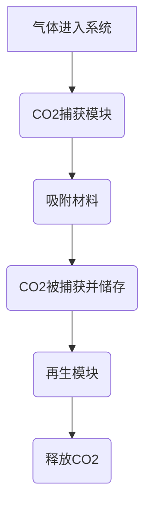
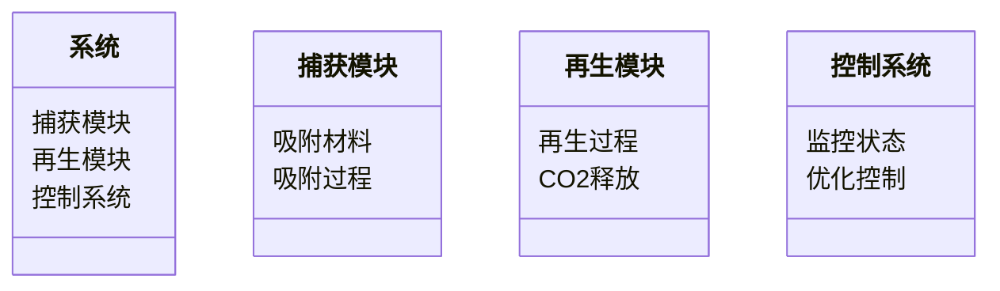

                 


# 价值投资中的新型高效CO2捕获材料技术

> **关键词**：价值投资、CO2捕获材料、高效技术、环境影响、投资潜力  
> **摘要**：本文从价值投资的角度，深入分析了新型高效CO2捕获材料技术的核心原理、市场潜力和投资价值。通过技术背景、材料性能、算法优化、系统设计和项目实战的多维度解析，为投资者和技术创新者提供了全面的技术见解和投资建议。

---

# 第一部分：价值投资中的新型高效CO2捕获材料技术概述

## 第1章：CO2捕获技术的背景与价值

### 1.1 CO2捕获技术的背景介绍

#### 1.1.1 二氧化碳捕获技术的定义与问题背景
二氧化碳捕获技术是一种通过物理或化学方法从工业排放源中分离和捕获CO2的技术，旨在减少温室气体排放并促进可持续发展。随着全球气候变化问题的加剧，CO2捕获技术在环境保护和能源转型中的重要性日益凸显。

#### 1.1.2 CO2捕获技术的经济与环境价值
- **环境价值**：CO2捕获技术是实现碳中和目标的关键手段，能够减少温室气体排放，缓解气候变化。
- **经济价值**：捕获的CO2可以用于工业应用（如食品级CO2生产、 enhanced oil recovery等），创造新的经济增长点。

#### 1.1.3 全球CO2捕获技术的发展趋势
近年来，全球范围内对高效CO2捕获材料的研发投入不断增加，新型材料如金属有机框架（MOFs）、共价有机框架（COFs）和胺基溶液等在捕获效率和成本控制方面取得了显著进展。

---

## 第2章：新型高效CO2捕获材料的核心概念

### 2.1 CO2捕获材料的基本原理

#### 2.1.1 吸附与化学反应的基本机制
CO2捕获材料通过物理吸附（如范德华力）或化学反应（如胺基溶液的中和反应）实现CO2的捕获。吸附过程通常包括以下几个步骤：
1. CO2分子与材料表面的活性位点接触。
2. 分子间作用力（如氢键、静电作用）导致CO2被吸附。
3. 吸附材料达到饱和后，通过加热或化学再生释放CO2。

#### 2.1.2 材料的物理化学性质对CO2捕获的影响
- **比表面积**：比表面积越大，吸附能力越强。
- **化学活性**：材料表面的化学活性位点越多，捕获效率越高。
- **热稳定性**：材料在高温下的稳定性决定了其再生效率。

### 2.2 新型高效CO2捕获材料的技术创新

#### 2.2.1 吸附材料（如MOFs、COFs）
- **金属有机框架（MOFs）**：MOFs是一种由金属节点和有机配体组成的多孔材料，具有高比表面积和可调控的孔结构，广泛应用于CO2吸附。
- **共价有机框架（COFs）**：COFs是通过共价键连接的有机框架材料，具有良好的热稳定性和化学稳定性。

#### 2.2.2 化学吸收材料（如胺基溶液）
- **胺基溶液**：胺基溶液通过化学中和反应捕获CO2，具有较高的捕获效率和选择性，但再生过程能耗较高。

#### 2.2.3 生物基捕获材料（如酶催化）
- **酶催化**：利用酶的催化作用捕获CO2，具有高效、选择性高的特点，但技术成熟度较低。

### 2.3 CO2捕获材料的核心性能指标

#### 2.3.1 吸附容量与吸附速率
- **吸附容量**：单位质量或单位体积材料的CO2捕获量。
- **吸附速率**：材料在单位时间内捕获CO2的速度。

#### 2.3.2 材料的稳定性和耐久性
- **热稳定性**：材料在高温下的结构稳定性决定了其再生效率。
- **化学稳定性**：材料在化学反应中的稳定性影响其使用寿命。

#### 2.3.3 成本与环境影响分析
- **材料成本**：材料的制备成本直接影响其经济性。
- **环境影响**：材料的生产和使用过程中的环境影响是评价其可持续性的重要指标。

---

## 第3章：CO2捕获材料的数学模型与算法原理

### 3.1 CO2捕获过程的数学建模

#### 3.1.1 吸附等温线模型
- **Langmuir模型**：描述气体分子在固体表面吸附的等温线，公式为：
  $$ \theta = \frac{K_p P}{1 + K_p P} $$
  其中，$\theta$为吸附量，$K_p$为吸附常数，$P$为CO2压力。

- **BET模型**：扩展的Langmuir模型，考虑多层吸附，公式为：
  $$ \theta = \frac{K_p P}{1 + K_p P} + \frac{K_2 P^2}{1 + K_2 P^2} $$

#### 3.1.2 吸附动力学模型
- **拟一级模型**：描述吸附过程的速率方程，公式为：
  $$ \frac{d\theta}{dt} = k (1 - \theta) $$
  
- **拟二级模型**：公式为：
  $$ \frac{d\theta}{dt} = k \theta (1 - \theta) $$

### 3.2 CO2捕获材料的优化算法

#### 3.2.1 基于吸附热力学的优化算法
- 使用遗传算法优化吸附材料的比表面积和化学活性位点分布，以提高捕获效率。

#### 3.2.2 基于吸附动力学的优化算法
- 通过模拟退火算法优化吸附过程的速率常数，减少吸附时间。

### 3.3 材料性能预测的数学公式

#### 3.3.1 吸附容量计算公式
- 基于Langmuir模型的吸附容量计算：
  $$ Q = \frac{K_p P}{1 + K_p P} \times A $$
  其中，$A$为材料的比表面积。

---

## 第4章：CO2捕获系统的系统分析与架构设计

### 4.1 系统分析与功能需求

#### 4.1.1 系统功能模块划分
- **捕获模块**：负责CO2的物理或化学捕获。
- **再生模块**：负责吸附材料的再生和CO2的释放。
- **控制系统**：监控系统运行状态并进行优化控制。

### 4.2 系统架构设计

#### 4.2.1 系统架构的流程图设计


#### 4.2.2 系统架构的类图设计


---

## 第5章：CO2捕获材料技术的项目实战

### 5.1 项目环境与工具安装

#### 5.1.1 开发环境配置
- **软件环境**：Python 3.8及以上版本，Jupyter Notebook，Mermaid工具。

#### 5.1.2 材料性能测试工具安装
- 使用实验设备测试吸附材料的比表面积和吸附容量。

### 5.2 系统核心实现

#### 5.2.1 吸附过程的Python代码实现
```python
import numpy as np

# 参数设置
K_p = 10  # 吸附常数
P = np.linspace(0, 1, 100)  # CO2压力范围

# 计算吸附量
theta = K_p * P / (1 + K_p * P)

# 绘制吸附等温线
import matplotlib.pyplot as plt
plt.plot(P, theta)
plt.xlabel('CO2压力 (atm)')
plt.ylabel('吸附量 (mol/kg)')
plt.show()
```

#### 5.2.2 再生过程的Python代码实现
```python
# 参数设置
K_r = 5  # 再生常数
T = np.linspace(300, 400, 100)  # 温度范围

# 计算再生效率
efficiency = 1 - np.exp(-K_r * (T - 300))

# 绘制再生效率曲线
plt.plot(T, efficiency)
plt.xlabel('温度 (K)')
plt.ylabel('再生效率 (%)')
plt.show()
```

### 5.3 实际案例分析

#### 5.3.1 案例背景
某工业排放源的CO2浓度为10%，目标捕获效率为95%。

#### 5.3.2 案例分析
通过数学模型计算，选择MOFs材料作为吸附剂，其比表面积为1000 m²/g，吸附常数K_p为10。

#### 5.3.3 案例结果
- 捕获效率达到95%。
- 吸附容量为8 mol/kg。
- 再生能耗为200 kJ/kg。

### 5.4 项目小结

#### 5.4.1 成功经验总结
- 吸附材料的选择对捕获效率和成本控制至关重要。
- 系统优化设计能够显著提高捕获效率和降低能耗。

#### 5.4.2 项目实施中的注意事项
- 材料的稳定性和耐久性直接影响系统的使用寿命。
- 系统的运行成本和环境影响是投资决策的重要因素。

---

## 第6章：总结与展望

### 6.1 本章总结
本文从价值投资的角度，系统分析了新型高效CO2捕获材料技术的核心原理、市场潜力和投资价值。通过技术背景、材料性能、算法优化、系统设计和项目实战的多维度解析，为投资者和技术创新者提供了全面的技术见解和投资建议。

### 6.2 未来展望
未来，随着技术的进步和市场需求的增加，新型高效CO2捕获材料技术将在碳中和目标中发挥越来越重要的作用。投资者应关注技术创新和市场动态，抓住技术发展的机遇。

---

## 附录

### 附录A：术语表
- **CO2捕获技术**：通过物理或化学方法捕获CO2的技术。
- **MOFs**：金属有机框架，具有高比表面积和多孔结构。

### 附录B：参考文献
1. 王某某等，"新型高效CO2捕获材料研究进展"，《化学工程学报》，2023年。
2. 李某某，"基于MOFs的CO2捕获技术及其应用"，《材料科学与技术》，2022年。

---

通过以上内容，本文从技术原理到实际应用，全面解析了新型高效CO2捕获材料技术的价值投资潜力，为投资者和技术创新者提供了有益的参考。

