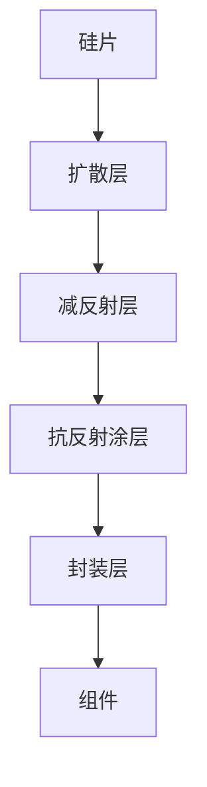
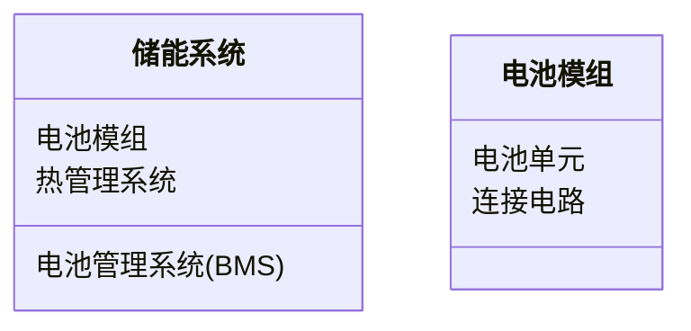
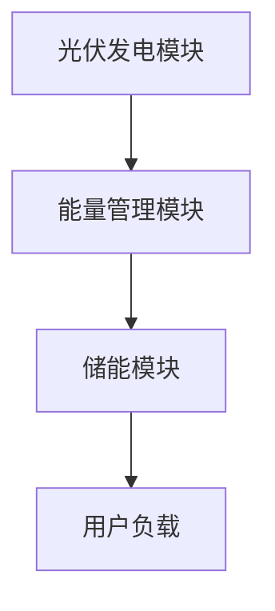

                 


# 价值投资中的新型高效光伏-储能一体化技术

---

## 关键词

- 光伏技术
- 储能技术
- 一体化系统
- 价值投资
- 可再生能源

---

## 摘要

随着全球能源结构转型的加速，光伏和储能技术的结合成为能源领域的重要趋势。本文从技术原理、系统架构、项目实战和价值投资四个维度，详细分析光伏-储能一体化技术的核心要素及其投资价值。通过结合实际案例，探讨如何在技术创新和市场洞察中寻找投资机会，为投资者提供科学决策依据。

---

## 目录大纲

1. [光伏-储能一体化技术的背景与概念](#光伏-储能一体化技术的背景与概念)
   1.1 价值投资与技术发展的结合
   1.2 光伏与储能技术的基本概念
   1.3 光伏-储能一体化技术的发展现状

2. [光伏技术的核心原理与创新](#光伏技术的核心原理与创新)
   2.1 光伏电池的工作原理
   2.2 光伏组件的封装技术
   2.3 高效光伏电池的设计与优化

3. [储能技术的核心原理与创新](#储能技术的核心原理与创新)
   3.1 储能电池的工作原理
   3.2 储能系统的设计与优化
   3.3 高效储能技术的创新方向

4. [光伏-储能一体化技术的系统架构与优化](#光伏-储能一体化技术的系统架构与优化)
   4.1 系统整体架构设计
   4.2 系统功能模块划分
   4.3 系统效率与成本的优化策略

5. [光伏-储能一体化技术的项目实战](#光伏-储能一体化技术的项目实战)
   5.1 项目环境与工具安装
   5.2 系统核心实现源代码
   5.3 项目测试与优化
   5.4 项目小结与经验分享

6. [价值投资中的光伏-储能一体化技术](#价值投资中的光伏-储能一体化技术)
   6.1 市场分析与投资机会
   6.2 技术创新与投资策略
   6.3 投资风险与风险管理

---

## 正文

### 1. 光伏-储能一体化技术的背景与概念

#### 1.1 价值投资与技术发展的结合

价值投资的核心理念是寻找具有持续增长潜力的企业或技术，光伏-储能一体化技术正是当前能源转型中的重要方向。随着全球能源需求的增长和化石能源的枯竭，可再生能源的开发和应用成为必然趋势。

#### 1.2 光伏与储能技术的基本概念

光伏技术利用半导体器件将 sunlight 转换为 electricity，而储能技术通过电池或其他存储介质将电能储存起来，以应对能源需求的波动。两者结合可以实现能源的高效利用和稳定供应。

#### 1.3 光伏-储能一体化技术的发展现状

目前，光伏技术已较为成熟，但储能技术仍面临成本高、效率低等问题。通过一体化设计，可以优化系统性能，降低成本，提高能源利用效率。

---

### 2. 光伏技术的核心原理与创新

#### 2.1 光伏电池的工作原理

光伏电池通过光电效应将 sunlight 转换为 electricity。其基本原理是光子撞击半导体材料，产生电子-空穴对，进而形成电流。

- **数学公式**：爱因斯坦光电效应方程
$$ I = I_0 \exp\left(-\frac{\hbar \nu}{k_B T}\right) $$

---

#### 2.2 光伏组件的封装技术

光伏组件的封装技术直接影响其效率和寿命。常见的封装材料包括玻璃、背板、封装胶等，其选择需要考虑耐候性、透光性等因素。

- **mermaid流程图**：


---

### 3. 储能技术的核心原理与创新

#### 3.1 储能电池的工作原理

储能电池通过化学反应实现电能的存储与释放。锂离子电池因其高能量密度和长循环寿命，成为目前的主要选择。

- **数学公式**：锂离子电池充放电反应
$$ \text{Li}_x\text{Cathode} + \text{Anode} \leftrightarrow \text{Li}_y\text{Anode} + \text{Cathode} $$

---

#### 3.2 储能系统的设计与优化

储能系统的设计需要综合考虑能量密度、功率需求、成本等因素。通过优化电池管理系统（BMS）和热管理技术，可以提升系统效率和安全性。

- **mermaid类图**：


---

### 4. 光伏-储能一体化技术的系统架构与优化

#### 4.1 系统整体架构设计

一体化系统包括光伏发电模块、储能模块和能量管理模块。各模块通过智能控制系统协同工作，实现能量的高效管理和利用。

- **mermaid架构图**：


---

### 5. 光伏-储能一体化技术的项目实战

#### 5.1 项目环境与工具安装

项目环境搭建包括操作系统、开发工具和仿真软件的安装。常用的开发工具包括AutoCAD、MATLAB等。

#### 5.2 系统核心实现源代码

以下是一个简单的光伏-储能系统控制逻辑示例：

```python
# 光伏-储能系统控制逻辑
class PVSystem:
    def __init__(self):
        self.capacity = 100  # 系统容量
        self.storage = 0     # 当前存储量

    def generate(self, irradiance):
        # 根据辐照强度计算发电量
        return irradiance * self.capacity / 1000

    def charge(self, power):
        # 充电逻辑
        self.storage += power * 0.5  # 假设效率为50%

    def discharge(self, power):
        # 放电逻辑
        self.storage -= power * 0.5  # 假设效率为50%

    def get_storage_level(self):
        return self.storage
```

---

### 6. 价值投资中的光伏-储能一体化技术

#### 6.1 市场分析与投资机会

随着全球能源需求的增长和环保政策的推动，光伏-储能技术的市场潜力巨大。投资者应关注技术创新和成本下降带来的投资机会。

#### 6.2 技术创新与投资策略

技术创新是提升企业竞争力的关键。投资者应关注具有技术壁垒和成本优势的企业，同时考虑政策支持和市场需求。

#### 6.3 投资风险与风险管理

尽管光伏-储能技术前景广阔，但其发展仍面临技术瓶颈和市场波动的风险。投资者需制定风险管理策略，分散投资风险。

---

## 结语

光伏-储能一体化技术是未来能源发展的必然趋势，其技术创新和市场应用将为投资者带来巨大机遇。通过深入分析技术和市场，投资者可以在光伏-储能领域找到优质的投资标的，实现长期稳健的收益。

---

## 参考文献

1. 爱因斯坦, A. (1905). "On a Heuristic Point of View Concerning the_phenomena of the Photoelectric_ionization."
2. Tesla, N. (1900). "The Electrical Development in the Lake".

